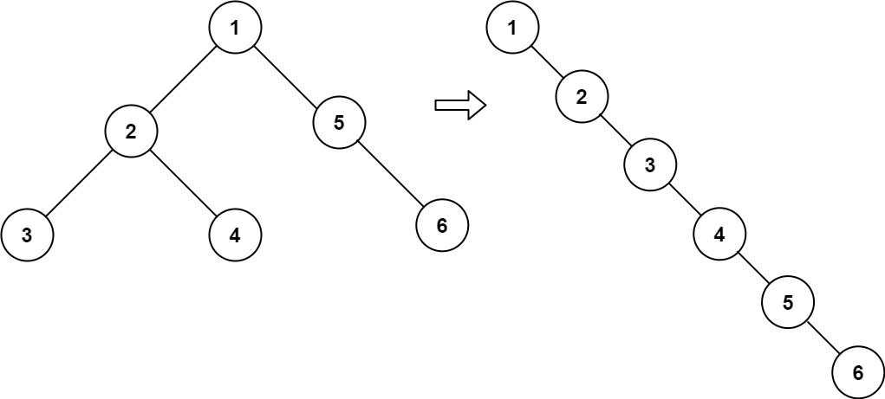

# 时间空间复杂度及稳定性


# 字符串

## [415. 字符串相加](https://leetcode-cn.com/problems/add-strings)

给定两个字符串形式的非负整数 `num1` 和`num2` ，计算它们的和并同样以字符串形式返回。
你不能使用任何內建的用于处理大整数的库（比如 `BigInteger`）， 也不能直接将输入的字符串转换为整数形式。

```java
输入：num1 = "11", num2 = "123"
输出："134"

输入：num1 = "456", num2 = "77"
输出："533"
```

```java
class Solution {
    /*
    两个num数组，从最右侧开始，一个一个的取出数（n1,n2）来加
    一个加到头了，就取0
    维护一个 carry = tmp / 10，表示进位
    int tmp = n1 + n2 + carry;
    StringBuilder res
    res.append(tmp % 10);
    注：最后的进位1需要考虑
    res.reverse()
     */
    public String addStrings(String num1, String num2) {
        StringBuilder res = new StringBuilder();
        int length1 = num1.length() - 1;
        int length2 = num2.length() - 1;
        int carry = 0;
        while(length1 >= 0 || length2 >= 0){
            int n1;
            if (length1 >= 0) {
                n1 = num1.charAt(length1) - '0';
            } else {
                n1 = 0;
            }
            int n2;
            if (length2 >= 0) {
                n2 = num2.charAt(length2) - '0';
            } else {
                n2 = 0;
            }
            int tmp = n1 + n2 + carry;
            carry = tmp / 10;
            res.append(tmp % 10);
            length1--;
            length2--;
        }
        // 注意：不要忘了最后一个进位
        if(carry == 1) {
            res.append(1);
        }
        return res.reverse().toString();
    }
}
```


## [43. 字符串相乘](https://leetcode-cn.com/problems/multiply-strings)

给定两个以字符串形式表示的非负整数 `num1` 和 `num2`，返回 `num1` 和 `num2` 的乘积，它们的乘积也表示为字符串形式。
**注意：**不能使用任何内置的 BigInteger 库或直接将输入转换为整数。

```java
输入: num1 = "2", num2 = "3"
输出: "6"

输入: num1 = "123", num2 = "456"
输出: "56088"
```

```java
class Solution {
    /*
    模拟过程：
        遍历 num2 每一位与 num1 进行相乘，将每一步的结果进行累加。
        注意：
            num2 除了第一位，其他位与 num1 运算的结果需要补0
            计算字符串数字累加其实就是 415. 字符串相加
     */
    public String multiply(String num1, String num2) {
        if (num1.equals("0") || num2.equals("0")) {
            return "0";
        }
        String res = "0";

        int length1 = num1.length();
        int length2 = num2.length();

        // num2 逐位与 num1 相乘
        for (int i = length2 - 1; i >= 0; i--) {
            // 保存 num2[i] 与 num1 相乘的结果
            StringBuilder num2i_multiply_num1 = new StringBuilder();

            // 根据 num2[i] 的位置，在 num2i_multiply_num1 前面补 number_0 个 0
            int number_0 = (length2 - 1) - i;
            while (number_0 != 0) {
                num2i_multiply_num1.append(0);
                number_0--;
            }

            // num1 逐位 与 num2 的第 i 位数字 n2 相乘
            int n2 = num2.charAt(i) - '0';
            int carry = 0;
            for (int j = length1 - 1; j >= 0; j--) {
                int n1 = num1.charAt(j) - '0';
                int tmp = (n1 * n2) + carry;
                num2i_multiply_num1.append(tmp % 10);
                carry = tmp / 10;
            }
            // 注意：不要忘了最后一个进位
            if (carry != 0) {
                num2i_multiply_num1.append(carry);
            }
            // 将当前结果与新计算的结果求和作为新的结果
            res = addStrings(res, num2i_multiply_num1.reverse().toString());
        }
        return res;
    }
    // 对两个字符串数字进行相加，返回字符串形式的和
    public String addStrings(String num1, String num2) {
        StringBuilder res = new StringBuilder();
        int length1 = num1.length() - 1;
        int length2 = num2.length() - 1;
        int carry = 0;
        while(length1 >= 0 || length2 >= 0){
            int n1;
            if (length1 >= 0) {
                n1 = num1.charAt(length1) - '0';
            } else {
                n1 = 0;
            }
            int n2;
            if (length2 >= 0) {
                n2 = num2.charAt(length2) - '0';
            } else {
                n2 = 0;
            }
            int tmp = n1 + n2 + carry;
            carry = tmp / 10;
            res.append(tmp % 10);
            length1--;
            length2--;
        }
        // 注意：不要忘了最后一个进位
        if(carry == 1) {
            res.append(1);
        }
        return res.reverse().toString();
    }
}
```


## [151. 翻转字符串里的单词](https://leetcode-cn.com/problems/reverse-words-in-a-string)

给你一个字符串 `s` ，颠倒字符串中 **单词** 的顺序。
**单词** 是由非空格字符组成的字符串。`s` 中使用至少一个空格将字符串中的 **单词** 分隔开。
返回 **单词** 顺序颠倒且 **单词** 之间用单个空格连接的结果字符串。

```java
输入：s = "the sky is blue"
输出："blue is sky the"

输入：s = "a good example" 
输出："example good a"
```

```java
class Solution {
    /*
    使用 trim() 删除首尾空格
    解题流程：
        1.搜索单词左边首个空格
        2.添加单词
        3.跳过单词间空格
        4.重置j = i，重复1,2,3操作
        5.记得返回值去除尾部空格
     */
    public String reverseWords(String s) {
        // 删除首尾空格
        s = s.trim();
        int j = s.length() - 1, i = j;
        StringBuilder res = new StringBuilder();
        while(i >= 0) {
            // 搜索单词左边首个空格
            while(i >= 0 && s.charAt(i) != ' ') {
                i--;
            }
            // 添加单词
            res.append(s, i + 1, j + 1).append(" ");
            // 跳过单词间空格
            while(i >= 0 && s.charAt(i) == ' ') {
                i--;
            }
            // j 指向下个单词的尾字符
            j = i;
        }
        // 记得再去除尾部空格
        return res.substring(0, res.length() - 1);
    }
    /*
    不使用 trim() 删除首尾空格
    解题流程：
        1.去除首尾以及中间多余空格
        2.反转整个字符串
        3.反转各个单词
     */
    public String _reverseWords(String s) {
        // 1.去除首尾以及中间多余空格
        StringBuilder sb = removeSpace(s);
        // 2.反转整个字符串
        reverseString(sb, 0, sb.length() - 1);
        // 3.反转各个单词
        reverseEachWord(sb);
        return sb.toString();
    }
    // 去除首尾以及中间多余空格
    private StringBuilder removeSpace(String s) {
        int start = 0;
        int end = s.length() - 1;
        while (s.charAt(start) == ' ') {
            start++;
        }
        while (s.charAt(end) == ' ') {
            end--;
        }
        StringBuilder sb = new StringBuilder();
        while (start <= end) {
            char c = s.charAt(start);
            if (c != ' ' || sb.charAt(sb.length() - 1) != ' ') {
                sb.append(c);
            }
            start++;
        }
        return sb;
    }
    // 反转字符串指定区间[start, end]的字符
    public void reverseString(StringBuilder sb, int start, int end) {
        while (start < end) {
            char temp = sb.charAt(start);
            sb.setCharAt(start, sb.charAt(end));
            sb.setCharAt(end, temp);
            start++;
            end--;
        }
    }
    // 反转各个单词
    private void reverseEachWord(StringBuilder sb) {
        int start = 0;
        int end = 1;
        int n = sb.length();
        while (start < n) {
            while (end < n && sb.charAt(end) != ' ') {
                end++;
            }
            reverseString(sb, start, end - 1);
            start = end + 1;
            end = start + 1;
        }
    }
}
```

```go
/*
   使用 trim() 删除首尾空格
   解题流程：
       1.搜索单词左边首个空格
       2.添加单词
       3.跳过单词间空格
       4.重置j = i，重复1,2,3操作
       5.记得返回值去除尾部空格
*/
func reverseWords(s string) string {
    s = strings.TrimSpace(s)
    var res string
    i := len(s) - 1
    j := i
    for i >= 0 {
        for i >= 0 && s[i] != ' ' {
            i--
        }
        res += s[i+1:j+1] + " "
        for i >= 0 && s[i] == ' ' {
            i--
        }
        j = i
    }
    return res[0 : len(res) - 1]
}
```


## [8. 字符串转换整数 (atoi)](https://leetcode-cn.com/problems/string-to-integer-atoi)

请你来实现一个 `myAtoi(string s)` 函数，使其能将字符串转换成一个 32 位有符号整数（类似 C/C++ 中的 `atoi` 函数）。

函数 `myAtoi(string s)` 的算法如下：

1. 读入字符串并丢弃无用的前导空格
2. 检查下一个字符（假设还未到字符末尾）为正还是负号，读取该字符（如果有）。 确定最终结果是负数还是正数。 如果两者都不存在，则假定结果为正。
3. 读入下一个字符，直到到达下一个非数字字符或到达输入的结尾。字符串的其余部分将被忽略。
4. 将前面步骤读入的这些数字转换为整数（即，"123" -> 123， "0032" -> 32）。如果没有读入数字，则整数为 `0` 。必要时更改符号（从步骤 2 开始）。
5. 如果整数数超过 32 位有符号整数范围 `[−2^31,  2^31 − 1]` ，需要截断这个整数，使其保持在这个范围内。具体来说，小于 `−2^31` 的整数应该被固定为 `−2^31` ，大于 `2^31 − 1` 的整数应该被固定为 `2^31 − 1` 。
6. 返回整数作为最终结果。

**注意：**

- 本题中的空白字符只包括空格字符 `' '` 。
- 除前导空格或数字后的其余字符串外，**请勿忽略** 任何其他字符。

```java
输入：s = "42"
输出：42

输入：s = "   -42"
输出：-42

输入：s = "4193 with words"
输出：4193
```

```java
class Solution {
    /*
    解题思路：
        1.去除前面的空格
        2.去除前面出现的 + - 号，根据最后一个符号决定正负。
        3.只有 0-9 的字符才有效，出现别的就退出。
            判断溢出时，为了防止溢出，所以不能用 ans * 10 + digit
            要用 ans > (Integer.MAX_VALUE - digit) / 10
     */
    public int myAtoi(String s) {
        int flag = 1;
        int ans = 0;
        int index = 0;
        char[] array = s.toCharArray();
        // 去除前面的空格
        while (index < array.length && array[index] == ' ') {
            index ++;
        }
        // 去除前面所以的 + - 号，根据最后一个符号决定正负。
        if (index < array.length && (array[index] == '-' || array[index] == '+')) {
            flag = array[index] == '-' ? -1 : 1;
            index++;
        }
        // 只有 0-9 的字符才有效，出现别的就退出。
        while (index < array.length && array[index] <= '9' && array[index] >= '0') {
            int digit = array[index] - '0';
            // 判断溢出时，为了防止溢出，所以不能用 ans * 10 + digit
            // ans * 10 + digit > Integer.MAX_VALUE
            if (ans > (Integer.MAX_VALUE - digit) / 10) {
                return flag == 1 ? Integer.MAX_VALUE : Integer.MIN_VALUE;
            }
            ans = ans * 10 + digit;
            index++;
        }
        return ans * flag;
    }
}
```


# 数组

## [31. 下一个排列](https://leetcode-cn.com/problems/next-permutation)

实现获取 **下一个排列** 的函数，算法需要将给定数字序列重新排列成字典序中下一个更大的排列（即，组合出下一个更大的整数）。
如果不存在下一个更大的排列，则将数字重新排列成最小的排列（即升序排列）。
必须**[ 原地 ](https://baike.baidu.com/item/原地算法)**修改，只允许使用额外常数空间。

```java
输入：nums = [1,2,3]
输出：[1,3,2]

输入：nums = [3,2,1]
输出：[1,2,3]

输入：nums = [1,1,5]
输出：[1,5,1]
```

```java
class Solution {
    /*
    思路：
        1.下一个数比当前数大，所以将后面一个大数与前面一个小数交换
        2.变换成的下一个数的增幅尽可能小
            1.在尽可能靠右的低位进行交换，从后往前遍历。
            2.将后面尽可能小的大数与前面的小数进行交换，12345876是把6和5交换，不是把7或8和5交换。
            3.后面的大数交换到前面后，将大数后面的数升序排序，这样后面就是最小的排列，交换到前面的大数让总体变大了，所以总体就是字典序中下一个更大的排列。
     */
    public void nextPermutation(int[] nums) {
        int len = nums.length;
        if (len <= 1) {
            return;
        }
        for (int i = len-1; i>0; i--) {
            //从后往前找，找到最右边的升序
            if (nums[i] > nums[i-1]) {
                // nums[i-1] 到 nums[i]是最右边的升序，nums[i]后面都是降序。
                // 从右往左找到最右边最小的比 nums[i-1] 大的数，交换。
                for (int j=len-1; j>=i; j--) {
                    if (nums[j] > nums[i-1]) {
                        swap(nums, i-1, j);
                        // 需要跳出for循环，不然后面还会发生交换影响结果。
                        break;
                    }
                }
                // 交换过后，还需要把交换到前面的数后面的数升序排序，这样才能保证后面最小。
                Arrays.sort(nums, i, len);
                return;
            }
        }
        Arrays.sort(nums);
    }
    public void swap(int[] nums, int i, int j) {
        int tmp = nums[i];
        nums[i] = nums[j];
        nums[j] = tmp;
    }
}
```


## [556. 下一个更大元素 III](https://leetcode-cn.com/problems/next-greater-element-iii)

给你一个正整数 `n` ，请你找出符合条件的最小整数，其由重新排列 `n` 中存在的每位数字组成，并且其值大于 `n` 。如果不存在这样的正整数，则返回 `-1` 。
**注意** ，返回的整数应当是一个 **32 位整数** ，如果存在满足题意的答案，但不是 **32 位整数** ，同样返回 `-1` 。

```java
输入：n = 12
输出：21

输入：n = 21
输出：-1
```

```java
class Solution {
    /*
    下一个排列问题的变种
    思路：
        把 n 转换成数组，运用解决下一个排列问题的方法解决。
        题目要求超过32位整数时返回-1，可以通过在 try catch 中对 string 转换成 int 时抛异常来解决。
    解决”下一个排列“
        思路：
            1.下一个数比当前数大，所以将后面一个大数与前面一个小数交换
            2.变换成的下一个数的增幅尽可能小
                1.在尽可能靠右的低位进行交换，从后往前遍历。
                2.将后面尽可能小的大数与前面的小数进行交换，12345876是把6和5交换，不是把7或8和5交换。
                3.后面的大数交换到前面后，将大数后面的数升序排序，这样后面就是最小的排列，交换到前面的大数让总体变大了，所以总体就是字典序中下一个更大的排列。
     */
    public int nextGreaterElement(int n) {
        String numStr = String.valueOf(n);
        int length = numStr.length();
        int[] nums = new int[length];
        for (int i = 0; i < length; i++) {
            nums[i] = numStr.charAt(i) - '0';
        }
        for (int i = length-1; i>0; i--) {
            //从后往前找，找到最右边的升序
            if (nums[i] > nums[i-1]) {
                // nums[i-1] 到 nums[i]是最右边的升序，nums[i]后面都是降序。
                // 从右往左找到最右边最小的比 nums[i-1] 大的数，交换。
                for (int j=length-1; j>=i; j--) {
                    if (nums[j] > nums[i-1]) {
                        swap(nums, i-1, j);
                        // 需要跳出for循环，不然后面还会发生交换影响结果。
                        break;
                    }
                }
                // 交换过后，还需要把交换到前面的数后面的数升序排序，这样才能保证后面最小。
                Arrays.sort(nums, i, length);
                break;
            }
        }
        StringBuilder sb = new StringBuilder();
        for (int num : nums) {
            sb.append(num);
        }
        try {
            int res = Integer.parseInt(sb.toString());
            return res > n ? res : -1;
        } catch (Exception e) {
            return -1;
        }
    }
    public void swap(int[] nums, int i, int j) {
        int tmp = nums[i];
        nums[i] = nums[j];
        nums[j] = tmp;
    }
}
```


## [670. 最大交换](https://leetcode-cn.com/problems/maximum-swap)

给定一个非负整数，你**至多**可以交换一次数字中的任意两位。返回你能得到的最大值。

```java
输入: 2736
输出: 7236
解释: 交换数字2和数字7。

输入: 9973
输出: 9973
解释: 不需要交换。
```

```java
class Solution {
    /*
    解题思路：
        int[] maxIndexArr 存储当前到最后面位置，最大数的索引。
        倒着遍历 char[] numChars，得出 maxIndexArr
        再正着遍历 numChars，哪一个数 不等于 numChars[maxIndexArr[i]]，就交换这两个数。
     */
    public int maximumSwap(int num) {
        char[] numChars = String.valueOf(num).toCharArray();
        int length = numChars.length;
        // 保存当前到最后面位置，最大数的索引。
        int[] maxIndexArr = new int[length];
        int maxIndex = length - 1;
        for (int i = length - 1; i >= 0; i--) {
            // 条件满足时，更新最大数索引。
            if (numChars[i] > numChars[maxIndex]) {
                maxIndex = i;
            }
            maxIndexArr[i] = maxIndex;
        }
        for (int i = 0; i < length; i++) {
            if (numChars[i] != numChars[maxIndexArr[i]]) {
                swap(numChars, i, maxIndexArr[i]);
                break;
            }
        }
        return Integer.parseInt(new String(numChars));
    }
    private void swap(char[] numChars, int i, int j) {
        char temp = numChars[i];
        numChars[i] = numChars[j];
        numChars[j] = temp;
    }
}
```


## [41. 缺失的第一个正数](https://leetcode-cn.com/problems/first-missing-positive)

给你一个未排序的整数数组 `nums` ，请你找出其中没有出现的最小的正整数。
请你实现时间复杂度为 `O(n)` 并且只使用常数级别额外空间的解决方案。

```java
输入：nums = [1,2,0]
输出：3

输入：nums = [3,4,-1,1]
输出：2
```

```java
/*
原地哈希
使用座位交换法
      根据思路② 可知，缺失的第一个整数是 [1, len + 1] 之间，
      那么我们可以遍历数组，然后将对应的数据填充到对应的位置上去，比如 1 就填充到 nums[0] 的位置， 2 就填充到 nums[1]
      如果填充过程中， nums[i] < 1 && nums[i] > len，那么直接舍弃
      填充完成，我们再遍历一次数组，如果对应的 nums[i] != i + 1，那么这个 i + 1 就是缺失的第一个正数

      比如 nums = [7, 8, 9, 10, 11], len = 5
      我们发现数组中的元素都无法进行填充，直接舍弃跳过，
      那么最终遍历数组的时候，我们发现 nums[0] != 0 + 1，即第一个缺失的是 1 

      比如 nums = [3, 1, 2], len = 3
      填充过后，我们发现最终数组变成了 [1, 2, 3]，每个元素都对应了自己的位置，那么第一个缺失的就是 len + 1 == 4
*/
class Solution {
    public int firstMissingPositive(int[] nums) {

        int len = nums.length;
        for(int i = 0; i < len; i++){
       /*
       只有在 nums[i] 是 [1, len] 之间的数，并且不在自己应该呆的位置， nums[i] != i + 1 ，
        并且 它应该呆的位置没有被同伴占有（即存在重复值占有）	nums[nums[i] - 1] != nums[i] 的时候才进行交换
        	
        为什么使用 while ？ 因为交换后，原本 i 位置的 nums[i] 已经交换到了别的地方，
        交换后到这里的新值不一定是适合这个位置的，因此需要重新进行判断交换
        如果使用 if，那么进行一次交换后，i 就会 +1 进入下一个循环，那么交换过来的新值就没有去找到它该有的位置
         比如 nums = [3, 4, -1, 1] 当 3 进行交换后， nums 变成 [-1，4，3，1]，
         此时 i == 0，如果使用 if ，那么会进入下一个循环， 这个 -1 就没有进行处理
        */
            while(nums[i] > 0 && nums[i] <= len && nums[i] != i + 1 && nums[nums[i] - 1] != nums[i]){
                swap(nums, nums[i] - 1, i);
            }
        }
        for(int i = 0; i < len; i++){
            if(nums[i] != i + 1){
                return i + 1;
            }
        }
        return len + 1;
    }

    private void swap(int[] nums, int i, int j){
        int temp = nums[i];
        nums[i] = nums[j];
        nums[j] = temp;
    }
}
```


## [54. 螺旋矩阵](https://leetcode-cn.com/problems/spiral-matrix)

给你一个 `m` 行 `n` 列的矩阵 `matrix` ，请按照 **顺时针螺旋顺序** ，返回矩阵中的所有元素。

```java
输入：matrix = [[1,2,3],
			   [4,5,6],
               [7,8,9]] 
输出：[1,2,3,6,9,8,7,4,5]
```

```java
class Solution {
    /*
    按照右下左上的顺序移动
    每次移动到了边界就重新设定边界
    边界超出就break
     */
    public List<Integer> spiralOrder(int[][] matrix) {
        List<Integer> res = new ArrayList<>();
        // 数组为空直接返回
        if (matrix.length == 0) {
            return res;
        }
        // 设定上下左右四个边界
        int up = 0;
        int down = matrix.length-1;
        int left = 0;
        int right = matrix[0].length-1;
        while (true) {
            // 往右移动，当到最右边时停下来
            for (int col=left ; col<=right; col++) {
                res.add(matrix[up][col]);
            }
            // 重新设定上边界
            up++;
            // 若上边界超过下边界，跳出
            if (up > down) {
                break;
            }
            // 往下移
            for (int row=up ; row<=down; row++) {
                res.add(matrix[row][right]);
            }
            right--;
            if (right < left) {
                break;
            }
            // 往左移
            for (int col=right ; col>=left; col--) {
                res.add(matrix[down][col]);
            }
            down--;
            if (down < up) {
                break;
            }
            // 往上移
            for (int row=down ; row>=up; row--) {
                res.add(matrix[row][left]);
            }
            left++;
            if (left > right) {
                break;
            }
        }
        return res;
    }
}
```


## [48. 旋转图像](https://leetcode-cn.com/problems/rotate-image)

给定一个 *n* × *n* 的二维矩阵 `matrix` 表示一个图像。请你将图像顺时针旋转 90 度。
你必须在原地 旋转图像，这意味着你需要直接修改输入的二维矩阵。**请不要** 使用另一个矩阵来旋转图像。

```java
输入：matrix = [[1,2,3],
			   [4,5,6],
			   [7,8,9]] 
输出：[[7,4,1],
	  [8,5,2],
      [9,6,3]]
```

```java
class Solution {
    public void rotate(int[][] matrix) {
        int n = matrix.length;
        // 水平翻转
        for (int i = 0; i < n / 2; i++) {
            for (int j = 0; j < n; j++) {
                int temp = matrix[i][j];
                matrix[i][j] = matrix[n - i - 1][j];
                matrix[n - i - 1][j] = temp;
            }
        }
        // 主对角线翻转
        for (int i = 0; i < n; i++) {
            for (int j = 0; j < i; j++) {
                int temp = matrix[i][j];
                matrix[i][j] = matrix[j][i];
                matrix[j][i] = temp;
            }
        }
    }
}
```


## [498. 对角线遍历](https://leetcode-cn.com/problems/diagonal-traverse)

给你一个大小为 `m x n` 的矩阵 `mat` ，请以对角线遍历的顺序，用一个数组返回这个矩阵中的所有元素。


```java
输入：mat = [[1,2,3],[4,5,6],[7,8,9]]
输出：[1,2,4,7,5,3,6,8,9]

输入：mat = [[1,2],[3,4]]
输出：[1,2,3,4]
```

```java
class Solution {
    /*
    从坐标 (m:0, n:0) 开始，右上->左下->右上->左下->右上->左下->........
    规律：每次朝一个方向时，m + n 是相等的，切方向切换时，m + n 是从 0 开始递增的
    解题思路：
        // i 是 x + y 的和
        for i = 0; i < count; i++
            //通过 i % 2 控制方向
            i % 2 == 0
                while (m >= 0 && n < col)
                    answer[answerIndex] = matrix[m][n];
                    answerIndex++;
                    m--;
                    n++;
                超出边界处理
            i % 2 != 0
                while (m >= 0 && n < col)
                    answer[answerIndex] = matrix[m][n];
                    answerIndex++;
                    m--;
                    n++;
                超出边界处理
     */
    public int[] findDiagonalOrder(int[][] matrix) {
        if (matrix.length == 0) {
            return new int[0];
        }

        int row = matrix.length;
        int col = matrix[0].length;

        int[] answer = new int[row * col];
        int count = row + col - 1;
        int m = 0;
        int n = 0;
        int answerIndex = 0;

        // (m,n) 坐标的移动，i 是 x + y 的和
        for (int i = 0; i < count; i++) {
            // 往右上角移动
            if (i % 2 == 0) {
                while (m >= 0 && n < col) {
                    answer[answerIndex] = matrix[m][n];
                    answerIndex++;
                    m--;
                    n++;
                }
                // 出边界后的回退处理
                // 第一种 m 出边界了
                if (n < col) {
                    m++;
                }
                // 第二种到右上角的拐角，m，n都出边界了
                else {
                    m = m + 2;
                    n--;
                }
            }
            // 往左下角移动
            else {
                while (m < row && n >= 0) {
                    answer[answerIndex] = matrix[m][n];
                    answerIndex++;
                    m++;
                    n--;
                }
                // 出边界后的回退处理
                // 第一种 n 出边界了
                if (m < row) {
                    n++;
                }
                // // 第二种到左下角的拐角，m，n都出边界了
                else{
                    m--;
                    n = n + 2;
                }

            }
        }
        return answer;
    }
}
```


## [56. 合并区间](https://leetcode-cn.com/problems/merge-intervals)

以数组 `intervals` 表示若干个区间的集合，其中单个区间为 `intervals[i] = [starti, endi]` 。请你合并所有重叠的区间，并返回一个不重叠的区间数组，该数组需恰好覆盖输入中的所有区间。

```java
输入：intervals = [[1,3],[2,6],[8,10],[15,18]]
输出：[[1,6],[8,10],[15,18]]
解释：区间 [1,3] 和 [2,6] 重叠, 将它们合并为 [1,6]

输入：intervals = [[1,4],[4,5]]
输出：[[1,5]]
解释：区间 [1,4] 和 [4,5] 可被视为重叠区间。
```

```java
class Solution {
    public int[][] merge(int[][] intervals) {
        // 先按照区间起始位置排序
        Arrays.sort(intervals, (v1, v2) -> v1[0] - v2[0]);
        // 遍历区间
        int[][] res = new int[intervals.length][2];
        int index = -1;
        for (int[] interval: intervals) {
            // 如果结果数组是空的，或者当前区间的起始位置 > 结果数组中最后区间的终止位置，
            // 则不合并，直接将当前区间加入结果数组。
            if (index == -1 || interval[0] > res[index][1]) {
                index++;
                res[index] = interval;
            } else {
                // 反之将当前区间合并至结果数组的最后区间
                res[index][1] = Math.max(res[index][1], interval[1]);
            }
        }
        return Arrays.copyOf(res, index + 1);
    }
}
```


## [88. 合并两个有序数组](https://leetcode-cn.com/problems/merge-sorted-array)

给你两个按 **非递减顺序** 排列的整数数组 `nums1` 和 `nums2`，另有两个整数 `m` 和 `n` ，分别表示 `nums1` 和 `nums2` 中的元素数目。
请你 **合并** `nums2` 到 `nums1` 中，使合并后的数组同样按 **非递减顺序** 排列。
**注意：**最终，合并后数组不应由函数返回，而是存储在数组 `nums1` 中。为了应对这种情况，`nums1` 的初始长度为 `m + n`，其中前 `m` 个元素表示应合并的元素，后 `n` 个元素为 `0` ，应忽略。`nums2` 的长度为 `n` 。

```java
输入：nums1 = [1,2,3,0,0,0], m = 3, nums2 = [2,5,6], n = 3
输出：[1,2,2,3,5,6]
解释：需要合并 [1,2,3] 和 [2,5,6] 。
合并结果是 [1,2,2,3,5,6] ，其中斜体加粗标注的为 nums1 中的元素。

输入：nums1 = [1], m = 1, nums2 = [], n = 0
输出：[1]
解释：需要合并 [1] 和 [] 。
合并结果是 [1] 。
```

```java
class Solution {
    /*
    从后往前依次比较两个数组，将大的数放 nums1
     */
    public void merge(int[] nums1, int m, int[] nums2, int n) {
        int index1 = m - 1, index2 = n - 1;
        int indexMerge = m + n - 1;
        while (index1 >= 0 || index2 >= 0) {
            if (index1 < 0) {
                nums1[indexMerge--] = nums2[index2--];
            }
            else if (index2 < 0) {
                nums1[indexMerge--] = nums1[index1--];
            }
            else if (nums1[index1] > nums2[index2]) {
                nums1[indexMerge--] = nums1[index1--];
            }
            else {
                nums1[indexMerge--] = nums2[index2--];
            }
        }
    }
}
```


## [717. 1比特与2比特字符](https://leetcode-cn.com/problems/1-bit-and-2-bit-characters/)

有两种特殊字符：

- 第一种字符可以用一个比特 `0` 来表示
- 第二种字符可以用两个比特(`10` 或 `11`)来表示、

给定一个以 `0` 结尾的二进制数组 `bits` ，如果最后一个字符必须是一位字符，则返回 `true` 。

```java
输入: bits = [1, 0, 0]
输出: true
解释: 唯一的编码方式是一个两比特字符和一个一比特字符。
所以最后一个字符是一比特字符。

输入: bits = [1, 1, 1, 0]
输出: false
解释: 唯一的编码方式是两比特字符和两比特字符。
所以最后一个字符不是一比特字符。
```

```java
class Solution {
    /*
    走一步还是走两步？
    idx（idx < n-1） 遇到 0 走一步，遇到 1 走两步
    遍历完前面所有字符后，如果最后一位还有一个字符那就是 true
     */
    public boolean isOneBitCharacter(int[] bits) {
        int n = bits.length;
        int idx = 0;
        while (idx < n - 1) {
            if (bits[idx] == 0){
                idx++;
            }
            else {
                idx += 2;
            }
        }
        return idx == n - 1;
    }
}
```


## [240. 搜索二维矩阵 II](https://leetcode-cn.com/problems/search-a-2d-matrix-ii)

编写一个高效的算法来搜索 `*m* x *n*` 矩阵 `matrix` 中的一个目标值 `target` 。该矩阵具有以下特性：

- 每行的元素从左到右升序排列。
- 每列的元素从上到下升序排列。

```java
输入：matrix = [[1,4,7,11,15],[2,5,8,12,19],[3,6,9,16,22],[10,13,14,17,24],[18,21,23,26,30]], target = 5
输出：true
```

```java
class Solution {
    /*
    根据矩阵特性：一个数比他上面的大，比他右边的小
    从左下角开始遍历
     */
    public boolean searchMatrix(int[][] matrix, int target) {
        int row = matrix.length;
        int col = matrix[0].length;
        int i = row -1;
        int j = 0;
        while (i >= 0 && j <= col -1) {
            if (matrix[i][j] > target){
                i--;
            } else if (matrix[i][j] < target){
                j++;
            } else {
                return true;
            }
        }
        return false;
    }
}
```

```go
/*
根据矩阵特性：一个数比他上面的大，比他右边的小
从左下角开始遍历
 */
func searchMatrix(matrix [][]int, target int) bool {
    row := len(matrix)
    col := len(matrix[0])
    i := row - 1
    j := 0
    for i >= 0 && j <= col -1 {
        if  matrix[i][j] > target{
            i--
        } else if matrix[i][j] < target{
            j++
        } else {
            return true
        }

    }
    return false
}
```


## [287. 寻找重复数](https://leetcode-cn.com/problems/find-the-duplicate-number)

```java
class Solution {
    /*
    思路：
        1,3,4,2,5
        0->1, 1->3, 2->4, 3->2, 4->5
        数组里没有重复的数，索引和对应位置的数的映射能组成一个链表，链表无环。
        1,3,4,2,2
        0->1, 1->3, 2->4, 3->2, 4->2
        数组里有重复的数，索引和对应位置的数的映射能组成一个链表，链表有环。
        综上，问题转换为类似 142 题，转到链表环入口即可。
    解题步骤：
        如何找到链表环入口
        设链表共 a+b 个节点，链表头到链表入口有 a 个节点（不包含链表入口），链表环有 b 个节点
        当 fast 追上 slow 时：
            设 fast 走 f 步，slow 走 s 步
            fast 走的步数是 slow 步数的 2 倍，即 f = 2s;
            fast 追上了 slow，f = a + jb, s = a + kb ==> f = s + nb;
            f = 2s, f = s + nb ==> s = nb, f = 2nb;
        节点从 head 走到链表入口节点时的步数: a + xb
        slow 已经走了 nb，那么 slow 再走 a 步就是入环点了

        重新构建一个从头开始的指针 temp，往前走 a 步到入口，slow 也同时往前走了 a 步，最终两节点在入口相遇。
     */
    public int findDuplicate(int[] nums) {
        int slow = 0;
        int fast = 0;
        // slow每次走一步，fast每次走两步。
        slow = nums[slow];
        fast = nums[nums[fast]];
        while(slow != fast){
            slow = nums[slow];
            fast = nums[nums[fast]];
        }
        // 当slow和fast相遇时,slow再走a（tmp从head走到链表环入口步）步，slow和temp在入口相遇。
        int temp = 0;
        while(temp != slow){
            temp = nums[temp];
            slow = nums[slow];
        }
        return temp;
    }
}
```


## [136. 只出现一次的数字](https://leetcode.cn/problems/single-number/)

给定一个**非空**整数数组，除了某个元素只出现一次以外，其余每个元素均出现两次。找出那个只出现了一次的元素。
你的算法应该具有线性时间复杂度。 你可以不使用额外空间来实现吗？

```java
输入: [2,2,1]
输出: 1

输入: [4,1,2,1,2]
输出: 4
```

```java
class Solution {
    /*
    解题思路：
        a ^ b ^ a ^ c ^ d ^ c ^ d = b
        按位异或，最终剩下就出现一次的数
     */
    public int singleNumber(int[] nums) {
        int res = 0;
        for (int num : nums) {
            res ^= num;
        }
        return res;
    }
}
```


## [169. 多数元素](https://leetcode.cn/problems/majority-element/)

给定一个大小为 n 的数组 nums ，返回其中的多数元素。多数元素是指在数组中出现次数 大于 ⌊ n/2 ⌋ 的元素。
你可以假设数组是非空的，并且给定的数组总是存在多数元素。

```java
输入：nums = [3,2,3]
输出：3

输入：nums = [2,2,1,1,1,2,2]
输出：2
```

```java
class Solution {
    /*
    解题思路：摩尔投票法
        候选人(candidate)初始化为nums[0]，票数count初始化为1。
        当遇到与 candidate 相同的数，则票数count = count + 1，否则票数count = count - 1。
        当票数count为0时，更换候选人，并将票数count重置为1。
        遍历完数组后，candidate 即为最终答案。
    摩尔投票法证明：
        遇到相同的则票数 + 1，遇到不同的则票数 - 1。
        “多数元素”的个数> n/2，其余元素的个数总和 <= n/2。
        所以“多数元素”的个数 - 其余元素的个数总和 >= 1。
        相当于每个“多数元素”和其他元素 两两相互抵消，抵消到最后至少还剩余1个“多数元素”。
    */
    public int majorityElement(int[] nums) {
        int cand = nums[0];
        int count = 1;
        for (int i = 1; i < nums.length; i++) {
            if (nums[i] == cand) {
                count++;
            } else {
                count--;
                if (count == 0) {
                    count = 1;
                    cand = nums[i];
                }
            }
        }
        return cand;
    }
}
```


## [283. 移动零](https://leetcode-cn.com/problems/move-zeroes)

给定一个数组 `nums`，编写一个函数将所有 `0` 移动到数组的末尾，同时保持非零元素的相对顺序。
**请注意** ，必须在不复制数组的情况下原地对数组进行操作。

```java
输入: nums = [0,1,0,3,12]
输出: [1,3,12,0,0]

输入: nums = [0]
输出: [0]
```

```java
class Solution {
    /*
    解题思路
        双指针解法
        慢指针一直指向 0，快指针到非 0 就停下来，快慢指针指向的数字交换。
        如何保证慢指针一直指向 0？
            快慢指针一起从 index = 0 出发
                遇到非 0 的值，快慢指针指向的数字交换，慢指针++，快指针++
                遇到为 0 的值，慢指针不动，快指针++
            这种情况下，就能保证慢指针一直指向 0，发生交换时符合要求
     */
    public void moveZeroes(int[] nums) {
        for (int slow = 0, fast = 0; fast < nums.length; fast++) {
            if (nums[fast] != 0) {
                swap(nums, slow, fast);
                slow++;
            }
        }
    }

    private void swap(int[] nums, int slow, int fast) {
        int temp = nums[slow];
        nums[slow] = nums[fast];
        nums[fast] = temp;
    }
}
```


## [252. 会议室](https://leetcode.cn/problems/meeting-rooms)

给定一个会议时间安排的数组 `intervals` ，每个会议时间都会包括开始和结束的时间 `intervals[i] = [starti, endi]` ，请你判断一个人是否能够参加这里面的全部会议。

```java
输入：intervals = [[0,30],[5,10],[15,20]]
输出：false

输入：intervals = [[7,10],[2,4]]
输出：true
```

```java
class Solution {
    /*
    解题思路：
        一个人是否能够参加这里面的全部会议？即 A0, A1, B0, B1, C0, C1 能否单调增
        使用 Arrays.sort() 将二维数组通过 intervals[0][j], 对里面的一维数组排序
        接下来判断 intervals[i][1] > intervals[i + 1][0]，即出现 A1 > B0 的情况就肯定不能参加这里面的全部会议。
     */
    public boolean canAttendMeetings(int[][] intervals) {
        Arrays.sort(intervals, (v1, v2) -> v1[0] - v2[0]);
        for (int i = 0; i < intervals.length - 1; i++) {
            if (intervals[i][1] > intervals[i + 1][0]) {
                return false;
            }
        }
        return true;
    }
}
```


## [253. 会议室 II](https://leetcode.cn/problems/meeting-rooms-ii)

给定一个会议时间安排的数组 `intervals` ，每个会议时间都会包括开始和结束的时间 `intervals[i] = [starti, endi]` ，返回所需会议室的最小数量 。

```java
输入：intervals = [[0,30],[5,10],[15,20]]
输出：2

输入：intervals = [[7,10],[2,4]]
输出：1
```

```java
class Solution {
    /*
    解题思路
        intervals = [[0,30],[5,10],[15,20]]
        可以将问题转换成上下车问题，某个人从 0 上车，从 30 下车，某个人从 5 上车，从 10 下车。
        某个时刻，车上存在的最多的人，就是此题目的答案。
        解题步骤：
            构造一个行为数组(二维)，表示每个时刻是上车还是下车（1， -1）
            对行为数组按照时刻数字进行增序排序，当出现某个时刻既有上车也有下车，要先下车再上车。
            遍历行为数组，求出某个时刻，车上存在的最多的人。
     */
    public int minMeetingRooms(int[][] intervals) {
        int length = intervals.length;
        int[][] actions = new int[length * 2][2];


        int i = 0;
        for (int[] interval : intervals) {
            actions[i++] = new int[]{interval[0], 1};
            actions[i++] = new int[]{interval[1], -1};
        }

        Arrays.sort(actions, (v1, v2) -> {
            int x = v1[0] - v2[0];
            return x == 0 ? v1[1] - v2[1] : x;
        });

        int max = 0;
        int cur = 0;
        for (int[] action : actions) {
            cur = cur + action[1];
            max = Math.max(max, cur);
        }

        return max;
    }
}
```


## [238. 除自身以外数组的乘积](https://leetcode.cn/problems/product-of-array-except-self/)

给你一个整数数组 `nums`，返回 *数组 `answer` ，其中 `answer[i]` 等于 `nums` 中除 `nums[i]` 之外其余各元素的乘积* 。
题目数据 **保证** 数组 `nums`之中任意元素的全部前缀元素和后缀的乘积都在 **32 位** 整数范围内。
请**不要使用除法，**且在 `O(n)` 时间复杂度内完成此题。
在 `O(1)` 的额外空间复杂度内完成这个题目（ 出于对空间复杂度分析的目的，输出数组**不被视为**额外空间。）

```java
输入: nums = [1,2,3,4]
输出: [24,12,8,6]

输入: nums = [-1,1,0,-3,3]
输出: [0,0,9,0,0]
```

```java
class Solution {
    /*
    解题思路：前缀和思想
        要求 O(n) 时间复杂度，O(1) 的额外空间复杂度（返回的 res[] 不算）
        res[i] = i 左边的乘积 * i 右边的乘积
        第一遍对 nums 正向遍历，得到 “前缀乘积”数组 res[]
        第二遍对 nums 反向遍历，维护临时变量 k 得到 “后缀乘积”，用 k * res[i] 就是结果
     */
    public int[] productExceptSelf(int[] nums) {
        int length = nums.length;
        int temp = 1;
        int[] res = new int[length];
        for (int i = 0; i < length; i++) {
            res[i] = temp;
            temp *= nums[i];
        }
        // 后缀乘积
        int behind = 1;
        for (int i = length - 1; i >= 0; i--) {
            res[i] *= behind;
            behind *= nums[i];
        }
        return res;
    }
}
```


# 哈希表

## [1. 两数之和](https://leetcode-cn.com/problems/two-sum)

给定一个整数数组 `nums` 和一个整数目标值 `target`，请你在该数组中找出 **和为目标值** *`target`* 的那 **两个** 整数，并返回它们的数组下标。
你可以假设每种输入只会对应一个答案。但是，数组中同一个元素在答案里不能重复出现。
你可以按任意顺序返回答案。

```java
输入：nums = [2,7,11,15], target = 9
输出：[0,1]
解释：因为 nums[0] + nums[1] == 9 ，返回 [0, 1] 。
```

```java
class Solution {
    public int[] twoSum(int[] nums, int target) {
        Map<Integer, Integer> map = new HashMap<>();
        for (int i=0; i< nums.length; i++) {
            if (map.containsKey(target-nums[i])) {
                return new int[]{i, map.get(target-nums[i])};
            } else {
                map.put(nums[i], i);
            }
        }
        return null;
    }
}
```


## [49. 字母异位词分组](https://leetcode.cn/problems/group-anagrams/)

给你一个字符串数组，请你将 字母异位词 组合在一起。可以按任意顺序返回结果列表。
字母异位词 是由重新排列源单词的字母得到的一个新单词，所有源单词中的字母通常恰好只用一次。

```java
输入: strs = ["eat", "tea", "tan", "ate", "nat", "bat"]
输出: [["bat"],["nat","tan"],["ate","eat","tea"]]

输入: strs = [""]
输出: [[""]]

输入: strs = ["a"]
输出: [["a"]]
```

```java
class Solution {
    /*
    解题思路：字符串转数组，排序，通过 map<String, List<String>> 判段是否存在异位词并保存记录
    */
    public List<List<String>> groupAnagrams(String[] strs) {
        Map<String, List<String>> map = new HashMap<>();
        for (String str : strs) {
            char[] strArray = str.toCharArray();
            Arrays.sort(strArray);
            String key = new String(strArray);
            List<String> list = map.getOrDefault(key, new ArrayList<String>());
            list.add(str);
            map.put(key, list);
        }
        List<List<String>> res = new ArrayList<>();
        for (List<String> value : map.values()) {
            res.add(value);
        }
        return res;
        // return new ArrayList<>(map.values());
    }
}
```


# 链表

```java
public class ListNode {
    int val;
    ListNode next;
    ListNode() {}
    ListNode(int val) {
        this.val = val;
    }
    ListNode(int val, ListNode next) {
        this.val = val; this.next = next;
    }

    public ListNode getListNode(int[] nums) {
        ListNode head = new ListNode(nums[0]);
        ListNode temp = head;
        for (int i=1; i< nums.length; i++) {
            temp.next = new ListNode(nums[i]);
            temp = temp.next;
        }
        return head;
    }

    public String getListNodeStr(ListNode node) {
        List<Integer> list = new ArrayList<>();
        while (node != null) {
            list.add(node.val);
            node = node.next;
        }
        String s = Arrays.toString(list.toArray());
        String nodeStr = s.replace(",", "->").replace("[", "").replace("]", "");
        return nodeStr;
    }

    public String getListNodeStr(String str, ListNode node) {
        List<Integer> list = new ArrayList<>();
        while (node != null) {
            list.add(node.val);
            node = node.next;
        }
        String s = Arrays.toString(list.toArray());
        String nodeStr = s.replace(",", "->").replace("[", str + ": ").replace("]", "");
        return nodeStr;
    }
}
```


## [206. 反转链表](https://leetcode-cn.com/problems/reverse-linked-list)

给你单链表的头节点 `head` ，请你反转链表，并返回反转后的链表。

```java
输入：head = [1,2,3,4,5] 
输出：[5,4,3,2,1]
```

```java
class Solution {
     /* 迭代解法
     pre->null,cur->head
     cur.next->pre
     迭代每个节点，完成翻转
      */
    public ListNode reverseList(ListNode head) {
        ListNode pre = null;
        ListNode cur = head;
        //用tmp记录cur的右边节点，防止反转cur之后找不到右边节点
        ListNode tmp;
        while (cur!=null) {
            tmp = cur.next;
            cur.next = pre;
            pre = cur;
            cur = tmp;
        }
        return pre;
    }
    // 递归解法
    public ListNode _reverseList(ListNode head) {
        // head 为空时，不做处理
        if (head == null) {
            return head;
        }
        // 递归返回条件，到最后一个节点时开始返回
        if (head.next == null) {
            return head;
        }
        ListNode cur = _reverseList(head.next);
        // 从倒数第二个节点后面的链表开始处理
        // 建立反向指针
        head.next.next = head;
        // 防止环形链表，断开正向指针
        head.next = null;
        // 返回处理好的部分
        return cur;
    }
}
```


## [92. 反转链表 II](https://leetcode-cn.com/problems/reverse-linked-list-ii)

给你单链表的头指针  head  和两个整数  left  和  right  ，其中  left <= right  。
请你反转从位置  left  到位置  right  的链表节点，返回反转后的链表。

```java
输入：head = [1,2,3,4,5], left = 2, right = 4     	
输出：[1,4,3,2,5]
```

```java
class Solution {
    /*
     双指针(guard + point) + 头插法
     将guard移动到待翻转节点前一个，point移动到待翻转节点
     将point后面一个节点插入到guard后面
     重复上一步操作m-n次
     */
    public ListNode reverseBetween(ListNode head, int m, int n) {
        ListNode dummyHead = new ListNode(0);
        dummyHead.next = head;
        ListNode g = dummyHead;
        ListNode p = dummyHead.next;
        // 将guard移动到待翻转节点前一个，point移动到待翻转节点
        for (int i=0; i<m-1; i++) {
            g = g.next;
            p = p.next;
        }
        for (int i=0; i<n-m; i++) {
            insertHead(g, p);
        }
        return dummyHead.next;
    }
    // 将point后面一个节点插入到guard后面
    public void insertHead(ListNode guard, ListNode point) {
        // 记住point后面的节点
        ListNode removed = point.next;
        //删除point后面的节点
        point.next = point.next.next;

        //将point后面的节点插到guard后面
        removed.next = guard.next;
        guard.next = removed;
    }
}
```


## [25. K个一组翻转链表](https://leetcode-cn.com/problems/reverse-nodes-in-k-group)

给你一个链表，每 *k* 个节点一组进行翻转，请你返回翻转后的链表。
*k* 是一个正整数，它的值小于或等于链表的长度。
如果节点总数不是 *k* 的整数倍，那么请将最后剩余的节点保持原有顺序。

```java
输入：head = [1,2,3,4,5], k = 2 
输出：[2,1,4,3,5]
```

```java
class Solution {
    /*
    定义两个 dummy 节点 pre 和 end
    end 往后移动 k 个节点，这 k 个节点单拿出来组成一个链表进行翻转，pre 设置到 end 的位置。
    重复上述操作，直到 end 节点往后移动不到 k 个节点。
     */
    public ListNode reverseKGroup(ListNode head, int k) {
        ListNode dummy = new ListNode(0);
        dummy.next = head;
        ListNode pre = dummy;
        ListNode end = dummy;
        while (end.next != null) {
            for (int i=0; i<k&&end!=null; i++) {
                end = end.next;
            }
            if (end == null) {
                break;
            }
            // 记录断点并断开链表
            ListNode right = end.next;
            end.next = null;

            // 翻转这一段链表
            ListNode left = pre.next;
            pre.next = reverse(left);

            // left已经到了右边了，此时连接链表
            left.next = right;

            // pre 设置到 end 的位置
            pre = left;
            end = left;
        }
        return dummy.next;
    }
    // 不满 K 个也要翻转的处理方法
    public ListNode reverseKGroup1(ListNode head, int k) {
        ListNode dummy = new ListNode(0);
        dummy.next = head;
        ListNode pre = dummy;
        ListNode end = dummy;
        ListNode tmp = null;
        while (end.next != null) {
            for (int i=0; i<k&&end!=null; i++) {
                // 原来逻辑不变，用一个tmp记录end
                tmp = end;
                end = end.next;
            }
            if (end == null) {
                // 当end到最后空节点时，把end移回最后的尾结点，不做break，而是对最后这段进行翻转
                end = tmp;
            }
            // 记录断点并断开链表
            ListNode right = end.next;
            end.next = null;

            // 翻转这一段链表
            ListNode left = pre.next;
            pre.next = reverse(left);

            // left已经到了右边了，此时连接链表
            left.next = right;

            // pre 设置到 end 的位置
            pre = left;
            end = left;
        }
        return dummy.next;
    }
    /*
    翻转链表
    cur = head，pre = null
    cur->pre，不停的往后迭代。
     */
    private ListNode reverse(ListNode head) {
        if (head == null || head.next == null) {
            return head;
        }
        ListNode pre = null;
        ListNode cur = head;
        ListNode tmp;
        while (cur != null) {
            tmp = cur.next;
            cur.next = pre;

            pre = cur;
            cur = tmp;
        }
        return pre;
    }
}
```


## [61. 旋转链表](https://leetcode-cn.com/problems/rotate-list)

给你一个链表的头节点 `head` ，旋转链表，将链表每个节点向右移动 `k` 个位置。

```java
输入：head = [1,2,3,4,5], k = 2
输出：[4,5,1,2,3]
```

```java
class Solution {
    /*
    推演：1,2,3,4,5,6,7
        移动7位，不变
        移动3位 5,6,7,1,2,3,4
        移动17位，前14位不影响，后三位影响 3,4,5,1,2
    结论：链表移动k位，就是把链表后面 k%len 个节点移动到前面
         就是把第 (length - k)%length 个链表后面的链表移动到前面
    解题步骤：
        1.找到第 (length - k)%length 个链表
        2.断开第 (length - k)%length 个链表后面的链表
        3.将后面链表拼接到前面
     */
    public ListNode rotateRight(ListNode head, int k) {
        if (head == null || k == 0 || head.next == null) {
            return head;
        }
        int length = 0;
        ListNode cur = head;
        while (cur != null) {
            cur = cur.next;
            length++;
        }
        if (k % length == 0){
            return head;
        }
        int n = length - k % length;
        cur = head;
        // 找到第 (length - k)%length 个链表
        while (n > 1) {
            cur = cur.next;
            n--;
        }
        ListNode pre = cur.next;
        // 断开第 (length - k)%length 个链表后面的链表
        cur.next = null;
        cur = pre;
        while (cur.next != null) {
            cur = cur.next;
        }
        // 将后面链表拼接到前面
        cur.next = head;
        return pre;
    }
}
```


## [24. 两两交换链表中的节点](https://leetcode-cn.com/problems/swap-nodes-in-pairs)

给你一个链表，两两交换其中相邻的节点，并返回交换后链表的头节点。你必须在不修改节点内部的值的情况下完成本题（即，只能进行节点交换）。

```java
输入：head = [1,2,3,4]
输出：[2,1,4,3]
```

```java
class Solution {
    /*
    迭代解法
    1->2->3->4
    把1，2换位，然后3，4换位 start.next = end.next,，end.next = start
    cur 作用：cur 指向待处理的end，end，start处理完成后（换位），temp再指向start
     */
    public ListNode swapPairs(ListNode head) {
        ListNode dummy = new ListNode(-1);
        dummy.next = head;
        ListNode cur = dummy;
        while(cur.next != null && cur.next.next != null) {
            ListNode start = cur.next;
            ListNode end = cur.next.next;
            // temp 指向在上一轮处理过后的的链表尾，这一步操作把处理好的链表尾指向待处理的链表头
            // temp 指向的是地址，后面 end 处理好了，temp指的就对了
            cur.next = end;
            // start,end 交换位置
            start.next = end.next;
            end.next = start;
            // temp 指向处理过后的的链表尾
            cur = start;
        }
        return dummy.next;
    }

    public ListNode swapPairs1(ListNode head) {
        //递归的终止条件
        if(head==null || head.next==null) {
            return head;
        }
        //假设链表是 1->2->3->4
        //这句就先保存节点2
        ListNode temp = head.next;
        //继续递归，处理节点3->4
        //当递归结束返回后，就变成了4->3
        //于是head节点就指向了4，变成1->4->3
        head.next = swapPairs1(temp.next);
        //将2节点指向1
        temp.next = head;
        return temp;
    }
}
```


## [160. 相交链表](https://leetcode-cn.com/problems/intersection-of-two-linked-lists)

给你两个单链表的头节点 `headA` 和 `headB` ，请你找出并返回两个单链表相交的起始节点。如果两个链表不存在相交节点，返回 `null` 。
图示两个链表在节点 `c1` 开始相交**：**


```java
public class Solution {
    // 走到尽头见不到你，于是走过你来时的路，等到相遇时才发现，你也走过我来时的路。
    public ListNode getIntersectionNode(ListNode headA, ListNode headB) {
        if (headA == null || headB == null) {
            return null;
        }
        ListNode pA = headA, pB = headB;
        while (pA != pB) {
            if (pA != null) {
                pA = pA.next;
            } else {
                pA = headB;
            }
            if (pB != null) {
                pB = pB.next;
            } else {
                pB = headA;
            }
        }
        return pA;
    }
}
```


## [143. 重排链表](https://leetcode-cn.com/problems/reorder-list)

给定一个单链表 `L` 的头节点 `head` ，单链表 `L` 表示为：

```java
L0 → L1 → … → Ln - 1 → Ln
```

请将其重新排列后变为：

```java
L0 → Ln → L1 → Ln - 1 → L2 → Ln - 2 → …
```

不能只是单纯的改变节点内部的值，而是需要实际的进行节点交换。

```java
class Solution {
    /*
    双向队列解法
    除头节点外所有节点全部入队列
    节点出队列（先后再前）重建链表
     */
    public void reorderList(ListNode head) {
        if (head == null || head.next == null || head.next.next == null) {
            return;
        }
        Deque<ListNode> deque = new LinkedList<>();
        // 入队列
        ListNode next= head.next;
        while (next != null) {
            deque.add(next);
            next = next.next;
        }
        // 出队列
        while (!deque.isEmpty()) {
            // 后出
            head.next = deque.removeLast();
            // 节点指针往后移位
            head = head.next;
            // 前出
            if (!deque.isEmpty()) {
                head.next = deque.removeFirst();
                // 节点指针往后移位
                head = head.next;
            }
        }
        // 断开尾结点的next，防止环形链表
        head.next = null;
    }
}
```


## [21. 合并两个有序链表](https://leetcode-cn.com/problems/merge-two-sorted-lists)

将两个升序链表合并为一个新的 **升序** 链表并返回。新链表是通过拼接给定的两个链表的所有节点组成的。

```java
class Solution {
    /*
    递归实现
     */
    public ListNode mergeTwoLists(ListNode l1, ListNode l2) {
        if (l1 == null) {
            return l2;
        }
        if (l2 == null) {
            return l1;
        }
        if (l1.val < l2.val) {
            l1.next = mergeTwoLists(l1.next, l2);
            return l1;
        } else {
            l2.next = mergeTwoLists(l1, l2.next);
            return l2;
        }
    }
    /*
    迭代解法
     */
    public ListNode _mergeTwoLists(ListNode l1, ListNode l2) {
        ListNode preHead = new ListNode(-1);
        ListNode prev = preHead;
        while (l1 != null && l2 != null) {
            if (l1.val <= l2.val) {
                prev.next = l1;
                l1 = l1.next;
            } else {
                prev.next = l2;
                l2 = l2.next;
            }
            prev = prev.next;
        }
        // 合并后 l1 和 l2 最多只有一个还未被合并完，我们直接将链表末尾指向未合并完的链表即可
        prev.next = l1 == null ? l2 : l1;
        return preHead.next;
    }
}
```


## [23. 合并K个升序链表](https://leetcode-cn.com/problems/merge-k-sorted-lists)

给你一个链表数组，每个链表都已经按升序排列。
请你将所有链表合并到一个升序链表中，返回合并后的链表。

```java
输入：lists = [[1,4,5],[1,3,4],[2,6]]
输出：[1,1,2,3,4,4,5,6]
解释：链表数组如下：
[
  1->4->5,
  1->3->4,
  2->6
]
将它们合并到一个有序链表中得到。
1->1->2->3->4->4->5->6
```

```java
class Solution {
    /*
    优先队列，小顶堆

    全部链表入队
    取出头节点最小的那个链表
    建立新链表
    取出得链表还有next节点，那就把next节点再入队

    最终效果就是pre节点依次连接从优先队列里面从小到大取出的节点
     */
    public ListNode mergeKLists(ListNode[] lists) {
        PriorityQueue<ListNode> pq = new PriorityQueue<>((v1,v2)->v1.val-v2.val);
        for (ListNode node : lists) {
            if (node != null){
                pq.add(node);
            }
        }
        ListNode dummyHead = new ListNode(0);
        ListNode pre = dummyHead;
        while (!pq.isEmpty()) {
            ListNode minNode = pq.poll();
            pre.next = minNode;
            pre = pre.next;
            if (minNode.next != null) {
                pq.add(minNode.next);
            }
        }
        return dummyHead.next;
    }

    // 归并解法
    public ListNode _mergeKLists(ListNode[] lists) {
        if (lists == null || lists.length == 0) return null;
        return merge(lists, 0, lists.length - 1);
    }
    private ListNode merge(ListNode[] lists, int left, int right) {
        if (left == right) return lists[left];
        int mid = left + (right - left) / 2;
        ListNode l1 = merge(lists, left, mid);
        ListNode l2 = merge(lists, mid + 1, right);
        return mergeTwoLists(l1, l2);
    }
    private ListNode mergeTwoLists(ListNode l1, ListNode l2) {
        if (l1 == null) return l2;
        if (l2 == null) return l1;
        if (l1.val < l2.val) {
            l1.next = mergeTwoLists(l1.next, l2);
            return l1;
        } else {
            l2.next = mergeTwoLists(l1,l2.next);
            return l2;
        }
    }

}
```


## [328. 奇偶链表](https://leetcode-cn.com/problems/odd-even-linked-list)

给定一个单链表，把所有的奇数节点和偶数节点分别排在一起。
请注意，这里的奇数节点和偶数节点指的是节点编号的奇偶性，而不是节点的值的奇偶性。

```java
输入: 2->1->3->5->6->4->7->NULL
输出: 2->3->6->7->1->5->4->NULL
```

```java
class Solution {
    public ListNode oddEvenList(ListNode head) {
        // 分别定义奇偶链表的 虚拟头结点 和 尾结点
        ListNode oddHead = new ListNode();
        ListNode oddTail = oddHead;
        ListNode evenHead = new ListNode();
        ListNode evenTail = evenHead;
        // 遍历原链表，根据 isOdd 标识位决定将当前结点插入到奇链表还是偶链表（尾插法）
        boolean isOdd = true;
        while (head != null) {
            if (isOdd) {
                oddTail.next = head;
                oddTail = oddTail.next;
            } else {
                evenTail.next = head;
                evenTail = evenTail.next;
            }
            head = head.next;
            isOdd = !isOdd;
        }
        // 将奇链表后面拼接上偶链表，并将偶链表的next设置为null
        oddTail.next = evenHead.next;
        evenTail.next = null;
        return oddHead.next;
    }
}
```


## 补充题. 排序奇升偶降链表

奇数位升序偶数位降序链表排序
题目描述：一个链表，奇数位升序偶数位降序，让链表变成升序的。

```java
输入：1 8 3 6 5 4 7 2 9
输出：1 2 3 4 5 6 7 8 9
```

```java
public class OddIncreaseEvenDecrease {
    /*
    1.拆分为两个链表
    2.降序链表反转
    3.合并两个升序链表
     */
    public ListNode sort(ListNode head){
        if(head==null || head.next==null) {
            return head;
        }
        // 先把奇数位链表和偶数位链表拆开
        ListNode oddCur = head;
        ListNode evenCur = oddCur.next;
        ListNode oddHead = oddCur;
        ListNode evenHead = evenCur;
        while(evenCur != null){
            oddCur.next = evenCur.next;
            if(oddCur.next != null)
                evenCur.next = oddCur.next.next;
            oddCur = oddCur.next;
            evenCur = evenCur.next;
        }
        evenHead = reverseList(evenHead);
        return mergeTwoLists(oddHead,evenHead);
    }
    // 反转链表
    public ListNode reverseList(ListNode head) {
        ListNode pre = null;
        ListNode cur = head;
        //用tmp记录cur的右边节点，防止反转cur之后找不到右边节点
        ListNode tmp;
        while (cur!=null) {
            tmp = cur.next;
            cur.next = pre;
            pre = cur;
            cur = tmp;
        }
        return pre;
    }
    // 合并两个升序链表
    public ListNode mergeTwoLists(ListNode l1, ListNode l2) {
        if (l1 == null) {
            return l2;
        }
        if (l2 == null) {
            return l1;
        }
        if (l1.val < l2.val) {
            l1.next = mergeTwoLists(l1.next, l2);
            return l1;
        } else {
            l2.next = mergeTwoLists(l1, l2.next);
            return l2;
        }
    }
    public static void main(String[] args) {
        ListNode ListNode1 = new ListNode(1);
        ListNode ListNode2 = new ListNode(8);
        ListNode ListNode3 = new ListNode(3);
        ListNode ListNode4 = new ListNode(6);
        ListNode ListNode5 = new ListNode(5);
        ListNode ListNode6 = new ListNode(4);
        ListNode ListNode7 = new ListNode(7);
        ListNode ListNode8 = new ListNode(2);
        ListNode ListNode9 = new ListNode(9);
        ListNode1.next = ListNode2;
        ListNode2.next = ListNode3;
        ListNode3.next = ListNode4;
        ListNode4.next = ListNode5;
        ListNode5.next = ListNode6;
        ListNode6.next = ListNode7;
        ListNode7.next = ListNode8;
        ListNode8.next = ListNode9;
        ListNode sort = new OddIncreaseEvenDecrease().sort(ListNode1);
        while (sort != null) {
            System.out.println(sort.val);
            sort = sort.next;
        }
    }
}
```


## [148. 排序链表](https://leetcode-cn.com/problems/sort-list/)

给你链表的头结点 `head` ，请将其按 **升序** 排列并返回 **排序后的链表** 。

```java
class Solution {
    /*
     归并（递归）
     */
    public ListNode _sortList(ListNode head) {
        // 1、递归结束条件
        if (head == null || head.next == null) {
            return head;
        }
        // 2、找到链表中间节点并断开链表 & 递归下探
        ListNode midNode = middleNode(head);
        ListNode rightHead = midNode.next;
        midNode.next = null;

        ListNode left = _sortList(head);
        ListNode right = _sortList(rightHead);

        // 3、当前层业务操作（合并有序链表）
        return mergeTwoLists(left, right);
    }
    //  找到链表中间节点（876. 链表的中间结点）
    private ListNode middleNode(ListNode head) {
        if (head == null || head.next == null) {
            return head;
        }
        ListNode slow = head;
        ListNode fast = head.next.next;

        while (fast != null && fast.next != null) {
            slow = slow.next;
            fast = fast.next.next;
        }
        return slow;
    }
    // 合并两个有序链表（21. 合并两个有序链表）
    public ListNode mergeTwoLists(ListNode l1, ListNode l2) {
        if (l1 == null) {
            return l2;
        }
        if (l2 == null) {
            return l1;
        }
        if (l1.val < l2.val) {
            l1.next = mergeTwoLists(l1.next, l2);
            return l1;
        } else {
            l2.next = mergeTwoLists(l1, l2.next);
            return l2;
        }
    }
    /*
    快排（递归）
     */
    public ListNode __sortList(ListNode head) {
        //边界
        if(head==null || head.next==null)  {
            return head;
        }
        //伪头结点
        ListNode pre=new ListNode(0,head);
        //快排
        quickSort(pre,null);
        //返回头结点
        return pre.next;
    }
    //输入时伪头结点和尾节点null
    void quickSort(ListNode pre,ListNode end){
        //如果节点数小于1就返回
        if(pre==end||pre.next==end||pre.next.next==end) {
            return;
        }
        //选第一个节点为基准
        ListNode b=pre.next;
        //建立临时链表
        ListNode cur=new ListNode(0);
        //临时左右两指针
        ListNode r=b;
        ListNode l=cur;
        //遍历，右指针下一节点为end，说明当前是最后一个元素，结束
        while(r.next!=end){
            //如果当前元素小于基准，就加入临时链表，并在原链表中删除
            if(r.next.val<b.val){
                l.next=r.next;
                l=l.next;
                r.next=r.next.next;
            } else{
                //不小于基准，右指针后移
                r=r.next;
            }
        }
        //临时链表接在原链表前面，并把伪头结点指向临时节点头结点
        l.next=pre.next;
        pre.next=cur.next;
        //对基准的左右两边递归，注意输入都是伪头结点和两链表的尾节点的下一节点
        quickSort(pre,b);
        quickSort(b,end);
    }
    /*
    迭代法
     */
    public ListNode sortList(ListNode head) {
        int length = getLength(head);
        ListNode dummy = new ListNode(0);
        dummy.next = head;

        for(int step = 1; step < length; step*=2){ //依次将链表分成1块，2块，4块...
            //每次变换步长，pre指针和cur指针都初始化在链表头
            ListNode pre = dummy;
            ListNode cur = dummy.next;
            while(cur!=null){
                ListNode h1 = cur; //第一部分头 （第二次循环之后，cur为剩余部分头，不断往后把链表按照步长step分成一块一块...）
                ListNode h2 = split(h1,step);  //第二部分头
                cur = split(h2,step); //剩余部分的头
                ListNode temp = merge(h1,h2); //将一二部分排序合并
                pre.next = temp; //将前面的部分与排序好的部分连接
                while(pre.next!=null){
                    pre = pre.next; //把pre指针移动到排序好的部分的末尾
                }
            }
        }
        return dummy.next;
    }
    public int getLength(ListNode head){
        //获取链表长度
        int count = 0;
        while(head!=null){
            count++;
            head=head.next;
        }
        return count;
    }
    public ListNode split(ListNode head,int step){
        //断链操作 返回第二部分链表头
        if(head==null)  return null;
        ListNode cur = head;
        for(int i=1; i<step && cur.next!=null; i++){
            cur = cur.next;
        }
        ListNode right = cur.next;
        cur.next = null; //切断连接
        return right;
    }
    public ListNode merge(ListNode h1, ListNode h2){
        //合并两个有序链表
        ListNode head = new ListNode(-1);
        ListNode p = head;
        while(h1!=null && h2!=null){
            if(h1.val < h2.val){
                p.next = h1;
                h1 = h1.next;
            }
            else{
                p.next = h2;
                h2 = h2.next;
            }
            p = p.next;
        }
        if(h1!=null)    p.next = h1;
        if(h2!=null)    p.next = h2;

        return head.next;
    }
}
```


## [61. 旋转链表](https://leetcode-cn.com/problems/rotate-list)

给你一个链表的头节点 `head` ，旋转链表，将链表每个节点向右移动 `k` 个位置。

```java
输入：head = [1,2,3,4,5], k = 2
输出：[4,5,1,2,3]
```

```java
class Solution {
    /*
    推演：1,2,3,4,5,6,7
        移动7位，不变
        移动3位 5,6,7,1,2,3,4
        移动17位，前14位不影响，后三位影响 3,4,5,1,2
    结论：链表移动k位，就是把链表后面 k%len 个节点移动到前面
         就是把第 (length - k)%length 个链表后面的链表移动到前面
    解题步骤：
        1.找到第 (length - k)%length 个链表
        2.断开第 (length - k)%length 个链表后面的链表
        3.将后面链表拼接到前面
     */
    public ListNode rotateRight(ListNode head, int k) {
        if (head == null || k == 0 || head.next == null) {
            return head;
        }
        int length = 0;
        ListNode cur = head;
        while (cur != null) {
            cur = cur.next;
            length++;
        }
        if (k % length == 0){
            return head;
        }
        int n = length - k % length;
        cur = head;
        // 找到第 (length - k)%length 个链表
        while (n > 1) {
            cur = cur.next;
            n--;
        }
        ListNode pre = cur.next;
        // 断开第 (length - k)%length 个链表后面的链表
        cur.next = null;
        cur = pre;
        while (cur.next != null) {
            cur = cur.next;
        }
        // 将后面链表拼接到前面
        cur.next = head;
        return pre;
    }
}
```


## [83. 删除排序链表中的重复元素](https://leetcode-cn.com/problems/remove-duplicates-from-sorted-list)

存在一个按升序排列的链表，给你这个链表的头节点 `head` ，请你删除所有重复的元素，使每个元素 **只出现一次** 。
返回同样按升序排列的结果链表。

```java
输入：head = [1,1,2] 
输出：[1,2]
```

```java
class Solution {
    // 1 2 2 2 3 3 4
    public ListNode deleteDuplicates(ListNode head) {
        ListNode cur = head;
        while(cur != null && cur.next != null) {
            // 当cur 和 cur.next 值一样，直接把cur.next卡掉
            if(cur.val == cur.next.val) {
                cur.next = cur.next.next;
            } else {
                cur = cur.next;
            }
        }
        return head;
    }
}
```


## [82. 删除排序链表中的重复元素II](https://leetcode-cn.com/problems/remove-duplicates-from-sorted-list-ii)

存在一个按升序排列的链表，给你这个链表的头节点 `head` ，请你删除链表中所有存在数字重复情况的节点，只保留原始链表中 **没有重复出现** 的数字。
返回同样按升序排列的结果链表。

```java
输入：head = [1,2,3,3,4,4,5] 
输出：[1,2,5]
```

```java
class Solution {
    /*
    双指针 pre,cur
    if(pre.next.val!=cur.next.val)
        pre和cur都后移
    else
        //当cur、pre指向的节点值相等，就不断后移cur，直到cur、pre指向的值不相等
        while(cur.next!=null && pre.next.val==cur.next.val)
            cur后移
        pre.next = cur.next，这一步直接把所有重复的节点卡掉了，1222334->14
        cur = cur.next
        注：pre不能后移，因为pre下一个节点可能也要去掉
     */
    public ListNode deleteDuplicates(ListNode head) {
        if(head==null || head.next==null) {
            return head;
        }
        ListNode dummy = new ListNode(-1);
        dummy.next = head;
        ListNode pre = dummy;
        ListNode cur = head;
        while(cur!=null && cur.next!=null) {
            //初始化的时cur指向的是哑结点，所以比较逻辑应该是cur的下一个节点和pre的下一个节点
            if(pre.next.val!=cur.next.val) {
                pre = pre.next;
                cur = cur.next;
            }
            else {
                //当cur、pre指向的节点值相等，就不断后移cur，直到cur、pre指向的值不相等
                while(cur.next!=null && pre.next.val==cur.next.val) {
                    cur = cur.next;
                }
                pre.next = cur.next;
                cur = cur.next;
            }
        }
        return dummy.next;
    }
}
```


## [19. 删除链表的倒数第N个节点](https://leetcode-cn.com/problems/remove-nth-node-from-end-of-list)

给你一个链表，删除链表的倒数第 `n` 个结点，并且返回链表的头结点。

```java
输入：head = [1,2,3,4,5], n = 2 
输出：[1,2,3,5]
```

```java
class Solution {
    /*
    快慢指针
    fast 比 slow 先走 n 步，fast到尾了，slow到倒数第n个节点了
     */
    public ListNode removeNthFromEnd(ListNode head, int n) {
        ListNode dummy = new ListNode(0);
        dummy.next = head;
        ListNode slow = dummy;
        ListNode fast = dummy;
        while (n > 0) {
            fast = fast.next;
            n--;
        }
        while (fast.next != null) {
            fast = fast.next;
            slow = slow.next;
        }
        slow.next = slow.next.next;
        return dummy.next;
    }
}
```


## [141. 环形链表](https://leetcode-cn.com/problems/linked-list-cycle)

给你一个链表的头节点 `head` ，判断链表中是否有环。
如果链表中存在环，则返回 `true` 。 否则，返回 `false` 。

```java
public class Solution {
    /*
    快慢指针
    slow = head，fast = head.next
    当不超过边界，slow = slow.next，fast = fast.next.next
    如果环形链表，两个节点肯定会相遇
     */
    public boolean hasCycle(ListNode head) {
        if (head == null) {
            return false;
        }
        ListNode slow = head;
        ListNode fast = head.next;
        while (slow.next != null && fast.next != null && fast.next.next != null) {
            slow = slow.next;
            fast = fast.next.next;
            if (slow == fast) {
                return true;
            }
        }
        return false;
    }
}
```


## [142. 环形链表 II](https://leetcode-cn.com/problems/linked-list-cycle-ii)

给定一个链表，返回链表开始入环的第一个节点。 如果链表无环，则返回 `null`。
**不允许修改** 链表。


```java
public class Solution {
    /*
    设链表共 a+b 个节点，链表头到链表入口有 a 个节点（不包含链表入口），链表环有 b 个节点
    当 fast 追上 slow 时：
        设 fast 走 f 步，slow 走 s 步
        fast 走的步数是 slow 步数的 2 倍，即 f = 2s;
        fast 追上了 slow，f = a + jb, s = a + kb ==> f = s + nb;
        f = 2s, f = s + nb ==> s = nb, f = 2nb;
    节点从 head 走到链表入口节点时的步数: a + xb
    slow 已经走了 nb，那么 slow 再走 a 步就是入环点了

    重新构建一个从头开始的指针 temp，往前走 a 步到入口，slow 也同时往前走了 a 步，最终两节点在入口相遇。
     */
    public ListNode detectCycle(ListNode head) {
        if (head == null) {
            return null;
        }
        ListNode slow = head;
        ListNode fast = head;
        while (slow.next != null && fast.next!=null && fast.next.next!=null) {
            slow = slow.next;
            fast = fast.next.next;
            if (slow == fast) {
                ListNode temp = head;
                while (temp != slow) {
                    temp = temp.next;
                    slow = slow.next;
                }
                return temp;
            }
        }
        return null;
    }
}
```


## [234. 回文链表](https://leetcode-cn.com/problems/palindrome-linked-list/)

给你一个单链表的头节点 head ，请你判断该链表是否为回文链表。如果是，返回 true ；否则，返回 false 。

```java
输入：head = [1,2,2,1]
输出：true
示例 2：

输入：head = [1,2]
输出：false
```

```java
class Solution {
    public boolean isPalindrome(ListNode head) {
        ListNode dummy = new ListNode(-1);
        ListNode slow = dummy;
        ListNode fast = dummy;
        dummy.next = head;

        //找到链表中间节点
        while(fast!=null && fast.next!=null) {
            slow = slow.next;
            fast = fast.next.next;
        }

        // 断开链表
        ListNode tmp = slow.next;
        slow.next = null;

        // 反转后半部分链表
        ListNode lastListNode = reverseList(tmp);

        //将链表前半部分 preListNode 和 反转的后半部分 lastListNode 对比
        ListNode preListNode = dummy.next;
        while(lastListNode!=null) {
            if(preListNode.val!=lastListNode.val) {
                return false;
            }
            preListNode = preListNode.next;
            lastListNode = lastListNode.next;
        }
        return true;
    }

    public ListNode reverseList(ListNode head) {
        ListNode pre = null;
        ListNode cur = head;
        //用tmp记录cur的右边节点，防止反转cur之后找不到右边节点
        ListNode tmp;
        while (cur!=null) {
            tmp = cur.next;
            cur.next = pre;
            pre = cur;
            cur = tmp;
        }
        return pre;
    }
}
```


## [剑指 Offer 22. 链表中倒数第k个节点](https://leetcode-cn.com/problems/lian-biao-zhong-dao-shu-di-kge-jie-dian-lcof)

输入一个链表，输出该链表中倒数第k个节点。为了符合大多数人的习惯，本题从1开始计数，即链表的尾节点是倒数第1个节点。
例如，一个链表有 `6` 个节点，从头节点开始，它们的值依次是 `1、2、3、4、5、6`。这个链表的倒数第 `3` 个节点是值为 `4` 的节点。

```java
给定一个链表: 1->2->3->4->5, 和 k = 2.
返回链表 4->5.
```

```java
class Solution {
    /*
    快慢节点解法
    1.fast 先往后移动 k 位
    2.fast 和 slow 一起往后移动，当 fast 到最后的空节点，slow 到倒数第 K 个节点。
     */
    public ListNode getKthFromEnd(ListNode head, int k) {
        ListNode dummy = new ListNode(0);
        dummy.next = head;
        ListNode fast = dummy;
        ListNode slow = dummy;
        while (k != 0) {
            fast = fast.next;
            k--;
        }
        while (fast != null) {
            fast = fast.next;
            slow = slow.next;
        }
        return slow;
    }
}
```

```go
/*
快慢节点解法
1.fast 先往后移动 k 位
2.fast 和 slow 一起往后移动，当 fast 到最后的空节点，slow 到倒数第 K 个节点。
*/
func getKthFromEnd(head *ListNode, k int) *ListNode {
    dummy := &ListNode{Val: 0}
    dummy.Next = head
    fast := dummy
    slow := dummy
    for k != 0 {
        fast = fast.Next
        k--
    }
    for fast != nil {
        fast = fast.Next
        slow = slow.Next
    }
    return slow
}
```


## [2. 两数相加](https://leetcode-cn.com/problems/add-two-numbers)

给你两个 **非空** 的链表，表示两个非负的整数。它们每位数字都是按照 **逆序** 的方式存储的，并且每个节点只能存储 **一位** 数字。
请你将两个数相加，并以相同形式返回一个表示和的链表。
你可以假设除了数字 0 之外，这两个数都不会以 0 开头。

```java
输入：l1 = [2,4,3], l2 = [5,6,4] 
输出：[7,0,8] 
解释：342 + 465 = 807
```

```java
class Solution {
    /*
    迭代两个链表
    维护一个进位 carry
    两个节点和进位相加 得到节点值和新进位
    迭代下去
     */
    public ListNode addTwoNumbers(ListNode l1, ListNode l2) {
        ListNode dummyHead = new ListNode(0);
        ListNode p = l1;
        ListNode q = l2;
        ListNode cur = dummyHead;
        int carry = 0;
        while (p != null || q != null) {
            int x = 0;
            if (p != null) {
                x = p.val;
            }
            int y = 0;
            if (q != null) {
                y = q.val;
            }

            int sum = carry + x + y;
            carry = sum / 10;
            sum = sum % 10;
            cur.next = new ListNode(sum);

            if (p != null) {
                p = p.next;
            }
            if (q != null) {
                q = q.next;
            }
            cur = cur.next;
        }
        if (carry > 0) {
            cur.next = new ListNode(carry);
        }
        return dummyHead.next;
    }

}
```


## [445. 两数相加 II](https://leetcode-cn.com/problems/add-two-numbers-ii)

给你两个 **非空** 链表来代表两个非负整数。数字最高位位于链表开始位置。它们的每个节点只存储一位数字。将这两数相加会返回一个新的链表。
你可以假设除了数字 0 之外，这两个数字都不会以零开头。

```java
输入：l1 = [7,2,4,3], l2 = [5,6,4]
输出：[7,8,0,7]

输入：l1 = [2,4,3], l2 = [5,6,4]
输出：[8,0,7]

输入：l1 = [0], l2 = [0]
输出：[0]
```

```java
class Solution {
    /*
    解题思路：
        双栈解法
        将两个链表的 val全部 add 到对应栈
        出栈，将两个值相加，再加上进位，构造一个链表节点 node(sum % 10)。
        node.next = head，head = node;
        维护进位 carry = sum/10;
     */
    public ListNode addTwoNumbers(ListNode l1, ListNode l2) {
        LinkedList<Integer> stack1 = new LinkedList<>();
        LinkedList<Integer> stack2 = new LinkedList<>();
        while (!Objects.isNull(l1)) {
            stack1.addFirst(l1.val);
            l1 = l1.next;
        }
        while (!Objects.isNull(l2)) {
            stack2.addFirst(l2.val);
            l2 = l2.next;
        }

        ListNode head = null;
        ListNode node;
        int carry = 0;

        while (!stack1.isEmpty() || !stack2.isEmpty() || carry > 0) {
            int sum = carry;
            sum += stack1.isEmpty() ? 0 : stack1.removeFirst();
            sum += (stack2.isEmpty() ? 0 : stack2.removeFirst());
            carry = sum/10;

            // 将加出来的值放在链表头
            node = new ListNode(sum % 10);
            node.next = head;
            head = node;
        }
        return head;
    }
}
```


## [138. 复制带随机指针的链表](https://leetcode-cn.com/problems/copy-list-with-random-pointer)

给你一个长度为 `n` 的链表，每个节点包含一个额外增加的随机指针 `random` ，该指针可以指向链表中的任何节点或空节点。
构造这个链表的 **[深拷贝](https://baike.baidu.com/item/深拷贝/22785317?fr=aladdin)**。 深拷贝应该正好由 `n` 个 **全新** 节点组成，其中每个新节点的值都设为其对应的原节点的值。新节点的 `next` 指针和 `random` 指针也都应指向复制链表中的新节点，并使原链表和复制链表中的这些指针能够表示相同的链表状态。**复制链表中的指针都不应指向原链表中的节点** 。
例如，如果原链表中有 `X` 和 `Y` 两个节点，其中 `X.random --> Y` 。那么在复制链表中对应的两个节点 `x` 和 `y` ，同样有 `x.random --> y` 。
返回复制链表的头节点。

```java
/*
class Node {
    int val;
    Node next;
    Node random;

    public Node(int val) {
        this.val = val;
        this.next = null;
        this.random = null;
    }
}
*/
class Solution {
    /*
    深拷贝：地址里的值一样，但是地址不能一样。
    解题步骤：
        1. 根据遍历到的原节点创建对应的新节点，每个新创建的节点是在原节点后面
        2. 设置新链表的随机指针
        3. 两个链表分离开，再返回新链表
     */
    public Node copyRandomList(Node head) {
        Node p = head;
        //第一步，在每个原节点后面创建一个新节点
        //1->1'->2->2'->3->3'
        while(p!=null) {
            Node newNode = new Node(p.val);
            newNode.next = p.next;
            p.next = newNode;
            p = p.next.next;
        }
        p = head;
        /*
        第二步，设置新节点的随机节点
        新节点的随机指针指向某新节点
        新节点对应的原节点指向某新节点对应的某原节点
        新节点：p.next，
        某新节点：原节点随机指针的next = p.random.next
         */
        while(p != null) {
            if(p.random != null) {
                p.next.random = p.random.next;
            }
            p = p.next.next;
        }
        Node dummy = new Node(-1);
        p = head;
        Node cur = dummy;
        //第三步，将两个链表分离
        while(p!=null) {
            cur.next = p.next;
            cur = cur.next;
            /*
            将 新节点复制给 cur 之后，p 也需要恢复原状，不然不符合题目要求
            下面两步改成 p = p.next.next, 对于 cur 来说不影响，但是 p 无法恢复原本的状态
             */
            // 这一步把新建的节点给卡掉了
            p.next = cur.next;
            p = p.next;
        }
        return dummy.next;
    }
}
```


# 树

```java
public class TreeNode {
    int val;
    TreeNode left;
    TreeNode right;
    TreeNode() {}
    TreeNode(int val) { this.val = val; }
    TreeNode(int val, TreeNode left, TreeNode right) {
        this.val = val;
        this.left = left;
        this.right = right;
    }

    public static TreeNode arrayToBTree(Integer[] nums) {
        LinkedList<TreeNode> list = new LinkedList<>();
        TreeNode root = new TreeNode(nums[0]);
        list.addLast(root);
        int k = 1;

        while(k < nums.length){
            int size = list.size();
            for(int i = 0; i < size; i++){
                TreeNode tmp = list.removeFirst();
                if(nums[k] != null){
                    TreeNode node = new TreeNode(nums[k]);
                    list.addLast(node);
                    tmp.left = node;
                }else{
                    tmp.left = null;
                }
                k++;
                if(nums[k] != null){
                    TreeNode node = new TreeNode(nums[k]);
                    list.addLast(node);
                    tmp.right = node;
                }else{
                    tmp.right = null;
                }
                k++;
            }
        }
        return root;
    }
}
```


## 二叉树的前中后序遍历（递归+迭代）

```java
class Solution {
    //前序遍历
    public List<Integer> preorder(TreeNode root,List list) {
        if (root!=null){
            //先根再左再右
            System.out.println(root.val);
            list.add(root.val);
            preorder(root.left,list);
            preorder(root.right,list);
        }
        return list;
    }
    //中序遍历
    public List<Integer> inorder(TreeNode root,List list) {
        if (root!=null){
            //先左再根再右
            inorder(root.left,list);
            System.out.println(root.val);
            list.add(root.val);
            inorder(root.right,list);
        }
        return list;
    }
    //后序遍历
    public List<Integer> afterorder(TreeNode root,List list) {
        if (root!=null){
            //先左再右再根
            afterorder(root.left,list);
            afterorder(root.right,list);
            System.out.println(root.val);
            list.add(root.val);
        }
        return list;
    }
    /*
    前序遍历
    本质上是在模拟递归，因为在递归的过程中使用了系统栈，所以在迭代的解法中常用Stack来模拟系统栈。
     */
    public List<Integer> preorderTraversal(TreeNode root) {
        List<Integer> list = new ArrayList<>();
        if (root==null){
            return list;
        }
        Stack<TreeNode> stack = new Stack<>();
        stack.push(root);
        while (!stack.isEmpty()){
            TreeNode node = stack.pop();
            //先根再左再右
            //因为是栈，所以右子树先入栈，所以左子树会先出栈先遍历
            System.out.println(node.val);
            list.add(node.val);
            if (node.right!=null){
                stack.add(node.right);
            }
            if (node.left!=null){
                stack.add(node.left);
            }
        }
        return list;
    }
    /*
    中序遍历
    定义一个栈，一个cur=root（TreeNode）
    从cur=root开始，不断将左子树入栈（stack.add(cur),cur=cur.left）     先左
    然后sout，list.add（node）                                       再根
    然后if:node.right!=null,cur=node.right                          再右
    */
    public List<Integer> inorderTraversal(TreeNode root) {
        List<Integer> list = new ArrayList<>();
        if (root==null){
            return list;
        }
        Stack<TreeNode> stack = new Stack<>();
        TreeNode cur = root;
        while (!stack.isEmpty()||cur!=null){
            //先左
            while (cur!=null){
                stack.push(cur);
                cur=cur.left;
            }
            TreeNode node = stack.pop();
            //再根
            System.out.println(node.val);
            list.add(node.val);
            //再右
            if (node.right!=null){
                cur=node.right;
            }
        }
        return list;
    }
    /*
    后序遍历
    用两个栈，一个队列来实现
    前序遍历是：根左右
    修改前序遍历代码，左子树先入栈：根右左
    依次出栈，然后入队，返回队列：左右根
    */
    public List<Integer> postorderTraversal(TreeNode root) {
        List<Integer> list = new ArrayList<>();
        if (root==null){
            return list;
        }
        Stack<TreeNode> stack = new Stack<>();
        Stack<Integer> stack1 = new Stack<>();
        stack.push(root);
        while (!stack.isEmpty()){
            TreeNode node = stack.pop();
            //先根
            stack1.push(node.val);
            //再右
            if (node.left!=null){
                stack.push(node.left);
            }
            //再左
            if (node.right!=null){
                stack.push(node.right);
            }
        }
        //在这里不能对栈使用foreach，这样的话遍历顺序是从栈底到栈顶
        while (!stack1.isEmpty()) {
            System.out.println(stack1.peek());
            list.add(stack1.pop());
        }
        return list;
    }
}
```


## 树的遍历问题

### 建树问题

给出一组数据，和一个递归定义的二叉树建树规则，将给定的数据按照递归定义的规则建成一棵二叉树。

这里建树规则是递归定义的，因此这是一种典型的递归的问题，那么按照规则直接递归地建树是个直接的办法，此外也是可以利用栈进行非递归建树的。


#### [105. 根据前序和中序遍历构造二叉树](https://leetcode-cn.com/problems/construct-binary-tree-from-preorder-and-inorder-traversal)

```java
class Solution {
    /*
    递归法实现
    前序遍历数组的第一个数就是根节点，可以在中序遍历数组中找到把其分割开（左边是左子树中序遍历数组，右边是右子树中序遍历数组）
    然后前序遍历可以分成两个部分（根据中序遍历分割点），左边是左子树前序遍历数组，右边是右子树前序遍历数组
    然后分治+递归就可以得出答案
     */
    public TreeNode buildTree(int[] preorder, int[] inorder) {
        int preLen = preorder.length;;
        int inLen = inorder.length;
        return build(preorder, 0, preLen-1, inorder, 0, inLen-1);
    }
    TreeNode build(int[] preorder, int preStart, int preEnd, int[] inorder, int inStart, int inEnd) {
        if (preStart > preEnd) {
            return null;
        }
        // root 节点对应的值就是前序遍历数组的第⼀个元素
        int rootVal = preorder[preStart];
        // rootVal 在中序遍历数组中的索引
        int index = 0;
        for (int i = inStart; i <= inEnd; i++) {
            if (inorder[i] == rootVal) {
                index = i;
                break;
            }
        }
        int leftSize = index - inStart;
        // 先构造出当前根节点
        TreeNode root = new TreeNode(rootVal);
        // 递归构造左右⼦树
        root.left = build(preorder, preStart + 1, preStart + leftSize, inorder, inStart, index - 1);
        root.right = build(preorder, preStart + leftSize + 1, preEnd, inorder, index + 1, inEnd);
        return root;
    }
    /*
    迭代法
     */
    public TreeNode _buildTree(int[] preorder, int[] inorder) {
        if (preorder.length == 0) {
            return null;
        }
        Stack<TreeNode> roots = new Stack<TreeNode>();
        int pre = 0;
        int in = 0;
        //先序遍历第一个值作为根节点
        TreeNode curRoot = new TreeNode(preorder[pre]);
        TreeNode root = curRoot;
        roots.push(curRoot);
        pre++;
        //遍历前序遍历的数组
        while (pre < preorder.length) {
            //出现了当前节点的值和中序遍历数组的值相等，寻找是谁的右子树
            if (curRoot.val == inorder[in]) {
                //每次进行出栈，实现倒着遍历
                while (!roots.isEmpty() && roots.peek().val == inorder[in]) {
                    curRoot = roots.peek();
                    roots.pop();
                    in++;
                }
                //设为当前的右孩子
                curRoot.right = new TreeNode(preorder[pre]);
                //更新 curRoot
                curRoot = curRoot.right;
                roots.push(curRoot);
                pre++;
            } else {
                //否则的话就一直作为左子树
                curRoot.left = new TreeNode(preorder[pre]);
                curRoot = curRoot.left;
                roots.push(curRoot);
                pre++;
            }
        }
        return root;
    }
}
```


#### [106. 根据中序和后序遍历构造二叉树](https://leetcode-cn.com/problems/construct-binary-tree-from-inorder-and-postorder-traversal)

```java
class Solution {
    /*
    递归法实现
    与（从前序与中序遍历序列构造二叉树）相比
    后序遍历和前序遍历相反，根节点对应的值为 postorder 的最后⼀个元素。
     */
    public TreeNode buildTree(int[] inorder, int[] postorder) {
        int inLen = inorder.length;
        int postLen = postorder.length;;
        return build(inorder, 0, inLen-1, postorder, 0, postLen-1);
    }
    TreeNode build(int[] inorder, int inStart, int inEnd, int[] postorder, int postStart, int postEnd) {
        if (inStart > inEnd) {
            return null;
        }
        // root 节点对应的值就是后序遍历数组的最后⼀个元素
        int rootVal = postorder[postEnd];
        // rootVal 在中序遍历数组中的索引
        int index = 0;
        for (int i = inStart; i <= inEnd; i++) {
            if (inorder[i] == rootVal) {
                index = i;
                break;
            }
        }
        // 左⼦树的节点个数
        int leftSize = index - inStart;
        TreeNode root = new TreeNode(rootVal);
        // 递归构造左右⼦树
        root.left = build(inorder, inStart, index - 1, postorder, postStart, postStart + leftSize - 1);
        root.right = build(inorder, index + 1, inEnd, postorder, postStart + leftSize, postEnd - 1);
        return root;
    }

}
```


### 结构判断问题

这类问题一般是给定一棵树，判断这棵树的结构是否与另一棵树相同，是否是另一棵树的子树，或者是判断这棵树中是否有一部分满足某个条件。

由于这类问题涉及到一棵树与另一个结构的对比，所以特点就是两个指针在两棵树上同步遍历。每遍历一个节点，额外的指针也相应地进行移动，然后对这一组节点进行判断。如果一直到遍历完也没有判断失败，则结构判断成功，否则结构判断失败。


#### [572. 另一个树的子树](https://leetcode-cn.com/problems/subtree-of-another-tree)

给你两棵二叉树 `root` 和 `subRoot` 。检验 `root` 中是否包含和 `subRoot` 具有相同结构和节点值的子树。如果存在，返回 `true` ；否则，返回 `false` 。
二叉树 `tree` 的一棵子树包括 `tree` 的某个节点和这个节点的所有后代节点。`tree` 也可以看做它自身的一棵子树。

```java
class Solution {
    /*
    递归root每个节点，判断两个树是否相等
    这一题是判断是否是子树，只要递归的判断root的每个节点，看subRoot是否是该节点的子树即可。
    和树的子结构有本质区别
     */
    public boolean isSubtree(TreeNode root, TreeNode subRoot) {
        if (subRoot == null) {
            return true;
        }
        if (root == null) {
            return false;
        }
        return isSamtree(root, subRoot) || isSubtree(root.left, subRoot) || isSubtree(root.right, subRoot);
    }
    public boolean isSamtree(TreeNode root, TreeNode subRoot) {
        if (root == null && subRoot == null) {
            return true;
        }
        if (root == null || subRoot == null) {
            return false;
        }
        if (root.val != subRoot.val) {
            return false;
        }
        return isSamtree(root.left, subRoot.left) && isSamtree(root.right, subRoot.right);
    }
}
```


#### [剑指 Offer 26. 树的子结构](https://leetcode-cn.com/problems/shu-de-zi-jie-gou-lcof)

输入两棵二叉树A和B，判断B是不是A的子结构。(约定空树不是任意一个树的子结构)
B是A的子结构， 即 A中有出现和B相同的结构和节点值。
例如:
给定的树 A:
	   3
      / \
    4   5
  /   \
1      2
给定的树 B： 
   4
  /
1
返回 true，因为 B 与 A 的一个子树拥有相同的结构和节点值。

```java
输入：A = [1,2,3], B = [3,1]
输出：false

输入：A = [3,4,5,1,2], B = [4,1]
输出：true
```

```java
class Solution {
    /*
    双重递归
    这一题是判断是否是子结构，和判断是否是树的子树有本质区别。
    isSub(A,B) 判断A是否包含B
    isSubStructure 递归判断
     */
    public boolean _isSubStructure(TreeNode A, TreeNode B) {
        if (A == null || B == null)
            return false;
        //先从根节点判断B是不是A的子结构，如果不是再分别从左右两个子树判断，
        //只要有一个为true，就说明B是A的子结构
        if (isSub(A, B)) {
            return true;
        } else {
            return isSubStructure(A.left, B) || isSubStructure(A.right, B);
        }
    }
    boolean isSub(TreeNode A, TreeNode B) {
        //这里如果B为空，说明B已经访问完了，确定是A的子结构
        if (B == null) {
            return true;
        }
        //如果B不为空A为空，或者这两个节点值不同，说明B树不是
        //A的子结构，直接返回false
        if (A == null || A.val != B.val) {
            return false;
        }
        //当前节点比较完之后还要继续判断左右子节点
        return isSub(A.left, B.left) && isSub(A.right, B.right);
    }

    /*
    迭代解法
    isSubStructure(A,B):
        先遍历树A，如果遍历到和B节点值相同的节点，进入helper方法判断接下来的节点是否都相同
        节点都相同返回True；不相同返回False，并且继续遍历树A找下一个相同的节点
        如果遍历完了A还没有返回过True，说明B不是A的子结构，返回False
    helper(A,B): 用于判断从A的子树是否有和B相同的部分
        正常BFS步骤
        因为入队的条件是只要树B节点存在就入队，如果A已经没有了相应节点返回False
        如果A和B对应节点值不相同也返回False
        如果遍历完了B也没有返回过False，说明B是A的子结构，返回True
     */
    public boolean isSubStructure(TreeNode A, TreeNode B) {
        if(B == null) {
            return false;
        }
        LinkedList<TreeNode> queue = new LinkedList<>();
        queue.add(A);
        while(!queue.isEmpty()){
            TreeNode node = queue.remove();
            if(node.val == B.val){
                if(helper(node, B)){
                    return true;
                }
            }
            if(node.left != null){
                queue.add(node.left);
            }
            if(node.right != null){
                queue.add(node.right);
            }
        }
        return false;
    }
    private boolean helper(TreeNode A, TreeNode B){
        Queue<TreeNode> queueA = new LinkedList<>();
        Queue<TreeNode> queueB = new LinkedList<>();
        queueA.offer(A);
        queueB.offer(B);

        while(!queueB.isEmpty()){
            A = queueA.poll();
            B = queueB.poll();
            if(A == null){
                return false;
            }
            if (A.val != B.val){
                return false;
            }
            if(B.left != null){
                queueA.offer(A.left);
                queueB.offer(B.left);
            }
            if(B.right != null){
                queueA.offer(A.right);
                queueB.offer(B.right);
            }
        }
        return true;
    }
}
```


### 序列化反序列化问题

有一个程序，如果希望在执行这个程序的过程中可以保存程序中的对象，即望将对象存储在磁盘上，便于以后检索，这就是**持久化**。

持久化的手段是**序列化**。它是一个将任意复杂的对象转成**对象的文本或二进制表示**的过程。同时必须能够将对象经过序列化后的形式恢复到原有的对象。序列化有一些常见的协议，比如：**JSON**、**XML**、**Thrift**、**Protobuf**…

序列化过程可以将对象转换成字符串、磁盘上的文件或者任何类似于文件的对象，也可以将这些字符串、文件或任何类似于文件的对象转换成原来的对象。

序列化的过程，不论使用的是哪种协议，实现过程都是基于树的遍历。


#### [297. 二叉树的序列化与反序列](https://leetcode-cn.com/problems/serialize-and-deserialize-binary-tree)

序列化是将一个数据结构或者对象转换为连续的比特位的操作，进而可以将转换后的数据存储在一个文件或者内存中，同时也可以通过网络传输到另一个计算机环境，采取相反方式重构得到原数据。
请设计一个算法来实现二叉树的序列化与反序列化。这里不限定你的序列 / 反序列化算法执行逻辑，你只需要保证一个二叉树可以被序列化为一个字符串并且将这个字符串反序列化为原始的树结构。


```java
示例
输入：root = [1,2,3,null,null,4,5]
输出：[1,2,3,null,null,4,5]
```

```java
public class Codec {
    /*
    类似BFS解法
     */
    public String serialize(TreeNode root) {
        if (root == null) {
            return "";
        }
        StringBuilder res = new StringBuilder();
        res.append("[");
        LinkedList<TreeNode> queue = new LinkedList<>();
        queue.add(root);
        while (!queue.isEmpty()) {
            TreeNode node = queue.remove();
            // 这里和常规BFS不同
            // 当前节点不为空，就把当前节点加入结果集，并把左右子节点不用校验，都加入队列。
            if (node != null) {
                res.append(node.val).append(",");
                queue.add(node.left);
                queue.add(node.right);
            }
            // 当前节点为空，那就只把 "null" 加入结果集
            else {
                res.append("null").append(",");
            }
        }
        res.append("]");
        return res.toString();
    }
    public TreeNode deserialize(String data) {
        if (data.equals("")) {
            return null;
        }
        String[] dataSplit = data.substring(1, data.length() - 1).split(",");
        LinkedList<TreeNode> queue = new LinkedList<>();
        TreeNode root = new TreeNode(Integer.parseInt(dataSplit[0]));
        int i = 1;
        queue.add(root);
        // 这里跟序列化节点相反
        while (!queue.isEmpty()) {
            // 从队列中拿到节点
            TreeNode node = queue.remove();
            // 如果数组中对应索引处不为 "null" 那就构建 node 的左子节点
            if (!dataSplit[i].equals("null")) {
                node.left = new TreeNode(Integer.parseInt(dataSplit[i]));
                queue.offer(node.left);
            }
            i++;
            // 如果数组中对应索引处不为 "null" 那就构建 node 的右子节点
            if (!dataSplit[i].equals("null")) {
                node.right = new TreeNode(Integer.parseInt(dataSplit[i]));
                queue.offer(node.right);
            }
            i++;
        }
        return root;
    }
}
```

```go
/*
类似BFS解法
*/
func (this *Codec) serialize(root *TreeNode) string {
    queue := []*TreeNode{root}
    res := []string{}
    for len(queue) > 0 {
        node := queue[0]
        queue = queue[1:]
        // 这里和常规BFS不同
        // 当前节点不为空，就把当前节点加入结果集，并把左右子节点不用校验，都加入队列。
        if node != nil {
            res = append(res, strconv.Itoa(node.Val))
            queue = append(queue, node.Left)
            queue = append(queue, node.Right)
        } else {
            // 当前节点为空，那就只把 "null" 加入结果集
            res = append(res, "null")
        }
    }
    return strings.Join(res, ",")
}

func (this *Codec) deserialize(data string) *TreeNode {
    if data == "null" {
        return nil
    }
    dataSplit := strings.Split(data, ",")
    Val, _ := strconv.Atoi(dataSplit[0])
    root := &TreeNode{Val: Val}
    queue := []*TreeNode{root}
    i := 1
    // 这里跟序列化节点相反
    for len(queue) > 0 {
        // 从队列中拿到节点
        node := queue[0]
        queue = queue[1:]
        // 如果数组中对应索引处不为 "null" 那就构建 node 的左子节点
        if dataSplit[i] != "null" {
            v, _ := strconv.Atoi(dataSplit[i])
            leftNode := &TreeNode{Val: v}
            node.Left = leftNode
            queue = append(queue, leftNode)
        }
        i++
        // 如果数组中对应索引处不为 "null" 那就构建 node 的右子节点
        if dataSplit[i] != "null" {
            v, _ := strconv.Atoi(dataSplit[i])
            rightNode := &TreeNode{Val: v}
            node.Right = rightNode
            queue = append(queue, rightNode)
        }
        i++
    }
    return root
}
```


### 自底向上整合子树结果

有很多对树上的信息进行统计的应用问题，可以抽象为树的后序遍历。在后序遍历过程中，需要将子树的答案交给当前节点，根据需求进行整合后，再继续向根节点传。整棵树遍历完成后，根节点整合后的就是统计结果。


### 层序遍历

层序遍历的过程是从根节点开始，将同一层的节点压进队列，然后集中弹出，这样集中弹出的节点就是同一层的节点。节点弹出的时候，将子节点再压入，就形成新的一层的节点。直至所有节点全都经过了压入队列再弹出的过程，遍历就结束了。

在层序遍历过程中还是有很多有变化的地方的，比如过程中需要统计信息，或者压入队列的顺序需要改变等等。


#### [103. 二叉树的锯齿形层序遍历](https://leetcode-cn.com/problems/binary-tree-zigzag-level-order-traversal)

给定一个二叉树，返回其节点值的锯齿形层序遍历。（即先从左往右，再从右往左进行下一层遍历，以此类推，层与层之间交替进行）。例如：
给定二叉树 `[3,9,20,null,null,15,7]`

```java
    3
   / \
  9  20
    /  \
   15   7
```

返回锯齿形层序遍历如下：

```java
[
  [3],
  [20,9],
  [15,7]
]
```

```java
class Solution {
    /*
    广度优先搜索，通过flag控制在每层遍历时的方向
    queue.add(root)
    while(!queue.isEmpyt){
        int size = queue.size();
        for循环size次，每个size次为一层，根据flag确定插入方向
        for (int i=0; i<size; i++) {}
        res.add(linkedList),flag=!flag
    }
     */
    public List<List<Integer>> zigzagLevelOrder(TreeNode root) {
        List<List<Integer>> res = new ArrayList<>();
        if (root == null) {
            return res;
        }
        Queue<TreeNode> queue = new LinkedList<>();
        boolean flag = true;
        queue.add(root);
        while (!queue.isEmpty()){
            // 通过size来一层一层的加入linkedList
            int size = queue.size();
            LinkedList<Integer> linkedList = new LinkedList<>();
            for (int i=0; i<size; i++) {
                TreeNode node = queue.remove();
                if (flag) {
                    linkedList.addLast(node.val);
                } else {
                    linkedList.addFirst(node.val);
                }

                if (node.left != null ) {
                    queue.add(node.left);
                }
                if (node.right != null ) {
                    queue.add(node.right);
                }
            }
            res.add(linkedList);
            flag = !flag;
        }
        return res;
    }
}
```


### 垂序遍历

有一类比较少见的遍历方式称为垂序遍历，它与层序遍历类似，只是层序遍历的过程是从上到下的，而垂序遍历的过程从左到右或从右到左的。垂序遍历过程中的细节比层序遍历要多。


## [236. 二叉树的最近公共祖先](https://leetcode-cn.com/problems/lowest-common-ancestor-of-a-binary-tree)

给定一个二叉树, 找到该树中两个指定节点的最近公共祖先。
最近公共祖先的定义为：“对于有根树 T 的两个节点 p、q，最近公共祖先表示为一个节点 x，满足 x 是 p、q 的祖先且 x 的深度尽可能大（**一个节点也可以是它自己的祖先**）。”


```java
输入：root = [3,5,1,6,2,0,8,null,null,7,4], p = 5, q = 1 
输出：3 
```

```java
class Solution {
    /*
    后序遍历
    明确 lowestCommonAncestor(root, p, q) 函数作用，这个函数有三个功能：
        1.如果 p 和 q 都存在，则返回它们的最近公共祖先；
        2.如果只存在一个，则返回存在的一个；
        3.如果 p 和 q 都不存在，则返回 null
    假定该函数已经具备上述1、2、3的功能，直接对子问题使用该函数，考虑输入输出即可。
     */
    public TreeNode lowestCommonAncestor(TreeNode root, TreeNode p, TreeNode q) {
        if (root == null) {
            return null;
        }
        // p或q是根节点，那根节点就肯定是 p q 的公共祖先
        if (root == p || root == q) {
            return root;
        }
        TreeNode left = lowestCommonAncestor(root.left, p, q);
        TreeNode right = lowestCommonAncestor(root.right, p, q);
        // 如果 left 为空，那么p、q肯定都在root.right，返回的 right 就是最近公共祖先。
        if (left == null) {
            return right;
        }
        // 如果 right 为空，那么p、q肯定都在root.left，返回的 left 就是最近公共祖先。
        if (right == null) {
            return left;
        }
        // left 不为空且 right 不为空，那就说明 p、q 在 root.left 和 root.right 一边一个。
        // 所以 root 就是最近公共祖先。
        return root;
    }

    public TreeNode _lowestCommonAncestor(TreeNode root, TreeNode p, TreeNode q) {
        if (root == null) {
            return null;
        }
        // 如果p,q为根节点，则公共祖先为根节点
        if (root.val == p.val || root.val == q.val) {
            return root;
        }
        // 如果p,q在左子树，则公共祖先在左子树查找
        if (find(root.left, p) && find(root.left, q)) {
            return _lowestCommonAncestor(root.left, p, q);
        }
        // 如果p,q在右子树，则公共祖先在右子树查找
        if (find(root.right, p) && find(root.right, q)) {
            return _lowestCommonAncestor(root.right, p, q);
        }
        // 如果p,q分属两侧，则公共祖先为根节点
        return root;
    }
    private boolean find(TreeNode root, TreeNode c) {
        if (root == null) {
            return false;
        }
        if (root == c) {
            return true;
        }
        return find(root.left, c) || find(root.right, c);
    }
}
```


## [102. 二叉树的层序遍历](https://leetcode.cn/problems/binary-tree-level-order-traversal/)

给你二叉树的根节点 `root` ，返回其节点值的 **层序遍历** 。 （即逐层地，从左到右访问所有节点）。

```java
class Solution {
    public List<List<Integer>> levelOrder(TreeNode root) {
        List<List<Integer>> res = new ArrayList<>();
        if(root == null) {
            return res;
        }
        LinkedList<TreeNode> queue = new LinkedList<>();
        queue.add(root);
        while (!queue.isEmpty()) {
            List<Integer> temp = new ArrayList<>();
            int size = queue.size();
            for (int i = 0; i < size; i++) {
                TreeNode node = queue.removeFirst();
                if(node.left != null) {
                    queue.addLast(node.left);
                }
                if(node.right != null) {
                    queue.addLast(node.right);
                }
                temp.add(node.val);
            }
            res.add(temp);
        }
        return res;
    }
}
```


## [199. 二叉树的右视图](https://leetcode-cn.com/problems/binary-tree-right-side-view)

给定一个二叉树的 **根节点** `root`，想象自己站在它的右侧，按照从顶部到底部的顺序，返回从右侧所能看到的节点值。


```java
输入: [1,2,3,null,5,null,4] 
输出: [1,3,4]
```

```java
class Solution {
    /*
     bfs 层次遍历
     每次进入while(!queue.isEmpty()),用一个size维护层次遍历
     每次层次遍历到(size-1)，这个就是要的右视图
     */
    public List<Integer> rightSideView(TreeNode root) {
        List<Integer> res = new ArrayList<>();
        if (root == null) {
            return res;
        }
        Queue<TreeNode> queue = new LinkedList<>();
        queue.add(root);
        while (!queue.isEmpty()) {
            int size = queue.size();
            for (int i=0; i<size; i++) {
                TreeNode node = queue.poll();
                if (i == size-1) {
                    res.add(node.val);
                }
                if (node.left != null) {
                    queue.add(node.left);
                }
                if (node.right != null) {
                    queue.add(node.right);
                }
            }
        }
        return res;
    }
}
```


## [662. 二叉树最大宽度](https://leetcode-cn.com/problems/maximum-width-of-binary-tree)

给定一个二叉树，编写一个函数来获取这个树的最大宽度。树的宽度是所有层中的最大宽度。这个二叉树与**满二叉树（full binary tree）**结构相同，但一些节点为空。
每一层的宽度被定义为两个端点（该层最左和最右的非空节点，两端点间的`null`节点也计入长度）之间的长度。

```java
输入: 

           1
         /   \
        3     2
       / \     \  
      5   3     9 

输出: 4
解释: 最大值出现在树的第 3 层，宽度为 4 (5,3,null,9)。
```

```java
class Solution {
    /*
    层次遍历
    两个queue，一个存储节点，一个存储节点顺序值
    最右边顺序值 - 最左边 + 1 = 该层宽带
     */
    public int widthOfBinaryTree(TreeNode root) {
        if (root == null) {
            return 0;
        }
        LinkedList<TreeNode> queue = new LinkedList<>();
        LinkedList<Integer> levelQueue = new LinkedList<>();
        int res = 1;
        queue.add(root);
        levelQueue.add(1);
        while (!queue.isEmpty()) {
            int size = queue.size();
            for (int i=0; i<size; i++) {
                TreeNode node = queue.remove();
                int level = levelQueue.remove();
                if (node.left != null) {
                    queue.add(node.left);
                    levelQueue.add(2*level);
                }
                if (node.right != null) {
                    queue.add(node.right);
                    levelQueue.add(2*level +1);
                }
            }
            // 确保第二层有节点，计算才有意义
            if (levelQueue.size() > 0) {
                res = Math.max(res, levelQueue.getLast() - levelQueue.getFirst() + 1);
            }
        }
        return res;
    }
}
```


## [ 104. 二叉树的最大深度](https://leetcode-cn.com/problems/maximum-depth-of-binary-tree)

给定一个二叉树，找出其最大深度。
二叉树的深度为根节点到最远叶子节点的最长路径上的节点数。
**说明:** 叶子节点是指没有子节点的节点。

```java
给定二叉树 [3,9,20,null,null,15,7],返回它的最大深度 3 。
    3
   / \
  9  20
    /  \
   15   7
```

```java
class Solution {
    /*
    递归解法
    假定函数已经具备已有功能：maxDepth(root) 求出 root 的最大深度
    代码流程：
        1.递归退出条件(也可以理解输入条件的校验)
        2.求出左子树最大深度 maxDepth(root.left)
        3.求出左子树最大深度 maxDepth(root.left)
        4.返回 max(leftDepth, rightDepth) + 1
     */
    public int maxDepth(TreeNode root) {
        if (root == null) {
            return 0;
        }
        int leftDepth = maxDepth(root.left);
        int rightDepth = maxDepth(root.right);
        return Math.max(leftDepth, rightDepth) + 1;
    }
}
```

```go
/*
   递归解法
   假定函数已经具备已有功能：maxDepth(root) 求出 root 的最大深度
   代码流程：
       1.递归退出条件(也可以理解输入条件的校验)
       2.求出左子树最大深度 maxDepth(root.left)
       3.求出左子树最大深度 maxDepth(root.left)
       4.返回 max(leftDepth, rightDepth) + 1
*/
func maxDepth(root *TreeNode) int {
    if root == nil {
        return 0
    }
    leftDepth := maxDepth(root.Left)
    rightDepth := maxDepth(root.Right)
    return max_maxDepth(leftDepth, rightDepth) + 1
}
func max_maxDepth(a int, b int) int {
    if a > b {
        return a
    }
    return b
}
```


## [543. 二叉树的直径](https://leetcode-cn.com/problems/diameter-of-binary-tree)

给定一棵二叉树，你需要计算它的直径长度。一棵二叉树的直径长度是任意两个结点路径长度中的最大值。这条路径可能穿过也可能不穿过根结点。

```java
给定二叉树
		  1
         / \
        2   3
       / \     
      4   5    
返回 3, 它的长度是路径 [4,2,1,3] 或者 [5,2,1,3]。
```

```java
class Solution {
    /*
    直径 ！= 左子树深度 + 右子树深度
    直径 = 最大的某个节点的左子树深度 + 右子树深度
    思路：后序遍历树的节点，维护一个全局变量max
         求得每个节点的直径，更新max
     */
    int max;
    public int diameterOfBinaryTree(TreeNode root) {
        traverse(root);
        return max;
    }
    // 返回树的深度
    int traverse(TreeNode root) {
        if (root == null) {
            return 0;
        }
        int left = traverse(root.left); // 左子树的深度
        int right = traverse(root.right); // 右子树的深度
        // 直接访问全局变量
        max = Math.max(max, left + right);
        return 1 + Math.max(left, right);
    }
}
```


## [129. 求根到叶子节点数字之和](https://leetcode-cn.com/problems/sum-root-to-leaf-numbers)

给你一个二叉树的根节点 `root` ，树中每个节点都存放有一个 `0` 到 `9` 之间的数字。
每条从根节点到叶节点的路径都代表一个数字
计算从根节点到叶节点生成的 **所有数字之和** 。

```java
    	1
     /      \
  2           3
  输入：root = [1,2,3] 
  输出：25
```

```java
class Solution {
    /*
    dfs 前序遍历
    维护一个tmp=0
    tmp = tmp*10 + root.val;
    然后往下一层传
    递归结束：
        root == null return 0
        root.left == null && root.right == null return  tmp
     */
    public int sumNumbers(TreeNode root) {
        if (root == null) {
            return 0;
        }
        int tmp = 0;
        return  dfs(root, tmp);
    }
    private int dfs(TreeNode root, int tmp) {
        if (root == null) {
            return 0;
        }
        tmp = tmp*10 + root.val;
        if (root.left == null && root.right == null) {
            return tmp;
        }
        return dfs(root.left, tmp) + dfs(root.right, tmp);
    }
}
```


## [889. 根据前序和后序遍历构造二叉树](https://leetcode-cn.com/problems/construct-binary-tree-from-preorder-and-postorder-traversal)

```java
class Solution {
    public TreeNode constructFromPrePost(int[] pre, int[] post) {
        if(pre==null || pre.length==0) {
            return null;
        }
        return dfs(pre,post);
    }
    /*
    用前序遍历的第一个元素创建出根节点
    用前序遍历的第二个元素x，去后序遍历中找对应的下标y，将y+1就能得到左子树的节点个数了
    将前序数组，后序数组拆分左右两部分
    递归的处理前序数组左边、后序数组右边
    递归的处理前序数组右边、后序数组右边
    返回根节点
     */
    private TreeNode dfs(int[] pre,int[] post) {
        if(pre==null || pre.length==0) {
            return null;
        }
        //数组长度为1时，直接返回即可
        if(pre.length==1) {
            return new TreeNode(pre[0]);
        }
        //根据前序数组的第一个元素，创建根节点
        TreeNode root = new TreeNode(pre[0]);
        int n = pre.length;
        for(int i=0;i<post.length;++i) {
            if(pre[1]==post[i]) {
                //根据前序数组第二个元素，确定后序数组左子树范围
                int left_count = i+1;
                //拆分前序和后序数组，分成四份
                int[] pre_left = Arrays.copyOfRange(pre,1,left_count+1);
                int[] pre_right = Arrays.copyOfRange(pre,left_count+1,n);
                int[] post_left = Arrays.copyOfRange(post,0,left_count);
                int[] post_right = Arrays.copyOfRange(post,left_count,n-1);
                //递归执行前序数组左边、后序数组左边
                root.left = dfs(pre_left,post_left);
                //递归执行前序数组右边、后序数组右边
                root.right = dfs(pre_right,post_right);
                break;
            }
        }
        //返回根节点
        return root;
    }
}
```


## [剑指 Offer 34. 二叉树中和为某一值的路径](https://leetcode-cn.com/problems/er-cha-shu-zhong-he-wei-mou-yi-zhi-de-lu-jing-lcof)

给你二叉树的根节点 `root` 和一个整数目标和 `targetSum` ，找出所有 **从根节点到叶子节点** 路径总和等于给定目标和的路径。
**叶子节点** 是指没有子节点的节点。

```java
输入：root = [5,4,8,11,null,13,4,7,2,null,null,5,1], targetSum = 22
输出：[[5,4,11,2],[5,8,4,5]]
```

```java
class Solution {
    /*
    回溯解法：
        回溯解法，类似于组合求和
        dfs下去，往下层传 sum - node.val
        当到达叶子节点时，node.val == sum，满足条件
        list.add(node.val),res.add(new ArrayList<>(list)),list.removeLast(),return;
        同样套模板
     */
    LinkedList<Integer> list = new LinkedList<>();
    LinkedList<List<Integer>> res = new LinkedList<>();
    public List<List<Integer>> pathSum(TreeNode root, int target) {
        if (root == null) {
            return res;
        }
        dfs(root, target);
        return res;
    }
    private void dfs(TreeNode root, int target) {
        if (root == null) {
            return;
        }
        if (target == root.val && root.left == null && root.right == null) {
            list.add(root.val);
            res.add(new ArrayList<>(list));
            list.removeLast();
            return;
        }
        list.add(root.val);
        dfs(root.left, target - root.val);
        dfs(root.right, target - root.val);
        list.removeLast();
    }
}
```


## [113. 路径总和 II](https://leetcode-cn.com/problems/path-sum-ii)

给你二叉树的根节点 `root` 和一个整数目标和 `targetSum` ，找出所有 **从根节点到叶子节点** 路径总和等于给定目标和的路径。


```java
public class Solution {
    /*
    回溯解法，类似于组合求和
    dfs下去，往下层传 sum - node.val
    当到达叶子节点时，node.val == sum，满足条件
    list.add(node.val),res.add(new ArrayList<>(list)),list.removeLast(),return;
    同样套模板
     */
    List<List<Integer>> res = new ArrayList<>();
    LinkedList<Integer> list = new LinkedList<>();
    public List<List<Integer>> pathSum(TreeNode root, int sum) {
        if (root == null) {
            return res;
        }
        dfs(root, sum);
        return res;
    }
    private void dfs(TreeNode node, int sum) {
        if (node == null) {
            return;
        }
        if (node.left == null && node.right == null && node.val == sum) {
            list.add(node.val);
            res.add(new ArrayList<>(list));
            list.removeLast();
            return;
        }
        list.add(node.val);
        dfs(node.left, sum - node.val);
        dfs(node.right, sum - node.val);
        list.removeLast();
    }
}
```


## [112. 路径总和](https://leetcode-cn.com/problems/path-sum)

给你二叉树的根节点 `root` 和一个表示目标和的整数 `targetSum` 。判断该树中是否存在 **根节点到叶子节点** 的路径，这条路径上所有节点值相加等于目标和 `targetSum` 。如果存在，返回 `true` ；否则，返回 `false` 。


```java
class Solution {
    /*
    路径总和II 简化版，没有回溯过程
    有一个满足结果直接 return true;
     */
    public boolean hasPathSum(TreeNode root, int targetSum) {
        if (root == null) {
            return false;
        }
        return dfs(root, targetSum);
    }
    private boolean dfs(TreeNode node, int sum) {
        if (node == null) {
            return false;
        }
        if (node.left == null && node.right == null && node.val == sum) {
            return true;
        }
        return  dfs(node.left, sum - node.val) || dfs(node.right, sum - node.val);
    }
}
```


## [437. 路径总和 III](https://leetcode-cn.com/problems/path-sum-iii) 

给定一个二叉树的根节点 `root` ，和一个整数 `targetSum` ，求该二叉树里节点值之和等于 `targetSum` 的 **路径** 的数目。
**路径** 不需要从根节点开始，也不需要在叶子节点结束，但是路径方向必须是向下的（只能从父节点到子节点）。


```java
class Solution {
    // key是前缀和, value是大小为key的前缀和出现的次数
    Map<Integer, Integer> preSumMap = new HashMap<>();
    int target;
    public int pathSum(TreeNode root, int sum) {
        target = sum;
        // 初始化前缀和为0的一条路径
        preSumMap.put(0, 1);
        // 前缀和的递归回溯思路
        return recursionPathSum(root, 0);
    }
    /*
     前缀和的递归回溯
     当前路径的前缀和 curSum = curSum + node.val
     如果之前路径存在前缀和 curSum - target
     说明存在路径的和为 target
     注：在回溯结束，回到上层时去除当前层，保证其不影响其他分支的结果
     */
    private int recursionPathSum(TreeNode node, int curSum) {
        if (node == null) {
            return 0;
        }

        int res = 0;
        // 当前路径上的前缀和
        curSum += node.val;

        // currSum-target相当于找路径的起点，当前点到起点的距离就是target
        res += preSumMap.getOrDefault(curSum - target, 0);
        // 更新路径上当前节点前缀和的个数
        preSumMap.put(curSum, preSumMap.getOrDefault(curSum, 0) + 1);

        // 进入下一层
        int left = recursionPathSum(node.left, curSum);
        int right = recursionPathSum(node.right, curSum);

        // 当我们把一个节点的前缀和信息更新到map里时，它应当只对其子节点们有效。
        preSumMap.put(curSum, preSumMap.get(curSum) - 1);

        // 结果是当前节点前缀树的个数加上左边满足的个数加右边满足的个数
        return res + left + right;
    }
}
```


## [101. 对称二叉树](https://leetcode-cn.com/problems/symmetric-tree)

给定一个二叉树，检查它是否是镜像对称的。

```java
例如，二叉树 [1,2,2,3,4,4,3] 是对称的。
      1
     / \
   2     2
 / \     / \
3  4  4   3
但是下面这个 `[1,2,2,null,3,null,3]` 则不是镜像对称的:
    1
   / \
  2   2
   \     \
    3     3
```

```java
class Solution {
    /*
    递归解法
    根节点左子树 ‘相当’ 根节点右子树
        根节点左子树的左子树值 = 根节点右子树的右子树值
        根节点左子树的右子树值 = 根节点右子树的左子树值
    递归出口：
        left == null && right == null true
        left == null || right == null false
        left.val != right.val false
     */
    public boolean _isSymmetric(TreeNode root) {
        if (root == null) {
            return true;
        }
        return dfs(root.left, root.right);
    }
    private boolean dfs(TreeNode left, TreeNode right) {
        if (left == null && right == null) {
            return true;
        }
        if (left == null || right == null) {
            return false;
        }
        if (left.val != right.val) {
            return false;
        }
        return dfs(left.left,right.right) && dfs(left.right, right.left);
    }
    // 迭代解法
    public boolean isSymmetric(TreeNode root) {
        if(root==null) {
            return true;
        }
        //用队列保存节点
        LinkedList<TreeNode> list = new LinkedList<>();
        //将根节点的左右孩子放到队列中
        list.add(root.left);
        list.add(root.right);
        while(list.size()>0) {
            //从队列中取出两个节点，再比较这两个节点
            TreeNode left = list.removeFirst();
            TreeNode right = list.removeFirst();
            //如果两个节点都为空就继续循环，两者有一个为空就返回false
            if(left==null && right==null) {
                continue;
            }
            if(left==null || right==null) {
                return false;
            }
            if(left.val!=right.val) {
                return false;
            }
            //将左节点的左孩子， 右节点的右孩子放入队列
            list.add(left.left);
            list.add(right.right);
            //将左节点的右孩子，右节点的左孩子放入队列
            .add(left.right);
            list.add(right.left);
        }
        return true;
    }
}
```


## [958. 二叉树的完全性检验](https://leetcode-cn.com/problems/check-completeness-of-a-binary-tree)

给定一个二叉树，确定它是否是一个*完全二叉树*。
若设二叉树的深度为 h，除第 h 层外，其它各层 (1～h-1) 的结点数都达到最大个数，第 h 层所有的结点都连续集中在最左边，这就是完全二叉树。（注：第 h 层可能包含 1~ 2h 个节点。）

```java
class Solution {
    /*
            1
           / \
          2   3
               / \
             4   5
     BFS 解法，当左边出现null节点时，右边还出现节点那就是false
     */
    public boolean isCompleteTree(TreeNode root) {
        LinkedList<TreeNode> queue = new LinkedList<>();
        boolean reacheNull = false;
        queue.add(root);
        while (!queue.isEmpty()) {
            TreeNode node = queue.remove();
            if (node == null) {
                reacheNull = true;
            } else {
                if (reacheNull) {
                    return false;
                }
                // 入队时没判断是否为空
                // 所以是有可能从左边开始，把空节点加入队列的
                queue.add(node.left);
                queue.add(node.right);
            }
        }
        return true;
    }
}
```


## [98. 验证二叉搜索树](https://leetcode-cn.com/problems/validate-binary-search-tree)

给你一个二叉树的根节点 `root` ，判断其是否是一个有效的二叉搜索树。
**有效** 二叉搜索树定义如下：

- 节点的左子树只包含 **小于** 当前节点的数。
- 节点的右子树只包含 **大于** 当前节点的数。
- 所有左子树和右子树自身必须也是二叉搜索树。

```java
class Solution {
    /*
    二叉搜索树中序遍历是递增的
    根据这个特性来判断
    注：long pre = Long.MIN_VALUE;
     */
    long pre = Long.MIN_VALUE;
    public boolean isValidBST(TreeNode root) {
        if (root == null) {
            return true;
        }
        if (!isValidBST(root.left)) {
            return false;
        }
        if (root.val <= pre) {
            return false;
        }
        pre = root.val;

        return isValidBST(root.right);
    }
}
```


## [110. 平衡二叉树](https://leetcode-cn.com/problems/balanced-binary-tree)

给定一个二叉树，判断它是否是高度平衡的二叉树。

本题中，一棵高度平衡二叉树定义为：

> 一个二叉树*每个节点* 的左右两个子树的高度差的绝对值不超过 1 。

```java
class Solution {
    /*
    定义递归函数 height(TreeNode root)，预置功能是返回 root 的高度，但当root 的左右子树高度差大于1时返回 -1
    解题步骤：
        主函数调用 height(root) 判断root高度是否为 -1
        height(root) {
            输入判断：当 root == null，return 0
            // 求得左右子树高度
            int left = height(root.left);
            int right = height(root.right);
            判断当左右子树有一个高度为 -1 时，不用递归下去了，子树的左右子树高度差大于1
            返回：1.左右子树高度差大于1时直接返回 -1。2.不满足1.时，返回左右子树最大高度 + 1
        }
     */
    public boolean isBalanced(TreeNode root) {
        // 求 root 的高度，当高度是 -1 时，说明 root 左右子树高度差大于 1
        return height(root) != -1;
    }

    private int height(TreeNode root) {
        if (root == null) {
            return 0;
        }
        int left = height(root.left);
        int right = height(root.right);
        if (left == -1) {
            return -1;
        }
        if (right == -1) {
            return -1;
        }
        return Math.abs(left - right) < 2 ? Math.max(left, right) + 1 : -1;
    }
}
```


## [230. 二叉搜索树中第K小的元素](https://leetcode-cn.com/problems/kth-smallest-element-in-a-bst)

给定一个二叉搜索树的根节点 `root` ，和一个整数 `k` ，请你设计一个算法查找其中第 `k` 个最小元素（从 1 开始计数）。


```java
输入：root = [3,1,4,null,2], k = 1
输出：1
```

```java
class Solution {
    /*
    中序遍历递归解法
    二叉搜索树的中序遍历是递增的
     */
    int ans = -1;
    int K = 0;
    public int kthSmallest(TreeNode root, int k) {
        K = k;
        inorder(root);
        return ans;
    }
    public void inorder(TreeNode root) {
        if (root!=null && ans == -1){
            inorder(root.left);
            if (--K == 0) {
                 ans = root.val;
            }
            inorder(root.right);
        }
    }
}
```

```go
/*
   中序遍历递归解法
   二叉搜索树的中序遍历是递增的
*/
func kthSmallest(root *TreeNode, k int) int {
    res := -1
    // 闭包
    var inorder func(root *TreeNode)

    inorder = func(root *TreeNode) {
        if root != nil && res == -1 {
            inorder(root.Left)
            k--
            if k == 0 {
               res = root.Val
            }
            inorder(root.Right)
        }
    }
    inorder(root)
    return res
}
```


## [剑指 Offer 54. 二叉搜索树的第 k 大节点](https://leetcode-cn.com/problems/er-cha-sou-suo-shu-de-di-kda-jie-dian-lcof)

给定一棵二叉搜索树，请找出其中第 `k` 大的节点的值。

```java
输入: root = [3,1,4,null,2], k = 1
   3
  / \
 1   4
  \
   2
输出: 4

输入: root = [5,3,6,2,4,null,null,1], k = 3
       5
      / \
     3   6
    / \
   2   4
  /
 1
输出: 4
```

```java
class Solution {
    /*
    思路：
        二叉搜索树的特征是中序遍历时，val是递增的。题目要求第K大，那么倒着中序遍历到第K个就行。
     */
    int k = 0;
    int res = 0;
    public int kthLargest(TreeNode root, int k) {
        this.k = k;
        dfs(root);
        return res;
    }
    // 需要倒着中序遍历，先右再左。
    public void dfs(TreeNode root){
        // 当 root 遍历完了或者 res 已经得出结果了，直接返回。
        if (root == null || res != 0) {
            return;
        }
        dfs(root.right);
        k--;
        if (k == 0) {
            res = root.val;
            return;
        }
        dfs(root.left);
    }
}
```


## [226. 翻转二叉树](https://leetcode.cn/problems/invert-binary-tree/)

给你一棵二叉树的根节点 root ，翻转这棵二叉树，并返回其根节点。


```java
输入：root = [4,2,7,1,3,6,9]
输出：[4,7,2,9,6,3,1]

输入：root = [2,1,3]
输出：[2,3,1]

输入：root = []
输出：[]
```

```java
class Solution {
    /*
    解题思路:
        递归解法
        定义 invertTree(root) 为将 root 翻转的函数
        对于递归思想，直接把 invertTree 拿来用，只需要考虑输入输出即可。
        解题步骤：
            当输入的 root = null，直接返回 null 即可。
            接下来把 root 的左右子树交换一下，但是左右子树的各自子树还没有翻转。
            所以后面分别对 root 的左右子树进行 invertTree 处理。
     */
    public TreeNode _invertTree(TreeNode root) {
        if (root == null) {
            return null;
        }

        TreeNode temp;
        temp = root.left;
        root.left = root.right;
        root.right = temp;

        _invertTree(root.left);
        _invertTree(root.right);

        return root;
    }

    /*
    迭代解法：
        运用 BFS，遍历二叉树节点。
        每遍历一个节点，将该节点的左右子树交换。
     */
    public TreeNode invertTree(TreeNode root) {
        if (root == null) {
            return null;
        }

        LinkedList<TreeNode> queue = new LinkedList<>();
        TreeNode temp;
        queue.addLast(root);

        while (!queue.isEmpty()) {
            TreeNode node = queue.removeFirst();

            temp = node.left;
            node.left = node.right;
            node.right = temp;

            if (node.left != null) {
                queue.addLast(node.left);
            }

            if (node.right != null) {
                queue.addLast(node.right);
            }
        }
        return root;
    }
}
```


## [114. 二叉树展开为链表](https://leetcode-cn.com/problems/flatten-binary-tree-to-linked-list)

给你二叉树的根结点 `root` ，请你将它展开为一个单链表：

- 展开后的单链表应该同样使用 `TreeNode` ，其中 `right` 子指针指向链表中下一个结点，而左子指针始终为 `null` 。
- 展开后的单链表应该与二叉树 先序遍历顺序相同。



```java
输入：root = [1,2,5,3,4,null,6]
输出：[1,null,2,null,3,null,4,null,5,null,6]
```

```java
class Solution {
    /*
    迭代处理过程：
        1.将右子树替换成左子树
        2.将原来的右子树拼接到新树的最右边节点的右子树上
        3.重复上述操作，直到没有左子树
    递归处理过程：
        注意：不要尝试理解和实现递归函数具体逻辑，假设函数已经具备设定的功能，考虑输入输出即可。
             假设 flatten(root) 是将 root 转换成链表
        代码流程：
            1.递归退出条件(也可以理解输入条件的校验)
            2.flatten(root.left) 将左子树转换成链表（先处理右子树也可以）
            3.flatten(root.right) 将右子树转换成链表（后处理左子树也可以）
            4.拼接两个链表
     */
    public void flatten(TreeNode root) {
        if (root == null) {
            return;
        }
        flatten(root.left);
        flatten(root.right);
        TreeNode temp = root.right;
        root.right = root.left;
        // 需要将原来的左子树置为空
        root.left = null;
        while (root.right != null) {
            root = root.right;
        }
        root.right = temp;
    }
    // 迭代解法
    public void _flatten(TreeNode root) {
        while (root != null) {
            //左子树为 null，直接考虑下一个节点
            if (root.left == null) {
                root = root.right;
            } else {
                // 找左子树最右边的节点
                TreeNode pre = root.left;
                while (pre.right != null) {
                    pre = pre.right;
                }
                //将原来的右子树接到左子树的最右边节点
                pre.right = root.right;
                // 将左子树插入到右子树的地方
                root.right = root.left;
                root.left = null;
                // 考虑下一个节点
                root = root.right;
            }
        }
    }
}
```

```go
/*
   迭代处理过程：
       1.将右子树替换成左子树
       2.将原来的右子树拼接到新树的最右边节点的右子树上
       3.重复上述操作，直到没有左子树
   递归处理过程：
       注意：不要尝试理解和实现递归函数具体逻辑，假设函数已经具备设定的功能，考虑输入输出即可。
            假设 flatten(root) 是将 root 转换成链表
       代码流程：
           1.递归退出条件(也可以理解输入条件的校验)
           2.flatten(root.left) 将左子树转换成链表（先处理右子树也可以）
           3.flatten(root.right) 将右子树转换成链表（后处理左子树也可以）
           4.拼接两个链表
*/
func flatten(root *TreeNode)  {
    if root == nil {
        return
    }
    flatten(root.Left)
    flatten(root.Right)
    temp := root.Right
    root.Right = root.Left
    // 需要将原来的左子树置为空
    root.Left = nil
    for root.Right != nil {
        root = root.Right
    }
    root.Right = temp
}
```


## [剑指 Offer 36. 二叉搜索树与双向列表](https://leetcode-cn.com/problems/er-cha-sou-suo-shu-yu-shuang-xiang-lian-biao-lcof)

输入一棵二叉搜索树，将该二叉搜索树转换成一个排序的循环双向链表。要求不能创建任何新的节点，只能调整树中节点指针的指向。

为了让您更好地理解问题，以下面的二叉搜索树为例：


我们希望将这个二叉搜索树转化为双向循环链表。链表中的每个节点都有一个前驱和后继指针。对于双向循环链表，第一个节点的前驱是最后一个节点，最后一个节点的后继是第一个节点。
下图展示了上面的二叉搜索树转化成的链表。“head” 表示指向链表中有最小元素的节点。


```java
/*
// Definition for a Node.
class Node {
    public int val;
    public Node left;
    public Node right;

    public Node() {}

    public Node(int _val) {
        val = _val;
    }

    public Node(int _val,Node _left,Node _right) {
        val = _val;
        left = _left;
        right = _right;
    }
};
*/
class Solution {
    /*
    中序遍历解法：
        中序遍历二叉搜索树，遍历顺序是递增的。
        解题思路：
            两个全局变量pre，head，pre保存中序遍历的前一个节点，head保存排序链表的头节点
            中序遍历 dfs ，递归到最底层，将 pre.right = cur,cur.left = pre。(当 pre 是 null，保存头节点 head = cur)
            然后 pre = cur，去往下一层递归处理
     */
    // 保存中序遍历的前一个节点
    Node pre;
    // 记录排序链表的头节点
    Node head;
    public Node treeToDoublyList(Node root) {
        if(root == null) {
            return null;
        }
        dfs(root);
        // 首尾连接
        head.left = pre;
        pre.right = head;
        return head;
    }
    void dfs(Node cur) {
        if(cur == null) {
            return;
        }
        dfs(cur.left);
        if(pre != null) {
            pre.right = cur;
        }
        else {
            head = cur;
        }
        cur.left = pre;
        pre = cur;
        dfs(cur.right);
    }
}
```


# 队列

## [862. 和至少为 K 的最短子数](https://leetcode-cn.com/problems/shortest-subarray-with-sum-at-least-k)

给你一个整数数组 `nums` 和一个整数 `k` ，找出 `nums` 中和至少为 `k` 的 **最短非空子数组** ，并返回该子数组的长度。如果不存在这样的 **子数组** ，返回 `-1` 。
**子数组** 是数组中 **连续** 的一部分。

```java
输入：nums = [1], k = 1
输出：1

输入：nums = [1,2], k = 4
输出：-1

输入：nums = [2,-1,2], k = 3
输出：3
```

```java
class Solution {
    /*
    思考：找出 nums 中和至少为 k 的 最短非空子数组
        连续子数组 + 求和 -> 前缀和
        最短非空子数组    -> 滑动窗口
    解题步骤:
        1.构建前缀和数组 preSum
        2.对 preSum “滑动窗口“处理找到和至少为 k 的最短非空子数组。(O(N^2) 的时间复杂的会导致超时！)
    思考：对于指定的 j,如果 preSum[i] <= preSum[i - x],(i-x) -> j 满足和至少为 k，那么 i -> j 一定满足
         同时，i 到 j 距离更小，所以 i - x 就可以排除了。所以针对该题，可以使用单调队列实现（减少计算次数）
    单调队列解题步骤：
        i 遍历 preSum
            从队尾删除比 preSum[i] 大或相等的元素(preSum 数组索引)
            当队首的 preSum[queue.getFirst()] 与 preSum[i] 的差不小于k时
                更新min，删除队首(队首的索引元素类似于 j)
            入队尾
     */
    public int shortestSubarray(int[] nums, int k) {
        /*
        1.构建前缀和数组 preSum
        前缀和数组 preSum 需要和 nums 有 +1 的偏移量
        nums[1, 2, 3] preSum[1, 3, 6], 没有偏移量的话，一次遍历没法求出 和为 6 的子数组
         */
        int length = nums.length;
        long [] preSum = new long [length + 1];

        for (int i = 0; i < length; i++) {
            if (nums[i] >= k) {
                return 1;
            }
            preSum[i + 1] = preSum[i] + nums[i];
        }
        /*
        2.对 preSum “滑动窗口”处理找到最短非空子数组
        由于数组存在负数，所以前缀和数组不具有单调性，滑动窗口无法判断一次就退出，需要暴力算出所有结果
        但是 O(N^2) 的时间复杂的会导致超时
         */
        int min = Integer.MAX_VALUE;
        LinkedList<Integer> queue = new LinkedList<>();
        for(int i = 0; i < preSum.length; i++){
            while(!queue.isEmpty() && preSum[i] <= preSum[queue.getLast()]) {
                queue.removeLast();
            }
            while(!queue.isEmpty() && preSum[i] - preSum[queue.getFirst()] >= k) {
                min = Math.min(min, i - queue.removeFirst());
            }
            queue.addLast(i);
        }
        return min != Integer.MAX_VALUE ? min : -1;
        // 这个O(N^2) 的时间复杂的会导致超时
//            int min = Integer.MAX_VALUE;
//            for (int i = 0; i < length; i++) {
//                for (int j = i + 1; j <= length; j++) {
//                    if (preSum[j] - preSum[i] >= k) {
//                        min = Math.min(min, j - i);
//                    }
//                }
//            }
    }
}
```


## [239. 滑动窗口最大值](https://leetcode-cn.com/problems/sliding-window-maximum)

给你一个整数数组 `nums`，有一个大小为 `k` 的滑动窗口从数组的最左侧移动到数组的最右侧。你只可以看到在滑动窗口内的 `k` 个数字。滑动窗口每次只向右移动一位。返回 *滑动窗口中的最大值* 。

```java
输入：nums = [1,3,-1,-3,5,3,6,7], k = 3
输出：[3,3,5,5,6,7]
解释：
滑动窗口的位置          最大值
---------------                     -----
[1  3  -1] -3  5  3  6  7       3
 1 [3  -1  -3] 5  3  6  7       3
 1  3 [-1  -3  5] 3  6  7       5
 1  3  -1 [-3  5  3] 6  7       5
 1  3  -1  -3 [5  3  6] 7       6
 1  3  -1  -3  5 [3  6  7]      7


输入：nums = [1], k = 1
输出：[1]
```

```java
class Solution {
    /*
    双向单调队列解法：
        维持一个单调队列，存储窗口内可能出现的最大值的索引。
        nums[i] < nums[i+1]，前者就可以出队列了，因为前者就不可能是nums[i+1]在的情况下的窗口的最大值
    解题步骤：
        for right,index; right < len; right++
            (先确定队列不为空)当队尾元素（索引）小于即将加入的索引对应的数组值，出队，一直重复这步操作
            元素入队
            求出左边界left（左边界可能还没进入数组，还没形成窗口）
            当队首元素索引小于 left，说明队首已经出窗口了，出队首
            当 right >= k - 1，说明右边界已经到达第 k 个位置了，窗口形成了，该求最大值了
                res[index] = nums[queue.peekFirst]
                index++
     */
    public int[] maxSlidingWindow(int[] nums, int k) {
        int length = nums.length;
        int[] res = new int[length - k + 1];
        LinkedList<Integer> queue = new LinkedList<>();
        for (int right = 0, index = 0; right < length; right++) {
            while (!queue.isEmpty() && nums[queue.peekLast()] < nums[right]) {
                queue.removeLast();
            }
            queue.add(right);
            // 求出左边界left（左边界可能还没进入数组，还没形成窗口）
            int left = right - (k - 1);
            // 当队首元素索引小于 left，说明队首已经出窗口了，出队首
            if (left > queue.peekFirst()) {
                queue.removeFirst();
            }
            // 说明已经形成窗口，需要求最大值了
            if (right >= k - 1) {
                res[index] = nums[queue.peekFirst()];
                index++;
            }
        }
        return res;
    }
}
```


# 堆

**大顶堆**：每个结点的值都大于或等于其左右孩子结点的值
**小顶堆**：每个结点的值都小于或等于其左右孩子结点的值


## [215. 数组中的第K个最大元素](https://leetcode-cn.com/problems/kth-largest-element-in-an-array)

给定整数数组 `nums` 和整数 `k`，请返回数组中第 `k` 个最大的元素。
请注意，你需要找的是数组排序后的第 `k` 个最大的元素，而不是第 `k` 个不同的元素。

```java
输入: [3,2,1,5,6,4] 和 k = 2
输出: 5
```

```java
class Solution {
    /*
    快速选择(切分)算法：
    findK() {
        寻找第K大的数就是寻找”排序“数组中第num.len-K个数
        target = len-K
        left = 0
        right = len -1;
        while(true) {
            int index = partition(num[],left,right)
            if (index > target) {
                right = index -1
            } else if (index < target) {
                left = index+1
            } else {
                return nums[target]
            }
        }
    }
    partition(num[],left,right) {
        使num[left]大于左边的数，小于右边的数
        返回num[left]的下标
    }
     */
    public int findKthLargest(int[] nums, int k) {
        int length = nums.length;
        int target = length-k;
        int left = 0;
        int right = length -1;
        while(true) {
            int index = partition(nums, left, right);
            if (index > target) {
                right = index -1;
            } else if (index < target) {
                left = index+1;
            } else {
                return nums[target];
            }
        }
    }
    public int partition(int[] nums, int left, int right) {
        // temp就是基准位
        int pivot = nums[left];
        int i = left;
        int j = right;
        while (i<j) {
            // 从右边开始找到比基准数小的
            while (i<j && nums[j]>=pivot) {
                j--;
            }
            // 从左边开始找到比基准数大的
            while (i<j && nums[i]<=pivot) {
                i++;
            }
            // 此时满足条件（nums[j] < pivot < nums[i]），交换
            swap(nums, i, j);
        }
        // 最终i，j移动到一个位置，这个位置左边的数<=pivot,右边的数>=pivot
        // 最后将基准为与i和j相等位置的数字交换
        swap(nums, left, i);
        return  i;
    }
    public void swap(int[] nums, int i, int j) {
        int temp = nums[i];
        nums[i] = nums[j];
        nums[j] = temp;
    }
    /**
     * 小顶堆实现（当前节点小于等于左右孩子节点）
     * for (int num : nums) {
     *     heap.add(num);
     *     if (heap.size() > k) {
     *         heap.poll();
     *      }
     * }
     * return heap.peek();
     */
    //小顶堆实现
    public int findKthLargest1(int[] nums, int k) {
        PriorityQueue<Integer> minHeap = new PriorityQueue<>();
        for (int num : nums) {
            minHeap.add(num);
            if (minHeap.size()>k){
                minHeap.poll();
            }
        }
        return minHeap.peek();
    }
}
```


## [295. 数据流的中位数](https://leetcode-cn.com/problems/find-median-from-data-stream)

中位数是有序列表中间的数。如果列表长度是偶数，中位数则是中间两个数的平均值。
例如，[2,3,4] 的中位数是 3，[2,3] 的中位数是 (2 + 3) / 2 = 2.5。
设计一个支持以下两种操作的数据结构：

- void addNum(int num) - 从数据流中添加一个整数到数据结构中。
- double findMedian() - 返回目前所有元素的中位数。

```java
addNum(1)
addNum(2)
findMedian() -> 1.5
addNum(3) 
findMedian() -> 2
```

```java
class MedianFinder {
    /*
    双堆解法
    思路：
        一个大顶堆 largeHeap，一个小顶堆 smallHeap，满足largeHeap的最大值小于smallHeap的最小值。
        这样中位数是largeHeap的顶或smallHeap的顶或两个顶的平均数
        addNum() 保证largeHeap的最大值小于smallHeap的最小值：
            每次来都插到一个堆里面，然后出堆顶插到另一个堆里。
            还要保证两个堆的 size 大小最大差距不超过 1
            if(l.size > s.size) {
                l插入再出堆顶
                刚出的堆顶插入s
            } else {
                s插入再出堆顶
                刚出的堆顶插入l
            }
     */
    PriorityQueue<Integer> smallHeap;
    PriorityQueue<Integer> largeHeap;

    public MedianFinder() {
        smallHeap = new PriorityQueue<>();
        largeHeap = new PriorityQueue<>((a,b) -> b - a);
    }

    public void addNum(int num) {
        if (largeHeap.size() > smallHeap.size()) {
            largeHeap.add(num);
            smallHeap.add(largeHeap.poll());
        } else {
            smallHeap.add(num);
            largeHeap.add(smallHeap.poll());
        }
    }

    public double findMedian() {
        if (largeHeap.size() > smallHeap.size()) {
            return largeHeap.peek();
        } else if (largeHeap.size() < smallHeap.size()) {
            return smallHeap.peek();
        } else {
            return ((double) largeHeap.peek() + (double)smallHeap.peek())/2;
        }
    }
}
```


# 栈


## [155. 最小栈](https://leetcode-cn.com/problems/min-stack)

设计一个支持 `push` ，`pop` ，`top` 操作，并能在常数时间内检索到最小元素的栈。

- `push(x)` —— 将元素 x 推入栈中。
- `pop()` —— 删除栈顶的元素。
- `top()` —— 获取栈顶元素。
- `getMin()` —— 检索栈中的最小元素。

```java
class _MinStack {
    Stack<Integer> stack = new Stack<>();
    Stack<Integer> minStack = new Stack<>();
    public _MinStack() {
    }
    public void push(int x) {
        stack.push(x);
        if (!minStack.isEmpty()) {
            int top = minStack.peek();
            //小于的时候才入栈
            if (x <= top) {
                minStack.push(x);
            }
        }else{
            minStack.push(x);
        }
    }
    public void pop() {
        int pop = stack.pop();
        int top = minStack.peek();
        //等于的时候再出栈
        if (pop == top) {
            minStack.pop();
        }

    }
    public int top() {
        return stack.peek();
    }
    public int getMin() {
        return minStack.peek();
    }
}
```


## [20. 有效的括号](https://leetcode-cn.com/problems/valid-parentheses)

给定一个只包括 `'('`，`')'`，`'{'`，`'}'`，`'['`，`']'` 的字符串 `s` ，判断字符串是否有效。
有效字符串需满足：

1. 左括号必须用相同类型的右括号闭合。
2. 左括号必须以正确的顺序闭合。

```java
输入：s = "()"
输出：true

输入：s = "()[]{}"
输出：true

输入：s = "(]" 
输出：false

输入：s = "([)]" 
输出：false
```

```java
class Solution {
    /*
    辅助栈解法
    遍历字符串，遇到左边，入栈右边
    遇到右边，出栈字节，对比右边
    栈为空 或者 栈顶不等右边 就是错
    最后栈为空就真
     */
    public boolean isValid(String s) {
        Stack<Character> stack = new Stack<>();
        char[] chars = s.toCharArray();
        for (char c : chars) {
            if (c == '(') {
                stack.push(')');
            } else if (c == '{') {
                stack.push('}');
            } else if (c == '[') {
                stack.push(']');
            } else if(stack.isEmpty() || stack.pop()!=c) {
                return false;
            }
        }
        return stack.empty();
    }
}
```


## [232. 用栈实现队列](https://leetcode-cn.com/problems/implement-queue-using-stacks)

请你仅使用两个栈实现先入先出队列。队列应当支持一般队列支持的所有操作（`push`、`pop`、`peek`、`empty`）：
实现 `MyQueue` 类：

- `void push(int x)` 将元素 x 推到队列的末尾
- `int pop()` 从队列的开头移除并返回元素
- `int peek()` 返回队列开头的元素
- `boolean empty()` 如果队列为空，返回 `true` ；否则，返回 `false`

```java
class MyQueue {
    /*
    双栈实现队列，一个push栈，一个pop栈
    pop栈不为空就pop或者peek pop栈的
    pop栈为空就把push栈全放入pop栈
     */
    Stack<Integer> stackPush;
    Stack<Integer> stackPop;
    public MyQueue() {
        stackPush = new Stack<>();
        stackPop = new Stack<>();
    }

    public void push(int x) {
        stackPush.push(x);
    }

    public int pop() {
        if (!stackPop.isEmpty()) {
            return stackPop.pop();
        }
        helper();
        return stackPop.pop();
    }

    public int peek() {
        if (!stackPop.isEmpty()) {
            return stackPop.peek();
        }
        helper();
        return stackPop.peek();
    }

    public boolean empty() {
        return stackPush.isEmpty() && stackPop.isEmpty();
    }

    private void helper() {
        while (!stackPush.isEmpty()) {
            stackPop.push(stackPush.pop());
        }
    }
}
```


## [394. 字符串解码](https://leetcode-cn.com/problems/decode-string)

给定一个经过编码的字符串，返回它解码后的字符串。
编码规则为: `k[encoded_string]`，表示其中方括号内部的 `encoded_string` 正好重复 `k` 次。注意 `k` 保证为正整数。
你可以认为输入字符串总是有效的；
输入字符串中没有额外的空格，且输入的方括号总是符合格式要求的。
此外，你可以认为原始数据不包含数字，所有的数字只表示重复的次数 `k` ，例如不会出现像 `3a` 或 `2[4]` 的输入。

```java
输入：s = "3[a]2[bc]"
输出："aaabcbc"

输入：s = "3[a2[c]]"
输出："accaccacc"
```

```java
class Solution {
    /*
    辅助栈解法

    for(char c : s.CharArray())
        碰到左括号:
            kStack.push(k)，resStack.push(res)，k，res归零。
        碰到右括号:
            res = resStack.pop() + res * k(最近的一个左括号入栈的k)
        碰到数字:
            k = c - '0' + k * 10 (连续数字的时候需要处理前面的 * 10)
        碰到字母:
            res = res + c
     */
    public String decodeString(String s) {
        int k = 0;
        StringBuilder res = new StringBuilder();
        Stack<Integer> kStack = new Stack<>();
        Stack<StringBuilder> resStack = new Stack<>();

        for(char c : s.toCharArray()){
            if(c == '['){
                //碰到括号，记录K和当前res，归零。
                kStack.push(k);
                resStack.push(res);
                k = 0;
                res = new StringBuilder();
            }else if(c ==']'){
                //出最近的一个左括号入的k,当前res进行计算不入栈
                int curk = kStack.pop();
                StringBuilder temp = new StringBuilder();
                for(int i = 0; i < curk; i++){
                    temp.append(res);
                }
                //与括号外合并
                res = resStack.pop().append(temp);

            }else if(c >= '0' && c <= '9'){
                k = c - '0' + k * 10;
                //如果k是多位数需要x10
            }else{
                res.append(c);
                //如果是字母则缓慢添加
            }
        }
        return res.toString();
    }
}
```


## [1047. 删除字符串中的所有相邻重复项](https://leetcode.cn/problems/remove-all-adjacent-duplicates-in-string/)

给出由小写字母组成的字符串 `S`，**重复项删除操作**会选择两个相邻且相同的字母，并删除它们。
在 S 上反复执行重复项删除操作，直到无法继续删除。
在完成所有重复项删除操作后返回最终的字符串。答案保证唯一。

```java
输入："abbaca"
输出："ca"
解释：
例如，在 "abbaca" 中，我们可以删除 "bb" 由于两字母相邻且相同，这是此时唯一可以执行删除操作的重复项。
之后我们得到字符串 "aaca"，其中又只有 "aa" 可以执行重复项删除操作，所以最后的字符串为 "ca"。
```

```java
class Solution {
    /*
    解题思路：
        辅助栈解法
        遍历字符串
            当前字符和栈顶相同那就出栈（栈不为空）
            不相同那就把当前字符入栈
        最后把栈按照栈底到栈顶 toString 即可
     */
    public String removeDuplicates(String s) {
        LinkedList<Character> stack = new LinkedList<>();
        for (char c : s.toCharArray()) {
            if (!stack.isEmpty() && stack.peekFirst().equals(c)) {
                stack.removeFirst();
            } else {
                stack.addFirst(c);
            }
        }
        StringBuilder res = new StringBuilder();
        while (!stack.isEmpty()) {
            res.append(stack.removeLast());
        }
        return res.toString();
    }
}
```


## [227. 基本计算器 II](https://leetcode-cn.com/problems/basic-calculator-ii)

给你一个字符串表达式 `s` ，请你实现一个基本计算器来计算并返回它的值。
整数除法仅保留整数部分。
你可以假设给定的表达式总是有效的。所有中间结果将在 `[-231, 231 - 1]` 的范围内。
**注意：**不允许使用任何将字符串作为数学表达式计算的内置函数，比如 `eval()` 。

```java
输入：s = "3+2*2"
输出：7

输入：s = " 3/2 "
输出：1

输入：s = " 3+5 / 2 "
输出：5

1 <= s.length <= 3 * 105
s 由整数和算符 ('+', '-', '*', '/') 组成，中间由一些空格隔开
s 表示一个 有效表达式
表达式中的所有整数都是非负整数，且在范围 [0, 231 - 1] 内
题目数据保证答案是一个 32-bit 整数
```

```java
class Solution {
    /*
    双栈解法：通用解法，解决 模拟计算器相关问题，需要提前构造好运算符优先级
    解题流程
        明确各个运算符对应的优先级，构造 map
        正则去除空格和把 (- 转换成 (0-
        开头补 0，防止开头就是负号
        遍历 s.toCharArray()
            遇到 ( ，入 opts 栈
            遇到数字，将 i 后面的数字都读取组合再入 nums 栈
            遇到运算符，把栈内可以算的都算了(当 栈内运算符优先级 >= 当前运算符优先级 时)
            遇到 ')'，做运算( 当 opt 栈顶有数据且不为 ( 时)
        s.toCharArray() 遍历完了，opts 中元素还没全部出栈，还需要再做计算
     */
    Map<Character, Integer> map = new HashMap() {
        {
            put('+', 1);
            put('-', 1);
            put('*', 2);
            put('/', 2);
            put('%', 2);
            put('^', 3);
        }
    };
    private void calculate(LinkedList<Integer> nums, LinkedList<Character> opts) {
        // opts 不为空时，nums 里面肯定至少有两个数据
        int a = nums.pop();
        int b = nums.pop();
        int ans = 0;
        char opt = opts.pop();
        if (opt == '+') ans = b + a;
        else if (opt == '-') ans = b - a;
        else if (opt == '*') ans = b * a;
        else if (opt == '/')  ans = b / a;
        else if (opt == '^') ans = (int)Math.pow(b, a);
        else if (opt == '%') ans = b % a;
        nums.push(ans);
    }
    public int _calculate(String s) {
        // 去除空格，并且把 5 * (-2 + 4) -> 5 * (0 - 2 + 4)
        s = s.replaceAll(" ", "").replaceAll("\\(-", "(0-");
        char[] chs = s.toCharArray();
        int length = chs.length;
        // 存放数字的栈
        LinkedList<Integer> nums = new LinkedList<>();
        // 开头补 0，防止开头就是负号
        nums.push(0);
        // 存放符号的栈
        LinkedList<Character> opts = new LinkedList<>();
        for (int i = 0; i < length; i++) {
            char ch = chs[i];
            // 处理 '('
            if (ch == '(') {
                opts.push(ch);
            }
            // 处理 ')'
            else if (ch == ')') {
                while (!opts.isEmpty()) {
                    // 当遇到 ')' 且 opt 栈顶有数据且不为 '('，做计算
                    if (opts.peek() != '(') {
                        calculate(nums, opts);
                    } else {
                        // 当遇到 ')' 且 opt 栈顶有数据且是 '('，出栈
                        opts.pop();
                        break;
                    }
                }
            }
            // 处理数字
            else if (Character.isDigit(ch)) {
                int num = 0;
                // 将 i 后面的数字都读取组合再入栈
                while (i < length && Character.isDigit(chs[i])) {
                    num = num * 10 + (chs[i++] - '0');
                }
                nums.push(num);
                // i已经到符号位了，需要回退一格
                i--;
            }
            // 处理计算符号
            else {
                // 新计算符号要入栈时，先把栈内可以算的都算了
                // 当 栈内运算符优先级 >= 当前运算符优先级 时，才运算
                while (!opts.isEmpty() && opts.peek() != '(' && map.get(opts.peek()) >= map.get(ch)) {
                    calculate(nums, opts);
                }
                opts.push(ch);
            }
        }
        // s 串遍历完了，opts 中元素还没全部出栈，还需要再做计算
        while (!opts.isEmpty()) {
            calculate(nums, opts);
        }
        return nums.pop();
    }
    public int calculate(String s) {
        // 去除空格
        s = s.replaceAll(" ", "");
        char[] chs = s.toCharArray();
        int length = chs.length;
        // 存放数字的栈
        LinkedList<Integer> nums = new LinkedList<>();
        // 存放符号的栈
        LinkedList<Character> opts = new LinkedList<>();
        for (int i = 0; i < length; i++) {
            char ch = chs[i];
            // 处理数字
            if (Character.isDigit(ch)) {
                int num = 0;
                // 将 i 后面的数字都读取组合再入栈
                while (i < length && Character.isDigit(chs[i])) {
                    num = num * 10 + (chs[i++] - '0');
                }
                nums.push(num);
                // i已经到符号位了，需要回退一格
                i--;
            }
            // 处理计算符号
            else {
                // 新计算符号要入栈时，先把栈内可以算的都算了
                // 当 栈内运算符优先级 >= 当前运算符优先级 时，才运算
                while (!opts.isEmpty() && map.get(opts.peek()) >= map.get(ch)) {
                    calculate(nums, opts);
                }
                opts.push(ch);
            }
        }
        // s 串遍历完了，opts 中元素还没全部出栈，还需要再做计算
        while (!opts.isEmpty()) {
            calculate(nums, opts);
        }
        return nums.pop();
    }
}
```


## [224. 基本计算器](https://leetcode-cn.com/problems/basic-calculator)

给你一个字符串表达式 `s` ，请你实现一个基本计算器来计算并返回它的值。
注意:不允许使用任何将字符串作为数学表达式计算的内置函数，比如 `eval()` 。

```java
输入：s = "1 + 1"
输出：2

输入：s = " 2-1 + 2 "
输出：3

输入：s = "(1+(4+5+2)-3)+(6+8)"
输出：23

1 <= s.length <= 3 * 105
s 由数字、'+'、'-'、'('、')'、和 ' ' 组成
s 表示一个有效的表达式
'+' 不能用作一元运算(例如， "+1" 和 "+(2 + 3)" 无效)
'-' 可以用作一元运算(即 "-1" 和 "-(2 + 3)" 是有效的)
输入中不存在两个连续的操作符
每个数字和运行的计算将适合于一个有符号的 32位 整数
```

```java
class Solution {
    /*
    双栈解法：通用解法，解决 模拟计算器相关问题，需要提前构造好运算符优先级
    解题流程
        明确各个运算符对应的优先级，构造 map
        正则去除空格和把 (- 转换成 (0-
        开头补 0，防止开头就是负号
        遍历 s.toCharArray()
            遇到 ( ，入 opts 栈
            遇到数字，将 i 后面的数字都读取组合再入 nums 栈
            遇到运算符，把栈内可以算的都算了(当 栈内运算符优先级 >= 当前运算符优先级 时)
            遇到 ')'，做运算( 当 opt 栈顶有数据且不为 ( 时)
        s.toCharArray() 遍历完了，opts 中元素还没全部出栈，还需要再做计算
     */
    Map<Character, Integer> map = new HashMap() {
        {
            put('+', 1);
            put('-', 1);
            put('*', 2);
            put('/', 2);
            put('%', 2);
            put('^', 3);
        }
    };
    private void calculate(LinkedList<Integer> nums, LinkedList<Character> opts) {
        // opts 不为空时，nums 里面肯定至少有两个数据
        int a = nums.pop();
        int b = nums.pop();
        int ans = 0;
        char opt = opts.pop();
        if (opt == '+') ans = b + a;
        else if (opt == '-') ans = b - a;
        else if (opt == '*') ans = b * a;
        else if (opt == '/')  ans = b / a;
        else if (opt == '^') ans = (int)Math.pow(b, a);
        else if (opt == '%') ans = b % a;
        nums.push(ans);
    }
    public int _calculate(String s) {
        // 去除空格，并且把 5 * (-2 + 4) -> 5 * (0 - 2 + 4)
        s = s.replaceAll(" ", "").replaceAll("\\(-", "(0-");
        char[] chs = s.toCharArray();
        int length = chs.length;
        // 存放数字的栈
        LinkedList<Integer> nums = new LinkedList<>();
        // 开头补 0，防止开头就是负号
        nums.push(0);
        // 存放符号的栈
        LinkedList<Character> opts = new LinkedList<>();
        for (int i = 0; i < length; i++) {
            char ch = chs[i];
            // 处理 '('
            if (ch == '(') {
                opts.push(ch);
            }
            // 处理 ')'
            else if (ch == ')') {
                while (!opts.isEmpty()) {
                    // 当遇到 ')' 且 opt 栈顶有数据且不为 '('，做计算
                    if (opts.peek() != '(') {
                        calculate(nums, opts);
                    } else {
                        // 当遇到 ')' 且 opt 栈顶有数据且是 '('，出栈
                        opts.pop();
                        break;
                    }
                }
            }
            // 处理数字
            else if (Character.isDigit(ch)) {
                int num = 0;
                // 将 i 后面的数字都读取组合再入栈
                while (i < length && Character.isDigit(chs[i])) {
                    num = num * 10 + (chs[i++] - '0');
                }
                nums.push(num);
                // i已经到符号位了，需要回退一格
                i--;
            }
            // 处理计算符号
            else {
                // 新计算符号要入栈时，先把栈内可以算的都算了
                // 当 栈内运算符优先级 >= 当前运算符优先级 时，才运算
                while (!opts.isEmpty() && opts.peek() != '(' && map.get(opts.peek()) >= map.get(ch)) {
                    calculate(nums, opts);
                }
                opts.push(ch);
            }
        }
        // s 串遍历完了，opts 中元素还没全部出栈，还需要再做计算
        while (!opts.isEmpty()) {
            calculate(nums, opts);
        }
        return nums.pop();
    }
    public int calculate(String s) {
        // 去除空格，并且把 5 * (-2 + 4) -> 5 * (0 - 2 + 4)
        s = s.replaceAll(" ", "").replaceAll("\\(-", "(0-");
        char[] chs = s.toCharArray();
        int length = chs.length;
        // 存放数字的栈
        LinkedList<Integer> nums = new LinkedList<>();
        // 开头补 0，防止开头就是负号
        nums.push(0);
        // 存放符号的栈
        LinkedList<Character> opts = new LinkedList<>();
        for (int i = 0; i < length; i++) {
            char ch = chs[i];
            // 处理 '('
            if (ch == '(') {
                opts.push(ch);
            }
            // 处理 ')'
            else if (ch == ')') {
                while (!opts.isEmpty()) {
                    // 当遇到 ')' 且 opt 栈顶有数据且不为 '('，做计算
                    if (opts.peek() != '(') {
                        calculate(nums, opts);
                    } else {
                        // 当遇到 ')' 且 opt 栈顶有数据且是 '('，出栈
                        opts.pop();
                        break;
                    }
                }
            }
            // 处理数字
            else if (Character.isDigit(ch)) {
                int num = 0;
                // 将 i 后面的数字都读取组合再入栈
                while (i < length && Character.isDigit(chs[i])) {
                    num = num * 10 + (chs[i++] - '0');
                }
                nums.push(num);
                // i已经到符号位了，需要回退一格
                i--;
            }
            // 处理计算符号
            else {
                // 新计算符号要入栈时，先把栈内可以算的都算了
                // 当 栈内运算符优先级 >= 当前运算符优先级 时，才运算
                while (!opts.isEmpty() && opts.peek() != '(') {
                    calculate(nums, opts);
                }
                opts.push(ch);
            }
        }
        // s 串遍历完了，opts 中元素还没全部出栈，还需要再做计算
        while (!opts.isEmpty()) {
            calculate(nums, opts);
        }
        return nums.pop();
    }
}
```


## 单调栈

### [42. 接雨水](https://leetcode-cn.com/problems/trapping-rain-water)

给定 `n` 个非负整数表示每个宽度为 `1` 的柱子的高度图，计算按此排列的柱子，下雨之后能接多少雨水。


```java
输入：height = [0,1,0,2,1,0,1,3,2,1,2,1]
输出：6
解释：上面是由数组 [0,1,0,2,1,0,1,3,2,1,2,1] 表示的高度图，在这种情况下，可以接 6 个单位的雨水（蓝色部分表示雨水）。 
```

```java
class Solution {
    /*
    单调栈解法
    用非递增栈存储数组索引，入栈递减或者相等
     */
    public int trap(int[] height) {
        int len = height.length;
        if (len == 0) {
            return 0;
        }
        Stack<Integer> stack = new Stack<>();
        int res = 0;
        for (int i=0; i<len; i++) {
            // 当栈不为空 且 即将入栈的数开始递增，那就不入栈，开始做处理计算雨水面积
            while (!stack.isEmpty() && height[stack.peek()] < height[i]) {
                // 取出栈顶，height[curIdx] 作为基底，后续计算面积从此往上面计算
                int baseIndex = stack.pop();
                // 如果有多个连续相同的基底，那就出栈，往左找到第一个比基底高的数的索引
                while (!stack.isEmpty() && height[baseIndex] == height[stack.peek()]) {
                    stack.pop();
                }
                // 基底左边是空的，那雨水接不住的，例如基底左边是 y 轴
                if (!stack.isEmpty()) {
                    // 从栈中到左边第一个比基底高的数的索引
                    int firstTopIndex = stack.peek();
                    // 这部分雨水的面积 = (min(左边第一个比基底高的数，最开始没入栈的索引对应的数) - 基底) * 没入栈的索引到栈中左边第一个比基底高的数的索引之间夹着的距离
                    res += (Math.min(height[firstTopIndex], height[i]) - height[baseIndex]) * (i - firstTopIndex -1);
                }
            }
            // 当栈是空或者遍历取出数组的数不大于栈顶，那就入栈
            stack.add(i);
        }
        return res;
    }
}
```


### [84. 柱状图中最大的矩形](https://leetcode.cn/problems/largest-rectangle-in-histogram/)

给定 n 个非负整数，用来表示柱状图中各个柱子的高度。每个柱子彼此相邻，且宽度为 1 。
求在该柱状图中，能够勾勒出来的矩形的最大面积。


```java
输入：heights = [2,1,5,6,2,3]
输出：10
解释：最大的矩形为图中红色区域，面积为 10

输入： heights = [2,4]
输出： 4
```

```java
class Solution {
    /*
    解题思路：单调增栈（相等或者更大）
        暴力解法：
            遍历数组，以当前柱子高度为h，分别往左往右，找到能组成高为 h，宽为 w 的矩形。
            遍历对比，得出最大的矩形。
        暴力解法的优化思路，针对指定的柱体 heights[i]，用O(1)时间复杂度的方法找到左右第一个比 heights[i] 小的数，计算面积。
        单调增栈，遍历到的比栈顶元素小的数，针对当前栈顶的柱体，栈顶元素在栈中的下一个元素，就是它左边第一个比它小的数，
        遍历到的比栈顶元素大的数，就是右边第一个比它小的数。
        因此，对应栈顶柱体 heights[i]，它左右第一个比它小的数的位置就确定了，就可以计算面积了。
    */
    public int largestRectangleArea(int[] heights) {
        // 这里为了代码简便，在柱体数组的头和尾加了两个高度为 0 的柱体。
        int[] tmp = new int[heights.length + 2];
        System.arraycopy(heights, 0, tmp, 1, heights.length);

        Deque<Integer> stack = new ArrayDeque<>();
        int area = 0;
        for (int i = 0; i < tmp.length; i++) {
            // 当出现第一个比栈顶元素小的数，栈顶元素左右第一个比栈顶元素小的数的位置就出现了，通过此计算面积。
            // 不断进行计算面积，直到能满足单调增栈的条件，再入栈。
            while (!stack.isEmpty() && tmp[i] < tmp[stack.peek()]) {
                // 这里的 w 必须等栈顶元素 pop之后，根据新栈顶元素得出。
                // 意思是栈顶左边第一个比它小的元素，到栈顶右边第一个比它小的元素之间的宽度。
                int h = tmp[stack.pop()];
                int w = i - stack.peek() - 1;
                area = Math.max(area, w * h);
            }
            stack.push(i);
        }
        return area;
    }

    /*
    暴力解法：
        遍历数组，以当前柱子高度为h，分别往左往右，找到能组成高为 h，宽为 w 的矩形。
        得出最大的矩形。
    */
    public int _largestRectangleArea(int[] heights) {
        int area = 0;
        int n = heights.length;
        for (int i = 0; i < n; i++) {
            int w = 1;
            int h = heights[i];
            int j = i;
            while (--j >= 0 && heights[j] >= h) {
                w++;
            }
            j = i;
            while (++j < n && heights[j] >= h) {
                w++;
            }
            area = Math.max(area, w * h);
        }
        return area;
    }
}
```


### [85. 最大矩形](https://leetcode.cn/problems/maximal-rectangle/)

给定一个仅包含 0 和 1 、大小为 rows x cols 的二维二进制矩阵，找出只包含 1 的最大矩形，并返回其面积。


```java
输入：matrix = [
				["1","0","1","0","0"],
				["1","0","1","1","1"],
				["1","1","1","1","1"],
				["1","0","0","1","0"]
			  ]
输出：6
解释：最大矩形如上图所示。
```

```java
class Solution {
    /*
    解题思路：
        对于每一行，求出 heights[]，可以把问题转换成 84.柱状图中最大的矩形

    84题的解题思路：单调增栈（相等或者更大）
        暴力解法：
            遍历数组，以当前柱子高度为h，分别往左往右，找到能组成高为 h，宽为 w 的矩形。
            遍历对比，得出最大的矩形。
        暴力解法的优化思路，针对指定的柱体 heights[i]，用O(1)时间复杂度的方法找到左右第一个比 heights[i] 小的数，计算面积。
        单调增栈，遍历到的比栈顶元素小的数，针对当前栈顶的柱体，栈顶元素在栈中的下一个元素，就是它左边第一个比它小的数，
        遍历到的比栈顶元素大的数，就是右边第一个比它小的数。
        因此，对应栈顶柱体 heights[i]，它左右第一个比它小的数的位置就确定了，就可以计算面积了。
    */
    public int maximalRectangle(char[][] matrix) {
        int res = 0;
        for (int i = 0; i < matrix.length; i++) {
            int[] heights = getHeights(matrix, i);
            res = Math.max(res, largestRectangleArea(heights));
        }
        return res;
    }

    public int[] getHeights(char[][] matrix, int bottom) {
        /*
            {'1','0','1','0','0'},
            {'1','0','1','1','1'},
            {'1','1','1','1','1'},
            {'1','0','0','1','0'}
         */
        int width = matrix[0].length;
        int[] heights = new int[matrix[0].length];
        for (int j = 0; j < width; j++) {
            int h = 0;
            for (int i = bottom; i >= 0; i--) {
                if (matrix[i][j] == '1') {
                    h++;
                } else {
                    break;
                }
            }
            heights[j] = h;
        }
        return heights;
    }

    public int largestRectangleArea(int[] heights) {
        // 这里为了代码简便，在柱体数组的头和尾加了两个高度为 0 的柱体。
        int[] tmp = new int[heights.length + 2];
        System.arraycopy(heights, 0, tmp, 1, heights.length);

        Deque<Integer> stack = new ArrayDeque<>();
        int area = 0;
        for (int i = 0; i < tmp.length; i++) {
            // 当出现第一个比栈顶元素小的数，栈顶元素左右第一个比栈顶元素小的数的位置就出现了，通过此计算面积。
            // 不断进行计算面积，直到能满足单调增栈的条件，再入栈。
            while (!stack.isEmpty() && tmp[i] < tmp[stack.peek()]) {
                // 这里的 w 必须等栈顶元素 pop之后，根据新栈顶元素得出。
                // 意思是栈顶左边第一个比它小的元素，到栈顶右边第一个比它小的元素之间的宽度。
                int h = tmp[stack.pop()];
                int w = i - stack.peek() - 1;
                area = Math.max(area, w * h);
            }
            stack.push(i);
        }
        return area;
    }
}
```


### [402. 移掉K位数字](https://leetcode-cn.com/problems/remove-k-digits)

给你一个以字符串表示的非负整数 `num` 和一个整数 `k` ，移除这个数中的 `k` 位数字，使得剩下的数字最小。请你以字符串形式返回这个最小的数字。

```java
输入：num = "1432219", k = 3
输出："1219"
解释：移除掉三个数字 4, 3, 和 2 形成一个新的最小的数字 1219 。

输入：num = "10200", k = 1
输出："200"
解释：移掉首位的 1 剩下的数字为 200. 注意输出不能有任何前导零。
```

```java
class Solution {
    /*
    单调栈解法
    当num[i]>num[i+1]，删掉，总共删除 K 次
     */
    public String removeKdigits(String num, int k) {
        LinkedList<Character> stack = new LinkedList<>();
        // 当num[i]>num[i+1]，删掉，总共删除 K 次
        for(char c : num.toCharArray()){
            while(k > 0 && !stack.isEmpty() && c < stack.peek()){
                stack.pop();
                k--;
            }
            // 避免0入空栈：当前的字符不是"0"，或栈非空才入栈
            if( c != '0' || !stack.isEmpty()){
                stack.push(c);
            }
        }
        // 没删够还要继续删
        while( k > 0 && !stack.isEmpty()){
            stack.pop();
            k--;
        }
        StringBuilder buffer = new StringBuilder();
        while(!stack.isEmpty()){
            buffer.append(stack.pop());
        }
        buffer.reverse();
        return buffer.length() == 0 ? "0" : buffer.toString();
    }
}
```


### [739. 每日温度](https://leetcode-cn.com/problems/daily-temperatures)

给定一个整数数组 `temperatures` ，表示每天的温度，返回一个数组 `answer` ，其中 `answer[i]` 是指在第 `i` 天之后，才会有更高的温度。如果气温在这之后都不会升高，请在该位置用 `0` 来代替。

```java
输入: temperatures = [73,74,75,71,69,72,76,73]
输出: [1,1,4,2,1,1,0,0]

输入: temperatures = [30,40,50,60]
输出: [1,1,1,0]
```

```java
class Solution {
    /*
    单调递减栈解法（栈内存储的是数组索引）
    遍历数组索引 i：
        当栈不为空时，且 temperatures[i] > 栈顶
            栈顶出栈
            ans[栈顶索引] = i - 栈顶索引
            重复上面操作，直到不满足条件
        索引入栈
    */
    public int[] dailyTemperatures(int[] temperatures) {
        int length = temperatures.length;
        Stack<Integer> stack = new Stack<>();
        int[] ans = new int[length];
        for (int i = 0; i < length; i++) {
            while (!stack.empty() && temperatures[i] > temperatures[stack.peek()]) {
                int preIndex = stack.pop();
                ans[preIndex] = i - preIndex;
            }
            stack.push(i);
        }
        return ans;
    }
}
```

```go
/*
单调递减栈解法（栈内存储的是数组索引）
遍历数组索引 i：
    当栈不为空时，且 temperatures[i] > 栈顶
        栈顶出栈
        ans[栈顶索引] = i - 栈顶索引
        重复上面操作，直到不满足条件
    索引入栈
 */
func dailyTemperatures(temperatures []int) []int {
    length := len(temperatures)
    ans := make([]int, length)
    stack := []int{}
    for i := 0; i < length; i++ {
        temperature := temperatures[i]
        for len(stack) > 0 && temperature > temperatures[stack[len(stack) - 1]] {
            preIndex := stack[len(stack)-1]
            stack = stack[0:len(stack) - 1]
            ans[preIndex] = i - preIndex
        }
        stack = append(stack, i)

    }
    return ans
}
```


### [496. 下一个更大元素 I](https://leetcode-cn.com/problems/next-greater-element-i)

`nums1` 中数字 `x` 的 **下一个更大元素** 是指 `x` 在 `nums2` 中对应位置 **右侧** 的 **第一个** 比 `x` 大的元素。
给你两个 **没有重复元素** 的数组 `nums1` 和 `nums2` ，下标从 **0** 开始计数，其中`nums1` 是 `nums2` 的子集。
对于每个 `0 <= i < nums1.length` ，找出满足 `nums1[i] == nums2[j]` 的下标 `j` ，并且在 `nums2` 确定 `nums2[j]` 的 **下一个更大元素** 。如果不存在下一个更大元素，那么本次查询的答案是 `-1` 。
返回一个长度为 `nums1.length` 的数组 `ans` 作为答案，满足 `ans[i]` 是如上所述的 **下一个更大元素** 。

```java
输入：nums1 = [4,1,2], nums2 = [1,3,4,2].
输出：[-1,3,-1]

输入：nums1 = [2,4], nums2 = [1,2,3,4].
输出：[3,-1]
```

```java
class Solution {
    /*
    思路：
        找到最近一个比其大的元素 --> 单调栈解法
    注：可正序可倒序遍历数组，倒序遍历是为了把右边的值先入栈.
       这样遍历数组，num[i]下一个更大元素就是栈顶元素，就能“正序”解决问题。
    倒序遍历解题步骤：
        单调递减栈 + 哈希表
        逆序遍历 nums2
            出栈，直到栈顶元素大于 nums2[i]
            此时栈顶元素（不为空）是 nums2[i] 下一个更大元素，构建哈希表映射
            nums2[i] 入栈
        遍历 nums1，从哈希表获得数据
    正序遍历解题步骤：
        非单调递增栈 + 哈希表
        正序遍历 nums2
            出栈(栈不为空)，直到栈顶元素不小于 nums
                此时出栈的元素的下一个更大元素就是 num，构建哈希表映射
            不满足上述条件（栈为空 或 无法保持非单调递增栈）
                num 入栈
        遍历nums1，从哈希表获得数据（如果存在）
     */
    // 正序遍历
    public int[] nextGreaterElement(int[] nums1, int[] nums2) {
        LinkedList<Integer> stack = new LinkedList<>();
        Map<Integer, Integer> map = new HashMap<>();
        for (int num : nums2) {
            while (!stack.isEmpty() && stack.peekFirst() < num) {
                map.put(stack.pollFirst(), num);
            }
            stack.addFirst(num);
        }
        int[] ans = new int[nums1.length];
        for (int i = 0; i < nums1.length; i++) {
            ans[i] = map.getOrDefault(nums1[i], -1);
        }
        return ans;
    }
    // 倒序遍历
    public int[] _nextGreaterElement(int[] nums1, int[] nums2) {
        LinkedList<Integer> stack = new LinkedList<>();
        Map<Integer, Integer> map = new HashMap<>();
        for (int i = nums2.length - 1; i >= 0; i--) {
            int tmp = nums2[i];
            while (!stack.isEmpty() && stack.peekFirst() <= tmp) {
                stack.pollFirst();
            }
            map.put(tmp, stack.isEmpty() ? -1 : stack.peekFirst());
            stack.addFirst(nums2[i]);
        }
        int[] res = new int[nums1.length];
        for (int i = 0; i < nums1.length; i++) {
            res[i] = map.get(nums1[i]);
        }
        return res;
    }
}
```


### [503. 下一个更大元素 II](https://leetcode-cn.com/problems/next-greater-element-ii)

给定一个循环数组 `nums` （ `nums[nums.length - 1]` 的下一个元素是 `nums[0]` ），返回 *`nums` 中每个元素的 **下一个更大元素*** 。
数字 `x` 的 **下一个更大的元素** 是按数组遍历顺序，这个数字之后的第一个比它更大的数，这意味着你应该循环地搜索它的下一个更大的数。如果不存在，则输出 `-1` 。

```java
输入: nums = [1,2,1]
输出: [2,-1,2]
解释: 第一个 1 的下一个更大的数是 2；
数字 2 找不到下一个更大的数； 
第二个 1 的下一个最大的数需要循环搜索，结果也是 2。

输入: nums = [1,2,3,4,3]
输出: [2,3,4,-1,4]
```

```java
class Solution {
    /*
    思路:
        下一个更大的元素类问题 -> 单调栈解决
        循环数组只要遍历两遍数组就能解决问题
    注:栈里存的是数组下标
     */
    public int[] nextGreaterElements(int[] nums) {
        int length = nums.length;
        int[] res = new int[length];
        /*
        顺序遍历，所以栈里存的都是还没得出答案的数的索引
        之后的遍历中，如果没有比他大的数，他的索引就一直不会出栈
        所以res[index]就会等于0，所以要提前置为 -1
         */
        Arrays.fill(res, -1);
        LinkedList<Integer> stack = new LinkedList<>();
        for (int i = 0; i < 2 * length; i++) {
            int tmp = nums[i % length];
            while (!stack.isEmpty() && tmp > nums[stack.peekFirst()]) {
                int index = stack.pollFirst();
                res[index] = tmp;
            }
            stack.addFirst(i % length);
        }
        return res;
    }
}
```


# 设计

## [146. LRU 缓存机制](https://leetcode-cn.com/problems/lru-cache)

运用你所掌握的数据结构，设计和实现一个LRU (最近最少使用) 缓存机制 。

实现 `LRUCache` 类：

- `LRUCache(int capacity)` 以正整数作为容量 `capacity` 初始化 LRU 缓存
- `int get(int key)` 如果关键字 `key` 存在于缓存中，则返回关键字的值，否则返回 `-1` 。
- `void put(int key, int value)` 如果关键字已经存在，则变更其数据值；如果关键字不存在，则插入该组「关键字-值」。当缓存容量达到上限时，它应该在写入新数据之前删除最久未使用的数据值，从而为新的数据值留出空间。

```java
/*
 通过map来实现get缓存逻辑
 通过双向链表来实现“最近最少使用”逻辑
 通过变量size来维护双向链表的长度
 记录head和tail这两个头尾连接的空节点方便操作
 get(key) {
    node = map.get(key)
    node 存在:
        moveToHead(node)
        return node.val
    不存在:
        return -1
 }
 put(key) {
    key不存在:
        构建node
        addToHead(node)
        size溢出:
            removeTail()
            从map移除
    存在:
        更新map和DLinkedNode的值
        moveToHead(node)
 }
 实现需要的方法:
     moveToHead(node)
     addToHead(node)
     removeTail()
     removeNode(node)
 */
class LRUCache {
    // 构造双向链表
    class DLinkedNode {
        int key;
        int val;
        DLinkedNode pre;
        DLinkedNode next;
        public DLinkedNode(){}
        public DLinkedNode(int key, int val) {
            this.key = key;
            this.val = val;
        }
    }
    // 初始化capacity，size
    // 构造cacheMap，还要构造headNode，tailNode这两个头尾连接的空节点方便使用。
    public Map<Integer, DLinkedNode> cacheMap = new HashMap<>();
    public int capacity;
    public int size;
    public DLinkedNode headNode;
    public DLinkedNode tailNode;
    public LRUCache(int capacity) {
        this.size = 0;
        this.capacity = capacity;
        headNode = new DLinkedNode();
        tailNode = new DLinkedNode();
        headNode.next = tailNode;
        tailNode.pre = headNode;
    }
    public int get(int key) {
        DLinkedNode node = cacheMap.get(key);
        if (node != null) {
            moveToHead(node);
            return node.val;
        } else {
            return -1;
        }
    }
    public void put(int key, int value) {
        DLinkedNode node = cacheMap.get(key);
        if (node == null) {
            DLinkedNode linkedNode = new DLinkedNode(key, value);
            cacheMap.put(key, linkedNode);
            addToHead(linkedNode);
            size++;
            if (size > capacity) {
                // 移除非空尾节点，需要把该非空尾节点返回出来，方便map移除
                DLinkedNode tailPre = removeTail();
                cacheMap.remove(tailPre.key);
                size--;
            }
        } else {
            cacheMap.put(key, node);
            moveToHead(node);
            node.val = value;
        }
    }
    // 重建前后节点的连接，
    public void removeNode(DLinkedNode node) {
        DLinkedNode preNode = node.pre;
        DLinkedNode nextNode = node.next;
        preNode.next = nextNode;
        nextNode.pre = preNode;
    }
    // 移除空的尾节点tail前一个节点就行
    public DLinkedNode removeTail() {
        DLinkedNode tailPre = tailNode.pre;
        removeNode(tailPre);
        return tailPre;
    }
    // 插入到空的头节点 head 和其下一个节点中间即可
    public void addToHead(DLinkedNode node) {
        DLinkedNode headNext = headNode.next;
        headNode.next = node;
        node.pre = headNode;
        node.next = headNext;
        headNext.pre = node;
    }
    // removeNode(node) -> addToHead
    public void moveToHead(DLinkedNode node) {
        removeNode(node);
        addToHead(node);
    }
}
```


## [380. 常数时间插入、删除和获取随机元素](https://leetcode-cn.com/problems/insert-delete-getrandom-o1)

实现`RandomizedSet` 类：

- `RandomizedSet()` 初始化 `RandomizedSet` 对象
- `bool insert(int val)` 当元素 `val` 不存在时，向集合中插入该项，并返回 `true` ；否则，返回 `false` 。
- `bool remove(int val)` 当元素 `val` 存在时，从集合中移除该项，并返回 `true` ；否则，返回 `false` 。
- `int getRandom()` 随机返回现有集合中的一项（测试用例保证调用此方法时集合中至少存在一个元素）。每个元素应该有 **相同的概率** 被返回。

你必须实现类的所有函数，并满足每个函数的 **平均** 时间复杂度为 `O(1)` 。

```java
输入
["RandomizedSet", "insert", "remove", "insert", "getRandom", "remove", "insert", "getRandom"]
[[], [1], [2], [2], [], [1], [2], []]
输出
[null, true, false, true, 2, true, false, 2]
```

```java
class RandomizedSet {
    /*
    解题思路：
        insert 和 remove 可以通过 hash表 来实现
        getRandom设计思路：
            创建一个数组
            insert 时：index++, map.put(val, index), nums[index] = val
            remove 时：temp = map.remove(val), nums[temp] = nums[index], map.put(nums[index], temp), index--
                通过把 nums[index] 把 map.remove(val)对应的值覆盖，再 index--达到效果。
                注意：当 temp = index时，map.put就不是覆盖了，而是又重新把 remove 的又 put 回来了。
            getRandom：nums[random.nextInt(index + 1)]
     */
    int[] nums;
    Random random;
    Map<Integer, Integer> map;
    int index = -1;
    public RandomizedSet() {
        random = new Random();
        map = new HashMap<>();
        nums = new int[200010];
    }

    public boolean insert(int val) {
        if (map.containsKey(val)) {
            return false;
        }
        index++;
        map.put(val, index);
        nums[index] = val;
        return true;
    }

    public boolean remove(int val) {
        if (!map.containsKey(val)) {
            return false;
        }
        int temp = map.remove(val);
        nums[temp] = nums[index];
        // 当 temp = index时，map.put就不是覆盖了，而是又重新把remove的又put回来了。
        if (temp != index) {
            map.put(nums[index], temp);
        }
        index--;
        return true;
    }

    public int getRandom() {
        return nums[random.nextInt(index + 1)];
    }
}
```


# 字典序

## [440. 字典序的第K小数字](https://leetcode-cn.com/problems/k-th-smallest-in-lexicographical-order)

给定整数 `n` 和 `k`，找到 `1` 到 `n` 中字典序第 `k` 小的数字。
注意：1 ≤ k ≤ n ≤ 109。

```java
输入:
n: 13   k: 2

输出:
10

解释:
字典序的排列是 [1, 10, 11, 12, 13, 2, 3, 4, 5, 6, 7, 8, 9]，所以第二小的数字是 10。
```

```java
class Solution {
    /*
    字典序解法
    1.确定指定前缀下所有子节点数：用下一个前缀的起点减去当前前缀的起点
    2.第k个数在当前前缀下：往子树里面去看
    3.第k个数不在当前前缀下：扩大前缀
     */
    public int findKthNumber(int n, int k) {
        // 已经经过的元素个数, 开始一个元素都没有经过, 所以个数为 0
        int cnt = 0;
        // 第一个元素 (经过 i 个元素, 当前 num 是第 i + 1 元素)
        int num = 1;
        // 要找到第 k 个元素, 需要经过 k - 1 个元素
        // 经过了 k - 1 个元素找到了第 k 个元素
        while (cnt != k - 1) {
            int temp = count((long)num, n);    // 以 num 为根, 以 n 为最大值的十叉树的元素总个数
            if (cnt + temp >= k) {       // 以 num 为根的十叉树内有第 k 个元素
                num *= 10;
                cnt++;
            } else if (cnt + temp < k) { // 以 num 为根的十叉树内没有第 k 个元素
                num++;
                cnt += temp;
            }
        }
        return num;
    }
    /*
    以当前数字为根的十叉树的元素总个数 (包括当前数字)
    num 当前数字 (需要先 cast 成 long, 因为 num*10 可能导致 int 溢出)
    n   数字的最大值
     */
    private int count(long num, int n) {
        int cnt = 0;     // 元素总个数
        int width = 1;   // 当前层数的宽度, 第一层只有 num 一个元素, 所以第一层宽度为 1
        while (true) {
            if (num + width - 1 <= n) {   // n 的值大于等于当前层的最大值, 说明当前层数的个数可以全部添加
                cnt += width;
                num *= 10;
                width *= 10;
            } else {                      // n 的值小于当前层的最大值则只能添加部分个数或者不添加, 并跳出循环
                if (n - num >= 0) {
                    cnt += n - num + 1;
                }
                break;
            }
        }
        return cnt;
    }
}
```


# 前缀和

## [560. 和为 K 的子数组](https://leetcode-cn.com/problems/subarray-sum-equals-k/)

给你一个整数数组 `nums` 和一个整数 `k` ，请你统计并返回该数组中和为 `k` 的连续子数组的个数。

```java
输入：nums = [1,1,1], k = 2
输出：2

输入：nums = [1,2,3], k = 3
输出：2
```

```java
public class Solution {
    /*
    前缀和解法
    1 2 3 4 5
    1 的前缀和是1,3的前缀和是6
    6-1=5,1到3（不包括1）的路径就是 子数组和为5
    注意：前缀和数组偏移量为 +1
     */
    public int subarraySum(int[] nums, int k) {
        int len = nums.length;
        int count = 0;
        if (len == 0) {
            return count;
        }
        // 构建前缀和数组
        int[] preSum = new int[len+1];
        for (int i=0; i<len; i++) {
            preSum[i+1] = preSum[i] + nums[i];
        }
        // 寻找路径
        for (int left = 0; left < len; left++) {
            for (int right = left; right < len; right++) {
                if (preSum[right+1] - preSum[left] == k) {
                    count++;
                }
            }
        }
        return count;
    }
    // 哈希表优化前缀和
    public int _subarraySum(int[] nums, int k) {
        // key：前缀和，value：key 对应的前缀和的个数
        Map<Integer, Integer> preSumFreq = new HashMap<>();
        // 对于下标为 0 的元素，前缀和为 0，个数为 1
        preSumFreq.put(0, 1);
        int preSum = 0;
        int count = 0;
        for (int num : nums) {
            preSum += num;
            // 先获得前缀和为 preSum - k 的个数，加到计数变量里
            if (preSumFreq.containsKey(preSum - k)) {
                count += preSumFreq.get(preSum - k);
            }
            // 然后维护 preSumFreq 的定义
            preSumFreq.put(preSum, preSumFreq.getOrDefault(preSum, 0) + 1);
        }
        return count;
    }
}
```


## [437. 路径总和 III](https://leetcode-cn.com/problems/path-sum-iii) 

给定一个二叉树的根节点 `root` ，和一个整数 `targetSum` ，求该二叉树里节点值之和等于 `targetSum` 的 **路径** 的数目。
**路径** 不需要从根节点开始，也不需要在叶子节点结束，但是路径方向必须是向下的（只能从父节点到子节点）。


```java
class Solution {
    // key是前缀和, value是大小为key的前缀和出现的次数
    Map<Integer, Integer> preSumMap = new HashMap<>();
    int target;
    public int pathSum(TreeNode root, int sum) {
        target = sum;
        // 初始化前缀和为0的一条路径
        preSumMap.put(0, 1);
        // 前缀和的递归回溯思路
        return recursionPathSum(root, 0);
    }
    /*
     前缀和的递归回溯
     当前路径的前缀和 curSum = curSum + node.val
     如果之前路径存在前缀和 curSum - target
     说明存在路径的和为 target
     注：在回溯结束，回到上层时去除当前层，保证其不影响其他分支的结果
     */
    private int recursionPathSum(TreeNode node, int curSum) {
        if (node == null) {
            return 0;
        }

        int res = 0;
        // 当前路径上的前缀和
        curSum += node.val;

        // currSum-target相当于找路径的起点，当前点到起点的距离就是target
        res += preSumMap.getOrDefault(curSum - target, 0);
        // 更新路径上当前节点前缀和的个数
        preSumMap.put(curSum, preSumMap.getOrDefault(curSum, 0) + 1);

        // 进入下一层
        int left = recursionPathSum(node.left, curSum);
        int right = recursionPathSum(node.right, curSum);

        // 当我们把一个节点的前缀和信息更新到map里时，它应当只对其子节点们有效。
        preSumMap.put(curSum, preSumMap.get(curSum) - 1);

        // 结果是当前节点前缀树的个数加上左边满足的个数加右边满足的个数
        return res + left + right;
    }
}
```


## [862. 和至少为 K 的最短子数](https://leetcode-cn.com/problems/shortest-subarray-with-sum-at-least-k)

给你一个整数数组 `nums` 和一个整数 `k` ，找出 `nums` 中和至少为 `k` 的 **最短非空子数组** ，并返回该子数组的长度。如果不存在这样的 **子数组** ，返回 `-1` 。
**子数组** 是数组中 **连续** 的一部分。

```java
输入：nums = [1], k = 1
输出：1

输入：nums = [1,2], k = 4
输出：-1

输入：nums = [2,-1,2], k = 3
输出：3
```

```java
class Solution {
    /*
    思考：找出 nums 中和至少为 k 的 最短非空子数组
        连续子数组 + 求和 -> 前缀和
        最短非空子数组    -> 滑动窗口
    解题步骤:
        1.构建前缀和数组 preSum
        2.对 preSum “滑动窗口“处理找到和至少为 k 的最短非空子数组。(O(N^2) 的时间复杂的会导致超时！)
    思考：对于指定的 j,如果 preSum[i] <= preSum[i - x],(i-x) -> j 满足和至少为 k，那么 i -> j 一定满足
         同时，i 到 j 距离更小，所以 i - x 就可以排除了。所以针对该题，可以使用单调队列实现（减少计算次数）
    单调队列解题步骤：
        i 遍历 preSum
            从队尾删除比 preSum[i] 大或相等的元素(preSum 数组索引)
            当队首的 preSum[queue.getFirst()] 与 preSum[i] 的差不小于k时
                更新min，删除队首(队首的索引元素类似于 j)
            入队尾
     */
    public int shortestSubarray(int[] nums, int k) {
        /*
        1.构建前缀和数组 preSum
        前缀和数组 preSum 需要和 nums 有 +1 的偏移量
        nums[1, 2, 3] preSum[1, 3, 6], 没有偏移量的话，一次遍历没法求出 和为 6 的子数组
         */
        int length = nums.length;
        long [] preSum = new long [length + 1];

        for (int i = 0; i < length; i++) {
            if (nums[i] >= k) {
                return 1;
            }
            preSum[i + 1] = preSum[i] + nums[i];
        }
        /*
        2.对 preSum “滑动窗口”处理找到最短非空子数组
        由于数组存在负数，所以前缀和数组不具有单调性，滑动窗口无法判断一次就退出，需要暴力算出所有结果
        但是 O(N^2) 的时间复杂的会导致超时
         */
        int min = Integer.MAX_VALUE;
        LinkedList<Integer> queue = new LinkedList<>();
        for(int i = 0; i < preSum.length; i++){
            while(!queue.isEmpty() && preSum[i] <= preSum[queue.getLast()]) {
                queue.removeLast();
            }
            while(!queue.isEmpty() && preSum[i] - preSum[queue.getFirst()] >= k) {
                min = Math.min(min, i - queue.removeFirst());
            }
            queue.addLast(i);
        }
        return min != Integer.MAX_VALUE ? min : -1;
        // 这个O(N^2) 的时间复杂的会导致超时
//            int min = Integer.MAX_VALUE;
//            for (int i = 0; i < length; i++) {
//                for (int j = i + 1; j <= length; j++) {
//                    if (preSum[j] - preSum[i] >= k) {
//                        min = Math.min(min, j - i);
//                    }
//                }
//            }
    }
}
```


## [238. 除自身以外数组的乘积](https://leetcode.cn/problems/product-of-array-except-self/)

给你一个整数数组 `nums`，返回 *数组 `answer` ，其中 `answer[i]` 等于 `nums` 中除 `nums[i]` 之外其余各元素的乘积* 。
题目数据 **保证** 数组 `nums`之中任意元素的全部前缀元素和后缀的乘积都在 **32 位** 整数范围内。
请**不要使用除法，**且在 `O(n)` 时间复杂度内完成此题。
在 `O(1)` 的额外空间复杂度内完成这个题目（ 出于对空间复杂度分析的目的，输出数组**不被视为**额外空间。）

```java
输入: nums = [1,2,3,4]
输出: [24,12,8,6]

输入: nums = [-1,1,0,-3,3]
输出: [0,0,9,0,0]
```

```java
class Solution {
    /*
    解题思路：前缀和思想
        要求 O(n) 时间复杂度，O(1) 的额外空间复杂度（返回的 res[] 不算）
        res[i] = i 左边的乘积 * i 右边的乘积
        第一遍对 nums 正向遍历，得到 “前缀乘积”数组 res[]
        第二遍对 nums 反向遍历，维护临时变量 k 得到 “后缀乘积”，用 k * res[i] 就是结果
     */
    public int[] productExceptSelf(int[] nums) {
        int length = nums.length;
        int temp = 1;
        int[] res = new int[length];
        for (int i = 0; i < length; i++) {
            res[i] = temp;
            temp *= nums[i];
        }
        // 后缀乘积
        int behind = 1;
        for (int i = length - 1; i >= 0; i--) {
            res[i] *= behind;
            behind *= nums[i];
        }
        return res;
    }
}
```


# 数学模拟

## [415. 字符串相加](https://leetcode-cn.com/problems/add-strings)

给定两个字符串形式的非负整数 `num1` 和`num2` ，计算它们的和并同样以字符串形式返回。
你不能使用任何內建的用于处理大整数的库（比如 `BigInteger`）， 也不能直接将输入的字符串转换为整数形式。

```java
输入：num1 = "11", num2 = "123"
输出："134"

输入：num1 = "456", num2 = "77"
输出："533"
```

```java
class Solution {
    /*
    两个num数组，从最右侧开始，一个一个的取出数（n1,n2）来加
    一个加到头了，就取0
    维护一个 carry = tmp / 10，表示进位
    int tmp = n1 + n2 + carry;
    StringBuilder res
    res.append(tmp % 10);
    注：最后的进位1需要考虑
    res.reverse()
     */
    public String addStrings(String num1, String num2) {
        StringBuilder res = new StringBuilder();
        int length1 = num1.length() - 1;
        int length2 = num2.length() - 1;
        int carry = 0;
        while(length1 >= 0 || length2 >= 0){
            int n1;
            if (length1 >= 0) {
                n1 = num1.charAt(length1) - '0';
            } else {
                n1 = 0;
            }
            int n2;
            if (length2 >= 0) {
                n2 = num2.charAt(length2) - '0';
            } else {
                n2 = 0;
            }
            int tmp = n1 + n2 + carry;
            carry = tmp / 10;
            res.append(tmp % 10);
            length1--;
            length2--;
        }
        // 注意：不要忘了最后一个进位
        if(carry == 1) {
            res.append(1);
        }
        return res.reverse().toString();
    }
}
```


## [43. 字符串相乘](https://leetcode-cn.com/problems/multiply-strings)

给定两个以字符串形式表示的非负整数 `num1` 和 `num2`，返回 `num1` 和 `num2` 的乘积，它们的乘积也表示为字符串形式。
**注意：**不能使用任何内置的 BigInteger 库或直接将输入转换为整数。

```java
输入: num1 = "2", num2 = "3"
输出: "6"

输入: num1 = "123", num2 = "456"
输出: "56088"
```

```java
class Solution {
    /*
    模拟过程：
        遍历 num2 每一位与 num1 进行相乘，将每一步的结果进行累加。
        注意：
            num2 除了第一位，其他位与 num1 运算的结果需要补0
            计算字符串数字累加其实就是 415. 字符串相加
     */
    public String multiply(String num1, String num2) {
        if (num1.equals("0") || num2.equals("0")) {
            return "0";
        }
        String res = "0";

        int length1 = num1.length();
        int length2 = num2.length();

        // num2 逐位与 num1 相乘
        for (int i = length2 - 1; i >= 0; i--) {
            // 保存 num2[i] 与 num1 相乘的结果
            StringBuilder num2i_multiply_num1 = new StringBuilder();

            // 根据 num2[i] 的位置，在 num2i_multiply_num1 前面补 number_0 个 0
            int number_0 = (length2 - 1) - i;
            while (number_0 != 0) {
                num2i_multiply_num1.append(0);
                number_0--;
            }

            // num1 逐位 与 num2 的第 i 位数字 n2 相乘
            int n2 = num2.charAt(i) - '0';
            int carry = 0;
            for (int j = length1 - 1; j >= 0; j--) {
                int n1 = num1.charAt(j) - '0';
                int tmp = (n1 * n2) + carry;
                num2i_multiply_num1.append(tmp % 10);
                carry = tmp / 10;
            }
            // 注意：不要忘了最后一个进位
            if (carry != 0) {
                num2i_multiply_num1.append(carry);
            }
            // 将当前结果与新计算的结果求和作为新的结果
            res = addStrings(res, num2i_multiply_num1.reverse().toString());
        }
        return res;
    }
    // 对两个字符串数字进行相加，返回字符串形式的和
    public String addStrings(String num1, String num2) {
        StringBuilder res = new StringBuilder();
        int length1 = num1.length() - 1;
        int length2 = num2.length() - 1;
        int carry = 0;
        while(length1 >= 0 || length2 >= 0){
            int n1;
            if (length1 >= 0) {
                n1 = num1.charAt(length1) - '0';
            } else {
                n1 = 0;
            }
            int n2;
            if (length2 >= 0) {
                n2 = num2.charAt(length2) - '0';
            } else {
                n2 = 0;
            }
            int tmp = n1 + n2 + carry;
            carry = tmp / 10;
            res.append(tmp % 10);
            length1--;
            length2--;
        }
        // 注意：不要忘了最后一个进位
        if(carry == 1) {
            res.append(1);
        }
        return res.reverse().toString();
    }
}
```


## [166. 分数到小数](https://leetcode-cn.com/problems/fraction-to-recurring-decimal)

给定两个整数，分别表示分数的分子 `numerator` 和分母 `denominator`，以 **字符串形式返回小数** 。
如果小数部分为循环小数，则将循环的部分括在括号内。
如果存在多个答案，只需返回 **任意一个** 。
对于所有给定的输入，**保证** 答案字符串的长度小于 `104` 。

```java
输入：numerator = 1, denominator = 2
输出："0.5"

输入：numerator = 2, denominator = 1
输出："2"

输入：numerator = 4, denominator = 333
输出："0.(012)"
```

```java
class Solution {
    /*
    数学模拟类问题，模拟除法
    解题步骤：
        先转 long，-> a,b
        StringBuffer res;
        考虑正负
            if (a * b < 0) res.append("-")
        a = abs(a), b = abs(b)
        res = a/b
        a = a % b
        需要考虑解决无限循环的问题
        所以需要记录每一个余数和余数所在的位置，不停往后求余
        当出现余数和前面相同时，将这两个余数间的数括号括起来
     */
    public String fractionToDecimal(int numerator, int denominator) {
        long a = numerator;
        long b = denominator;
        StringBuffer res = new StringBuffer();
        if (a % b == 0) {
            return String.valueOf(a / b);
        }
        if (a * b < 0) {
            res.append("-");
        }
        a = Math.abs(a);
        b = Math.abs(b);
        res.append(a / b).append(".");
        a %= b;
        Map<Long, Integer> map = new HashMap<>();
        while (a != 0) {
            map.put(a, res.length());
            a *= 10;
            res.append(a / b);
            a %= b;
            if (map.containsKey(a)) {
                int index = map.get(a);
                return res.substring(0, index) + "(" + res.substring(index ) + ")";
            }
        }
        return res.toString();
    }
}
```


## [50. Pow(x, n)](https://leetcode-cn.com/problems/powx-n)

```java
class Solution {
    /*
    分治法：
        当n是偶数的时候，对n进行分治，拆解为x*x的n/2的次方。
        当n为奇数的时候拆分成x * myPow(x,n-1)
        注：当n是负数或者是0的特殊情况。
     */
    public double myPow(double x, int n) {
        if (x == 1 || n == 0) {
            return 1;
        }
        long a = n;
        return a >= 0 ? pow(x, a) : 1 / pow(x, -a);
    }
    public double  pow(double  x, long y) {
        if (y == 0) {
            return 1;
        }
        double ret = pow(x, y / 2);
        if (y % 2 == 0) {
            return ret * ret;
        } else {
            return ret * ret * x;
        }
    }
}
```


## [470. 用 Rand7() 实现 Rand10()](https://leetcode-cn.com/problems/implement-rand10-using-rand7/)

已有方法 `rand7` 可生成 1 到 7 范围内的均匀随机整数，试写一个方法 `rand10` 生成 1 到 10 范围内的均匀随机整数。
不要使用系统的 `Math.random()` 方法。

```java
输入: 1
输出: [7]

输入: 2
输出: [8,4]
```

```java
class Solution extends SolBase {
    public int rand10() {
        while(true) {
            int a = rand7();
            int b = rand7();
            // rand 49
            int num = (a-1)*7 + b;
            if(num <= 40) {
                // rand 10
                return num % 10 + 1;
            }
            // rand 9
            a = num - 40;
            b = rand7();
            // rand 63
            num = (a-1)*7 + b;
            if(num <= 60) {
                return num % 10 + 1;
            }
            // rand 3
            a = num - 60;
            b = rand7();
            // rand 21
            num = (a-1)*7 + b;
            if(num <= 20) {
                // rand 10
                return num % 10 + 1;
            }
        }
    }
}
```


# 贪心

## [135. 分发糖果](https://leetcode-cn.com/problems/candy)

`n` 个孩子站成一排。给你一个整数数组 `ratings` 表示每个孩子的评分。你需要按照以下要求，给这些孩子分发糖果：

- 每个孩子至少分配到 `1` 个糖果。
- 相邻两个孩子评分更高的孩子会获得更多的糖果。

请你给每个孩子分发糖果，计算并返回需要准备的 **最少糖果数目** 。

```java
输入：ratings = [1,0,2]
输出：5
解释：你可以分别给第一个、第二个、第三个孩子分发 2、1、2 颗糖果。

输入：ratings = [1,2,2]
输出：4
```

```java
class Solution {
    /*
    贪心思想：
        求最小糖果数，即要满足左规则的同时满足右规则。匹配规则时，每次加一，取两次匹配规则时的最大值。
    左规则：当 ratings[i] > ratings[i-1], ratings[i] 比 ratings[i-1] 多一个。
    右规则：当 ratings[i] > ratings[i+1], ratings[i] 比 ratings[i+1] 多一个。
    先每个学生发一个糖果，再从左到右、从右到左，分别遍历该数组两次，处理出每一个学生分别满足左规则或右规则时，最少需要被分得的糖果数量。
    取以上 2 轮遍历 left 和 right 对应学生糖果数的 最大值 ，这样则同时满足左规则和右规则 ，即得到每个同学的最少糖果数量。
     */
    public int candy(int[] ratings) {
        int ans = 0;
        int length = ratings.length;
        int[] left = new int[length];
        // Arrays.fill(left, 1);
        for (int i = 0; i < length; i++) {
            if (i > 0 && ratings[i] > ratings[i-1]) {
                left[i] = left[i-1] + 1;
            } else {
                left[i] = 1;
            }
        }
        // 省略 right 数组，只需要用单个变量记录当前位置的右规则
        int right = 0;
        for (int i = length - 1; i >= 0; i--) {
            if (i < length - 1 && ratings[i] > ratings[i+1]) {
                right++;
            } else {
                right = 1;
            }
            ans += Math.max(left[i], right);
        }
        return ans;
    }
}
```

```go
/*
贪心思想：
    求最小糖果数，即要满足左规则的同时满足右规则。匹配规则时，每次加一，取两次匹配规则时的最大值。
左规则：当 ratings[i] > ratings[i-1], ratings[i] 比 ratings[i-1] 多一个。
右规则：当 ratings[i-1] > ratings[i], ratings[i-1] 比 ratings[i] 多一个。
先每个学生发一个糖果，再从左到右、从右到左，分别遍历该数组两次，处理出每一个学生分别满足左规则或右规则时，最少需要被分得的糖果数量。
取以上 2 轮遍历 left 和 right 对应学生糖果数的 最大值 ，这样则同时满足左规则和右规则 ，即得到每个同学的最少糖果数量。
 */
func candy(ratings []int) int {
    ans := 0
    length := len(ratings)
    left := make([]int, length)
    for i := 0; i < length; i++ {
        if i > 0 && ratings[i] > ratings[i-1] {
            left[i] = left[i-1] + 1
        } else {
            left[i] = 1
        }
    }
    // 省略 right 切片，只需要用单个变量记录当前位置的右规则
    right := 0
    for i := length -1; i >= 0; i-- {
        if i < length - 1 &&  ratings[i] > ratings[i+1]{
            right++
        } else {
            right = 1
        }
        ans += max(left[i], right)
    }
    return ans
}
func max(a int, b int) int {
    if a > b {
        return a
    }
    return b
}
```


## [55. 跳跃游戏](https://leetcode-cn.com/problems/jump-game)

给定一个非负整数数组 `nums` ，你最初位于数组的 **第一个下标** 。
数组中的每个元素代表你在该位置可以跳跃的最大长度。
判断你是否能够到达最后一个下标。

```java
输入：nums = [2,3,1,1,4]
输出：true
解释：可以先跳 1 步，从下标 0 到达下标 1, 然后再从下标 1 跳 3 步到达最后一个下标。

输入：nums = [3,2,1,0,4]
输出：false
解释：无论怎样，总会到达下标为 3 的位置。但该下标的最大跳跃长度是 0 ， 所以永远不可能到达最后一个下标。
```

```java
class Solution {
    /*
    思路：
        能到某个位置一定能到达他前面的位置！
    贪心解法：尽量到达更远的位置
    解题思路：
        遍历数组，更新最远能到达的位置 max（首先需要 max >= i，确定能到达当前位置）
        当 max >= nums.len,肯定能到达最后一个下标。
     */
    public boolean canJump(int[] nums) {
        int max = 0;
        int length = nums.length;
        for (int i = 0; i < length - 1; i++) {
            if (max >= i) {
                max = Math.max(max, i + nums[i]);
            }
        }
        return max >= length - 1;
    }
}
```


## [45. 跳跃游戏 II](https://leetcode-cn.com/problems/jump-game-ii)

给你一个非负整数数组 `nums` ，你最初位于数组的第一个位置。
数组中的每个元素代表你在该位置可以跳跃的最大长度。
你的目标是使用最少的跳跃次数到达数组的最后一个位置。
假设你总是可以到达数组的最后一个位置。

```java
输入: nums = [2,3,1,1,4]
输出: 2
解释: 跳到最后一个位置的最小跳跃数是 2。
     从下标为 0 跳到下标为 1 的位置，跳 1 步，然后跳 3 步到达数组的最后一个位置。
     
输入: nums = [2,3,0,1,4]
输出: 2
```

```java
class Solution {
    /*
    贪心思想：
        从 nums[0] 出发，跳跃的选择有 nums[0] 个，遍历后面 nums[0] 个选择，哪个能跳更远，就从 nums[0] 跳到哪个位置。
     */
    public int jump(int[] nums) {
        int step = 0;
        // 起跳点下一次跳跃范围的起点
        int start = 0;
        // 起跳点下一次跳跃范围的终点
        int end = 0;
        while (end < nums.length - 1) {
            // 跳跃范围内，选择某个起跳点，能跳到的最远位置。
            int maxPos = 0;
            for (int i = start; i <= end; i++) {
                // 能跳到最远的距离
                maxPos = Math.max(maxPos, i + nums[i]);
            }
            // 下一次起跳点范围开始的格子
            start = end + 1;
            // 下一次起跳点范围结束的格子
            end = maxPos;
            step++;
        }
        return step;
    }
}
```


## [763. 划分字母区间](https://leetcode.cn/problems/partition-labels)

字符串 `S` 由小写字母组成。我们要把这个字符串划分为尽可能多的片段，同一字母最多出现在一个片段中。返回一个表示每个字符串片段的长度的列表。

```java
输入：S = "ababcbacadefegdehijhklij"
输出：[9,7,8]
解释：划分结果为 "ababcbaca", "defegde", "hijhklij"。
每个字母最多出现在一个片段中，像 "ababcbacadefegde", "hijhklij" 的划分是错误的，因为划分的片段数较少。
```

```java
class Solution {
    /*
    解题思路：
        贪心思想
        条件一：同一字母只能出现在一个片段中 & 条件二：划分为尽可能多的片段
        使用 int[] last = new int[26] 记录字符串每个字符最后出现的位置
        遍历字符串，维护一个 end 来表示当前遍历区间中，相同字符最后出现的位置。
        当遍历索引 i = end 时，说明该区间满足条件一，res.add(区间一的长度)。
        对后面的字符串做同样操作，直到索引结束。
        证明：
            当遍历索引 i = end 时，说明该区间满足条件一。
            由于从头遍历到 i 时第一次满足条件一，所以这个就是前面的满足条件一的最小串。
            同理，运用该方法，每个子串都是最小串，所以自然满足条件二。
     */
    public List<Integer> partitionLabels(String s) {
        int[] lastIndex = new int[26];
        for (int i = 0; i < s.length(); i++) {
            lastIndex[s.charAt(i) - 'a'] = i;
        }
        int start = 0;
        int end = 0;
        List<Integer> res = new ArrayList<>();
        for (int i = 0; i < s.length(); i++) {
            end = Math.max(end, lastIndex[s.charAt(i) - 'a']);
            if (i == end) {
                res.add(end - start + 1);
                start = i + 1;
            }
        }
        return res;
    }

};
```


# 动态规划

## 单串

单串 dp[i] 线性是动态规划最简单的一类问题，输入是一个串，状态一般定义为`dp[i] := 考虑[0..i]上，原问题的解`。
其中 i 位置的处理，根据不同的问题，主要有**两种方式**：

1. 第一种是 i 位置必须取，此时状态可以进一步描述为`dp[i] := 考虑[0..i]上，且取 i，原问题的解`；
2. 第二种是 i 位置可以取可以不取

线性动态规划中单串 dp[i] 的问题，状态的推导方向以及推导公式如下

​	`dp[i] = f(dp[i - 1], dp[i - 2], ...)`

**进一步推导公式**

1. **依赖比 i 小的`O(1)`个子问题**

   `dp[n]`只与常数个小规模子问题有关，状态的推导过程`dp[i] = f(dp[i - 1], dp[i - 2], ...)`。时间复杂度`O(n)`，空间复杂度`O(n)`可以优化为`O(1)`。

   例如，当`f(dp[i-1], ...) = dp[i-1] + nums[i]`时，当前状态`dp[i]`仅与`dp[i-1]`有关。这个例子是一种数据结构前缀和的状态计算方式，

2. **依赖比 i 小的`O(n)`个子问题**

   `dp[n]` 与此前的更小规模的所有子问题 `dp[n - 1], dp[n - 2], ..., dp[1]` 都可能有关系，计算橙色的当前状态`dp[i]`时，紫色的此前计算过的状态`dp[i-1], ..., dp[0]`均有可能用到，在计算`dp[i]`时需要将它们遍历一遍完成计算。


### LIS (最长递增子序列) 系列

#### [300. 最长递增子序列](https://leetcode-cn.com/problems/longest-increasing-subsequence)

给你一个整数数组 `nums` ，找到其中最长严格递增子序列的长度。
子序列是由数组派生而来的序列，删除（或不删除）数组中的元素而不改变其余元素的顺序。例如，`[3,6,2,7]` 是数组 `[0,3,1,6,2,2,7]` 的子序列。

```java
输入：nums = [10,9,2,5,3,7,101,18]
输出：4
解释：最长递增子序列是 [2,3,7,101]，因此长度为 4 。

输入：nums = [0,1,0,3,2,3]
输出：4

输入：nums = [7,7,7,7,7,7,7]
输出：1
```

```java
class Solution {
    /*
    单串题型： i 位置必须取 & 依赖比 i 小的 O(n) 个子问题
    状态定义：dp[i] 的值代表 nums 以 nums[i] 结尾的最长子序列长度。
    转移方程：设 j∈[0,i)，考虑每轮计算新 dp[i] 时，遍历 [0,i) 列表区间，做以下判断：
        if(nums[i]>nums[j]):
            nums[i] 可以接在nums[j] 之后,此情况下最长上升子序列长度为 dp[j] + 1。
            接下来更新 dp[i]，要考虑 dp[i] 在 dp[j] 之前已经被赋予了更大的值的情况。
            dp[i] = Math.max(dp[i], dp[j]+1);
        else:
            nums[i] 无法接在 nums[j] 之后，不满足状态定义，跳过。
    初始状态：dp[i] 所有元素置 1，含义是每个元素都至少可以单独成为子序列，此时长度都为 1。
    返回值：dp 列表最大值
    */
    public int _lengthOfLIS(int[] nums) {
        int len = nums.length;
        if (len == 0) {
            return len;
        }
        int[] dp = new int[len];
        Arrays.fill(dp,1);
        int res = 0;
        int pos = 0;
        for (int i=0; i<len; i++) {
            for (int j=0; j<i; j++) {
                if (nums[i] > nums[j]) {
                    dp[i] = Math.max(dp[i], dp[j]+1);
                }
            }
            if (dp[i] >= res) {
                res = dp[i];
                pos = i;
            }
        }

        int posdp = res;
        List<Integer> list = new ArrayList<>();
        list.add(nums[pos]);
        for (int i=pos-1; i>=1; i--) {
            if (dp[i] == posdp-1) {
                list.add(nums[i]);
                posdp = dp[i];
            }
        }
        System.out.println(list);

        return res;
    }

    /*
    解题思路：贪心算法 + 二分算法
    原动态规划解法状态定义：dp[i] 的值代表 nums 以 nums[i] 结尾的最长子序列长度。
    新的状态定义：tail[i]，长度为 i + 1 的 所有上升子序列的结尾的最小值。
        举例：对于nums = [10,9,2,5,3,7,101,18]，tail = {2, 3, 7, 18}。
        数组tail是一个严格的递增数组，证明：反证法
            对于i < j,如果有 tail[i] >= tail[j]
            对于tail[i] 而言，对应一个上升子序列 [a0, a1, ..., ai], tail[i] = ai
            对于tail[j] 而言，对应一个上升子序列 [b0, b1, ..bi..., bj], tail[j] = bj
            tail[i] >= tail[j], 即ai >= bj。在上升子序列[b0, b1, ..bi..., bj]中，bi 肯定小于 bj
            所以 ai >= bj > bi, 那么 [b0, b1, ..bi] 就是长度为 i + 1 的结尾更小的上升子序列，即 tail[i] = bi。
            上述 tail[i] >= tail[j] 与推导的 tail[i] = bi相矛盾，所以数组tail是一个严格的递增数组。
    所以，遍历数组，维护tail的定义，最终tail的长度就是最长上升子序列的长度。
    解题步骤：即如何在遍历数组的过程中维护tail
        遍历数组 nums
            num > 有序数组 tail 的最后一个元素：
                把 num 放在有序数组 tail 的后面，对于整个串来说，最长子序列的长度增加了。
            小于等于：
                在 tail 中查找第 1 个 >= num 的那个数
                    如果 tail 中存在等于 num 的数，那就继续下一次循环，因为 num 已经是某个长度的上升子序列的最小值了
                    如果 tail 中存在大于 num 的数，找到第一个，更新tail，把该数更新为 num，这样我们就找到了一个结尾更小的相同长度的上升子序列。
                使用二分算法优化查找效率
     */
    public int lengthOfLIS(int[] nums) {
        int length = nums.length;
        if (length <= 1) {
            return length;
        }

        int[] tail = new int[length];
        tail[0] = nums[0];
        // end 表示有序数组 tail 的最后一个已经赋值元素的索引
        int end = 0;

        for (int i = 1; i < length; i++) {
            if (nums[i] > tail[end]) {
                end++;
                tail[end] = nums[i];
            } else {
                // 使用二分查找法，在有序数组 tail 中找到第 1 个大于等于 nums[i] 的元素
                int left = 0;
                int right = end;
                while (left < right) {
                    int mid = left + (right - left) / 2;
                    if (tail[mid] < nums[i]) {
                        left = mid + 1;
                    } else {
                        right = mid;
                    }
                }
                // 最开始已经判断过 nums[i] > tail[end]，所以数组中一定存在大于等于 nums[i] 的元素
                tail[left] = nums[i];
            }
        }
        return end + 1;
    }
}
```


#### [673. 最长递增子序列的个数](https://leetcode.cn/problems/number-of-longest-increasing-subsequence/)

给定一个未排序的整数数组 `nums` ， *返回最长递增子序列的个数* 。**注意** 这个数列必须是 **严格** 递增的。

```java
输入: [1,3,5,4,7]
输出: 2
解释: 有两个最长递增子序列，分别是 [1, 3, 4, 7] 和[1, 3, 5, 7]。

输入: [2,2,2,2,2]
输出: 5
解释: 最长递增子序列的长度是1，并且存在5个子序列的长度为1，因此输出5。
```

```java
class Solution {
    /*
    解题思路：300.最长递增子序列
        单串题型： i 位置必须取 & 依赖比 i 小的 O(n) 个子问题
        状态定义：f[i] 的值代表 nums 以 nums[i] 结尾的最长子序列长度。
        转移方程：设 j∈[0,i)，考虑每轮计算新 f[i] 时，遍历 [0,i) 列表区间，做以下判断：
            if(nums[i]>nums[j]):
                nums[i] 可以接在nums[j] 之后,此情况下最长上升子序列长度为 f[j] + 1。
                接下来更新 f[i]，要考虑 f[i] 在 f[j] 之前已经被赋予了更大的值的情况。
                f[i] = Math.max(f[i], f[j]+1);
            else:
                nums[i] 无法接在 nums[j] 之后，不满足状态定义，跳过。
        初始状态：f[i] 所有元素置 1，含义是每个元素都至少可以单独成为子序列，此时长度都为 1。
        返回值：f 列表最大值
    解题思路：对于 673.最长递增子序列的个数
        增加一个状态定义：g[i] 代表 nums 以 nums[i] 结尾的最长递增子序列的个数。
        状态转移：
            if(nums[i]>nums[j]):
                f[i] < f[j] + 1：
                    说明 f[i] 会被 f[j] + 1 更新，以 nums[i] 结尾的最长子序列长度已经更新，此时同步更新 g[i] = g[j]。
                f[i] = f[j] + 1：
                    说明以 nums[i] 结尾的最长子序列长度 = 说明以 nums[j] 结尾的最长子序列长度 + 1
                    说明当前以 nums[i] 结尾的最长递增子序列的个数 = g[i] + g[j]（即之前以 nums[i] 结尾的最长递增子序列的个数 + 以 nums[j] 结尾的最长递增子序列的个数）
        初始状态：g[i] 所有元素置 1，含义是每个元素都都能独自一个成为子序列。
        返回值：在状态转移处理里面维护一个 max：最长递增子序列的长度，遍历 f，当f[i] = max，res += f[i]。
    */
    public int findNumberOfLIS(int[] nums) {
        int length = nums.length;
        int[] f = new int[length];
        int[] g = new int[length];
        Arrays.fill(f, 1);
        Arrays.fill(g, 1);
        int max = Integer.MIN_VALUE;
        for (int i = 0; i < length; i++) {
            for (int j = 0; j < i; j++) {
                if (nums[i] > nums[j]) {
                    if (f[j] + 1 > f[i]) {
                        f[i] = f[j] + 1;
                        g[i] = g[j];
                    } else if (f[i] == f[j] + 1) {
                        g[i] += g[j];
                    }
                }
            }
            max = Math.max(max, f[i]);
        }
        int res = 0;
        for (int i = 0; i < length; i++) {
            if (f[i] == max) {
                res += g[i];
            }
        }
        return res;
    }
}
```


#### [354. 俄罗斯套娃信封问题](https://leetcode.cn/problems/russian-doll-envelopes/)

给你一个二维整数数组 envelopes ，其中 envelopes[i] = [wi, hi] ，表示第 i 个信封的宽度和高度。
当另一个信封的宽度和高度都比这个信封大的时候，这个信封就可以放进另一个信封里，如同俄罗斯套娃一样。
请计算 最多能有多少个 信封能组成一组“俄罗斯套娃”信封（即可以把一个信封放到另一个信封里面）。

```java
输入：envelopes = [[5,4],[6,4],[6,7],[2,3]]
输出：3
解释：最多信封的个数为 3, 组合为: [2,3] => [5,4] => [6,7]。

输入：envelopes = [[1,1],[1,1],[1,1]]
输出：1
```

```java
class Solution {
    /*
    解题思路：排序 + 最长递增子序列
        将 e 按照 e[i][0] 排序，再对 e[i][1] 求最长递增子序列。
        针对本题，排序好的数组中，当 e[i][0] = e[i + 1][0] 时，即 [1, 3] [1, 4] 是无法套娃的
        所以需要特殊处理一下，当 e[i][0] = e[i + 1][0] 时，将数组按照 e[i][1] 降序排列。
        为什么这么特殊处理：
            例如 [1, 3], [1, 4], [1, 5], [2, 4] -> [1, 5], [1, 4], [1, 3], [2, 4]
            前面三个虽然 e[i][1] 递增，但是无法套娃，对 e[i][1] 降序，这样最小的 e[i][1] 就到最右边了，就可以和 [2, 4] 套娃了。
        求解最长递增子序列，LC 300，贪心算法 + 二分算法
     */
    public int maxEnvelopes(int[][] envelopes) {
        Arrays.sort(envelopes, (a, b) -> {
            if (a[0] == b[0]) {
                return b[1] - a[1];
            }
            return a[0] - b[0];
        });
        int length = envelopes.length;
        return lengthOfLIS(envelopes);
    }

    public int lengthOfLIS(int[][] nums) {
        int length = nums.length;
        if (length <= 1) {
            return length;
        }

        int[] tail = new int[length];
        tail[0] = nums[0][1];
        // end 表示有序数组 tail 的最后一个已经赋值元素的索引
        int end = 0;

        for (int i = 1; i < length; i++) {
            if (nums[i][1] > tail[end]) {
                end++;
                tail[end] = nums[i][1];
            } else {
                // 使用二分查找法，在有序数组 tail 中找到第 1 个大于等于 nums[i] 的元素
                int left = 0;
                int right = end;
                while (left < right) {
                    int mid = left + (right - left) / 2;
                    if (tail[mid] < nums[i][1]) {
                        left = mid + 1;
                    } else {
                        right = mid;
                    }
                }
                // 最开始已经判断过 nums[i] > tail[end]，所以数组中一定存在大于等于 nums[i] 的元素
                tail[left] = nums[i][1];
            }
        }
        return end + 1;
    }
}
```


### 最大子数组和系列

#### [53. 最大子序和](https://leetcode-cn.com/problems/maximum-subarray)

给你一个整数数组 `nums` ，请你找出一个具有最大和的连续子数组（子数组最少包含一个元素），返回其最大和。**子数组** 是数组中的一个连续部分。

```java
输入：nums = [-2,1,-3,4,-1,2,1,-5,4]
输出：6
解释：连续子数组 [4,-1,2,1] 的和最大，为 6 。

输入：nums = [1]
输出：1

输入：nums = [5,4,-1,7,8]
输出：23
```

```java
class Solution {
    /*
    dp[i]：以num[i]为结尾的最大子数组和
    状态转移方程：dp[i] = dp[i-1] + nums[i]，当 dp[i-1] <= 0，前面的直接不要了 dp[i] = nums[i];
     */
    public int maxSubArray(int[] nums) {
        int len = nums.length;
        int[] dp = new int[len];
        dp[0] = nums[0];
        int max = dp[0];
        for (int i=1; i<len; i++) {
            if (dp[i-1] > 0) {
                dp[i] = dp[i-1] + nums[i];
            } else {
                dp[i] = nums[i];
            }
            max = Math.max(dp[i], max);
        }
        return max;
    }
}
```


#### [152. 乘积最大子数组](https://leetcode-cn.com/problems/maximum-product-subarray)

给你一个整数数组 `nums` ，请你找出数组中乘积最大的非空连续子数组（该子数组中至少包含一个数字），并返回该子数组所对应的乘积。**子数组** 是数组的连续子序列。

```java
输入: nums = [2,3,-2,4]
输出: 6
解释: 子数组 [2,3] 有最大乘积 6。

输入: nums = [-2,0,-1]
输出: 0
```

```java
class Solution {
    /*
    dp解法
    注意：由于存在负数，所以要维护两个 dp，一个 maxDp，一个minDp
    状态定义：dp[i] 是以 nums[i] 为结尾的乘积最大的非空连续子数组
            dp[i] 是以 nums[i] 为结尾的乘积最大的非空连续子数组
    状态转移：
            if nums[i] >= 0
                maxDp[i] = max(nums[i], maxDp[i-1]*nums[i])
                minDp[i] = min(nums[i], minDp[i-1]*nums[i])
            else
                maxDp[i] = max(nums[i], minDp[i-1]*nums[i])
                minDp[i] = min(nums[i], maxDp[i-1]*nums[i])
    base case：maxDp[0] = nums[0],minDp[0] = nums[0];
     */
    public int maxProduct(int[] nums) {
        int length = nums.length;
        if (length == 0) {
            return 0;
        }
        int[] maxDp = new int[length];
        int[] minDp = new int[length];
        maxDp[0] = nums[0];
        minDp[0] = nums[0];
        for (int i = 1; i < length; i++) {
            if (nums[i] >= 0) {
                maxDp[i] = Math.max(nums[i], maxDp[i-1] * nums[i]);
                minDp[i] = Math.min(nums[i], minDp[i-1] * nums[i]);
            } else {
                maxDp[i] = Math.max(nums[i], minDp[i-1] * nums[i]);
                minDp[i] = Math.min(nums[i], maxDp[i-1] * nums[i]);
            }
        }
        int max = maxDp[0];
        for (int i : maxDp) {
            max = Math.max(max, i);
        }
        return max;
    }
}
```

```go
/*
   dp解法
   注意：由于存在负数，所以要维护两个 dp，一个 maxDp，一个minDp
   状态定义：dp[i] 是以 nums[i] 为结尾的乘积最大的非空连续子数组
           dp[i] 是以 nums[i] 为结尾的乘积最大的非空连续子数组
   状态转移：
           if nums[i] >= 0
               maxDp[i] = max(nums[i], maxDp[i-1]*nums[i])
               minDp[i] = min(nums[i], minDp[i-1]*nums[i])
           else
               maxDp[i] = max(nums[i], minDp[i-1]*nums[i])
               minDp[i] = min(nums[i], maxDp[i-1]*nums[i])
   base case：maxDp[0] = nums[0],minDp[0] = nums[0];
*/
func maxProduct(nums []int) int {
    length := len(nums)
    if length == 0 {
        return 0
    }
    maxDp := make([]int, length)
    minDp := make([]int, length)
    maxDp[0] = nums[0]
    minDp[0] = nums[0]
    for i := 1; i < length; i++ {
        if nums[i] >= 0 {
            maxDp[i] = maxProductMax(nums[i], maxDp[i-1]*nums[i])
            minDp[i] = maxProductMin(nums[i], minDp[i-1]*nums[i])
        } else {
            maxDp[i] = maxProductMax(nums[i], minDp[i-1]*nums[i])
            minDp[i] = maxProductMin(nums[i], maxDp[i-1]*nums[i])
        }
    }
    res := maxDp[0]
    for _, i := range maxDp {
        res = maxProductMax(i, res)
    }
    return res
}
func maxProductMax(a int, b int) int {
    if a > b {
        return a
    }
    return b
}
func maxProductMin(a int, b int) int {
    if a > b {
        return b
    }
    return a
}
```


#### [918. 环形子数组的最大和](https://leetcode.cn/problems/maximum-sum-circular-subarray)

给定一个长度为 `n` 的**环形整数数组** `nums` ，返回 *`nums` 的非空 **子数组** 的最大可能和* 。
**环形数组** 意味着数组的末端将会与开头相连呈环状。形式上， `nums[i]` 的下一个元素是 `nums[(i + 1) % n]` ， `nums[i]` 的前一个元素是 `nums[(i - 1 + n) % n]` 。
**子数组** 最多只能包含固定缓冲区 `nums` 中的每个元素一次。形式上，对于子数组 `nums[i], nums[i + 1], ..., nums[j]` ，不存在 `i <= k1, k2 <= j` 其中 `k1 % n == k2 % n` 。

```java
输入：nums = [1,-2,3,-2]
输出：3
解释：从子数组 [3] 得到最大和 3

输入：nums = [5,-3,5]
输出：10
解释：从子数组 [5,5] 得到最大和 5 + 5 = 10

输入：nums = [3,-2,2,-3]
输出：3
解释：从子数组 [3] 和 [3,-2,2] 都可以得到最大和 3
```

```java
class Solution {
    /*
    明确题意：求环形数组最大子数组的和 res，每个数字最多只能被使用一次。
    解题思路：
        最大子数组出现情况：
            没有包含环的连接处：res = 非环形数组最大子数组和 maxSum
            包含环的连接处：
                此时最大子数组横跨数组开头和结尾，也就意味着 数组最小子数组的和没有包含环的连接处。
                那么此时 res = 数组总和 sum - 非环数组最小子数组的和 minSum
        综上：res = max(非环形数组最大子数组和 maxSum，数组总和 sum - 非环数组最小子数组的和 minSum)
        注意：存在特殊情况，当数组全部为负数时，sum - minSum = 0 > maxSum, 得出 res = sum - minSum，但此时 res 应该等于 maxSum。
     */
    public int maxSubarraySumCircular(int[] nums) {
        int maxSum = nums[0];
        int minSum = nums[0];
        int preMin = 0;
        int preMax = 0;
        int sum = 0;
        for (int num : nums) {
            preMax = Math.max(preMax + num, num);
            preMin = Math.min(preMin + num, num);
            sum += num;

            maxSum = Math.max(maxSum, preMax);
            minSum = Math.min(minSum, preMin);
        }
        return Math.max(maxSum, sum - minSum == 0 ? maxSum : sum - minSum);
    }
}
```


#### [面试题 17.24. 最大子矩阵](https://leetcode.cn/problems/max-submatrix-lcci/)

给定一个正整数、负整数和 0 组成的 N × M 矩阵，编写代码找出元素总和最大的子矩阵。
返回一个数组 [r1, c1, r2, c2]，其中 r1, c1 分别代表子矩阵左上角的行号和列号，r2, c2 分别代表右下角的行号和列号。若有多个满足条件的子矩阵，返回任意一个均可。

```java
输入：
[
   [-1,0],
   [0,-1]
]
输出：[0,1,0,1]
解释：输入中标粗的元素即为输出所表示的矩阵
```

```java
class Solution {
    /*
    解题思路：二维数组前缀和 + 最大子序和（dp）
        针对该题，我们需要将求解最大子序和的二维数组降维。对降维后的一维数组求解最大子序和。
    解题步骤：
        生成一个二维数组前缀和 preSum[i][j]，代表从左上角 (0,0) 到右下角 (i - 1, j - 1)的二维数组所有数的和。
        for top = 0; top < row; top++
            for bottom = top; bottom < row; bottom++
                在这两个 for 循环中，确定了要处理数组的上下边界，接着对于确定上下边界的数组，开始从头遍历。
                left = 0
                for right = 0; right < col; right++
                    在这里面的逻辑，就是求出一维数组的最大子序和，这里就体现了二维数组的降维。
                    对这里的一维数组的详解：
                        从左上角 (top, left) 到右下角 (bottom, right) 的二维数组，对每一列单独求和得出一个一维数组。
                    接下来的逻辑就是求出一维数组的最大子序和，当出现更大的子序和就更新 res
     */
    public int[] getMaxMatrix(int[][] matrix) {
        int row = matrix.length;
        int col = matrix[0].length;
        // 二维前缀和
        int[][] preSum = new int[row + 1][col + 1];
        // 前缀和是需要错一位的
        for(int i = 1; i < row + 1; i++) {
            for(int j = 1; j < col + 1; j ++) {
                preSum[i][j] = matrix[i - 1][j - 1] + preSum[i - 1][j] + preSum[i][j - 1] - preSum[i - 1][j - 1];
            }
        }
        // 开始最大子序和
        int preMaxSum = Integer.MIN_VALUE;
        // 要返回的结果
        int[] res = new int[4];
        // 先固定上下两条边
        for(int top = 0; top < row; top++) {
            for(int bottom = top; bottom < row; bottom++) {
                int localSum;
                int left = 0;
                // 然后从左往右一遍扫描找最大子序和
                for(int right = 0; right < col; right++) {
                    // 利用 preSum 快速求出 localSum
                    localSum = (preSum[bottom + 1][right + 1] - preSum[top][right + 1]) - (preSum[bottom + 1][left] - preSum[top][left]);
                    // 如果比 global 大，更新
                    if(preMaxSum < localSum) {
                        preMaxSum = localSum;
                        res[0] = top;
                        res[1] = left;
                        res[2] = bottom;
                        res[3] = right;
                    }
                    // 如果不满0，前面都舍弃，从新开始计算，left更新到right+1，right下一轮递增之后left == right
                    if(localSum < 0) {
                        left = right + 1;
                    }
                }
            }
        }
        return res;
    }
}
```


### 股票问题

```java
// 状态定义
dp[i][k][0] //表示在第 i 天结束时，最多进行 k 次交易且在进行操作后持有 0 份股票的情况下可以获得的最大收益；
dp[i][k][1] //表示在第 i 天结束时，最多进行 k 次交易且在进行操作后持有 1 份股票的情况下可以获得的最大收益。
// base case：
dp[-1][...][0] = dp[...][0][0] = 0            // i = -1 意味着还没有开始，这时候的利润是0。 k=0 意味着根本不允许交易，这时候利润是0。
dp[-1][...][1] = dp[...][0][1] = -infinity    // 还没开始的时候，是不可能持有股票的。不允许交易的情况下，是不可能持有股票的。因为我们的算法要求⼀个最⼤值，所以初始值设为⼀个最⼩值，⽅便取最⼤值。 
// 状态转移⽅程：
dp[i][k][0] = max(dp[i-1][k][0], dp[i-1][k][1] + prices[i])     // ( 今天选择 rest, 今天选择 sell )
dp[i][k][1] = max(dp[i-1][k][1], dp[i-1][k-1][0] - prices[i])   // ( 今天选择 rest, 今天选择 buy  ) 
```


#### [121. 买卖股票的最佳时机（k = 1）](https://leetcode-cn.com/problems/best-time-to-buy-and-sell-stock)

给定一个数组 `prices` ，它的第 `i` 个元素 `prices[i]` 表示一支给定股票第 `i` 天的价格。
你只能选择 **某一天** 买入这只股票，并选择在 **未来的某一个不同的日子** 卖出该股票。设计一个算法来计算你所能获取的最大利润。
返回你可以从这笔交易中获取的最大利润。如果你不能获取任何利润，返回 `0` 。

```java
输入：[7,1,5,3,6,4]
输出：5
解释：在第 2 天（股票价格 = 1）的时候买入，在第 5 天（股票价格 = 6）的时候卖出，最大利润 = 6-1 = 5 。
注意利润不能是 7-1 = 6, 因为卖出价格需要大于买入价格；同时，你不能在买入前卖出股票。
     
输入：prices = [7,6,4,3,1]
输出：0
解释：在这种情况下, 没有交易完成, 所以最大利润为 0。
```

```java
// k = 1
dp[i][1][0] = max(dp[i-1][1][0], dp[i-1][1][1] + prices[i])
dp[i][1][1] = max(dp[i-1][1][1], dp[i-1][0][0] - prices[i]) = max(dp[i-1][1][1], -prices[i])
// 解释：k = 0 的 base case，所以 dp[i-1][0][0] = 0。
// 现在发现 k 都是 1，不会改变，即 k 对状态转移已经没有影响了。
// 可以进⾏进⼀步化简去掉所有 k：
dp[i][0] = max(dp[i-1][0], dp[i-1][1] + prices[i])
dp[i][1] = max(dp[i-1][1], -prices[i])
```

```java
// 原始版本
int maxProfit_k_1(int[] prices) {
    int n = prices.length;
    int[][] dp = new int[n][2];
    for (int i = 0; i < n; i++) {
        if (i - 1 == -1) {
            // base case
            // 根据状态转移⽅程可得：
            // dp[i][0]
            // = max(dp[-1][0], dp[-1][1] + prices[i])
            // = max(0, -infinity + prices[i]) = 0
            dp[i][0] = 0;
            // 根据状态转移⽅程可得：
            // dp[i][1]
            // = max(dp[-1][1], dp[-1][0] - prices[i])
            // = max(-infinity, 0 - prices[i])
            // = -prices[i]
            dp[i][1] = -prices[i];
            continue;
        }
        dp[i][0] = Math.max(dp[i-1][0], dp[i-1][1] + prices[i]);
        dp[i][1] = Math.max(dp[i-1][1], -prices[i]);
    }
    return dp[n - 1][0];
}
// 空间复杂度优化版本
int maxProfit_k_1(int[] prices) {
    int n = prices.length;
    // base case: dp[-1][0] = 0, dp[-1][1] = -infinity
    int dp_i_0 = 0, dp_i_1 = Integer.MIN_VALUE;
    for (int i = 0; i < n; i++) {
        // dp[i][0] = max(dp[i-1][0], dp[i-1][1] + prices[i])
        dp_i_0 = Math.max(dp_i_0, dp_i_1 + prices[i]);
        // dp[i][1] = max(dp[i-1][1], -prices[i])
        dp_i_1 = Math.max(dp_i_1, -prices[i]);
    }
    return dp_i_0;
}
```


#### [122. 买卖股票的最佳时机 II（k = +infinity）](https://leetcode-cn.com/problems/best-time-to-buy-and-sell-stock-ii)

给定一个数组 `prices` ，其中 `prices[i]` 是一支给定股票第 `i` 天的价格。
设计一个算法来计算你所能获取的最大利润。你可以尽可能地完成更多的交易（多次买卖一支股票）。
**注意：**你不能同时参与多笔交易（你必须在再次购买前出售掉之前的股票）。

```java
输入: prices = [7,1,5,3,6,4]
输出: 7
解释: 在第 2 天（股票价格 = 1）的时候买入，在第 3 天（股票价格 = 5）的时候卖出, 这笔交易所能获得利润 = 5-1 = 4 。
随后，在第 4 天（股票价格 = 3）的时候买入，在第 5 天（股票价格 = 6）的时候卖出, 这笔交易所能获得利润 = 6-3 = 3 。
     
输入: prices = [1,2,3,4,5]
输出: 4
解释: 在第 1 天（股票价格 = 1）的时候买入，在第 5 天 （股票价格 = 5）的时候卖出, 这笔交易所能获得利润 = 5-1 = 4 。
注意你不能在第 1 天和第 2 天接连购买股票，之后再将它们卖出。因为这样属于同时参与了多笔交易，你必须在再次购买前出售掉之前的股票。
     
输入: prices = [7,6,4,3,1]
输出: 0
解释: 在这种情况下, 没有交易完成, 所以最大利润为 0。
```

```java
// k = +infinity 
// 如果 k 为正⽆穷，那么就可以认为 k 和 k - 1 是⼀样的。可以这样改写框架：
dp[i][k][0] = max(dp[i-1][k][0], dp[i-1][k][1] + prices[i])
dp[i][k][1] = max(dp[i-1][k][1], dp[i-1][k-1][0] - prices[i]) = max(dp[i-1][k][1], dp[i-1][k][0] - prices[i])
// 我们发现数组中的 k 已经不会改变了，也就是说不需要记录 k 这个状态了：
dp[i][0] = max(dp[i-1][0], dp[i-1][1] + prices[i])
dp[i][1] = max(dp[i-1][1], dp[i-1][0] - prices[i])
```

```java
// 原始版本
int maxProfit_k_inf(int[] prices) {
    int n = prices.length;
    int[][] dp = new int[n][2];
    for (int i = 0; i < n; i++) {
        if (i - 1 == -1) {
            // base case
            dp[i][0] = 0;
            dp[i][1] = -prices[i];
            continue;
        }
        dp[i][0] = Math.max(dp[i-1][0], dp[i-1][1] + prices[i]);
        dp[i][1] = Math.max(dp[i-1][1], dp[i-1][0] - prices[i]);
    }
    return dp[n - 1][0];
}
// 空间复杂度优化版本
int maxProfit_k_inf(int[] prices) {
    int n = prices.length;
    int dp_i_0 = 0, dp_i_1 = Integer.MIN_VALUE;
    for (int i = 0; i < n; i++) {
        int temp = dp_i_0;
        dp_i_0 = Math.max(dp_i_0, dp_i_1 + prices[i]);
        dp_i_1 = Math.max(dp_i_1, temp - prices[i]);
    }
    return dp_i_0;
}
```


#### [309. 最佳买卖股票时机含冷冻期（k = +infinity with cooldown）](https://leetcode-cn.com/problems/best-time-to-buy-and-sell-stock-with-cooldown/)

给定一个整数数组，其中第 *i* 个元素代表了第 *i* 天的股票价格 。
设计一个算法计算出最大利润。在满足以下约束条件下，你可以尽可能地完成更多的交易（多次买卖一支股票）:

- 你不能同时参与多笔交易（你必须在再次购买前出售掉之前的股票）。
- 卖出股票后，你无法在第二天买入股票 (即冷冻期为 1 天)。

```java
输入: [1,2,3,0,2]
输出: 3 
```

```java
// k = +infinity with cooldown
// 参考K为正无穷
dp[i][0] = max(dp[i-1][0], dp[i-1][1] + prices[i])
dp[i][1] = max(dp[i-1][1], dp[i-2][0] - prices[i])
// 第 i 天选择 buy 的时候，要从 i-2 的状态转移，⽽不是 i-1 。
```

```java
// 原始版本
int maxProfit_with_cool(int[] prices) {
    int n = prices.length;
    int[][] dp = new int[n][2];
    for (int i = 0; i < n; i++) {
        if (i - 1 == -1) {
            // base case 1
            dp[i][0] = 0;
            dp[i][1] = -prices[i];
            continue;
        }
        if (i - 2 == -1) {
            // base case 2
            dp[i][0] = Math.max(dp[i-1][0], dp[i-1][1] + prices[i]);
            // i - 2 ⼩于 0 时根据状态转移⽅程推出对应 base case
            dp[i][1] = Math.max(dp[i-1][1], -prices[i]);
            // dp[i][1]
            // = max(dp[i-1][1], dp[-1][0] - prices[i])
            // = max(dp[i-1][1], 0 - prices[i])
            // = max(dp[i-1][1], -prices[i])
            continue;
        }
        dp[i][0] = Math.max(dp[i-1][0], dp[i-1][1] + prices[i]);
        dp[i][1] = Math.max(dp[i-1][1], dp[i-2][0] - prices[i]);
    }
    return dp[n - 1][0];
}
// 空间复杂度优化版本
int maxProfit_with_cool(int[] prices) {
    int n = prices.length;
    int dp_i_0 = 0, dp_i_1 = Integer.MIN_VALUE;
    int dp_pre_0 = 0; // 代表 dp[i-2][0]
    for (int i = 0; i < n; i++) {
        int temp = dp_i_0;
        dp_i_0 = Math.max(dp_i_0, dp_i_1 + prices[i]);
        dp_i_1 = Math.max(dp_i_1, dp_pre_0 - prices[i]);
        dp_pre_0 = temp;
    }
    return dp_i_0;
}
```


#### [714. 买卖股票的最佳时机含手续费（k = +infinity with fee）](https://leetcode-cn.com/problems/best-time-to-buy-and-sell-stock-with-transaction-fee)

给定一个整数数组 `prices`，其中第 `i` 个元素代表了第 `i` 天的股票价格 ；整数 `fee` 代表了交易股票的手续费用。
你可以无限次地完成交易，但是你每笔交易都需要付手续费。如果你已经购买了一个股票，在卖出它之前你就不能再继续购买股票了。
返回获得利润的最大值。
**注意：**这里的一笔交易指买入持有并卖出股票的整个过程，每笔交易你只需要为支付一次手续费。

```java
输入：prices = [1, 3, 2, 8, 4, 9], fee = 2
输出：8
解释：能够达到的最大利润:  
在此处买入 prices[0] = 1
在此处卖出 prices[3] = 8
在此处买入 prices[4] = 4
在此处卖出 prices[5] = 9
总利润: ((8 - 1) - 2) + ((9 - 4) - 2) = 8

输入：prices = [1,3,7,5,10,3], fee = 3
输出：6
```

```java
// k = +infinity with fee
// 每次交易要⽀付⼿续费，只要把⼿续费从利润中减去即可。改写⽅程：
dp[i][0] = max(dp[i-1][0], dp[i-1][1] + prices[i])
dp[i][1] = max(dp[i-1][1], dp[i-1][0] - prices[i] - fee)
// 相当于买⼊股票的价格升⾼了。
// 在第⼀个式⼦⾥减也是⼀样的，相当于卖出股票的价格减⼩了。
```

```java
// 原始版本
int maxProfit_with_fee(int[] prices, int fee) {
    int n = prices.length;
    int[][] dp = new int[n][2];
    for (int i = 0; i < n; i++) {
        if (i - 1 == -1) {
            // base case
            dp[i][0] = 0;
            dp[i][1] = -prices[i] - fee;
            // dp[i][1]
            // = max(dp[i - 1][1], dp[i - 1][0] - prices[i] - fee)
            // = max(dp[-1][1], dp[-1][0] - prices[i] - fee)
            // = max(-inf, 0 - prices[i] - fee)
            // = -prices[i] - fee
            continue;
        }
        dp[i][0] = Math.max(dp[i - 1][0], dp[i - 1][1] + prices[i]);
        dp[i][1] = Math.max(dp[i - 1][1], dp[i - 1][0] - prices[i] - fee);
    }
    return dp[n - 1][0];
}
// 空间复杂度优化版本
int maxProfit_with_fee(int[] prices, int fee) {
    int n = prices.length;
    int dp_i_0 = 0, dp_i_1 = Integer.MIN_VALUE;
    for (int i = 0; i < n; i++) {
        int temp = dp_i_0;
        dp_i_0 = Math.max(dp_i_0, dp_i_1 + prices[i]);
        dp_i_1 = Math.max(dp_i_1, temp - prices[i] - fee);
    }
    return dp_i_0;
}
```


#### [123. 买卖股票的最佳时机III（k = 2）](https://leetcode-cn.com/problems/best-time-to-buy-and-sell-stock-iii)

给定一个数组，它的第 `i` 个元素是一支给定的股票在第 `i` 天的价格。
设计一个算法来计算你所能获取的最大利润。你最多可以完成 **两笔** 交易。
**注意：**你不能同时参与多笔交易（你必须在再次购买前出售掉之前的股票）。

```java
输入：prices = [3,3,5,0,0,3,1,4]
输出：6
解释：在第 4 天（股票价格 = 0）的时候买入，在第 6 天（股票价格 = 3）的时候卖出，这笔交易所能获得利润 = 3-0 = 3 。
随后，在第 7 天（股票价格 = 1）的时候买入，在第 8 天 （股票价格 = 4）的时候卖出，这笔交易所能获得利润 = 4-1 = 3 。

输入：prices = [1,2,3,4,5]
输出：4
解释：在第 1 天（股票价格 = 1）的时候买入，在第 5 天 （股票价格 = 5）的时候卖出, 这笔交易所能获得利润 = 5-1 = 4 。   
注意你不能在第 1 天和第 2 天接连购买股票，之后再将它们卖出。   
因为这样属于同时参与了多笔交易，你必须在再次购买前出售掉之前的股票。

输入：prices = [7,6,4,3,1] 
输出：0 
解释：在这个情况下, 没有交易完成, 所以最大利润为 0。
```

```java
dp[i][k][0] = max(dp[i-1][k][0], dp[i-1][k][1] + prices[i])
dp[i][k][1] = max(dp[i-1][k][1], dp[i-1][k-1][0] - prices[i])
```

```java
// 原始版本
int maxProfit_k_2(int[] prices) {
    int max_k = 2, n = prices.length;
    int[][][] dp = new int[n][max_k + 1][2];
    for (int i = 0; i < n; i++) {
        for (int k = max_k; k >= 1; k--) {
            if (i - 1 == -1) {
                // 处理 base case
                dp[i][k][0] = 0;
                dp[i][k][1] = -prices[i];
                continue;
            }
            dp[i][k][0] = Math.max(dp[i-1][k][0], dp[i-1][k][1] + prices[i]);
            dp[i][k][1] = Math.max(dp[i-1][k][1], dp[i-1][k-1][0] - prices[i]);
        }
    }
    // 穷举了 n × max_k × 2 个状态，正确。
    return dp[n - 1][max_k][0];
}
// 状态转移⽅程：
// dp[i][2][0] = max(dp[i-1][2][0], dp[i-1][2][1] + prices[i])
// dp[i][2][1] = max(dp[i-1][2][1], dp[i-1][1][0] - prices[i])
// dp[i][1][0] = max(dp[i-1][1][0], dp[i-1][1][1] + prices[i])
// dp[i][1][1] = max(dp[i-1][1][1], -prices[i])
// 空间复杂度优化版本
int maxProfit_k_2(int[] prices) {
    // base case
    int dp_i10 = 0, dp_i11 = Integer.MIN_VALUE;
    int dp_i20 = 0, dp_i21 = Integer.MIN_VALUE;
    for (int price : prices) {
        dp_i20 = Math.max(dp_i20, dp_i21 + price);
        dp_i21 = Math.max(dp_i21, dp_i10 - price);
        dp_i10 = Math.max(dp_i10, dp_i11 + price);
        dp_i11 = Math.max(dp_i11, -price);
    }
    return dp_i20;
}
```


#### [188. 买卖股票的最佳时机 IV（k = any integer）](https://leetcode-cn.com/problems/best-time-to-buy-and-sell-stock-iv)

给定一个整数数组 `prices` ，它的第 `i` 个元素 `prices[i]` 是一支给定的股票在第 `i` 天的价格。
设计一个算法来计算你所能获取的最大利润。你最多可以完成 **k** 笔交易。
**注意：**你不能同时参与多笔交易（你必须在再次购买前出售掉之前的股票）。

```java
输入：k = 2, prices = [2,4,1]
输出：2
解释：在第 1 天 (股票价格 = 2) 的时候买入，在第 2 天 (股票价格 = 4) 的时候卖出，这笔交易所能获得利润 = 4-2 = 2 。

输入：k = 2, prices = [3,2,6,5,0,3]
输出：7
解释：在第 2 天 (股票价格 = 2) 的时候买入，在第 3 天 (股票价格 = 6) 的时候卖出, 这笔交易所能获得利润 = 6-2 = 4 。
随后，在第 5 天 (股票价格 = 0) 的时候买入，在第 6 天 (股票价格 = 3) 的时候卖出, 这笔交易所能获得利润 = 3-0 = 3 。
```

```java
int maxProfit_k_any(int max_k, int[] prices) {
    int n = prices.length;
    if (n <= 0) {
        return 0;
    }
    if (max_k > n / 2) {
        // 交易次数 k 没有限制的情况
        return maxProfit_k_inf(prices);
    }
    // base case：
    // dp[-1][...][0] = dp[...][0][0] = 0
    // dp[-1][...][1] = dp[...][0][1] = -infinity
    int[][][] dp = new int[n][max_k + 1][2];
    // k = 0 时的 base case
    for (int i = 0; i < n; i++) {
        dp[i][0][1] = Integer.MIN_VALUE;
        dp[i][0][0] = 0;
    }
    for (int i = 0; i < n; i++)
        for (int k = max_k; k >= 1; k--) {
            if (i - 1 == -1) {
                // 处理 i = -1 时的 base case
                dp[i][k][0] = 0;
                dp[i][k][1] = -prices[i];
                continue;
            }
            dp[i][k][0] = Math.max(dp[i-1][k][0], dp[i-1][k][1] + prices[i]);
            dp[i][k][1] = Math.max(dp[i-1][k][1], dp[i-1][k-1][0] - prices[i]);
        }
    return dp[n - 1][max_k][0];
}
```


### 打家劫舍

#### [198. 打家劫舍](https://leetcode-cn.com/problems/house-robber)

你是一个专业的小偷，计划偷窃沿街的房屋。每间房内都藏有一定的现金，影响你偷窃的唯一制约因素就是相邻的房屋装有相互连通的防盗系统，**如果两间相邻的房屋在同一晚上被小偷闯入，系统会自动报警**。
给定一个代表每个房屋存放金额的非负整数数组，计算你 **不触动警报装置的情况下** ，一夜之内能够偷窃到的最高金额。

```java
输入：[1,2,3,1]
输出：4
解释：偷窃 1 号房屋 (金额 = 1) ，然后偷窃 3 号房屋 (金额 = 3)。偷窃到的最高金额 = 1 + 3 = 4 。
     
输入：[2,7,9,3,1]
输出：12
解释：偷窃 1 号房屋 (金额 = 2), 偷窃 3 号房屋 (金额 = 9)，接着偷窃 5 号房屋 (金额 = 1)。偷窃到的最高金额 = 2 + 9 + 1 = 12 。
```

```java
class Solution {
    /*
    状态定义：dp[i]，抢到第i个住户时的最大抢劫量
    初始状态定义：dp[0] = 0，dp[1] = nums[0]
    选择：抢或不抢第i-1户，抢了就不能抢第i户了
    状态转移方程：dp[i] = max(dp[i-2]+nums[i-1], dp[i-1])
     */
    public int rob(int[] nums) {
        if (nums.length == 0) {
            return 0;
        }
        int[] dp = new int[nums.length + 1];
        dp[0] = 0;
        dp[1] = nums[0];
        for (int i=2; i<=nums.length; i++) {
            dp[i] = Math.max(dp[i-2]+nums[i-1], dp[i-1]);
        }
        return dp[nums.length];
    }
}
```


#### [213. 打家劫舍 II](https://leetcode-cn.com/problems/house-robber-ii)

你是一个专业的小偷，计划偷窃沿街的房屋，每间房内都藏有一定的现金。这个地方所有的房屋都 **围成一圈** ，这意味着第一个房屋和最后一个房屋是紧挨着的。同时，相邻的房屋装有相互连通的防盗系统，**如果两间相邻的房屋在同一晚上被小偷闯入，系统会自动报警** 。
给定一个代表每个房屋存放金额的非负整数数组，计算你 **在不触动警报装置的情况下** ，今晚能够偷窃到的最高金额。

```java
输入：nums = [2,3,2]
输出：3
解释：你不能先偷窃 1 号房屋（金额 = 2），然后偷窃 3 号房屋（金额 = 2）, 因为他们是相邻的。

输入：nums = [1,2,3,1]
输出：4
解释：你可以先偷窃 1 号房屋（金额 = 1），然后偷窃 3 号房屋（金额 = 3）。偷窃到的最高金额 = 1 + 3 = 4 。
```

```java
class Solution {
    /*
    状态定义：dp[i]，抢到第i个住户时的最大抢劫量
    初始状态定义：dp[0] = 0，dp[1] = nums[0]
    选择：抢或不抢第i-1户，抢了就不能抢第i户了
    状态转移方程：dp[i] = max(dp[i-2]+nums[i-1], dp[i-1])

    注意：本题同 198.打家劫舍 不同的是头尾不能同时选择，
    所以弄两个数组，一个可以选头，一个可以选尾
     */
    public int rob(int[] nums) {
        if(nums.length == 0) {
            return 0;
        }
        if(nums.length == 1) {
            return nums[0];
        }
        // 左闭右开
        int[] nums1 = Arrays.copyOfRange(nums,1,nums.length);
        int[] nums2 = Arrays.copyOfRange(nums,0,nums.length-1);
        return Math.max(myrob(nums1), myrob(nums2));
    }
    private int myrob(int[] nums) {
        if (nums.length==0){
            return 0;
        }
        int[] dp = new int[nums.length+1];
        dp[0]=0;
        dp[1]=nums[0];
        for (int i=2;i<=nums.length;i++){
            dp[i]=Math.max(dp[i-1],dp[i-2]+nums[i-1]);
        }
        return dp[nums.length];
    }
}
```


#### [337. 打家劫舍 III](https://leetcode-cn.com/problems/house-robber-iii)

在上次打劫完一条街道之后和一圈房屋后，小偷又发现了一个新的可行窃的地区。这个地区只有一个入口，我们称之为“根”。 除了“根”之外，每栋房子有且只有一个“父“房子与之相连。一番侦察之后，聪明的小偷意识到“这个地方的所有房屋的排列类似于一棵二叉树”。 如果两个直接相连的房子在同一天晚上被打劫，房屋将自动报警。
计算在不触动警报的情况下，小偷一晚能够盗取的最高金额。

```java
输入: [3,2,3,null,3,null,1]

     3
    / \
   2   3
     \     \ 
      3      1

输出: 7 
解释: 小偷一晚能够盗取的最高金额 = 3 + 3 + 1 = 7

输入: [3,4,5,1,3,null,1]

        3
       / \
     4    5
    / \      \ 
  1   3      1

输出: 9
解释: 小偷一晚能够盗取的最高金额 = 4 + 5 = 9
```

```java
class Solution {
    /*
    后序遍历 + 动态规划
    状态定义：dp[j]，当前节点作为根节点，j=0 偷node，j=1不偷
            当前状态时，获得的最大价值。
    初始状态：一个结点都没有，空节点，返回 0，对应后序遍历时候的递归终止条件
    状态转移方程：
        当前节点不偷：max(左节点偷，左节点不偷) + max(右节点偷，右节点不偷)
        当前节点偷：node.val + 左节点不偷 + 右节点不偷
     */
    public int rob(TreeNode root) {
        int[] res = dfs(root);
        return Math.max(res[0], res[1]);
    }
    // 后序遍历
    // 子结点陆续汇报信息给父结点，一层一层向上汇报，最后在根结点汇总值。
    private int[] dfs(TreeNode node) {
        // base case
        if (node == null) {
            return new int[]{0, 0};
        }
        int[] left = dfs(node.left);
        int[] right = dfs(node.right);
        // dp[0]：node 结点不偷
        // dp[1]：node 结点偷
        int[] dp = new int[2];
        dp[0] = Math.max(left[0], left[1]) + Math.max(right[0], right[1]);
        dp[1] = node.val + left[0] + right[0];
        return dp;
    }
}
```


### 其它单串 dp[i] 问题

#### [32. 最长有效括号](https://leetcode-cn.com/problems/longest-valid-parentheses)

给你一个只包含 `'('` 和 `')'` 的字符串，找出最长有效（格式正确且连续）括号子串的长度

```java
输入：s = "(()"
输出：2
解释：最长有效括号子串是 "()"

输入：s = ")()())"
输出：4
解释：最长有效括号子串是 "()()"

输入：s = ""
输出：0
```

```java
class Solution {
    /*
    dp[i] 是以 s[i] 为字符结尾的最长有效子字符串的长度。
    s[i] == '(':
        这时，s[i] 无法和其之前的元素组成有效的括号对，dp[i] = 0
    s[i] == ')':
        s[i - 1] == '('
            即 s[i] 和 s[i - 1] 组成一对有效括号，那么有：dp[i] = dp[i - 2] + 2
            注意，如果是前两个，即 i<2，那么 dp[i] = 2
        s[i - 1] == ')'
            这种情况下，判断前面是否有和s[i]组成有效括号对的字符，即形如((....))。
            即跨过 dp[i - 1] 判断前一个字符：i - dp[i - 1] - 1。
            注意，需要dp[i - 1]是有效字符串才用判断前面的，即dp[i - 1]>0
            s[i - dp[i - 1] - 1] == '(':
                有效括号长度新增长度2：dp[i] = dp[i - 1] + 2
                    注意，i - dp[i - 1] - 1 和 i 组成了有效括号对，这将是一段独立的有效括号序列 ((....))
                    如果之前的子序列是 (...)(...) 这种序列，那么当前位置的最长有效括号长度还需要加上这一段。所以：
                    dp[i] = dp[i - 1] + dp[i - dp[i - 1] - 2] + 2
    */
    public int longestValidParentheses(String s) {
        int n = s.length();
        int[] dp = new int[n];//dp是以i处括号结尾的有效括号长度
        int max_len = 0;
        //i从1开始，一个是单括号无效，另一个是防i - 1索引越界
        for(int i = 1; i < n; i++) {
            //遇见右括号才开始判断
            if(s.charAt(i) == ')') {
                //上一个是左括号
                if(s.charAt(i - 1) == '(') {
                    if(i < 2) { //开头处
                        dp[i] = 2;
                    } else { //非开头处
                        dp[i] = dp[i - 2] + 2;
                    }
                }
                //上一个是右括号
                else {
                    //pre_left为i处右括号对应左括号下标，推导：(i-1)-dp[i-1]+1 - 1
                    int pre_left = i - dp[i - 1] - 1;
                    //dp[i - 1]是有效字符串 && s[]i - dp[i - 1] - 1 存在
                    if(dp[i - 1] > 0 && pre_left >= 0 && s.charAt(pre_left) == '(') {//左括号存在且为左括号（滑稽）
                        dp[i] = dp[i - 1] + 2;
                        //左括号前还可能存在有效括号
                        if(pre_left - 1 > 0) {
                            dp[i] = dp[i] + dp[pre_left - 1];
                        }
                    }
                }
            }
            max_len = Math.max(max_len, dp[i]);
        }
        return max_len;
    }
}
```


#### [91. 解码方法](https://leetcode-cn.com/problems/decode-ways)

一条包含字母 `A-Z` 的消息通过以下映射进行了 **编码** ：

```java
'A' -> "1"
'B' -> "2"
...
'Z' -> "26"
```

要 **解码** 已编码的消息，所有数字必须基于上述映射的方法，反向映射回字母（可能有多种方法）。例如，`"11106"` 可以映射为：

- `"AAJF"` ，将消息分组为 `(1 1 10 6)`
- `"KJF"` ，将消息分组为 `(11 10 6)`

注意，消息不能分组为 `(1 11 06)` ，因为 `"06"` 不能映射为 `"F"` ，这是由于 `"6"` 和 `"06"` 在映射中并不等价。
给你一个只含数字的 **非空** 字符串 `s` ，请计算并返回 **解码** 方法的 **总数** 。

```java
输入：s = "12"
输出：2
解释：它可以解码为 "AB"（1 2）或者 "L"（12）。

输入：s = "226"
输出：3
解释：它可以解码为 "BZ" (2 26), "VF" (22 6), 或者 "BBF" (2 2 6) 。

输入：s = "0"
输出：0
解释：没有字符映射到以 0 开头的数字。
含有 0 的有效映射是 'J' -> "10" 和 'T'-> "20" 。
由于没有字符，因此没有有效的方法对此进行解码，因为所有数字都需要映射。
```

```java
class Solution {
    /*
    思路：
        DFS递归+剪枝 ? DP
        DFS递归+剪枝+memo：
            无需输出具体编码，所以无需dfs回溯操作，直接简化成条件判断递归。
            结果超时，因为每个位置两种解法，100个位置就是2^100种解法，O(2^n)时间复杂度太高。
            考虑加入记忆表，记录 start 位置和对应的从start开始后面的解法，通过测试。
        DP:
            最优子结构，子问题的重叠性，无后效性。
            无后效性：某个阶段上过程的状态已知，则从此阶段以后过程的发展变化仅与此阶段的状态有关，而与过程在此阶段以前的阶段所经历过的状态无关。
            对于 s 的位置 i，我们只关心 i 和 i-1 的位置是否是一种选择，前面我们不关注。
            dp步骤：
                状态定义：dp(i)：以 s(i) 为结尾的字符串总共有多少种解码方法
                选择：dp(i) = dp(i-1) + dp(i-2)，当 s(i)，解码方法就是 +=dp(i-1)，当 s(i-1, i) 可以解码时，解码方法就是 +=dp(i-2)
                base case：f(0) = 1
     */
    public int numDecodings(String s) {
        int length = s.length();
        int[] dp = new int[length];
        char[] charArray = s.toCharArray();
        // 第一位是 0，那么无法解码。
        if (charArray[0] == '0') {
            return 0;
        }
        // base case
        dp[0] = 1;
        if (length >= 2) {
            if (charArray[1] != '0') {
                dp[1] = 1;
            }
            // 如果 i=1 在第二位吗，则需要特判，看 s(0,1) 两位数能不能解码。
            int num = 10 * (charArray[0] - '0') + (charArray[1] - '0');
            if (num >= 10 && num <= 26) {
                dp[1]++;
            }
        }
        for (int i = 2; i < length; i++) {
            if (charArray[i] != '0') {
                dp[i] = dp[i - 1];
            }
            int num = 10 * (charArray[i - 1] - '0') + (charArray[i] - '0');
            if (num >= 10 && num <= 26) {
                dp[i] += dp[i - 2];
            }
        }
        return dp[length - 1];
    }

    public int _numDecodings(String s) {
        // 定义 memo，实现记忆化搜索
        Map<Integer, Integer> memo = new HashMap<>();
        return getAns(s, 0, memo);
    }
    public int getAns(String s, int start, Map<Integer, Integer> memo) {
        // 当到最后一位了，那就没得选就一种解法了。
        if (start == s.length()) {
            return 1;
        }
        // 某个开头是 0 的字符串，从 0 开始 无解。
        if (s.charAt(start) == '0') {
            return 0;
        }
        if (memo.containsKey(start)) {
            return memo.get(start);
        }
        // 取一个数的结果
        int ans1 = getAns(s, start + 1, memo);
        // 取两个数的结果
        int ans2 = 0;
        if (start < s.length() - 1) {
            StringBuilder tmp = new StringBuilder();
            tmp.append(s.charAt(start)).append(s.charAt(start + 1));
            if (Integer.parseInt(tmp.toString()) <= 26) {
                ans2 = getAns(s, start + 2, memo);
            }
        }
        memo.put(start, ans1 + ans2);
        return ans1 + ans2;
    }
}
```


### 带维度单串 `dp[i][k]`

#### [887. 鸡蛋掉落](https://leetcode-cn.com/problems/super-egg-drop)

给你 `k` 枚相同的鸡蛋，并可以使用一栋从第 `1` 层到第 `n` 层共有 `n` 层楼的建筑。
已知存在楼层 `f` ，满足 `0 <= f <= n` ，任何从 **高于** `f` 的楼层落下的鸡蛋都会碎，从 `f` 楼层或比它低的楼层落下的鸡蛋都不会破。
每次操作，你可以取一枚没有碎的鸡蛋并把它从任一楼层 `x` 扔下（满足 `1 <= x <= n`）。如果鸡蛋碎了，你就不能再次使用它。如果某枚鸡蛋扔下后没有摔碎，则可以在之后的操作中 **重复使用** 这枚鸡蛋。
请你计算并返回要确定 `f` **确切的值** 的 **最小操作次数** 是多少？

```java
输入：k = 1, n = 2
输出：2
解释：
鸡蛋从 1 楼掉落。如果它碎了，肯定能得出 f = 0 。 
否则，鸡蛋从 2 楼掉落。如果它碎了，肯定能得出 f = 1 。 
如果它没碎，那么肯定能得出 f = 2 。 
因此，在最坏的情况下我们需要移动 2 次以确定 f 是多少。 

输入：k = 2, n = 6
输出：3

输入：k = 3, n = 14
输出：4
```

```java
class Solution {
    /*
    状态定义：dp[i][j] 使用 i 个鸡蛋,一共有 j 层楼梯（注意：这里 j 不表示高度，表示区间楼层数量）的情况下的最少实验的次数。
    初始状态：
        区间楼层数为0，不可能测出鸡蛋的个数 dp[0][j] = 0;
        区间楼层数为1，0个鸡蛋，测不出，大于等于1个鸡蛋都只要扔一次
        鸡蛋个数为0，测不出
        鸡蛋个数为1,区间楼层数为几要测几次
     状态转移方程：
        在x层蛋碎了，得到dp[i][j]的结果的实验在x层下面做（先不管哪一层，就知道在下面，剩余层数k-1）：dp[i][j] = dp[x-1][j-1]
        在x层蛋没碎，得到dp[i][j]的结果的实验在x层下面做：dp[i][j] = dp[i][j-x]
        求最坏情况下扔鸡蛋的最小次数，所以鸡蛋在第 i 层楼碎没碎，取决于哪种情况的结果更大，在该层又扔一次所以 +1
            res = min(res, max(dp(K - 1, i - 1), dp(K, N - i)) + 1)
     二分查找优化：
        根据 dp(K,N)数组的定义（有K个鸡蛋面对N层楼，最少需要扔几次），K固定时，函数随着N的增加单调递增
        注意 dp(K-1, i-1) 和 dp(K, N-i) 这两个函数
        i是从 1 到 N 单增的，固定 K 和 N，把这两个函数看做关于 i 的函数，“碎了”随着 i 的增加单调递增的，“不碎”随着 i 的增加单调递减的
        这时求 min(res, max(dp(K - 1, i - 1), dp(K, N - i)) + 1)，就是求两条函数直线的交点
        使用二分查找找“山谷”的
     */
    // 构造备忘录
    Map<Integer, Integer> memo = new HashMap<>();
    public int superEggDrop(int K, int N) {
        if (N == 0) {
            return 0;
        } else if (K == 1) {
            return N;
        }
        // 构造 key，保证key唯一，K <= 100，所以N*1000
        Integer key = N * 1000 + K;
        if (memo.containsKey(key)) {
            return memo.get(key);
        }
        // 用二分搜索代替线性搜索
        int low = 1, high = N;
        int res = Integer.MAX_VALUE;
        while (low  <= high) {
            int mid = (low + high) / 2;
            int broken = superEggDrop(K - 1, mid - 1);
            int notBroken = superEggDrop(K, N - mid);
            // 当碎了比不碎大，往小了找
            if (broken > notBroken) {
                high = mid - 1;
                res = Math.min(res, broken + 1);
            } else {
                low = mid + 1;
                res = Math.min(res, notBroken + 1);
            }
        }
        memo.put(key, res);
        return res;
    }
    // dp解法
    public int _superEggDrop(int K, int N) {
        int[][] dp = new int[K + 1][N + 1];
        for (int i = 1; i <= N; i++) {
            dp[1][i] = i; // only one egg
            dp[0][i] = 0; // no egg
        }
        for (int i = 1; i <= K; i++) {
            dp[i][0] = 0; // zero floor
        }
        for (int k = 2; k <= K; k++) { // start from two egg
            for (int n = 1; n <= N; n++) {
                int tMinDrop = Integer.MAX_VALUE;
                for (int x = 1; x <= n; x++) {
                    tMinDrop = Math.min(tMinDrop, 1 + Math.max(dp[k - 1][x - 1], dp[k][n - x]));
                }
                dp[k][n] = tMinDrop;
            }
        }
        return dp[K][N];
    }
}
```


### [42. 接雨水](https://leetcode-cn.com/problems/trapping-rain-water)

给定 `n` 个非负整数表示每个宽度为 `1` 的柱子的高度图，计算按此排列的柱子，下雨之后能接多少雨水。


```java
输入：height = [0,1,0,2,1,0,1,3,2,1,2,1]
输出：6
解释：上面是由数组 [0,1,0,2,1,0,1,3,2,1,2,1] 表示的高度图，在这种情况下，可以接 6 个单位的雨水（蓝色部分表示雨水）。 
```

```java
class Solution {
    /*
    解题思路：动态规划
        遍历思路分析：
            按照列来遍历，对于当前列 height[i]，找到该列左边最高的列和右边最高的列，找到后判断该列能存多少水。
            只有左右最高的列都 大于当前列，才能存住水，water = Math.min(lMax, rMax) - height[i]
        动态规划优化：
            找左右最高的列，可以提前用 dp 来求解，用两个数组保存好。
            lMax[i] : i 列左边最高的列，不包含当前列。
            rMax[i] : i 列右边最高的列，不包含当前列。
     */
    public int trap(int[] height) {
        int waterSum = 0;
        int length = height.length;
        int[] lMax = new int[length];
        int[] rMax = new int[length];
        for (int i = 1; i < length; i++) {
            lMax[i] = Math.max(lMax[i - 1], height[i - 1]);
        }

        for (int i = length - 2; i >= 0; i--) {
            rMax[i] = Math.max(rMax[i + 1], height[i + 1]);
        }

        for (int i = 1; i < length; i++) {
            int tempMin = Math.min(lMax[i], rMax[i]);
            if (tempMin > height[i]) {
                waterSum += tempMin - height[i];
            }
        }
        return waterSum;
    }


    /*
    解题思路：动态规划 -> dp 空间优化
        在 dp 解法的基础上
        对于 lMax[i]，发现在遍历过程中每个只用一次，所以这个数组空间可以优化掉
        rMax[i] 也可以优化掉
     */
    public int __trap(int[] height) {
        return 0;
    }
}
```


## 双串

有两个字符串，长度分别为 m, n，此时子问题需要用 i, j 两个变量表示，分别代表第一个串和第二个串考虑的位置。 `dp[i][j] = 第一串考虑[0..i]，第二串考虑[0..j]时，原问题的解。`

较大规模的子问题只与常数个较小规模的子问题有关，其中较小规模可能是 i 更小，或者是 j 更小，也可以是 i，j 同时变小。

一种最常见的状态转移形式：推导 `dp[i][j]` 时，`dp[i][j]` 仅与 `dp[i-1][j], dp[i][j-1], dp[i-1][j-1]`。

线性动态规划中双串 `dp[i][j]` 的问题，状态的推导方向以及推导公式如下：
																						`dp[i][j] = f(dp[i-1][j], dp[i-1][j-1], dp[i][j-1])`


如图，紫色部分的 `dp[i-1 ~ 0][j-1 ~ 0]` 均已经计算过，计算橙色的当前状态时，仅用到 `dp[i-1][j], dp[i][j-1], dp[i-1][j-1]`，即比 i, j 小的 O(1)个子问题。这种形式的线性 DP 的代码常见写法如下

```java
for i = 1..m
    for j = 1..n
        dp[i][j] = f(dp[i-1][j-1], dp[i-1][j], dp[i][j-1])
// 时间复杂度 O(mn)，空间复杂度 O(mn)
```

以上是 O(1) 转移的情况，即计算 `dp[i][j]` 时，紫色部分的子问题均已经计算完，只需要用到 `dp[i-1][j], dp[i][j-1], dp[i-1][j-1]`。也可能出现更高复杂度的转移，类似单串中依赖比 i 小的 O(n) 个子问题的情况。


### LCS（最长公共子序列）系列

#### [1143. 最长公共子序列](https://leetcode-cn.com/problems/longest-common-subsequence)

给定两个字符串 `text1` 和 `text2`，返回这两个字符串的最长 **公共子序列** 的长度。如果不存在 **公共子序列** ，返回 `0` 。
一个字符串的 **子序列** 是指这样一个新的字符串：它是由原字符串在不改变字符的相对顺序的情况下删除某些字符（也可以不删除任何字符）后组成的新字符串。

- 例如，`"ace"` 是 `"abcde"` 的子序列，但 `"aec"` 不是 `"abcde"` 的子序列。

两个字符串的 **公共子序列** 是这两个字符串所共同拥有的子序列。

```java
输入：text1 = "abcde", text2 = "ace" 
输出：3  
解释：最长公共子序列是 "ace" ，它的长度为 3 。

输入：text1 = "abc", text2 = "abc"
输出：3
解释：最长公共子序列是 "abc" ，它的长度为 3 。
```

```java
class Solution {
    /*
    状态定义：dp[i][j]：text1[0 ~ (i - 1)] 和 text2[0 ~ (j - 1)]的最长 LCS
    base case : i or j==0, dp[i][j]=0;
    注意：dp数组 对应 text数组，两者下标错了 1 位， dp[0][0] 对应 text1[-1], text2[-1]，意思是 text1[-1], text2[-1]不存在，所以肯定没有 LCS。
    状态转移方程：
        text1[i] = text2[j]  : dp[i][j] = 1 + dp[i - 1][j - 1]
        text1[i] != text2[j] : dp[i][j] = max(dp[i - 1][j],dp[i][j - 1])
     */
    public int longestCommonSubsequence(String text1, String text2) {
        if (text1 == null || text2 == null) {
            return 0;
        }
        int n = text1.length();
        int m = text2.length();
        int[][] dp = new int[n + 1][m + 1];
        for (int i = 1; i <= n; i++){
            for (int j = 1; j <= m; j++){
                //dp数组 对应 text数组，两者下标需要错 1 位。dp 从 1 开始，所以 text 从 i - 1, j - 1 开始。
                if (text1.charAt(i - 1) == text2.charAt(j - 1)){
                    dp[i][j] = 1 + dp[i - 1][j - 1];
                }
                else {
                    dp[i][j] = Math.max(dp[i - 1][j],dp[i][j - 1]);
                }
            }
        }
        return dp[n][m];
    }
}
```


#### [718. 最长重复子数组](https://leetcode-cn.com/problems/maximum-length-of-repeated-subarray)

给两个整数数组 `nums1` 和 `nums2` ，返回 *两个数组中 **公共的** 、长度最长的子数组的长度* 。

```java
输入：nums1 = [1,2,3,2,1], nums2 = [3,2,1,4,7]
输出：3
解释：长度最长的公共子数组是 [3,2,1] 。

输入：nums1 = [0,0,0,0,0], nums2 = [0,0,0,0,0]
输出：5
```

```java
class Solution {
    /*
    状态定义：dp[i][j] 是以 nums1[i - 1], nums2[j - 1] 为结尾的最长重复子数组的长度。
    base case：当 i = 0 or j = 0时，nums1[i - 1], nums2[j - 1]不存在。
               所以最长重复子数组不存在，即 dp[i][j] = 0;
    状态转移方程：dp[i][j] = nums1[i - 1] == nums2[j - 1] ? 1 + dp[i - 1][j - 1] : 0;
     */
    public int findLength(int[] nums1, int[] nums2) {
        int length1 = nums1.length;
        int length2 = nums2.length;
        if (length1 == 0 || length2 == 0) {
            return 0;
        }
        int max = 0;
        // 根据 base case，dp 和 num 索引要错开一位。
        int[][] dp = new int[length1 + 1][length2 + 1];
        for (int i = 1; i <= length1; i++) {
            for (int j = 1; j <= length2; j++) {
                dp[i][j] = nums1[i - 1] == nums2[j - 1] ? 1 + dp[i - 1][j - 1] : 0;
                max = Math.max(max, dp[i][j]);
            }
        }
        return max;
    }
}
```


### 字符串匹配系列

#### [72. 编辑距离](https://leetcode-cn.com/problems/edit-distance)

给你两个单词 `word1` 和 `word2`，请你计算出将 `word1` 转换成 `word2` 所使用的最少操作数 。

你可以对一个单词进行如下三种操作：

- 插入一个字符
- 删除一个字符
- 替换一个字符

```java
输入：word1 = "horse", word2 = "ros"
输出：3
解释：
horse -> rorse (将 'h' 替换为 'r')
rorse -> rose (删除 'r')
rose -> ros (删除 'e')

输入：word1 = "intention", word2 = "execution"
输出：5
解释：
intention -> inention (删除 't')
inention -> enention (将 'i' 替换为 'e')
enention -> exention (将 'n' 替换为 'x')
exention -> exection (将 'n' 替换为 'c')
exection -> execution (插入 'u')
```

```java
class Solution {
    /*
    状态定义：dp[i][j]=x word1前i个字符的字符串变为word2前j个字符的字符串最少x步
    初始状态：
        word1前i个字符的字符串变为空串至少需要i步：dp[i][0]=i
        空串变为word2前j个字符的字符串至少需要j步：dp[0][j]=j
    做选择：
        删除：dp[i][j]=dp[i-1][j]+1      abcd,abc
        插入：dp[i][j]=dp[i][j-1]+1      abc,abcd
        替换：dp[i][j]=dp[i-1][j-1]+1    abcd,abce
    状态转移方程：
        不一样：dp[i][j]=min(删,改，插)
        一样：dp[i][j] = dp[i - 1][j - 1]
     */
    public int minDistance(String word1, String word2) {
        int n = word1.length();
        int m = word2.length();
        // word1前i个字符的字符串变为word2前j个字符的字符串最少需要的步数
        int[][] dp = new int[n+1][m+1];
        // base case
        for (int i=1;i<n+1;i++){
            dp[i][0]=i;
        }
        for (int j=1;j<m+1;j++){
            dp[0][j]=j;
        }
        for (int i=1;i<n+1;i++){
            for (int j=1;j<m+1;j++){
                if (word1.charAt(i-1)==word2.charAt(j-1)){
                    dp[i][j] = dp[i - 1][j - 1];
                }
                else{
                    dp[i][j]=min(dp[i-1][j]+1,dp[i][j-1]+1,dp[i-1][j-1]+1);
                }
            }
        }
        return dp[n][m];
    }
    int min(int a, int b, int c) {
        return Math.min(a, Math.min(b, c));
    }
}
```


#### [10. 正则表达式匹配](https://leetcode-cn.com/problems/regular-expression-matching)

给你一个字符串 `s` 和一个字符规律 `p`，请你来实现一个支持 `'.'` 和 `'*'` 的正则表达式匹配。

- `'.'` 匹配任意单个字符
- `'*'` 匹配零个或多个前面的那一个元素

所谓匹配，是要涵盖 **整个** 字符串 `s`的，而不是部分字符串。

```java
输入：s = "aa" p = "a"
输出：false
解释："a" 无法匹配 "aa" 整个字符串。

输入：s = "aa" p = "a*"
输出：true
解释：因为 '*' 代表可以匹配零个或多个前面的那一个元素, 在这里前面的元素就是 'a'。因此，字符串 "aa" 可被视为 'a' 重复了一次。

输入：s = "ab" p = ".*"
输出：true
解释：".*" 表示可匹配零个或多个（'*'）任意字符（'.'）。

输入：s = "aab" p = "c*a*b"
输出：true
解释：因为 '*' 表示零个或多个，这里 'c' 为 0 个, 'a' 被重复一次。因此可以匹配字符串 "aab"。

输入：s = "mississippi" p = "mis*is*p*."
输出：false
```

```java
class Solution {
    /*
    dp解法
    状态定义：dp[i][j]:表示s的前i个字符，p的前j个字符是否能够匹配
    初始状态：s为空，p为空，dp[0][0] = true
            p为空，s不为空，必为false，
            s为空，p不为空，由于*可以匹配0个字符，所以 dp[0][j] = dp[0][j - 2]
    填格子做选择：
        for (int i = 1; i <= cs.length; i++) {
            for (int j = 1; j <= cp.length; j++) {
                再从右往左拆解成子问题
     */
    public boolean isMatch(String s, String p) {
        char[] cs = s.toCharArray();
        char[] cp = p.toCharArray();
        // dp[i][j]:表示s的前i个字符，p的前j个字符是否能够匹配
        // dp[i][j] 对应的 cs[i-1]，cp[j-1]
        boolean[][] dp = new boolean[cs.length + 1][cp.length + 1];
        // base case
        // s为空，p为空，能匹配上
        // p为空，s不为空，必为false
        // s为空，p不为空，由于*可以匹配0个字符，所以有可能为true
        dp[0][0] = true;
        for (int j = 1; j <= cp.length; j++) {
            if (cp[j - 1] == '*') {
                dp[0][j] = dp[0][j - 2];
            }
        }
        // 填格子做选择
        for (int i = 1; i <= cs.length; i++) {
            for (int j = 1; j <= cp.length; j++) {
                // 文本串和模式串末位字符能匹配上
                if (cs[i - 1] == cp[j - 1] || cp[j - 1] == '.') {
                    dp[i][j] = dp[i - 1][j - 1];
                }
                // 模式串末位是*
                else if (cp[j - 1] == '*') {
                    // 模式串*的前一个字符能够跟文本串的末位匹配上
                    if (cs[i - 1] == cp[j - 2] || cp[j - 2] == '.') {
                        // *匹配0次，  s(0,i-1),p(0,j-3)
                        // *匹配1次，  s(0,i-2),p(0,j-3)
                        // *匹配>=2次，s往左一格继续判断，s(0,i-2),p(0,j-1)
                        dp[i][j] = dp[i][j - 2] || dp[i - 1][j];
                    }
                    // 模式串*的前一个字符不能够跟文本串的末位匹配
                    // *干掉cp[j - 2]
                    else {
                        dp[i][j] = dp[i][j - 2];
                    }
                }
            }
        }
        return dp[cs.length][cp.length];
    }
}
```


## 矩阵

输入是一个矩阵，宽和高分别为 m, n，用两个维度表示问题规模 `dp[i][j] = 第一维度考虑[0..i], 第二维度考虑[0..j]，原问题的解`

这样的状态定义，i 减小，j 减小均可以得到小规模子问题，两个维度均从小到大按顺序推，单独看各自维度，均是一个类似 上 的单串 dp[i] 问题，同样有单串中的两种情况，即转移时是要考虑 O(1) 个小规模子问题还是 O(n) 个子问题。

两个维度均只需考虑 O(1) 个子问题是最简单的情况，一般 `dp[i][j]` 就只与 `dp[i-1][j], dp[i][j-1], dp[i-1][j-1]` 有关，例如 64，但是也有可能出现需要其它位置的状态的情况，需要结合题目分析，这里分析的计算 `dp[i][j]` 需要哪些状态，决定了状态推导的方向。

线性动态规划中矩阵 dp[i][j] 的问题，状态的推导方向以及推导公式与双串 `dp[i][j]` 相同，但是物理意义不一样，且求 dp[i][j] 时所需的子问题的变化相对更多。


### 矩阵 `dp[i][j]`

#### [64. 最小路径和](https://leetcode-cn.com/problems/minimum-path-sum)

给定一个包含非负整数的 `*m* x *n*` 网格 `grid` ，请找出一条从左上角到右下角的路径，使得路径上的数字总和为最小。
**说明：**每次只能向下或者向右移动一步。


```java
输入：grid = [[1,3,1],[1,5,1],[4,2,1]]
输出：7
解释：因为路径 1→3→1→1→1 的总和最小。
```

```java
class Solution {
    /*
    状态：dp[i][j] 从左上角到 grid[i][j] 的最小路径和
    状态转移：
        dp[i][j] = min(dp[i-1][j], dp[i][j-1]) + grid[i][j]
    base case：
        dp[0][0] = grid[0][0]
        dp[0][j] = dp[0][j-1] + grid[0][j]
        dp[i][0] = dp[i-1][0] + grid[i][0]
     */
    public int minPathSum(int[][] grid) {
//            Map<String, String> map = new HashMap<>();

        int row = grid.length;
        int col = grid[0].length;
        int[][] dp = new int[row][col];
        // base case
        dp[0][0] = grid[0][0];
        for (int i = 1; i < row; i++) {
            dp[i][0] = dp[i-1][0] + grid[i][0];
        }
        for (int j = 1; j < col; j++) {
            dp[0][j] = dp[0][j-1] + grid[0][j];
        }
        for (int i = 1; i < row; i++) {
            for (int j = 1; j < col; j++) {
//                    如果要找到其中一条路径，那就根据 min(dp[i-1][j], dp[i][j-1])，记录从哪个小的坐标过来的。
//                    map 记录了 每个坐标于上一个坐标的映射
//                    从 map.get([row-1][col-1]) 往前反推就可以得到一条可行路径
//                     StringBuilder tmp = new StringBuilder();
//                     String ij = String.valueOf(i) + String.valueOf(j);
//                    if (dp[i-1][j] < dp[i][j-1]) {
//                         tmp.append(i-1).append(j);
//                         map.put(ij, tmp.toString());
//                         System.out.println(tmp + "->" + ij);
//                    } else {
//                         tmp.append(i).append(j-1);
//                         map.put(ij, tmp.toString());
//                         System.out.println(tmp + "->" + ij);
//                    }
                dp[i][j] = Math.min(dp[i-1][j], dp[i][j-1]) + grid[i][j];
            }
        }

        return dp[row-1][col-1];
    }
}
```

```go
/*
   状态：dp[i][j] 从左上角到 grid[i][j] 的最小路径和
   状态转移：
       dp[i][j] = min(dp[i-1][j], dp[i][j-1]) + grid[i][j]
   base case：
       dp[0][0] = grid[0][0]
       dp[0][j] = dp[0][j-1] + grid[0][j]
       dp[i][0] = dp[i-1][0] + grid[i][0]
*/
func minPathSum(grid [][]int) int {
    row := len(grid)
    col := len(grid[0])
    var dp [][]int
    for i := 0; i < row; i++ {
        dpTmp := make([]int, col)
        dp = append(dp, dpTmp)
    }
    dp[0][0] = grid[0][0]
    for i := 1; i < row; i++ {
        dp[i][0] = dp[i-1][0] + grid[i][0]
    }
    for j := 1; j < col; j++ {
        dp[0][j] = dp[0][j-1] + grid[0][j]
    }
    for i := 1; i < row; i++ {
        for j := 1; j < col; j++ {
            dp[i][j] = min_minPathSum(dp[i-1][j], dp[i][j-1]) + grid[i][j]
        }
    }
    return dp[row-1][col-1]
}
func min_minPathSum(x, y int) int {
    if x < y {
        return x
    }
    return y
}
```


#### [221. 最大正方形](https://leetcode-cn.com/problems/maximal-square/)

在一个由 `'0'` 和 `'1'` 组成的二维矩阵内，找到只包含 `'1'` 的最大正方形，并返回其面积。


```java
输入：matrix = [["1","0","1","0","0"],["1","0","1","1","1"],["1","1","1","1","1"],["1","0","0","1","0"]]
输出：4
```

```java
class Solution {
    // dp思路:相邻三个矩形边长的最小值+1
    // 若某格子值为 1，则以此为右下角的正方形的、最大边长为：上面的正方形、左面的正方形或左上的正方形中，最小的那个，再加上此格。
    public int maximalSquare(char[][] matrix) {
        int maxSide = 0;
        if (matrix == null || matrix.length == 0 || matrix[0].length == 0) {
            return maxSide;
        }
        int rows = matrix.length;
        int columns = matrix[0].length;

        int[][] dp = new int[rows][columns];
        for (int i = 0; i < rows; i++) {
            for (int j = 0; j < columns; j++) {
                if (matrix[i][j] == '1') {
                    if (i == 0 || j == 0) {
                        // base case
                        dp[i][j] = 1;
                    } else {
                        dp[i][j] = Math.min(Math.min(dp[i - 1][j], dp[i][j - 1]), dp[i - 1][j - 1]) + 1;
                    }
                    maxSide = Math.max(maxSide, dp[i][j]);
                }
            }
        }
        return maxSide * maxSide;
    }
}
```


## [5. 最长回文子串](https://leetcode-cn.com/problems/longest-palindromic-substring)

给你一个字符串 `s`，找到 `s` 中最长的回文子串。

```java
最长回文子序列输入：s = "babad"
输出："bab"
解释："aba" 同样是符合题意的答案。

输入：s = "cbbd"
输出："bb"
```

```java
public class Solution {
    /*
    动态规划
    dp[i,j]=true/false：以i,j为首尾的字符串是否为回文子串
    dp[i,i] = true
    状态转移方程：
        charArray[i] == charArray[j]
            dp[i][j] = dp[i+1][j-1]
            注：当s[i,s] 去掉头尾两个字符后的区间长度小于2，dp[i][j]肯定是true，即(i+1) - (j-1) + 1 < 2
     */
    public String _longestPalindrome(String s) {
        int len = s.length();
        if (len < 2) {
            return s;
        }
        boolean[][] dp = new boolean[len][len];
        char[] charArray = s.toCharArray();
        int max = 1;
        int begin = 0;
        //单字符，i=j时, charArray[i] == charArray[j]
        for (int j=0; j<len; j++) {
            for (int i=0; i<=j; i++) {
                if (charArray[i] == charArray[j]) {
                    // s[i,s] 去掉头尾两个字符，s[i+1, j-1]的区间长度小于2，dp[i][j]肯定是true
                    // (i+1) - (j-1) + 1 < 2;
                    if (j-i < 3) {
                        dp[i][j] = true;
                    } else {
                        dp[i][j] = dp[i+1][j-1];
                    }
                }
                if (dp[i][j] && max < j-i+1) {
                    max = j-i+1;
                    begin = i;
                }
            }
        }
        return s.substring(begin, begin+max);
    }
    // 中心扩散法
    public String longestPalindrome(String s) {
        int len = s.length();
        if (len < 2) {
            return s;
        }
        int left;
        int right;
        int begin = 0;
        int max = 1;
        for (int i = 0; i < len; i++) {
            left = i;
            right = i;
            // 中心可能为多个一样的字符
            // 往左寻找中心
            while (left > 0 && s.charAt(left-1) == s.charAt(i)) {
                left--;
            }
            // 往右寻找中心
            while (right < len-1 && s.charAt(right+1) == s.charAt(i)) {
                right++;
            }
            // 进行中心扩散
            while (left > 0 && right < len-1 && s.charAt(right+1) == s.charAt(left-1)) {
                left--;
                right++;
            }
            if (right-left+1 > max) {
                max = right-left+1;
                begin = left;
            }
        }
        return s.substring(begin, begin + max);
    }
}
```


## [688. 骑士在棋盘上的概率](https://leetcode-cn.com/problems/knight-probability-in-chessboard)

在一个 `n x n` 的国际象棋棋盘上，一个骑士从单元格 `(row, column)` 开始，并尝试进行 `k` 次移动。行和列是 **从 0 开始** 的，所以左上单元格是 `(0,0)` ，右下单元格是 `(n - 1, n - 1)` 。
象棋骑士有8种可能的走法，如下图所示。每次移动在基本方向上是两个单元格，然后在正交方向上是一个单元格。


每次骑士要移动时，它都会随机从8种可能的移动中选择一种(即使棋子会离开棋盘)，然后移动到那里。
骑士继续移动，直到它走了 `k` 步或离开了棋盘。
返回 *骑士在棋盘停止移动后仍留在棋盘上的概率* 。

```java
输入: n = 3, k = 2, row = 0, column = 0
输出: 0.0625
解释: 有两步(到(1,2)，(2,1))可以让骑士留在棋盘上。
在每一个位置上，也有两种移动可以让骑士留在棋盘上。
骑士留在棋盘上的总概率是0.0625。
```

```java
class Solution {
    /*
    1、DFS 记忆化搜索，时间：O(8*k*n^2)，空间：O(k*n^2)
    八个方向，对每个方向dfs看在单元格的可能的概率，八个方向的值相加除以8
    创建一个memo[n][n][k+1]，记录在 (i,j) 还剩 p 步时在棋盘上的概率
     */
    int[][] steps = new int[][]{{-2,1}, {-1,2}, {1,2}, {2,1}, {2,-1}, {1,-2}, {-1,-2}, {-2,-1}};
    public double knightProbability(int n, int k, int row, int column) {
        double[][][] memo = new double[n][n][k+1];
        for (int i = 0; i < n; i++) {
            for (int j = 0; j < n; j++) {
                Arrays.fill(memo[i][j], -1);
            }
        }
        return dfs(n, k, row, column, memo);
    }
    private double dfs(int n, int k, int row, int column, double[][][] memo) {
        if (!inner(n, row, column)) {
            return 0.0;
        }
        if (k == 0) {
            return 1.0;
        }
        if (memo[row][column][k] != -1) {
            return memo[row][column][k];
        }
        double res = 0;
        for (int[] step : steps) {
            res += dfs(n, k-1, row + step[0], column + step[1], memo);
        }
        memo[row][column][k] = res/8.0;
        return memo[row][column][k];
    }
    public boolean inner(int n, int i, int j) {
        return (0 <= i && i <= n-1) && (0 <= j && j <= n-1);
    }

    /*
    2、线性 dp 解法，时间：O(8*k*n^2)，空间：O(k*n^2)
    状态定义 dp[i][j][p] ： 在 (i, j) 还有 p 步要走时，留在棋盘内的概率
    状态转移方程分析：从还有 p 步要走，从（i,j）走到 (curRow, curColumn) 时
            如果 (row, col) 在棋盘内，dp[i][j][p] = dp[i][j][p] + dp[curRow][curColumn][p-1]/8（除以 8 的原因是从 (i,j)走 有八个等概率方向）
            如果 (row, col) 不在棋盘内，dp[row][col][p-1] = 0，不做计算，不影响结果
     初始状态：dp[i][j][0] = 1，只有 0 步走时，肯定在棋盘内
     */
    public double _knightProbability(int n, int k, int row, int column) {
        double[][][] dp = new double[n][n][k+1];
        for (int i = 0; i <= n-1; i++) {
            for (int j = 0; j <= n-1; j++) {
                dp[i][j][0] = 1;
            }
        }
        for (int p = 1; p <= k; p++) {
            for (int i = 0; i <= n-1; i++) {
                for (int j = 0; j <= n-1; j++) {
                    for (int[] step : steps) {
                        int curRow = i + step[0];
                        int curColumn = j + step[1];
                        if (inner(n, curRow, curColumn)) {
                            dp[i][j][p] += dp[curRow][curColumn][p-1]/8;
                        }
                    }
                }
            }
        }
        return dp[row][column][k];
    }
}
```


## [322. 零钱兑换](https://leetcode-cn.com/problems/coin-change)

给你一个整数数组 `coins` ，表示不同面额的硬币；以及一个整数 `amount` ，表示总金额。
计算并返回可以凑成总金额所需的 **最少的硬币个数** 。如果没有任何一种硬币组合能组成总金额，返回 `-1` 。
你可以认为每种硬币的数量是无限的。

```java
输入：coins = [1, 2, 5], amount = 11
输出：3 
解释：11 = 5 + 5 + 1

输入：coins = [2], amount = 3
输出：-1
```

```java
class Solution {
    /*
    状态：dp[n]=x,凑出n金额，最少需要x枚金币
    初始状态：dp[0]=0

    选择：要不要第i枚金币

    递推关系: dp[11] = min (dp[10] + 1, dp[9] + 1, dp[6] + 1, , , , , , ,)

    return: dp[amount]
    */
    public int coinChange(int[] coins, int amount) {
        int[] dp = new int[amount+1];
        Arrays.fill(dp, amount+1);
        // dp[amount] 最大不可能超过 amount，所以 amount + 1 就是一个无意义的数。
        // 所以将 dp 数组的所有元素都初始化为 amount + 1
        dp[0]=0;
        for (int i=1;i<=amount;i++){
            for (int coin : coins) {
                if (coin <= i) {
                    // dp[11] = min (dp[10] + 1, dp[9] + 1, dp[6] + 1，............)
                    // 所以遍历 coins ，dp[i] = Math.min(dp[i], dp[i - coin] + 1)
                    // min 中的dp[i] 记录的遍历过程中的最小值
                    dp[i] = Math.min(dp[i], dp[i - coin] + 1);
                }
            }
        }
        // 哪怕有一个元素是大于 amount + 1 的最终都会被最小化为 amount + 1，
        // 所以这里使用 dp[amount] > amount 还是 dp[amount] == amount + 1 没有区别。
        if (dp[amount] == amount + 1) {
            return -1;
        } else {
            return dp[amount];
        }
    }
}
```


## [518. 零钱兑换 II](https://leetcode-cn.com/problems/coin-change-2)

给你一个整数数组 `coins` 表示不同面额的硬币，另给一个整数 `amount` 表示总金额。
请你计算并返回可以凑成总金额的硬币组合数。如果任何硬币组合都无法凑出总金额，返回 `0` 。
假设每一种面额的硬币有无限个。
题目数据保证结果符合 32 位带符号整数。

```java
输入：amount = 5, coins = [1, 2, 5]
输出：4
解释：有四种方式可以凑成总金额：
5=5
5=2+2+1
5=2+1+1+1
5=1+1+1+1+1

输入：amount = 3, coins = [2]
输出：0
解释：只用面额 2 的硬币不能凑成总金额 3 。

输入：amount = 10, coins = [10] 
输出：1
```

```java
class Solution {
    /*
    状态定义：若只使用 coins 中的前 i 个硬币的面值，若想凑出金额 j，有 dp[i][j] 种凑法。
    初始状态：dp[0][..] = 0， dp[..][0] = 1

    选择：
        不把这第 i 个物品装入背包：dp[i][j] = dp[i-1][j]
        把这第 i 个物品装入了背包：dp[i][j] = dp[i][j-coins[i-1]]

    状态转移方程：
        if (j - coins[i-1] >= 0)
                dp[i][j] = dp[i - 1][j] + dp[i][j-coins[i-1]];
     */
    int _change(int amount, int[] coins) {
        int n = coins.length;
        int[][] dp = new int[n + 1][amount + 1];
        // base case
        for (int i = 0; i <= n; i++)
            dp[i][0] = 1;

        for (int i = 1; i <= n; i++) {
            for (int j = 1; j <= amount; j++)
                if (j - coins[i-1] >= 0) {
                    dp[i][j] = dp[i - 1][j] + dp[i][j - coins[i-1]];
                } else {
                    dp[i][j] = dp[i - 1][j];
                }
        }
        return dp[n][amount];
    }
    /*
    状态定义：dp[i] 表示金额之和等于 x 的硬币组合数
    初始状态：dp[0] = 1
    状态转移方程：dp[i] = dp[i-1] + dp[i-2] + dp[i-3] + ...........

    注意！爬楼梯泛化解法相当于排列，顺序不同表示不同的解法，本题解法类似于组合，顺序不同也表示相同的解法
    本题将 j(coin) 放在外层先遍历，先花完一种钱，再花下一种
    不允许在后面的硬币层次使用前面的硬币，这样就避免重复了
     */
    public int change(int amount, int[] coins) {
        int[] dp = new int[amount + 1];
        dp[0] = 1;
        for (int coin : coins) {
            for (int i = 1; i <= amount; i++) {
                if (i >= coin) {
                    dp[i] += dp[i - coin];
                }
            }
        }
        return dp[amount];
    }
}
```


## [62. 不同路径](https://leetcode-cn.com/problems/unique-paths)

一个机器人位于一个 `m x n` 网格的左上角 （起始点在下图中标记为 “Start” ）。
机器人每次只能向下或者向右移动一步。机器人试图达到网格的右下角（在下图中标记为 “Finish” ）。
问总共有多少条不同的路径？


```java
输入：m = 3, n = 7
输出：28

输入：m = 3, n = 2
输出：3
```

```java
class Solution {
    /*
    dp解法：
        终点只能由左边和上边两种方式过来
        状态定义：dp[i][j] = x 到 (i,j) 有 x 种方法
        base case：dp[0][j] = dp[i][0] = 1;
        状态转移：
            dp[i][j] =  dp[i - 1][j] + dp[i][j - 1]
        */
    public int uniquePaths(int m, int n) {
        int[][] dp = new int[m][n];
        for (int i = 0; i < m; i++) {
            dp[i][0] = 1;
        }
        for (int j = 0; j < n; j++) {
            dp[0][j] = 1;
        }
        for (int i = 1; i < m; i++) {
            for (int j = 1; j < n; j++) {
                dp[i][j] =  dp[i - 1][j] + dp[i][j - 1];
            }
        }
        return dp[m - 1][n - 1];
    }
}
```


## [70. 爬楼梯](https://leetcode-cn.com/problems/climbing-stairs)

假设你正在爬楼梯。需要 *n* 阶你才能到达楼顶。
每次你可以爬 1 或 2 个台阶。你有多少种不同的方法可以爬到楼顶呢？

```java
输入： 2
输出： 2
解释： 有两种方法可以爬到楼顶。
1.  1 阶 + 1 阶
2.  2 阶

输入： 3
输出： 3
解释： 有三种方法可以爬到楼顶。
1.  1 阶 + 1 阶 + 1 阶
2.  1 阶 + 2 阶
3.  2 阶 + 1 阶
```

```java
class Solution {
    /*
    从第0级开始爬，不动，1种方法
    从第1级开始爬，上一阶，1种方法
     */
    public int climbStairs(int n) {
        int[] dp = new int[n+1];
        dp[0] = 1;
        int[] steps = new int[]{1,2};
//            for (int i=2; i<=n; i++) {
//                dp[i] = dp[i-1] + dp[i-2];
//            }
        for (int i=1; i<=n; i++) {
            for (int j=0; j<steps.length; j++) {
                int step = steps[j];
                if (i >= step) {
                    dp[i] = dp[i] + dp[i-step];
                }
            }
        }
        return dp[n];
        /*
        用这个是不可以的，这种把步长的顺序固定住了，相当于求组合数，本题求排列数
        （212 和 122在排列里面是不同的，在组合里面是相同的）
        * */
//            for (int j=0; j<steps.length; j++) {
//                int step = steps[j];
//                for (int i=2; i<=n; i++) {
//                    if (i >= step) {
//                        dp[i]+=dp[i-step];
//                    }
//                }
//            }
    }
    /*
    泛化，可以走任意步时的解法
    dp[i] = dp[i-1] + dp[i-2] + dp[i-3] + ...........
     */
    public int _climbStairs(int n) {
        int[] dp = new int[n+1];
        dp[0] = 1;
        for (int i=1; i<=n; i++) {
            for (int j=0; j<=i; j++) {
                dp[i] = dp[i] + dp[i-j];
            }
        }
        return dp[n];
    }
}
```


## [补充题. 圆环回原点问题](https://mp.weixin.qq.com/s/NZPaFsFrTybO3K3s7p7EVg)

圆环上有10个点，编号为0~9。从0点出发，每次可以逆时针和顺时针走一步，问走n步回到0点共有多少种走法。

```java
输入: 2
输出: 2
解释：有2种方案。分别是0->1->0和0->9->0
```

```java
public class BackToOrigin {
    /*
    圆环上有10个点，编号为0~9。从0点出发，每次可以逆时针和顺时针走一步.
    问走n步回到0点共有多少种走法
    输入: 2
    输出: 2
    解释：有2种方案。分别是0->1->0和0->9->0

    状态定义: dp[i] [j] , 表示 走 i 步 回到 j 点的走法种树
    初始状态：dp[0][0]=1
    递推方程: 走n步到0的方案数 = 走n-1步到1的方案数 + 走n-1步到9的方案数
            dp[i][j] = dp[i-1][(j-1+length)%length] + dp[i-1][(j+1)%length]
     */
    public int backToOrigin(int n) {
        int len = 10;
        int[][] dp = new int[n + 1][len];
        dp[0][0] = 1;
        for (int i = 1; i <= n; i++) {
            // 注意这里j 从 0 开始
            for (int j = 0; j < len; j++) {
                // dp[i] [j]  ,  表示 走 i 步 回到 j 点有多少种走法
                dp[i][j] = dp[i - 1][(j - 1 + len) % len] + dp[i - 1][(j + 1) % len];
            }
        }
        return dp[n][0];
    }
}
```


## [128. 最长连续序列](https://leetcode-cn.com/problems/longest-consecutive-sequence)

给定一个未排序的整数数组 `nums` ，找出数字连续的最长序列（不要求序列元素在原数组中连续）的长度。
请你设计并实现时间复杂度为 `O(n)` 的算法解决此问题。

```java
输入：nums = [100,4,200,1,3,2]
输出：4
解释：最长数字连续序列是 [1, 2, 3, 4]。它的长度为 4。

输入：nums = [0,3,7,2,5,8,4,6,0,1]
输出：9
```

```java
class Solution {
    /*
    部分动态规划思想 + 哈希表
    比如 num是5，此时1234 678都在哈希表中
    此时哈希表中，1的位置和4存的值都是4，6和8存的值都是3
    所以5进来之后，发现左边有4个连续的，右边有3个连续的，加上自己一个，那么组成一个大连续的
    4+1+3 = 8
    所以要更新当前最长连续串的端点，也就是1的位置（5-4），8的位置（5+3），更新长度为8
    只需要端点存值就行，因为端点中的值在遍历的时候如果在哈希表中就会略过
     */
    public int longestConsecutive(int[] nums) {
        HashMap<Integer, Integer> map = new HashMap<>();
        int res = 0;
        for (Integer n : nums) {
            if (map.containsKey(n)) {
                continue;
            }
            // 获取当前数的左边连续长度,没有的话就更新为0
            int left = map.getOrDefault(n - 1, 0);
            // 同理获取右边的数
            int right = map.getOrDefault(n + 1, 0);
            // 当前数左右连续长度
            int len = left + 1 + right;
            // 当前数存入map，仅代表当前数字出现过
            map.put(n, -1);
            //更新两端值，当两端没出现时，更新的就是自己的值
            map.put(n - left, len);
            map.put(n + right, len);

            res = Math.max(res, len);
        }
        return res;
    }
}
```


## 背包问题


### 01背包

问：给你一个可装载重量为 W 的背包和 N 个物品，每个物品有重量和价值两个属性。其中第 i 个物品的重量为 wt[i]，价值为 val[i]，现在让你用这个背包装物品，最多能装的价值是多少？

```java
/* 
状态定义：dp[i][w]，对于前 i 个物品，当前背包的容量为 w，这种情况下可以装的最大价值是 dp[i][w]。
初始状态：dp[0][..] = dp[..][0] = 0

选择：
	没有把这第 i 个物品装入背包：dp[i][w] = dp[i-1][w]
	把这第 i 个物品装入了背包：dp[i][w] = dp[i-1][w - wt[i-1]] + val[i-1]

状态转移方程：
    if (w - wt[i-1] < 0) {
    	// 这种情况下只能选择不装入背包
        dp[i][w] = dp[i - 1][w];
        } else {
        // 装入或者不装入背包，择优
        dp[i][w] = max(dp[i - 1][w - wt[i-1]] + val[i-1], dp[i - 1][w]);
     }

*/
```

```java
int knapsack(int W, int N, int[] wt, int[] val) {
    // base case 已初始化
    int[][] dp = new dp[N+1][W+1];
    for (int i = 1; i <= N; i++) {
        for (int w = 1; w <= W; w++) {
            if (w - wt[i-1] < 0) {
                // 这种情况下只能选择不装入背包
                dp[i][w] = dp[i - 1][w];
            } else {
                // 装入或者不装入背包，择优
                dp[i][w] = max(dp[i - 1][w - wt[i-1]] + val[i-1], dp[i - 1][w]);
            }
        }
    }
    return dp[N][W];
}
```


### 完全背包

#### [518. 零钱兑换II](https://leetcode-cn.com/problems/coin-change-2)

给你一个整数数组 `coins` 表示不同面额的硬币，另给一个整数 `amount` 表示总金额。
请你计算并返回可以凑成总金额的硬币组合数。如果任何硬币组合都无法凑出总金额，返回 `0` 。
假设每一种面额的硬币有无限个。
题目数据保证结果符合 32 位带符号整数。

```java
输入：amount = 5, coins = [1, 2, 5]
输出：4
解释：有四种方式可以凑成总金额：
5=5
5=2+2+1
5=2+1+1+1
5=1+1+1+1+1

输入：amount = 3, coins = [2]
输出：0
解释：只用面额 2 的硬币不能凑成总金额 3 。

输入：amount = 10, coins = [10] 
输出：1
```

```java
/*
转换成背包问题：有一个背包，最大容量为 amount，有一系列物品 coins，每个物品的重量为 coins[i]，每个物品的数量无限。请问有多少种方法，能够把背包恰好装满？

状态定义：若只使用 coins 中的前 i 个硬币的面值，若想凑出金额 j，有 dp[i][j] 种凑法。
初始状态：dp[0][..] = 0， dp[..][0] = 1

选择：
	不把这第 i 个物品装入背包：dp[i][j] = dp[i-1][j]
	把这第 i 个物品装入了背包：dp[i][j] = dp[i][j-coins[i-1]]
	
状态转移方程：
	if (j - coins[i-1] >= 0)
            dp[i][j] = dp[i - 1][j] + dp[i][j-coins[i-1]];

*/
int change(int amount, int[] coins) {
    int n = coins.length;
    int[][] dp = int[n + 1][amount + 1];
    // base case
    for (int i = 0; i <= n; i++) 
        dp[i][0] = 1;

    for (int i = 1; i <= n; i++) {
        for (int j = 1; j <= amount; j++)
            if (j - coins[i-1] >= 0)
                dp[i][j] = dp[i - 1][j] + dp[i][j - coins[i-1]];
            else：
                dp[i][j] = dp[i - 1][j];
    }
    return dp[n][amount];
}

```


#### [139. 单词拆分](https://leetcode-cn.com/problems/word-break)

给你一个字符串 `s` 和一个字符串列表 `wordDict` 作为字典。请你判断是否可以利用字典中出现的单词拼接出 `s` 。**注意：**不要求字典中出现的单词全部都使用，并且字典中的单词可以重复使用。

```java
输入: s = "leetcode", wordDict = ["leet", "code"]
输出: true
解释: 返回 true 因为 "leetcode" 可以由 "leet" 和 "code" 拼接成。

输入: s = "applepenapple", wordDict = ["apple", "pen"]
输出: true
解释: 返回 true 因为"applepenapple"可以由"apple" "pen" "apple" 拼接成。 

注意，你可以重复使用字典中的单词。
```

```java
public class Solution {
    /*
    dp解法：类似完全背包，从一个集合中没有限制的取东西，组合成目标对象

    状态定义：dp[i] = true/false ， 以 s[i] 结尾的子字符串是否符合题意。
    初始状态：dp[i] = wordSet.contains(s.substring(0, i + 1)) ? true:false
    状态转移：
            for (int r=0; r<len; r++) {
                for (int l = r-1; l>=0; l--)
                    if (dp[l] && wordSet.contains(s.substring(l+1, r+1)))
                        dp[r] = true;
                        break;
     */
    public boolean wordBreak(String s, List<String> wordDict) {
        Set<String> wordSet = new HashSet<>(wordDict);
        int len = s.length();

        // 状态定义：以 s[i] 结尾的子字符串是否符合题意
        boolean[] dp = new boolean[len];
        // base case
        for (int i = 0; i < len; i++) {
            //（substring 右端点不包含，所以是 right + 1）
            if (wordSet.contains(s.substring(0, i + 1))) {
                dp[i] = true;
            }
        }
        for (int r = 0; r < len; r++) {
            for (int l = r - 1; l >= 0; l--) {
                if (dp[l] && wordSet.contains(s.substring(l+1, r+1))) {
                    dp[r] = true;
                    // 一旦得到 dp[right] = True ，break
                    // 若是继续循环，可能会导致 dp[r] = false
                    break;
                }
            }
        }
        return dp[len - 1];
    }
}
```


# n指针

## [15. 三数之和](https://leetcode-cn.com/problems/3sum)

给你一个包含 `n` 个整数的数组 `nums`，判断 `nums` 中是否存在三个元素 *a，b，c ，*使得 *a + b + c =* 0 ？请你找出所有和为 `0` 且不重复的三元组。**注意：**答案中不可以包含重复的三元组。

```java
输入：nums = [-1,0,1,2,-1,-4]
输出：[[-1,-1,2],[-1,0,1]]
```

```java
class Solution {
    /*
    三指针解法
    i=0,j=i+1,k=nums.len
     for (int i=0; i<length-2; i++){
        int temp = nums[i] + nums[j] + nums[k];
        temp > 0 k--
        temp < 0 j++
        temp = 0 res.add
            // 去重操作
            while(j<k && nums[j]=nums[j+1])
                j++
            while(j<k && nums[k]=nums[k-1])
                k--
     }
     */
    public List<List<Integer>> threeSum(int[] nums) {
        List<List<Integer>> res = new ArrayList<>();
        if (nums.length<3) {
            return res;
        }
        Arrays.sort(nums);
        int length = nums.length;
        for (int i=0; i<length-2; i++){
            if (nums[i] > 0) {
                break;
            }
            if(i > 0 && nums[i] == nums[i-1]) continue;
            int j = i + 1;
            int k = length-1;
            while (j<k) {
                int temp = nums[i] + nums[j] + nums[k];
                if (temp > 0) {
                    k--;
                } else if (temp < 0) {
                    j++;
                } else {
                    List<Integer> list = new ArrayList<>();
                    list.add(nums[i]);
                    list.add(nums[j]);
                    list.add(nums[k]);
                    res.add(list);
                    // 去重
                    while (j<k && nums[j]==nums[j+1]) {
                        j++;
                    }
                    while (j<k && nums[k]==nums[k-1]) {
                        k--;
                    }
                    k--;
                    j++;
                }
            }
        }
        return res;
    }
}
```


## [11. 盛最多水的容器](https://leetcode-cn.com/problems/container-with-most-water)

给定一个长度为 `n` 的整数数组 `height` 。有 `n` 条垂线，第 `i` 条线的两个端点是 `(i, 0)` 和 `(i, height[i])` 。
找出其中的两条线，使得它们与 `x` 轴共同构成的容器可以容纳最多的水。
返回容器可以储存的最大水量。


```java
输入：[1,8,6,2,5,4,8,3,7]
输出：49 
解释：图中垂直线代表输入数组 [1,8,6,2,5,4,8,3,7]。在此情况下，容器能够容纳水（表示为蓝色部分）
```

```java
class Solution {
    /*
    双指针解法
    面积 = min(height[i], height[j]) * (j - i)
    讨论两种情况：
        向内移动短板，min(height[i], height[j]) 可能会变大，面积可能会增大
        向内移动长板，min(height[i], height[j]) 肯定不会变大，面积肯定不会增大
    得出解法：左右指针从左右两端开始，依次向内移动更小端，更新结果值。
     */
    public int maxArea(int[] height) {
        int i = 0;
        int j = height.length - 1;
        int res = 0;
        while (i < j) {
            if (height[i] < height[j]) {
                res = Math.max(res, (j - i) * height[i]);
                i++;
            } else {
                res = Math.max(res, (j - i) * height[j]);
                j--;
            }
        }
        return res;
    }
}
```

```go
/*
   双指针解法
   面积 = min(height[i], height[j]) * (j - i)
   讨论两种情况：
       向内移动短板，min(height[i], height[j]) 可能会变大，面积可能会增大
       向内移动长板，min(height[i], height[j]) 肯定不会变大，面积肯定不会增大
   得出解法：左右指针从左右两端开始，依次向内移动更小端，更新结果值。
*/
func maxArea(height []int) int {
    i := 0
    j := len(height) - 1
    res := 0
    for i < j {
        if height[i] < height[j] {
            res = max_maxArea(res, (j - i) * height[i])
            i++
        } else {
            res = max_maxArea(res, (j - i) * height[j])
            j--
        }
    }
    return res
}

func max_maxArea(a int, b int) int {
    if a > b {
        return a
    }
    return b
}
```


## [165. 比较版本号](https://leetcode-cn.com/problems/compare-version-numbers)

给你两个版本号 `version1` 和 `version2` ，请你比较它们。
比较版本号时，请按从左到右的顺序依次比较它们的修订号。比较修订号时，只需比较 **忽略任何前导零后的整数值** 。也就是说，修订号 `1` 和修订号 `001` **相等** 。如果版本号没有指定某个下标处的修订号，则该修订号视为 `0` 。例如，版本 `1.0` 小于版本 `1.1` ，因为它们下标为 `0` 的修订号相同，而下标为 `1` 的修订号分别为 `0` 和 `1` ，`0 < 1` 。
返回规则如下：

- 如果 `*version1* > *version2*` 返回 `1`，
- 如果 `*version1* < *version2*` 返回 `-1`，
- 除此之外返回 `0`。

```java
输入：version1 = "1.01", version2 = "1.001"
输出：0
解释：忽略前导零，"01" 和 "001" 都表示相同的整数 "1"

输入：version1 = "1.0", version2 = "1.0.0"
输出：0
解释：version1 没有指定下标为 2 的修订号，即视为 "0"

输入：version1 = "0.1", version2 = "1.1"
输出：-1
解释：version1 中下标为 0 的修订号是 "0"，version2 中下标为 0 的修订号是 "1" 。0 < 1，所以 version1 < version2
```

```java
class Solution {
    /*
    双指针解法：
        两个指针，一个指向 version1，一个指向 version2
        以 '.' 为一次界限，每次取出两个 '.' 中间的数，计算出值，比较大小
     */
    public int compareVersion(String version1, String version2) {
        int l1 = version1.length();
        int l2 = version2.length();
        for (int i = 0, j = 0; i < l1 || j < l2; i++, j++) {
            int num1 = 0;
            while (i < l1 && version1.charAt(i) != '.') {
                num1 += 10 * num1 + (version1.charAt(i) - '0');
                i++;
            }
            int num2= 0;
            while (j < l2 && version2.charAt(j) != '.') {
                num2 += 10 * num2 + (version2.charAt(j) - '0');
                j++;
            }
            if (num1 > num2) {
                return 1;
            } else if (num1 < num2) {
                return -1;
            }
        }
        return 0;
    }
}
```


## [75. 颜色分类](https://leetcode-cn.com/problems/sort-colors)

给定一个包含红色、白色和蓝色、共 n 个元素的数组 nums ，原地对它们进行排序，使得相同颜色的元素相邻，并按照红色、白色、蓝色顺序排列。
我们使用整数 0、 1 和 2 分别表示红色、白色和蓝色。必须在不使用库的sort函数的情况下解决这个问题。

```java
输入：nums = [2,0,2,1,1,0]
输出：[0,0,1,1,2,2]

输入：nums = [2,0,1]
输出：[0,1,2]
```

```java
class Solution {

    /*
    解题思路：
        1.遍历数组把 0 交换到左边
        2.从 0 后面的数字遍历，把 1 交换到 0 后面的数字中
     */
    public void sortColors(int[] nums) {
        int n = nums.length;
        int ptr = 0;
        for (int i = 0; i < n; i++) {
            if (nums[i] == 0) {
                swap(nums, i, ptr);
                ptr++;
            }
        }
        for (int i = ptr; i < n; i++) {
            if (nums[i] == 1) {
                swap(nums, i, ptr);
                ptr++;
            }
        }
    }

    /*
    解题思路：
        刷油漆算法
        遍历一遍数组
            从头到尾把数组刷成 2
            从头开始把数组刷（0 和 1总数） 个数的1
            从头开始把数组刷 0 个数的 0
     */
    public void __sortColors(int[] nums) {
        int n0 = 0;
        int n1 = 0;
        for(int i = 0; i < nums.length; i++){
            int num = nums[i];
            nums[i] = 2;
            if(num == 0 || num == 1){
                nums[n1] = 1;
                n1++;
            }
            if(num == 0){
                nums[n0] = 0;
                n0++;
            }
        }
    }

    public void _sortColors(int[] nums) {
        if (nums.length <= 2) {
            return;
        }
        int index = nums.length - 1;
        for (int i = 0; i < nums.length && i < index; i++) {
            if (nums[i] == 2 ) {
                index = judge(nums, index, 2);
                if (index <= i) {
                    break;
                }
                swap(nums, i, index);
                index-- ;
            }
        }
        for (int i = 0; i < nums.length && i < index && index >= 0; i++) {
            if (nums[i] == 1) {
                index = judge(nums, index, 1);
                if (index <= i) {
                    break;
                }
                swap(nums, i, index);
                index-- ;
            }
        }
        System.out.println(Arrays.toString(nums));
    }
    private int judge(int[] nums, int index, int n) {
        if (index < 0) {
            return 0;
        }
        if (nums[index] < n) {
            return index;
        }
        return judge(nums, index - 1, n);
    }
    private void swap(int[] nums, int i, int j) {
        int tmp = nums[i];
        nums[i] = nums[j];
        nums[j] = tmp;
    }
}
```


## [283. 移动零](https://leetcode-cn.com/problems/move-zeroes)

给定一个数组 `nums`，编写一个函数将所有 `0` 移动到数组的末尾，同时保持非零元素的相对顺序。
**请注意** ，必须在不复制数组的情况下原地对数组进行操作。

```java
输入: nums = [0,1,0,3,12]
输出: [1,3,12,0,0]

输入: nums = [0]
输出: [0]
```

```java
class Solution {
    /*
    解题思路
        双指针解法
        慢指针一直指向 0，快指针到非 0 就停下来，快慢指针指向的数字交换。
        如何保证慢指针一直指向 0？
            快慢指针一起从 index = 0 出发
                遇到非 0 的值，快慢指针指向的数字交换，慢指针++，快指针++
                遇到为 0 的值，慢指针不动，快指针++
            这种情况下，就能保证慢指针一直指向 0，发生交换时符合要求
     */
    public void moveZeroes(int[] nums) {
        for (int slow = 0, fast = 0; fast < nums.length; fast++) {
            if (nums[fast] != 0) {
                swap(nums, slow, fast);
                slow++;
            }
        }
    }

    private void swap(int[] nums, int slow, int fast) {
        int temp = nums[slow];
        nums[slow] = nums[fast];
        nums[fast] = temp;
    }
}
```


# 二分/分治法

```java
class Solution {
    // 不断排除一半的区间，最后剩下的那个肯定是结果（如果数组里面包含的话）。
    public int search(int[] nums, int target) {
        int l = 0;
        int r = nums.length - 1;
        while (l < r) {
            int mid = l + (r - l)/2;
            if (nums[mid] < target) {
                l = mid + 1;
            } else {
                r = mid;
            }
        }
        return nums[l] == target ? l : -1;
    }

    // 每次判断中间的那个数，知道判断完所有数组的元素。
    public int _search(int[] nums, int target) {
        int l = 0;
        int r = nums.length - 1;
        while (l <= r) {
            int mid = l + (r - l) / 2;
            if (nums[mid] == target) {
                return mid;
            } else if (nums[mid] > target) {
                r = mid - 1;
            } else if (nums[mid] < target) {
                l = mid + 1;
            }
        }
        return -1;
    }

}
```


## [33. 搜索旋转排序数组](https://leetcode-cn.com/problems/search-in-rotated-sorted-array)

整数数组 `nums` 按升序排列，数组中的值 **互不相同** 。
在传递给函数之前，`nums` 在预先未知的某个下标 `k`（`0 <= k < nums.length`）上进行了 **旋转**，使数组变为 `[nums[k], nums[k+1], ..., nums[n-1], nums[0], nums[1], ..., nums[k-1]]`（下标 **从 0 开始** 计数）。例如， `[0,1,2,4,5,6,7]` 在下标 `3` 处经旋转后可能变为 `[4,5,6,7,0,1,2]` 。
给你 **旋转后** 的数组 `nums` 和一个整数 `target` ，如果 `nums` 中存在这个目标值 `target` ，则返回它的下标，否则返回 `-1` 。

```java
输入：nums = [4,5,6,7,0,1,2], target = 0
输出：4

输入：nums = [4,5,6,7,0,1,2], target = 3
输出：-1
```

```java
class Solution {
    /*
     旋转数组二分
     二分同时需要考虑mid在左右哪一段
     分四种情况
     例：5 6 7 8 9 0 1 2 3 4
     mid在左段（nums[lo]<=nums[mid]）:
        target在mid左边（nums[lo]<=target<nums[mid]）
        target在mid右边
     mid在右段:
        target在mid左边
        target在mid右边（nums[mid]<target<=nums[hi]）
     */
    public int search(int[] nums, int target) {
        int lo = 0;
        int hi = nums.length - 1;
        while (lo <= hi) {
            int mid = (lo + hi)/2;
            if (target == nums[mid]) {
                return mid;
            }
            if (nums[lo] <= nums[mid]) {
                if (nums[lo] <= target && target < nums[mid]) {
                    hi = mid -1;
                } else {
                    lo = mid + 1;
                }
            } else {
                if (nums[mid] < target && target <= nums[hi]) {
                    lo = mid + 1;
                } else {
                    hi = mid -1;
                }
            }
        }
        return -1;
    }
}
```


## [81. 搜索旋转排序数组 II](https://leetcode.cn/problems/search-in-rotated-sorted-array-ii)

已知存在一个按非降序排列的整数数组 `nums` ，数组中的值不必互不相同。
在传递给函数之前，`nums` 在预先未知的某个下标 `k`（`0 <= k < nums.length`）上进行了 **旋转** ，使数组变为 `[nums[k], nums[k+1], ..., nums[n-1], nums[0], nums[1], ..., nums[k-1]]`（下标 **从 0 开始** 计数）。例如， `[0,1,2,4,4,4,5,6,6,7]` 在下标 `5` 处经旋转后可能变为 `[4,5,6,6,7,0,1,2,4,4]` 。
给你 **旋转后** 的数组 `nums` 和一个整数 `target` ，请你编写一个函数来判断给定的目标值是否存在于数组中。如果 `nums` 中存在这个目标值 `target` ，则返回 `true` ，否则返回 `false` 。你必须尽可能减少整个操作步骤。

```java
输入：nums = [2,5,6,0,0,1,2], target = 0
输出：true

输入：nums = [2,5,6,0,0,1,2], target = 3
输出：false
```

```java
class Solution {
    /*
    数组中不存在相同元素的解题思路：
         旋转数组二分
         二分同时需要考虑mid在左右哪一段
         分四种情况
         例：5 6 7 8 9 0 1 2 3 4
         mid在左段（nums[left] <= nums[mid]）:
            target在mid左边（nums[left] <= target < nums[right]）
            target在mid右边
         mid在右段:
            target在mid左边
            target在mid右边（nums[mid] < target <= nums[right]）
    数组中存在相同元素的解题思路：
         当出现 1,0,1,1,1 或者 1,1,1,0,1 ，nums[left] = nums[mid]时，
         我们无法判断取哪个区间，数组失去了二段性。
         所以在原有思路的基础上，在 判断 nums[mid] == target 之后，在判断 nums[mid] >= nums[left] 之前
         判断 nums[left] == nums[mid]？符合的情况就要去掉这个重复的干扰项，即 left++; 再continue 进行下一次 nums[mid] >= nums[left] 判断
     */
    public boolean search(int[] nums, int target) {
        int left = 0;
        int right = nums.length - 1;
        while (left <= right) {
            int mid = left + (right - left)/2;
            if (nums[mid] == target) {
                return true;
            }
            if (nums[left] == nums[mid]) {
                left++;
                continue;
            }
            if (nums[mid] > nums[left]) {
                if (nums[left] <= target && target < nums[mid]) {
                    right = mid - 1;
                } else {
                    left = mid + 1;
                }
            } else {
                if (nums[mid] < target && target <= nums[right]) {
                    left = mid + 1;
                } else {
                    right = mid - 1;
                }
            }
        }
        return false;
    }
}
```


## [153. 寻找旋转排序数组中的最小值](https://leetcode.cn/problems/find-minimum-in-rotated-sorted-array/)

已知一个长度为 `n` 的数组，预先按照升序排列，经由 `1` 到 `n` 次 **旋转** 后，得到输入数组。例如，原数组 `nums = [0,1,2,4,5,6,7]` 在变化后可能得到：

- 若旋转 `4` 次，则可以得到 `[4,5,6,7,0,1,2]`
- 若旋转 `7` 次，则可以得到 `[0,1,2,4,5,6,7]`

注意，数组 `[a[0], a[1], a[2], ..., a[n-1]]` **旋转一次** 的结果为数组 `[a[n-1], a[0], a[1], a[2], ..., a[n-2]]` 。

给你一个元素值 **互不相同** 的数组 `nums` ，它原来是一个升序排列的数组，并按上述情形进行了多次旋转。请你找出并返回数组中的 **最小元素** 。你必须设计一个时间复杂度为 `O(log n)` 的算法解决此问题。

```java
输入：nums = [3,4,5,1,2]
输出：1
解释：原数组为 [1,2,3,4,5] ，旋转 3 次得到输入数组。

输入：nums = [4,5,6,7,0,1,2]
输出：0
解释：原数组为 [0,1,2,4,5,6,7] ，旋转 4 次得到输入数组。

输入：nums = [11,13,15,17]
输出：11
解释：原数组为 [11,13,15,17] ，旋转 4 次得到输入数组。
```

```java
class Solution {
    /*
    解题思路：
        二分法
            二分法主要是不断收缩左右空间，直到满足条件为止。
            如何判断能不能使用二分法，主要看区间是否满足二分性，即一边肯定满足条件，一边肯定不满足条件，这样就能明确排除掉一部分区间。
        对于本题，具体分析下：
            23456701, nums[mid] > nums[left] || nums[mid] > nums[right] 就能判断出结果在右边区间
                left = mid + 1
            67012345, nums[mid] < nums[left] || nums[mid] < nums[right] 就能判断出结果在左边区间
                right = mid -1
            012     , nums[mid] > nums[left] || nums[mid] < nums[right] 就能判断出结果在左边区间
                right = mid
        综上，对于本题的判断和取区间如下，区间收缩直到 left = right，那么此时索引就在最小值的时候。
        if(nums[mid] > nums[right]) {
            left = mid + 1
        } else {
            right = mid
        }
     */
    public int findMin(int[] nums) {
        int left = 0;
        int right = nums.length -1;
        while (left < right) {
            int mid = left + (right - left)/2;
            if(nums[mid] > nums[right]) {
                left = mid + 1;
            } else {
                right = mid;
            }
        }
        return nums[left];
    }
}
```


## [154. 寻找旋转排序数组中的最小值 II](https://leetcode.cn/problems/find-minimum-in-rotated-sorted-array-ii/)

已知一个长度为 n 的数组，预先按照升序排列，经由 1 到 n 次 旋转 后，得到输入数组。例如，原数组 nums = [0,1,4,4,5,6,7] 在变化后可能得到：
若旋转 4 次，则可以得到 [4,5,6,7,0,1,4]
若旋转 7 次，则可以得到 [0,1,4,4,5,6,7]
注意，数组 [a[0], a[1], a[2], ..., a[n-1]] 旋转一次 的结果为数组 [a[n-1], a[0], a[1], a[2], ..., a[n-2]] 。
给你一个可能存在 重复 元素值的数组 nums ，它原来是一个升序排列的数组，并按上述情形进行了多次旋转。请你找出并返回数组中的 最小元素 。

```java
输入：nums = [1,3,5]
输出：1

输入：nums = [2,2,2,0,1]
输出：0
```

```java
class Solution {
    /*
    数组中不存在相同元素的解题思路：
        二分法
            二分法主要是不断收缩左右空间，直到满足条件为止。
            如何判断能不能使用二分法，主要看区间是否满足二分性，即一边肯定满足条件，一边肯定不满足条件，这样就能明确排除掉一部分区间。
        对于本题，具体分析下：
            23456701, nums[mid] > nums[left] || nums[mid] > nums[right] 就能判断出结果在右边区间
                left = mid + 1
            67012345, nums[mid] < nums[left] || nums[mid] < nums[right] 就能判断出结果在左边区间
                right = mid -1
            012     , nums[mid] > nums[left] || nums[mid] < nums[right] 就能判断出结果在左边区间
                right = mid
        综上，对于本题的判断和取区间如下，区间收缩直到 left = right，那么此时索引就在最小值的时候。
        if(nums[mid] > nums[right]) {
            left = mid + 1
        } else {
            right = mid
        }
    存在相同元素的解题思路：
        在不存在相同元素的解题思路的基础上，有一些额外的思考。
        23444456701, nums[mid] > nums[right] 就能判断出结果在右边区间
            left = mid + 1
        67012333345 或者 0112， nums[mid] < nums[right] 就能判断出结果在左边区间
            right = mid
        这两种情况没有变化，但是存在 1,0,1,1,1 或 1,1,1,0,1，也就是nums[mid] = nums[right]时，数组失去了二段性，我们无法判断取哪个区间。
            此时我们可以使 right-1 来缩小区间。思考：right-1 会数组越界或者跳过最小值么？
            1.while (left < right) 保证了 right-1 也不会数组越界。
            2.nums[right] 是最小值的话，那么 nums[mid] 也是最小值，right-1 并没有使最小值丢失。
     */
    public int findMin(int[] nums) {
        int left = 0;
        int right = nums.length - 1;
        while (left < right) {
            int mid = left + (right - left)/2;
            if (nums[mid] > nums[right]) {
                left = mid + 1;
            } else if (nums[mid] < nums[right]) {
                right = mid;
            } else {
                right--;
            }
        }
        return nums[left];
    }
}
```


## [74. 搜索二维矩阵](https://leetcode-cn.com/problems/search-a-2d-matrix)

编写一个高效的算法来判断 `m x n` 矩阵中，是否存在一个目标值。该矩阵具有如下特性：

- 每行中的整数从左到右按升序排列。
- 每行的第一个整数大于前一行的最后一个整数。


```java
输入：matrix = [[1,3,5,7],[10,11,16,20],[23,30,34,60]], target = 3
输出：true
```

```java
class Solution {
    /*
    全局二分
    按列依次从左往右，全局递增的，所以使用全局二分查找。
    取中间数时 tmp = mat[mid / col][mid % col]
    mid/col，mid%col 即可得到中间索引的数。
     */
    public boolean searchMatrix(int[][] mat, int target) {
        int row = mat.length;
        int col = mat[0].length;
        int l = 0;
        int r = row * col - 1;
        while (l <= r) {
            int mid = (l + r) / 2;
            int tmp = mat[mid / col][mid % col];
            if (tmp < target) {
                l = mid + 1;
            } else if (tmp > target) {
                r = mid - 1;
            } else {
                return true;
            }
        }
        return false;
    }
}
```

```java
/*
   全局二分
   按列依次从左往右，全局递增的，所以使用全局二分查找。
   取中间数时 tmp = mat[mid / col][mid % col]
   mid/col，mid%col 即可得到中间索引的数。
*/
func searchMatrix(matrix [][]int, target int) bool {
    row := len(matrix)
    col := len(matrix[0])
    l := 0
    r := row * col -1
    for l <= r {
        mid := (l + r) / 2
        tmp := matrix[mid / col][mid % col]
        if tmp < target {
            l = mid + 1
        } else if tmp > target {
            r = mid - 1
        } else {
            return true
        }
    }
    return false
}
```


## [162. 寻找峰值](https://leetcode-cn.com/problems/find-peak-element)

峰值元素是指其值严格大于左右相邻值的元素。
给你一个整数数组 `nums`，找到峰值元素并返回其索引。数组可能包含多个峰值，在这种情况下，返回 **任何一个峰值** 所在位置即可。
你可以假设 `nums[-1] = nums[n] = -∞` 。
你必须实现时间复杂度为 `O(log n)` 的算法来解决此问题。

```java
输入：nums = [1,2,3,1]
输出：2
解释：3 是峰值元素，你的函数应该返回其索引 2。
```

```java
class Solution {
    /*
    二分法
    定论证明：nums[-1] = nums[n] = -∞，这就代表着 往递增的方向上，二分，一定能找到山峰，往递减的方向可能找到，也可能找不到。
     */
    public int findPeakElement(int[] nums) {
        int left = 0;
        int right = nums.length - 1;
        while (left < right) {
            int mid =  (left + right) / 2;
            if (nums[mid] > nums[mid + 1]) {
                // 判断 nums[mid] > nums[mid + 1] ，所以 nums[mid] 可能是一个峰值， r=mid-1 那就错过 mid这个峰值了。
                right = mid;
            } else {
                left = mid + 1;
            }
        }
        return left;
    }
}
```


## [69. Sqrt(x)](https://leetcode-cn.com/problems/sqrtx)

给你一个非负整数 `x` ，计算并返回 `x` 的 **算术平方根** 。
由于返回类型是整数，结果只保留 **整数部分** ，小数部分将被 **舍去 。**
**注意：**不允许使用任何内置指数函数和算符，例如 `pow(x, 0.5)` 或者 `x ** 0.5` 。

```java
输入：x = 4
输出：2

输入：x = 8
输出：2
解释：8 的算术平方根是 2.82842..., 由于返回类型是整数，小数部分将被舍去。
```

```java
class Solution {
    // 二分法
    public int mySqrt(int x) {
        if (x==0 || x==1) {
            return x;
        }
        long left = 0;
        long right = x;
        while (left <= right) {
            long mid = (right + left ) / 2;
            long tmp = mid*mid;
            if (tmp > x) {
                right = mid - 1;
            } else if (tmp < x){
                left = mid+1;
            } else {
                return (int)mid;
            }
        }

        // mid = (right + left )/2，退出while条件是 left > right,
        // 所以最后返回 left - 1
        return (int)left - 1;
    }

    // 牛顿法，可以自己控制保留几位小数
    int s;
    public int _mySqrt(int x) {
        s=x;
        if(x==0) {
            return 0;
        }
        double res = sqrts(x);
        // 控制保留几位有效数字
        DecimalFormat df = new DecimalFormat("###.000"); //保留三位有效数字（四舍五入）
        return (int)res;
    }
    public double sqrts(double x){
        double res = (x + s / x) / 2;
        if (res == x) {
            return x;
        } else {
            return sqrts(res);
        }
    }
}
```


## [4. 寻找两个正序数组的中位数](https://leetcode-cn.com/problems/median-of-two-sorted-arrays)

给定两个大小分别为 `m` 和 `n` 的正序（从小到大）数组 `nums1` 和 `nums2`。请你找出并返回这两个正序数组的 **中位数** 。
算法的时间复杂度应该为 `O(log (m+n))` 。

```java
输入：nums1 = [1,3], nums2 = [2]
输出：2.00000
解释：合并数组 = [1,2,3] ，中位数 2

输入：nums1 = [1,2], nums2 = [3,4]
输出：2.50000
解释：合并数组 = [1,2,3,4] ，中位数 (2 + 3) / 2 = 2.5
```

```java
class Solution {
    /*
    题目是求中位数，其实就是求第 k 小数的一种特殊情况，而求第 k 小数有一种算法。
    解法二中，我们一次遍历就相当于去掉不可能是中位数的一个值，也就是一个一个排除。
    由于数列是有序的，其实我们完全可以一半儿一半儿的排除。假设我们要找第 k 小数，我们可以每次循环排除掉 k/2 个数。

    A[1] ，A[2] ，A[3]，A[k/2] ... ，B[1]，B[2]，B[3]，B[k/2] ...
    如果 A[k/2]<B[k/2] ，那么A[1]，A[2]，A[3]，A[k/2]都不可能是第 k 小的数字。
    A 数组中比 A[k/2] 小的数有 k/2-1 个，B 数组中，B[k/2] 比 A[k/2] 小
    假设 B[k/2] 前边的数字都比 A[k/2] 小，也只有 k/2-1 个
    所以比 A[k/2] 小的数字最多有 k/1-1+k/2-1=k-2个，所以 A[k/2] 最多是第 k-1 小的数。
    而比 A[k/2] 小的数更不可能是第 k 小的数了，所以可以把它们排除。

    由于我们已经排除掉了 3 个数字，就是这 3 个数字一定在最前边
    所以在两个新数组中，我们只需要找第 7 - 3 = 4 小的数字就可以了，也就是 k = 4。
     */
    public double findMedianSortedArrays(int[] nums1, int[] nums2) {
        int n = nums1.length;
        int m = nums2.length;
        // 因为数组是从索引0开始的，因此我们在这里必须+1，即索引(k+1)的数，才是第k个数。
        int left = (n + m + 1) / 2;
        int right = (n + m + 2) / 2;
        // 将偶数和奇数的情况合并，如果是奇数，会求两次同样的 k
        return (getKth(nums1, 0, n - 1, nums2, 0, m - 1, left) + getKth(nums1, 0, n - 1, nums2, 0, m - 1, right)) * 0.5;
    }
    private int getKth(int[] nums1, int start1, int end1, int[] nums2, int start2, int end2, int k) {
        //因为索引和算数不同6-0=6，但是是有7个数的，因为end初始就是数组长度-1构成的。
        //最后len代表当前数组(也可能是经过递归排除后的数组)，符合当前条件的元素的个数
        int len1 = end1 - start1 + 1;
        int len2 = end2 - start2 + 1;
        //让 len1 的长度小于 len2，这样就能保证如果有数组空了，一定是 len1
        //就是如果len1长度小于len2，把getKth()中参数互换位置，即原来的len2就变成了len1，即len1，永远比len2小
        if (len1 > len2) {
            return getKth(nums2, start2, end2, nums1, start1, end1, k);
        }
        //如果一个数组中没有了元素，那么即从剩余数组nums2的其实start2开始加k再-1.
        //因为k代表个数，而不是索引，那么从nums2后再找k个数，那个就是start2 + k-1索引处就行了。因为还包含nums2[start2]也是一个数。因为它在上次迭代时并没有被排除
        if (len1 == 0) {
            return nums2[start2 + k - 1];
        }
        //如果k=1，表明最接近中位数了，即两个数组中start索引处，谁的值小，中位数就是谁(start索引之前表示经过迭代已经被排出的不合格的元素，即数组没被抛弃的逻辑上的范围是nums[start]--->nums[end])。
        if (k == 1) {
            return Math.min(nums1[start1], nums2[start2]);
        }
        //为了防止数组长度小于 k/2,每次比较都会从当前数组所生长度和k/2作比较，取其中的小的(如果取大的，数组就会越界)
        //然后数组如果len1小于k / 2，表示数组经过下一次遍历就会到末尾，然后后面就会在那个剩余的数组中寻找中位数
        int i = start1 + Math.min(len1, k / 2) - 1;
        int j = start2 + Math.min(len2, k / 2) - 1;
        //如果nums1[i] > nums2[j]，表示nums2数组中包含j索引，之前的元素，逻辑上全部淘汰，即下次从J+1开始。
        //而k则变为k - (j - start2 + 1)，即减去逻辑上排出的元素的个数(要加1，因为索引相减，相对于实际排除的时要少一个的)
        if (nums1[i] > nums2[j]) {
            return getKth(nums1, start1, end1, nums2, j + 1, end2, k - (j - start2 + 1));
        }
        else {
            return getKth(nums1, i + 1, end1, nums2, start2, end2, k - (i - start1 + 1));
        }
    }
    /*
    不合并，直接找中位数
    aStart 和 bStart 分别表示当前指向 A 数组和 B 数组的位置
    aStart 还没有到最后并且此时 A 位置的数字小于 B 位置的数组，那么就可以后移了
     */
    public double _findMedianSortedArrays(int[] nums1, int[] nums2) {
        int m = nums1.length;
        int n = nums2.length;
        int len = m + n;
        int left = -1, right = -1;
        int aStart = 0, bStart = 0;
        for (int i = 0; i <= len / 2; i++) {
            left = right;
            // 如果 B 数组此刻已经没有数字了
            // 继续取数字 B[ bStart ]，则会越界，所以判断下 bStart 是否大于数组长度了
            // 这样 || 后边的就不会执行了，也就不会导致错误了
            if (aStart < m && (bStart >= n || nums1[aStart] < nums2[bStart])) {
                right = nums1[aStart++];
            } else {
                right = nums2[bStart++];
            }
        }
        if ((len & 1) == 0)
            return (left + right) / 2.0;
        else
            return right;
    }
    // 合并两个数组(归并排序)，根据奇数偶数确定中位数
    public double __findMedianSortedArrays(int[] nums1, int[] nums2) {
        int m = nums1.length;
        int n = nums2.length;
        int[] nums = new int[m + n];
        if (m == 0) {
            return n%2 == 0 ? (nums2[n/2-1]+nums2[n/2])/2.0 : nums2[n/2];
        }
        if (n == 0) {
            return m%2 == 0 ? (nums1[m/2-1]+nums1[m/2])/2.0 : nums1[m/2];
        }
        int count = 0;
        int i = 0, j = 0;
        while (count != (m + n)) {
            if (i == m) {
                while (j != n) {
                    nums[count++] = nums2[j++];
                }
                break;
            }
            if (j == n) {
                while (i != m) {
                    nums[count++] = nums1[i++];
                }
                break;
            }
            if (nums1[i] < nums2[j]) {
                nums[count++] = nums1[i++];
            } else {
                nums[count++] = nums2[j++];
            }
        }
        return count%2==0 ? (nums[count/2-1]+nums[count/2])/2.0 : nums[count/2];
    }
}
```


## [50. Pow(x, n)](https://leetcode-cn.com/problems/powx-n)

```java
class Solution {
    /*
    分治法：
        当n是偶数的时候，对n进行分治，拆解为x*x的n/2的次方。
        当n为奇数的时候拆分成x * myPow(x,n-1)
        注：当n是负数或者是0的特殊情况。
     */
    public double myPow(double x, int n) {
        if (x == 1 || n == 0) {
            return 1;
        }
        long a = n;
        return a >= 0 ? pow(x, a) : 1 / pow(x, -a);
    }
    public double  pow(double  x, long y) {
        if (y == 0) {
            return 1;
        }
        double ret = pow(x, y / 2);
        if (y % 2 == 0) {
            return ret * ret;
        } else {
            return ret * ret * x;
        }
    }
}
```


# 滑动窗口

## [3. 无重复字符的最长子串](https://leetcode-cn.com/problems/longest-substring-without-repeating-characters)

给定一个字符串 `s` ，请你找出其中不含有重复字符的 **最长子串** 的长度。

```java
输入: s = "abcabcbb"
输出: 3 
解释: 因为无重复字符的最长子串是 "abc"，所以其长度为 3。

输入: s = "bbbbb"
输出: 1
解释: 因为无重复字符的最长子串是 "b"，所以其长度为 1。
```

```java
class Solution {
    /*
    abcabcbb
    滑动窗口

    低效率：使用s.contain来判断，用s的left,right截取来维持滑动窗口
    left,right维持一个窗口，max维护最大值
    right每次往前移动，然后拿出最新的那个字符c
    当最新的字符c包含在窗口里面，那就移动left直到窗口不包含c
    !s(left,right).contain(c) {
        max = Math.max(s(left,right+1).len,max)
    } else {
        while(!s(left,right).contain(c)) {
            left++;
        }
    }

    高效率：使用map.contain来判断，使用left,right截取来维持滑动窗口，用map记录s.charAt(index),index
    right每次往前移动，然后拿出最新的那个字符c
    当最新的字符c包含在窗口里面，那就从map里面取出c的位置，left = index(c)+1，注意：c的位置可能在left的左边，所以要判断一下大小(abba)
    再放入最新的c，然后计算max
     */
    public int lengthOfLongestSubstring(String s) {
        int max = 0;
        Map<Character, Integer> map = new HashMap<>();
        for (int left = 0,right = 0; right < s.length(); right++) {
            char c = s.charAt(right);
            if (map.containsKey(c)) {
                // abba  c的位置可能在left的左边，所以要判断一下大小
                left = Math.max(map.get(c)+1, left);
            }
            // put之后会把原来的值覆盖了，map里面永远只有一个c
            map.put(c, right);
            max = Math.max(max, right-left+1);
        }
        return max;
    }

    public int lengthOfLongestSubstring1(String s) {
        int max = 0;
        for (int left = 0,right = 0; right < s.length(); right++) {
            String c = s.substring(right, right + 1);
            String String = s.substring(left, right);
            if (!String.contains(c)) {
                max = Math.max(String.length() + 1, max);
            } else {
                while (String.contains(c)) {
                    left++;
                    String = s.substring(left, right);
                }
            }
        }
        return max;
    }
}
```


## 159. 至多包含两个不同字符的最长子串

给定一个字符串 s ，找出 至多 包含两个不同字符的最长子串 t ，并返回该子串的长度。

```java
输入: "eceba"
输出: 3
解释: t 是 "ece"，长度为3。

输入: "ccaabbb"
输出: 5
解释: t 是 "aabbb"，长度为5。
```

```java
class Solution {
    /*
    解题思路：
        注意：至多包含两个不同字符 && 最长子串，需要注意的是光包含两个不同字符还不行，还需要是最长子串。
        滑动窗口遍历 s，每次 r++, 控制窗口内不要出现三个不同字符，维护 res = max(res, r - l + 1);
        如何控制窗口内不出现三个不同字符：
            维护一个 map<Character, Integer>，每次遍历都往 map中存储（遍历到的字节，该字节出现的频次）。
            当 map.size > 2 时，说明窗口内出现三个不同字符，所以左边界右移，更新map，直到 map.size <= 2。
     */
    public int lengthOfLongestSubstringTwoDistinct(String s) {
        Map<Character, Integer> map = new HashMap<>();
        int res = 0;
        for (int l = 0, r = 0; r < s.length(); r++) {
            Character c = s.charAt(r);
            map.put(c, map.getOrDefault(c, 0) + 1);
            if (map.size() > 2) {
                char leftChar = s.charAt(l);
                int leftCharSize = map.get(leftChar);
                l++;
                leftCharSize--;
                if (leftCharSize == 0) {
                    map.remove(leftChar);
                } else {
                    map.put(leftChar, leftCharSize);
                }
            }
            res = Math.max(res, r - l + 1);
        }
        return res;
    }
}
```


## 340. 至多包含 K 个不同字符的最长子串

给定一个字符串 s ，找出 至多 包含 k 个不同字符的最长子串 T。

```java
输入: s = "eceba", k = 2
输出: 3
解释: 则 T 为 "ece"，所以长度为 3。

输入: s = "aa", k = 1
输出: 2
解释: 则 T 为 "aa"，所以长度为 2。
```

```java
class Solution {
    /*
    解题思路：
        滑动窗口解法
        注意：至多包含k个不同字符 && 最长子串，需要注意的是光包含k个不同字符还不行，还需要是最长子串。
        滑动窗口遍历 s，每次 r++, 控制窗口内不要出现三个不同字符，维护 res = max(res, r - l + 1);
        如何控制窗口内不超过k个不同字符：
            维护一个 map<Character, Integer>，每次遍历都往 map中存储（遍历到的字节，该字节出现的频次）。
            当 map.size > k 时，说明窗口内出现三个不同字符，所以左边界右移，更新map，直到 map.size <= k。
     */
    public int lengthOfLongestSubstringKDistinct(String s, int k) {
        Map<Character, Integer> map = new HashMap<>();
        int res = 0;
        for (int l = 0, r = 0; r < s.length(); r++) {
            Character c = s.charAt(r);
            map.put(c, map.getOrDefault(c, 0) + 1);
            if (map.size() > k) {
                char leftChar = s.charAt(l);
                int leftCharSize = map.get(leftChar);
                l++;
                leftCharSize--;
                if (leftCharSize == 0) {
                    map.remove(leftChar);
                } else {
                    map.put(leftChar, leftCharSize);
                }
            }
            res = Math.max(res, r - l + 1);
        }
        return res;
    }
}
```


## [1004. 最大连续1的个数 III](https://leetcode-cn.com/problems/max-consecutive-ones-iii)

给定一个二进制数组 `nums` 和一个整数 `k`，如果可以翻转最多 `k` 个 `0` ，则返回 *数组中连续 `1` 的最大个数* 。

```java
输入：nums = [1,1,1,0,0,0,1,1,1,1,0], K = 2
输出：6
解释：[1,1,1,0,0,1,1,1,1,1,1]
粗体数字从 0 翻转到 1，最长的子数组长度为 6。

输入：nums = [0,0,1,1,0,0,1,1,1,0,1,1,0,0,0,1,1,1,1], K = 3
输出：10
解释：[0,0,1,1,1,1,1,1,1,1,1,1,0,0,0,1,1,1,1]
粗体数字从 0 翻转到 1，最长的子数组长度为 10。
```

```java
class Solution {
    /*
    解题思路：
        滑动窗口解法
        注意：本题需要经过题意转换 -> 字符串中 除了1，最多包含k个0的最长子串。
        题解类似 340. 至多包含 K 个不同字符的最长子串。
        滑动窗口遍历 nums，r++，控制窗口不要出现 k 个以上的 0，维护 res = max(res, r - l - 1);
        如何控制控制窗口不出现 k 个以上的 0：
            维护一个 zeroNum，窗口遍历更新  zeroNum = 该数出现的次数
            当 zeroNum > k，说明出现 k 个以上的0了，那么窗口左边界右移，更新zeroNum，zeroNum <=  k。
     */
    public int longestOnes(int[] nums, int k) {
        int res = 0;
        int zeroNum = 0;
        for (int l = 0, r = 0; r < nums.length; r++) {
            if (nums[r] == 0) {
                zeroNum++;
            }
            while (zeroNum > k) {
                int leftInteger = nums[l];
                l++;
                if (leftInteger == 0) {
                    zeroNum--;
                }
            }
            res = Math.max(res, r - l + 1);
        }
        return res;
    }
}
```


## [76. 最小覆盖子串](https://leetcode-cn.com/problems/minimum-window-substring)

给你一个字符串 `s` 、一个字符串 `t` 。返回 `s` 中涵盖 `t` 所有字符的最小子串。如果 `s` 中不存在涵盖 `t` 所有字符的子串，则返回空字符串 `""` 。
**注意：**

- 对于 `t` 中重复字符，我们寻找的子字符串中该字符数量必须不少于 `t` 中该字符数量。
- 如果 `s` 中存在这样的子串，我们保证它是唯一的答案。

```java
输入：s = "ADOBECODEBANC", t = "ABC"
输出："BANC"

输入：s = "a", t = "a"
输出："a"
```

```java
class Solution {
    public static String minWindow(String s, String t) {
        //首先创建的是need数组表示每个字符在t中需要的数量，用ASCII码来保存
        //加入need[76] = 2，表明ASCII码为76的这个字符在目标字符串t中需要两个，如果是负数表明当前字符串在窗口中是多余的，需要过滤掉
        int[] need = new int[128];
        //按照字符串t的内容向need中添加元素
        for (int i = 0; i < t.length(); i++) {
            need[t.charAt(i)]++;
        }
        /*
        l: 滑动窗口左边界
        r: 滑动窗口右边界
        size: 窗口的长度
        count: 当次遍历中还需要几个字符才能够满足包含t中所有字符的条件，最大也就是t的长度
        start: 如果有效更新滑动窗口，记录这个窗口的起始位置，方便后续找子串用
         */
        int l = 0, r = 0, minSize = Integer.MAX_VALUE, count = t.length(), start = 0;
        //循环条件右边界不超过s的长度
        while (r < s.length()) {
            char c = s.charAt(r);
            //表示t中包含当前遍历到的这个c字符，更新目前所需要的count数大小，应该减少一个
            if (need[c] > 0) {
                count--;
            }
            //无论这个字符是否包含在t中，need[]数组中对应那个字符的计数都减少1，利用正负区分这个字符是多余的还是有用的
            need[c]--;
            //count==0说明当前的窗口已经满足了包含t所需所有字符的条件
            if (count == 0) {
                //如果左边界这个字符对应的值在need[]数组中小于0，说明他是一个多余元素，不包含在t内
                while (l < r && need[s.charAt(l)] < 0) {
                    //在need[]数组中维护更新这个值，增加1
                    need[s.charAt(l)]++;
                    //左边界向右移，过滤掉这个元素
                    l++;
                }
                //如果当前的这个窗口值比之前维护的窗口值更小，需要进行更新
                if (r - l + 1 < minSize) {
                    //更新窗口值
                    minSize = r - l + 1;
                    //更新窗口起始位置，方便之后找到这个位置返回结果
                    start = l;
                }
                //先将l位置的字符计数重新加1
                need[s.charAt(l)]++;
                //重新维护左边界值和当前所需字符的值count
                l++;
                count++;
            }
            //右移边界，开始下一次循环
            r++;
        }
        return minSize == Integer.MAX_VALUE ? "" : s.substring(start, start + minSize);
    }

    /*
    滑动窗口解法
    hs 维护s字符串中滑动窗口中各个字符出现的次数
     */
    public String _minWindow(String s, String t) {
        // 维护s字符串中滑动窗口中各个字符出现的次数
        HashMap<Character,Integer> hs = new HashMap<Character,Integer>();
        // 维护t字符串各个字符出现多少次
        HashMap<Character,Integer> ht = new HashMap<Character,Integer>();
        // 遍历t字符串，用ht哈希表记录t字符串各个字符出现的次数。
        for(int i = 0;i < t.length();i ++){
            ht.put(t.charAt(i),ht.getOrDefault(t.charAt(i), 0) + 1);
        }
        String ans = "";
        int minLen = Integer.MAX_VALUE;
        // 有多少个元素符合
        int count = 0;
        for(int i = 0,j = 0;i < s.length();i ++) {
            hs.put(s.charAt(i), hs.getOrDefault(s.charAt(i), 0) + 1);
            if(ht.containsKey(s.charAt(i)) && hs.get(s.charAt(i)) <= ht.get(s.charAt(i))){
                count ++;
            }
            while(j < i && (!ht.containsKey(s.charAt(j)) || hs.get(s.charAt(j)) > ht.get(s.charAt(j)))) {
                hs.put(s.charAt(j), hs.get(s.charAt(j)) - 1);
                j++;
            }
            if(count == t.length() && i - j + 1 < minLen) {
                minLen = i - j + 1;
                ans = s.substring(j,i + 1);
            }
        }
        return ans;
    }
}
```


## [209. 长度最小的子数组](https://leetcode-cn.com/problems/minimum-size-subarray-sum)

给定一个含有 `n` 个正整数的数组和一个正整数 `target` **。**
找出该数组中满足其和 `≥ target` 的长度最小的 **连续子数组** `[numsl, numsl+1, ..., numsr-1, numsr]` ，并返回其长度**。**如果不存在符合条件的子数组，返回 `0` 。

```java
输入：target = 7, nums = [2,3,1,2,4,3]
输出：2
解释：子数组 [4,3] 是该条件下的长度最小的子数组。

输入：target = 4, nums = [1,4,4]
输出：1
```

```java
class Solution {
    /*
    滑动窗口
     */
    public int _minSubArrayLen(int s, int[] nums) {
        int n = nums.length;
        if (n == 0) {
            return 0;
        }
        int left = 0;
        int right = 0;
        int sum = 0;
        int min = Integer.MAX_VALUE;
        while (right < n) {
            sum += nums[right];
            right++;
            while (sum >= s) {
                min = Math.min(min, right - left);
                sum -= nums[left];
                left++;
            }
        }
        return min == Integer.MAX_VALUE ? 0 : min;
    }
    /*
    二分
    对于长度为 n 的数组，我们先去判断长度为 n/2 的连续数字中最大的和是否大于等于 s。
        如果大于等于 s ，那么我们需要减少长度，继续判断所有长度为 n/4 的连续数字
        如果小于 s，我们需要增加长度，我们继续判断所有长度为 (n/2 + n) / 2，也就是 3n/4 的连续数字。
     */
    public int minSubArrayLen(int s, int[] nums) {
        int n = nums.length;
        if (n == 0) {
            return 0;
        }
        int minLen = 0, maxLen = n;
        int midLen;
        int min = -1;
        while (minLen <= maxLen) {
            //取中间的长度
            midLen = (minLen + maxLen) / 2;
            //判断当前长度的最大和是否大于等于 s
            if (getMaxSum(midLen, nums) >= s) {
                maxLen = midLen - 1; //减小长度
                min = midLen; //更新最小值
            } else {
                minLen = midLen + 1; //增大长度
            }
        }
        return min == -1 ? 0 : min;
    }
    private int getMaxSum(int len, int[] nums) {
        int n = nums.length;
        int sum = 0;
        int maxSum;
        // 达到长度
        for (int i = 0; i < len; i++) {
            sum += nums[i];
        }
        maxSum = sum; // 初始化 maxSum
        for (int i = len; i < n; i++) {
            // 加一个数字减一个数字，保持长度不变
            sum += nums[i];
            sum = sum - nums[i - len];
            // 更新 maxSum
            maxSum = Math.max(maxSum, sum);
        }
        return maxSum;
    }
}
```


## [239. 滑动窗口最大值](https://leetcode-cn.com/problems/sliding-window-maximum)

给你一个整数数组 `nums`，有一个大小为 `k` 的滑动窗口从数组的最左侧移动到数组的最右侧。你只可以看到在滑动窗口内的 `k` 个数字。滑动窗口每次只向右移动一位。返回 *滑动窗口中的最大值* 。

```java
输入：nums = [1,3,-1,-3,5,3,6,7], k = 3
输出：[3,3,5,5,6,7]
解释：
滑动窗口的位置          最大值
---------------                     -----
[1  3  -1] -3  5  3  6  7       3
 1 [3  -1  -3] 5  3  6  7       3
 1  3 [-1  -3  5] 3  6  7       5
 1  3  -1 [-3  5  3] 6  7       5
 1  3  -1  -3 [5  3  6] 7       6
 1  3  -1  -3  5 [3  6  7]      7


输入：nums = [1], k = 1
输出：[1]
```

```java
class Solution {
    /*
    双向单调队列解法：
        维持一个单调队列，存储窗口内可能出现的最大值的索引。
        nums[i] < nums[i+1]，前者就可以出队列了，因为前者就不可能是nums[i+1]在的情况下的窗口的最大值
    解题步骤：
        for right,index; right < len; right++
            (先确定队列不为空)当队尾元素（索引）小于即将加入的索引对应的数组值，出队，一直重复这步操作
            元素入队
            求出左边界left（左边界可能还没进入数组，还没形成窗口）
            当队首元素索引小于 left，说明队首已经出窗口了，出队首
            当 right >= k - 1，说明右边界已经到达第 k 个位置了，窗口形成了，该求最大值了
                res[index] = nums[queue.peekFirst]
                index++
     */
    public int[] maxSlidingWindow(int[] nums, int k) {
        int length = nums.length;
        int[] res = new int[length - k + 1];
        LinkedList<Integer> queue = new LinkedList<>();
        for (int right = 0, index = 0; right < length; right++) {
            while (!queue.isEmpty() && nums[queue.peekLast()] < nums[right]) {
                queue.removeLast();
            }
            queue.add(right);
            // 求出左边界left（左边界可能还没进入数组，还没形成窗口）
            int left = right - (k - 1);
            // 当队首元素索引小于 left，说明队首已经出窗口了，出队首
            if (left > queue.peekFirst()) {
                queue.removeFirst();
            }
            // 说明已经形成窗口，需要求最大值了
            if (right >= k - 1) {
                res[index] = nums[queue.peekFirst()];
                index++;
            }
        }
        return res;
    }
}
```


# DFS/BFS

```java
public class Solution {
    //深度优先搜索
    public List<Integer> preorder(TreeNode root,List list) {
        if (root!=null){
            //先根再左再右
            System.out.println(root.val);
            list.add(root.val);
            preorder(root.left,list);
            preorder(root.right,list);
        }
        return list;
    }

    //广度优先遍历
    public void breadFirstSearch(TreeNode root){
        LinkedList<TreeNode> queue = new LinkedList<>();
        queue.add(root);
        while(!queue.isEmpty()){
            TreeNode node = queue.remove();
            System.out.print(node.val);//遍历根结点
            if(node.left != null){
                queue.offer(node.left);//先将左子树入队
            }
            if(node.right != null){
                queue.offer(node.right);//再将右子树入队
            }
        }
    }
}
```


## [329. 矩阵中的最长递增路径](https://leetcode-cn.com/problems/longest-increasing-path-in-a-matrix)

给定一个 `m x n` 整数矩阵 `matrix` ，找出其中 **最长递增路径** 的长度。
对于每个单元格，你可以往上，下，左，右四个方向移动。 你 **不能** 在 **对角线** 方向上移动或移动到 **边界外**（即不允许环绕）。


```java
输入：matrix = [[9,9,4],[6,6,8],[2,1,1]]
输出：4 
解释：最长递增路径为 [1, 2, 6, 9]
```

```java
class Solution {
    /*
    dfs + 记忆化搜索
    从一个格子上下左右四个方向寻找（满足未超过边界和下一个方向的值大于当前格子值）
    dfs每一个格子
    记忆化搜索：用一个visited[][]，记住每一个格子的最大递增长度
     */
    public int longestIncreasingPath(int[][] matrix) {
        if(matrix.length == 0){
            return 0;
        }
        //visited有两个作用：1.判断是否访问过，2.存储当前格子的最长递增长度
        int[][] visited = new int[matrix.length][matrix[0].length];
        int max = 0;
        for(int i=0; i<matrix.length; i++){
            for(int j=0; j<matrix[0].length; j++){
                //if(visited[i][j] == 0){
                    int path = dfs(i, j, matrix, visited);
                    max = Math.max(max, path);
                //}
            }
        }
        return max;
    }
    public int dfs(int i, int j, int[][] matrix, int[][] visited){
        if(i < 0 || i >= matrix.length || j < 0 || j >= matrix[0].length){
            return 0;
        }
        if(visited[i][j] > 0){
            return visited[i][j];
        }
        int max = 0;
        // 上下左右
        if(i - 1 >= 0 && matrix[i-1][j] < matrix[i][j]){
            max = dfs(i-1, j, matrix, visited);
        }
        if(i + 1 < matrix.length && matrix[i+1][j] < matrix[i][j]){
            max = Math.max(max, dfs(i+1, j, matrix, visited));
        }
        if(j - 1 >= 0 && matrix[i][j-1] < matrix[i][j]){
            max = Math.max(max, dfs(i, j-1, matrix, visited));
        }
        if(j + 1 < matrix[0].length && matrix[i][j+1] < matrix[i][j]){
            max = Math.max(max, dfs(i, j+1, matrix, visited));
        }
        visited[i][j] = max+1;
        return max+1;
    }
}
```


## [91. 解码方法](https://leetcode-cn.com/problems/decode-ways)

一条包含字母 `A-Z` 的消息通过以下映射进行了 **编码** ：

```java
'A' -> "1"
'B' -> "2"
...
'Z' -> "26"
```

要 **解码** 已编码的消息，所有数字必须基于上述映射的方法，反向映射回字母（可能有多种方法）。例如，`"11106"` 可以映射为：

- `"AAJF"` ，将消息分组为 `(1 1 10 6)`
- `"KJF"` ，将消息分组为 `(11 10 6)`

注意，消息不能分组为 `(1 11 06)` ，因为 `"06"` 不能映射为 `"F"` ，这是由于 `"6"` 和 `"06"` 在映射中并不等价。
给你一个只含数字的 **非空** 字符串 `s` ，请计算并返回 **解码** 方法的 **总数** 。

```java
输入：s = "12"
输出：2
解释：它可以解码为 "AB"（1 2）或者 "L"（12）。

输入：s = "226"
输出：3
解释：它可以解码为 "BZ" (2 26), "VF" (22 6), 或者 "BBF" (2 2 6) 。

输入：s = "0"
输出：0
解释：没有字符映射到以 0 开头的数字。
含有 0 的有效映射是 'J' -> "10" 和 'T'-> "20" 。
由于没有字符，因此没有有效的方法对此进行解码，因为所有数字都需要映射。
```

```java
class Solution {
    /*
    思路：
        DFS递归+剪枝 ? DP
        DFS递归+剪枝+memo：
            无需输出具体编码，所以无需dfs回溯操作，直接简化成条件判断递归。
            结果超时，因为每个位置两种解法，100个位置就是2^100种解法，O(2^n)时间复杂度太高。
            考虑加入记忆表，记录 start 位置和对应的从start开始后面的解法，通过测试。
        DP:
            最优子结构，子问题的重叠性，无后效性。
            无后效性：某个阶段上过程的状态已知，则从此阶段以后过程的发展变化仅与此阶段的状态有关，而与过程在此阶段以前的阶段所经历过的状态无关。
            对于 s 的位置 i，我们只关心 i 和 i-1 的位置是否是一种选择，前面我们不关注。
            dp步骤：
                状态定义：dp(i)：以 s(i) 为结尾的字符串总共有多少种解码方法
                选择：dp(i) = dp(i-1) + dp(i-2)，当 s(i)，解码方法就是 +=dp(i-1)，当 s(i-1, i) 可以解码时，解码方法就是 +=dp(i-2)
                base case：f(0) = 1
     */
    public int numDecodings(String s) {
        int length = s.length();
        int[] dp = new int[length];
        char[] charArray = s.toCharArray();
        // 第一位是 0，那么无法解码。
        if (charArray[0] == '0') {
            return 0;
        }
        // base case
        dp[0] = 1;
        if (length >= 2) {
            if (charArray[1] != '0') {
                dp[1] = 1;
            }
            // 如果 i=1 在第二位吗，则需要特判，看 s(0,1) 两位数能不能解码。
            int num = 10 * (charArray[0] - '0') + (charArray[1] - '0');
            if (num >= 10 && num <= 26) {
                dp[1]++;
            }
        }
        for (int i = 2; i < length; i++) {
            if (charArray[i] != '0') {
                dp[i] = dp[i - 1];
            }
            int num = 10 * (charArray[i - 1] - '0') + (charArray[i] - '0');
            if (num >= 10 && num <= 26) {
                dp[i] += dp[i - 2];
            }
        }
        return dp[length - 1];
    }

    public int _numDecodings(String s) {
        // 定义 memo，实现记忆化搜索
        Map<Integer, Integer> memo = new HashMap<>();
        return getAns(s, 0, memo);
    }
    public int getAns(String s, int start, Map<Integer, Integer> memo) {
        // 当到最后一位了，那就没得选就一种解法了。
        if (start == s.length()) {
            return 1;
        }
        // 某个开头是 0 的字符串，从 0 开始 无解。
        if (s.charAt(start) == '0') {
            return 0;
        }
        if (memo.containsKey(start)) {
            return memo.get(start);
        }
        // 取一个数的结果
        int ans1 = getAns(s, start + 1, memo);
        // 取两个数的结果
        int ans2 = 0;
        if (start < s.length() - 1) {
            StringBuilder tmp = new StringBuilder();
            tmp.append(s.charAt(start)).append(s.charAt(start + 1));
            if (Integer.parseInt(tmp.toString()) <= 26) {
                ans2 = getAns(s, start + 2, memo);
            }
        }
        memo.put(start, ans1 + ans2);
        return ans1 + ans2;
    }
}
```


## [688. 骑士在棋盘上的概率](https://leetcode-cn.com/problems/knight-probability-in-chessboard)

在一个 `n x n` 的国际象棋棋盘上，一个骑士从单元格 `(row, column)` 开始，并尝试进行 `k` 次移动。行和列是 **从 0 开始** 的，所以左上单元格是 `(0,0)` ，右下单元格是 `(n - 1, n - 1)` 。
象棋骑士有8种可能的走法，如下图所示。每次移动在基本方向上是两个单元格，然后在正交方向上是一个单元格。


每次骑士要移动时，它都会随机从8种可能的移动中选择一种(即使棋子会离开棋盘)，然后移动到那里。
骑士继续移动，直到它走了 `k` 步或离开了棋盘。
返回 *骑士在棋盘停止移动后仍留在棋盘上的概率* 。

```java
输入: n = 3, k = 2, row = 0, column = 0
输出: 0.0625
解释: 有两步(到(1,2)，(2,1))可以让骑士留在棋盘上。
在每一个位置上，也有两种移动可以让骑士留在棋盘上。
骑士留在棋盘上的总概率是0.0625。
```

```java
class Solution {
    /*
    1、DFS 记忆化搜索，时间：O(8*k*n^2)，空间：O(k*n^2)
    八个方向，对每个方向dfs看在单元格的可能的概率，八个方向的值相加除以8
    创建一个memo[n][n][k+1]，记录在 (i,j) 还剩 p 步时在棋盘上的概率
     */
    int[][] steps = new int[][]{{-2,1}, {-1,2}, {1,2}, {2,1}, {2,-1}, {1,-2}, {-1,-2}, {-2,-1}};
    public double knightProbability(int n, int k, int row, int column) {
        double[][][] memo = new double[n][n][k+1];
        for (int i = 0; i < n; i++) {
            for (int j = 0; j < n; j++) {
                Arrays.fill(memo[i][j], -1);
            }
        }
        return dfs(n, k, row, column, memo);
    }
    private double dfs(int n, int k, int row, int column, double[][][] memo) {
        if (!inner(n, row, column)) {
            return 0.0;
        }
        if (k == 0) {
            return 1.0;
        }
        if (memo[row][column][k] != -1) {
            return memo[row][column][k];
        }
        double res = 0;
        for (int[] step : steps) {
            res += dfs(n, k-1, row + step[0], column + step[1], memo);
        }
        memo[row][column][k] = res/8.0;
        return memo[row][column][k];
    }
    public boolean inner(int n, int i, int j) {
        return (0 <= i && i <= n-1) && (0 <= j && j <= n-1);
    }

    /*
    2、线性 dp 解法，时间：O(8*k*n^2)，空间：O(k*n^2)
    状态定义 dp[i][j][p] ： 在 (i, j) 还有 p 步要走时，留在棋盘内的概率
    状态转移方程分析：从还有 p 步要走，从（i,j）走到 (curRow, curColumn) 时
            如果 (row, col) 在棋盘内，dp[i][j][p] = dp[i][j][p] + dp[curRow][curColumn][p-1]/8（除以 8 的原因是从 (i,j)走 有八个等概率方向）
            如果 (row, col) 不在棋盘内，dp[row][col][p-1] = 0，不做计算，不影响结果
     初始状态：dp[i][j][0] = 1，只有 0 步走时，肯定在棋盘内
     */
    public double _knightProbability(int n, int k, int row, int column) {
        double[][][] dp = new double[n][n][k+1];
        for (int i = 0; i <= n-1; i++) {
            for (int j = 0; j <= n-1; j++) {
                dp[i][j][0] = 1;
            }
        }
        for (int p = 1; p <= k; p++) {
            for (int i = 0; i <= n-1; i++) {
                for (int j = 0; j <= n-1; j++) {
                    for (int[] step : steps) {
                        int curRow = i + step[0];
                        int curColumn = j + step[1];
                        if (inner(n, curRow, curColumn)) {
                            dp[i][j][p] += dp[curRow][curColumn][p-1]/8;
                        }
                    }
                }
            }
        }
        return dp[row][column][k];
    }
}
```


## [22. 括号生成](https://leetcode-cn.com/problems/generate-parentheses)

数字 `n` 代表生成括号的对数，请你设计一个函数，用于能够生成所有可能的并且 **有效的** 括号组合。

```java
输入：n = 3
输出：["((()))","(()())","(())()","()(())","()()()"]

输入：n = 1
输出：["()"]
```

```java
class Solution {
    /*
    类似回溯
    dfs生成所有组合
    每次进入dfs判断确定不符合的就直接return :（left > n || right > left）
    经过剪枝后，到达叶子节点，那就加入结果集
     */
    List<String> res = new ArrayList<>();
    int n;
    public List<String> _generateParenthesis(int n) {
        if (n == 0) {
            return res;
        }
        this.n = n;
        dfs("", 0, 0);
        return res;
    }
    private void dfs(String curStr, int left, int right) {
        // 剪枝
        if (left > n || right > left) {
            return;
        }
        // 到达叶子节点加入结果集
        if (left + right == n*2) {
            res.add(curStr);
            return;
        }
        dfs(curStr + "(", left+1, right);
        dfs(curStr + ")", left, right+1);
    }

    // 广度优先遍历
    public List<String> generateParenthesis(int n) {
        List<String> res = new ArrayList<>();
        if (n == 0) {
            return res;
        }
        LinkedList<Node> queue = new LinkedList<>();
        queue.add(new Node("", n, n));
        while (!queue.isEmpty()) {
            Node curNode = queue.poll();
            if (curNode.left == 0 && curNode.right == 0) {
                res.add(curNode.res);
            }
            if (curNode.left > 0) {
                queue.add(new Node(curNode.res + "(", curNode.left - 1, curNode.right));
            }
            if (curNode.right > 0 && curNode.left < curNode.right) {
                queue.add(new Node(curNode.res + ")", curNode.left, curNode.right - 1));
            }
        }
        return res;
    }
    class Node {
        // 当前得到的字符串
        private String res;
        // 剩余左括号数量
        private int left;
        // 剩余右括号数量
        private int right;
        public Node(String str, int left, int right) {
            this.res = str;
            this.left = left;
            this.right = right;
        }
    }
}
```


## 岛屿类问题

首先二叉树DFS遍历框架

```java
public void dfs(TreeNode root) {
	if(root == null) {
        return;
    }
    //做处理
    traverse(root.left)
    traverse(root.right)
}
```

网格遍历框架

```java
public void dfs(char[][] grid, int r, int c) {
    // 行row，列column
    // 判断 base case
    if(!inArea(grid, r, c)) {
        return;
    }
    // 做处理
    // 不是岛屿直接返回
    if (grid[r][c] != '1') {
        return;
    }
    // 将岛屿标记为已经遍历
    grid[r][c] = '2';

    // 访问上下左右四个节点
    dfs(grid, r - 1, c);
    dfs(grid, r + 1, c);
    dfs(grid, r, c - 1);
    dfs(grid, r, c + 1);
}
public boolean inArea(char[][] grid, int r, int c) {
    return 0<=r && r<grid.length && 0<=c && c<grid[0].length;
}
```


### [200. 岛屿数量](https://leetcode-cn.com/problems/number-of-islands)

给你一个由 `'1'`（陆地）和 `'0'`（水）组成的的二维网格，请你计算网格中岛屿的数量。
岛屿总是被水包围，并且每座岛屿只能由水平方向和/或竖直方向上相邻的陆地连接形成。
此外，你可以假设该网格的四条边均被水包围。

```java
输入：grid = [
  ["1","1","1","1","0"],
  ["1","1","0","1","0"],
  ["1","1","0","0","0"],
  ["0","0","0","0","0"]
]
输出：1

输入：grid = [
  ["1","1","0","0","0"],
  ["1","1","0","0","0"],
  ["0","0","1","0","0"],
  ["0","0","0","1","1"]
]
输出：3
```

```java
/*
遍历“图“的每一个节点
遇到一个是岛屿就res++
然后从该节点开始dfs，将属于该岛屿的节点都标记为已经遍历 grid[r][c] = '2'
最终res++就是岛屿数量
*/
public int numIslands(char[][] grid) {
    int res = 0;
    for (int i=0; i<grid.length; i++) {
        for (int j=0; j< grid[0].length; j++) {
            if (grid[i][j] == '1') {
                dfs(grid, i, j);
                res++;
            }
        }
    }
    return res;
}
public void dfs(char[][] grid, int r, int c) {
    // 行row，列column
    // 判断 base case
    if(!inArea(grid, r, c)) {
        return;
    }
    // 做处理
    // 不是岛屿直接返回
    if (grid[r][c] != '1') {
        return;
    }
    // 将岛屿标记为已经遍历
    grid[r][c] = '2';

    // 访问上下左右四个节点
    dfs(grid, r - 1, c);
    dfs(grid, r + 1, c);
    dfs(grid, r, c - 1);
    dfs(grid, r, c + 1);
}
public boolean inArea(char[][] grid, int r, int c) {
    return 0<=r && r<grid.length && 0<=c && c<grid[0].length;
}
```


### [695. 岛屿的最大面积](https://leetcode-cn.com/problems/max-area-of-island)

给你一个大小为 `m x n` 的二进制矩阵 `grid` 。
**岛屿** 是由一些相邻的 `1` (代表土地) 构成的组合，这里的「相邻」要求两个 `1` 必须在 **水平或者竖直的四个方向上** 相邻。你可以假设 `grid` 的四个边缘都被 `0`（代表水）包围着。
岛屿的面积是岛上值为 `1` 的单元格的数目。
计算并返回 `grid` 中最大的岛屿面积。如果没有岛屿，则返回面积为 `0` 。


```java
输入：grid = [[0,0,1,0,0,0,0,1,0,0,0,0,0],[0,0,0,0,0,0,0,1,1,1,0,0,0],[0,1,1,0,1,0,0,0,0,0,0,0,0],[0,1,0,0,1,1,0,0,1,0,1,0,0],[0,1,0,0,1,1,0,0,1,1,1,0,0],[0,0,0,0,0,0,0,0,0,0,1,0,0],[0,0,0,0,0,0,0,1,1,1,0,0,0],[0,0,0,0,0,0,0,1,1,0,0,0,0]]
输出：6
解释：答案不应该是 11 ，因为岛屿只能包含水平或垂直这四个方向上的 1 。

输入：grid = [[0,0,0,0,0,0,0,0]]
输出：0
```

```java
/*
遍历“图“的每一个节点
遇到一个是岛屿就从该节点开始dfs，将属于该岛屿的节点都标记为已经遍历 grid[r][c] = '2'
dfs过程中不符合的（超出边界，不是岛屿）直接返回0
进入方法并且判断过没有超出边界，然后还判断了是岛屿，那面积就是 1 + dfs(上) + dfs(下) + dfs(左) + dfs(右);
*/
public int maxAreaOfIsland(int[][] grid) {
    int max = 0;
     (int i=0; i<grid.length; i++) {
        for (int j=0; j< grid[0].length; j++) {
            if (grid[i][j] == 1) {
                int area = dfs(grid, i, j);
                max = Math.max(area, max);
            }
        }
    }
    return max;
}
public int dfs(int[][] grid, int r, int c) {
    // 行row，列column
    // 判断 base case
    if(!inArea(grid, r, c)) {
        return 0;
    }
    // 不是岛屿返回0
    if (grid[r][c] != 1) {
        return 0;
    }
    // 将岛屿标记为已经遍历
    grid[r][c] = 2;

    // 访问上下左右四个节点
    // 进入方法并且判断过没有超出边界，然后还判断了是岛屿，那面积就是 1 + dfs(上) + dfs(下) + dfs(左) + dfs(右);
    return 1 + dfs(grid, r - 1, c)
        +dfs(grid, r + 1, c)
        +dfs(grid, r, c - 1)
        +dfs(grid, r, c + 1);
}
public boolean inArea(int[][] grid, int r, int c) {
    return 0<=r && r<grid.length && 0<=c && c<grid[0].length;
}
```


# 回溯

```java
// 回溯算法模板，适用于（排列，子集，组合）
res = List<List<Integer>>
list = LinkedList<Integer>
backtrack(选择列表):
    if 满足结束条件:
        res.add(list)
        return
    for 选择 in 选择列表:
        做选择
        backtrack(选择列表)
        撤销选择
```


## [79. 单词搜索](https://leetcode-cn.com/problems/word-search)

给定一个 `m x n` 二维字符网格 `board` 和一个字符串单词 `word` 。如果 `word` 存在于网格中，返回 `true` ；否则，返回 `false` 。
单词必须按照字母顺序，通过相邻的单元格内的字母构成，其中“相邻”单元格是那些水平相邻或垂直相邻的单元格。同一个单元格内的字母不允许被重复使用。


```java
输入：board = [["A","B","C","E"],["S","F","C","S"],["A","D","E","E"]], word = "ABCCED"
输出：true
```

```java
class Solution {
    /*
    回溯解法，类似岛屿问题，四个方向走
     */
    public boolean exist(char[][] board, String word) {
        // visited 数组防止重复访问
        int m = board.length;
        int n = board[0].length;
        boolean[][] visited = new boolean[m][n];
        // 每个格子都可能是起点
        for (int i = 0; i < m; i++) {
            for (int j = 0; j < n; j++) {
                if (dfs(board, i, j, 0, word, visited))
                    return true;
            }
        }
        return false;
    }
    public boolean dfs(char[][] a, int row, int col, int index, String word, boolean[][] visited) {
        // 不在网格内
        if (!inArea(a, row, col)) {
            return false;
        }
        // 重复访问
        if (visited[row][col]) {
            return false;
        }
        // 当前字符不等
        if (a[row][col] != word.charAt(index)) {
            return false;
        }
        // 如果word的每个字符都查找完了，直接返回true
        if (index == word.length() - 1) {
            return true;
        }
        // 当前字符匹配 做访问标记
        visited[row][col] = true;
        // 当前点四个方向匹配下一个字符
        boolean flag = dfs(a, row - 1, col, index + 1, word, visited) ||
                       dfs(a, row + 1, col, index + 1, word, visited) ||
                       dfs(a, row, col - 1, index + 1, word, visited) ||
                       dfs(a, row, col + 1, index + 1, word, visited);
        // 回溯修改当前不能访问的点 但是接下来的方向可以访问它
        visited[row][col] = false;
        return flag;
    }
    public boolean inArea(char[][] a, int i, int j) {
        return 0 <= i && i < a.length && 0 <= j && j < a[0].length;
    }
}
```


## [93. 复原IP地址](https://leetcode-cn.com/problems/restore-ip-addresses)

**有效 IP 地址** 正好由四个整数（每个整数位于 `0` 到 `255` 之间组成，且不能含有前导 `0`），整数之间用 `'.'` 分隔。

- 例如："0.1.2.201" 和 "192.168.1.1" 是 **有效** IP 地址，但是 "0.011.255.245"、"192.168.1.312" 和 "192.168@1.1" 是 **无效** IP 地址。

给定一个只包含数字的字符串 `s` ，用以表示一个 IP 地址，返回所有可能的**有效 IP 地址**，这些地址可以通过在 `s` 中插入 `'.'` 来形成。你不能重新排序或删除 `s` 中的任何数字。你可以按 **任何** 顺序返回答案。

```java
输入：s = "25525511135"
输出：["255.255.11.135","255.255.111.35"]

输入：s = "0000"
输出：["0.0.0.0"]

输入：s = "1111"
输出：["1.1.1.1"]
```

```java
class Solution {
    /*
    回溯解法
     */
    LinkedList<String> res = new LinkedList<>();
    LinkedList<String> list = new LinkedList<>();
    public List<String> restoreIpAddresses(String s) {
        if (s == null) {
            return res;
        }
        back(s, 0);
        return res;
    }
    private void back(String s, int pos) {
        // 当lis里面存了4个符合条件的字符串段组成IP
        // 注：必须要pos把s遍历完了，每个字节都用到了，才向res里面加入结果
        if (list.size() == 4) {
            if (pos == s.length()) {
                res.add(String.join(".", list));
            }
            return;
        }
        for (int i = 1; i <= 3; i++) {
            // 当字符串段要取得最后位置超出字符串时，剪枝
            // s.substring(pos, pos + i)，取到s.charAt(pos + i -1)， s.charAt(s.length() -1)是末端字节
            if (pos + i -1 > s.length() -1) {
                continue;
            }
            // 截取的字符串段，左并右开
            String segment = s.substring(pos, pos + i);
            // segment多个数字时首数字为0 || segment大于255，剪枝
            if (segment.startsWith("0") && segment.length() > 1 || Integer.parseInt(segment) > 255) {
                continue;
            }
            list.add(segment);
            back(s, pos + i);
            list.removeLast();
        }
    }

}
```


## 全排列

### [46. 全排列](https://leetcode-cn.com/problems/permutations)

给定一个不含重复数字的数组 `nums` ，返回其 **所有可能的全排列** 。你可以 **按任意顺序** 返回答案。

```java
输入：nums = [1,2,3]
输出：[[1,2,3],[1,3,2],[2,1,3],[2,3,1],[3,1,2],[3,2,1]]

输入：nums = [0,1]
输出：[[0,1],[1,0]]
```

```java
public  class Solution {
    // 使用一个动态数组保存所有可能的全排列
    List<List<Integer>> res = new ArrayList<>();
    LinkedList<Integer> list = new LinkedList<>();
    public List<List<Integer>> permute(int[] nums) {
        int len = nums.length;
        boolean[] used = new boolean[len];
        backtrack(nums, used);
        return res;
    }
    private void backtrack(int[] nums, boolean[] used) {
        if (list.size() == nums.length) {
            // 这里的 new ArrayList<>(list)) 意思是复制一个新的 list 传到res里面去
            // 因为用的全局 list，如果不这么处理，后续改变 list，res里面的 list 也会被改变
            res.add(new ArrayList<>(list));
            return;
        }
        // 每次从 i=0开始，如果used就下一个
        for (int i = 0; i < nums.length; i++) {
            if (!used[i]) {
                list.add(nums[i]);
                used[i] = true;
                backtrack(nums, used);
                used[i] = false;
                list.removeLast();
            }
        }
    }
}
```


### [47. 全排列 II](https://leetcode-cn.com/problems/permutations-ii)

给定一个可包含重复数字的序列 `nums` ，**按任意顺序** 返回所有不重复的全排列。

```java
输入：nums = [1,1,2]
输出：
[[1,1,2],
 [1,2,1],
 [2,1,1]]
 
输入：nums = [1,2,3]
输出：[[1,2,3],[1,3,2],[2,1,3],[2,3,1],[3,1,2],[3,2,1]]
```

```java
// 在全排列的基础上添加剪枝
class Solution {
    List<List<Integer>> res = new ArrayList<>();
    LinkedList<Integer> list = new LinkedList<>();
    public List<List<Integer>> permuteUnique(int[] nums) {
        int len = nums.length;
        boolean[] used = new boolean[len];
        //  排序是剪枝的前提
        Arrays.sort(nums);
        backtrack(nums, used);
        return res;
    }
    private void backtrack(int[] nums, boolean[] used) {
        if (list.size() == nums.length) {
            res.add(new ArrayList<>(list));
            return;
        }
        for (int i = 0; i < nums.length; i++) {
            // 添加剪枝条件，起到去重效果
            if (!used[i] && !cut(nums, used, i)) {
                list.add(nums[i]);
                used[i] = true;
                backtrack(nums, used);
                used[i] = false;
                list.removeLast();
            }
        }
    }
    // 剪枝
    private boolean cut(int[] nums, boolean[] used, int i) {
        /*
        1,2,2,5
        1, 2(第1个2), 2(第2个2), 8 和 1, 2(第2个2), 2(第1个2), 8  是重复的
        所以使用 nums[i - 1] && !used[i - 1]作为条件来剪枝
        i>0 保证nums[i - 1]合法
         */
        return i > 0 && nums[i] == nums[i - 1] && !used[i - 1];
    }
}
```


### [51. N 皇后](https://leetcode.cn/problems/n-queens/)

按照国际象棋的规则，皇后可以攻击与之处在同一行或同一列或同一斜线上的棋子。
n 皇后问题 研究的是如何将 n 个皇后放置在 n×n 的棋盘上，并且使皇后彼此之间不能相互攻击。
给你一个整数 n ，返回所有不同的 n 皇后问题 的解决方案。
每一种解法包含一个不同的 n 皇后问题 的棋子放置方案，该方案中 'Q' 和 '.' 分别代表了皇后和空位。

 

```java
输入：n = 4
输出：[[".Q..","...Q","Q...","..Q."],["..Q.","Q...","...Q",".Q.."]]
解释：如上图所示，4 皇后问题存在两个不同的解法。

输入：n = 1
输出：[["Q"]]
```

```java
class Solution {
    /*
    解题思路：回溯，剪枝，全排列
    回溯模板：
        res = List<List<Integer>>
        list = LinkedList<Integer>
        backtrack(选择列表):
            if 满足结束条件:
                res.add(list)
                return
            for 选择 in 选择列表:
                剪枝
                做选择
                backtrack(选择列表)
                撤销选择
     */
    List<List<String>> res = new ArrayList<>();
    char[][] charArray;

    public List<List<String>> solveNQueens(int n) {
        if (n <= 0) {
            return res;
        }
        charArray = new char[n][n];
        for (char[] chars : charArray) {
            Arrays.fill(chars, '.');
        }
        return backTrack(0);
    }

    private List<List<String>> backTrack(int row) {
        if (row == charArray.length) {
            res.add(charToList(charArray));
        }
        for (int col = 0; col < charArray[0].length; col++) {
            if (valid(row, col)) {
                charArray[row][col] = 'Q';
                backTrack(row + 1);
                charArray[row][col] = '.';
            }
        }
        return res;
    }

    private boolean valid(int row, int col) {
        /*
        因为第 row 层以下，还没有 dfs 到，所以对角线只有检查左上角和右上角就行。
        用的回溯，会有回退操作，一层只会存在一个 'Q'，所以只用检查同一列即可。
         */

        // 检查同一列
        for (char[] chars : charArray) {
            if (chars[col] == 'Q') {
                return false;
            }
        }

        // 检查右上角，j 需要从 col + 1 开始，因为不能检查自己所在列。
        int colSize = charArray[0].length;
        for (int i = row - 1, j = col + 1; i >= 0 && j < colSize; i--, j++) {
            if (charArray[i][j] == 'Q') {
                return false;
            }
        }

        // 检查左上角，j 需要从 col - 1 开始，因为不能检查自己所在列。
        for (int i = row - 1, j = col - 1; i >= 0 && j >= 0; i--, j--) {
            if (charArray[i][j] == 'Q') {
                return false;
            }
        }

        return true;
    }

    private List<String> charToList(char[][] charArray) {
        List<String> list = new ArrayList<>();
        for (char[] chars : charArray) {
            list.add(String.valueOf(chars));
        }
        return list;
    }
}
```


### [52. N皇后 II](https://leetcode.cn/problems/n-queens-ii/)

n 皇后问题 研究的是如何将 n 个皇后放置在 n × n 的棋盘上，并且使皇后彼此之间不能相互攻击。
给你一个整数 n ，返回 n 皇后问题 不同的解决方案的数量。

```java
输入：n = 4
输出：2
解释：如上图所示，4 皇后问题存在两个不同的解法。

输入：n = 1
输出：1
```

```java
class Solution {
    /*
    解题思路：同N皇后，一个要结果集一个要结果数。回溯、剪枝、全排列。
    回溯模板：
        res = List<List<Integer>>
        list = LinkedList<Integer>
        backtrack(选择列表):
            if 满足结束条件:
                res.add(list)
                return
            for 选择 in 选择列表:
                剪枝
                做选择
                backtrack(选择列表)
                撤销选择
     */
    int res = 0;
    char[][] charArray;

    public int totalNQueens(int n) {
        if (n <= 0) {
            return 0;
        }
        charArray = new char[n][n];
        for (char[] chars : charArray) {
            Arrays.fill(chars, '.');
        }
        return backTrack(0);
    }

    private int backTrack(int row) {
        if (row == charArray.length) {
            res++;
        }
        for (int col = 0; col < charArray[0].length; col++) {
            if (valid(row, col)) {
                charArray[row][col] = 'Q';
                backTrack(row + 1);
                charArray[row][col] = '.';
            }
        }
        return res;
    }

    private boolean valid(int row, int col) {
        /*
        因为第 row 层以下，还没有 dfs 到，所以对角线只有检查左上角和右上角就行。
        用的回溯，会有回退操作，一层只会存在一个 'Q'，所以只用检查同一列即可。
         */

        // 检查同一列
        for (char[] chars : charArray) {
            if (chars[col] == 'Q') {
                return false;
            }
        }

        // 检查右上角，j 需要从 col + 1 开始，因为不能检查自己所在列。
        int colSize = charArray[0].length;
        for (int i = row - 1, j = col + 1; i >= 0 && j < colSize; i--, j++) {
            if (charArray[i][j] == 'Q') {
                return false;
            }
        }

        // 检查左上角，j 需要从 col - 1 开始，因为不能检查自己所在列。
        for (int i = row - 1, j = col - 1; i >= 0 && j >= 0; i--, j--) {
            if (charArray[i][j] == 'Q') {
                return false;
            }
        }

        return true;
    }

}
```


## 组合

### [77. 组合](https://leetcode-cn.com/problems/combinations)

给定两个整数 `n` 和 `k`，返回范围 `[1, n]` 中所有可能的 `k` 个数的组合。
你可以按 **任何顺序** 返回答案。

```java
输入：n = 4, k = 2
输出：
[
  [2,4],
  [3,4],
  [2,3],
  [1,2],
  [1,3],
  [1,4],
]

输入：n = 1, k = 1
输出：[[1]]
```

```java
public class Solution {
    List<List<Integer>> res = new ArrayList<>();
    LinkedList<Integer> list = new LinkedList<>();
    public List<List<Integer>> combine(int n, int k) {
        backtrack(1, n, k);
        return res;
    }
    private void backtrack(int start, int n, int k) {
        if (k == list.size()) {
            res.add(new ArrayList<>(list));
            return;
        }
        for (int i=start; i<=n; i++) {
            list.add(i);
            backtrack(i+1, n, k);
            list.removeLast();
        }
    }
}
```


### [39. 组合总和](https://leetcode-cn.com/problems/combination-sum)

给你一个 **无重复元素** 的整数数组 `candidates` 和一个目标整数 `target` ，找出 `candidates` 中可以使数字和为目标数 `target` 的 **所有不同组合** ，并以列表形式返回。你可以按 **任意顺序** 返回这些组合。
`candidates` 中的 **同一个** 数字可以 **无限制重复被选取** 。如果至少一个数字的被选数量不同，则两种组合是不同的。
对于给定的输入，保证和为 `target` 的不同组合数少于 `150` 个。

```java
输入：candidates = [2,3,6,7], target = 7
输出：[[2,2,3],[7]]
解释：
2 和 3 可以形成一组候选，2 + 2 + 3 = 7 。注意 2 可以使用多次。
7 也是一个候选， 7 = 7 。
仅有这两种组合。

输入: candidates = [2,3,5], target = 8
输出: [[2,2,2,2],[2,3,3],[3,5]]
```

```java
class Solution {
    /*
    同样的回溯算法，每次判断的满足条件是target=0
    注：当target<0那什么都不做就直接返回
    注：需要先给数组排序， 让target从小到大的减
    注：同一个位置的数字无限次使用，所以传给下一层 i
    递归传给下一层 target - candidates[i]
     */
    List<List<Integer>> res = new ArrayList<>();
    LinkedList<Integer> list = new LinkedList<>();
    public List<List<Integer>> combinationSum(int[] candidates, int target) {
        // 需要先给数组排序， 让target从小到大的减
        Arrays.sort(candidates);
        backtrack(candidates, target, 0);
        return res;
    }
    private void backtrack(int[] candidates, int target, int start) {
        if (target < 0) {
            return;
        }
        if (target == 0) {
            res.add(new ArrayList<>(list));
            return;
        }
        for (int i = start; i < candidates.length; i++) {
            // 加个剪枝条件
            // 很明显已经target < candidates[i]了，后面target减下去肯定<0
            if (target < candidates[i]) {
                break;
            }
            list.add(candidates[i]);
            backtrack(candidates, target - candidates[i], i);
            list.removeLast();
        }
    }
}
```


### [40. 组合总和 II](https://leetcode-cn.com/problems/combination-sum-ii)

给定一个数组 `candidates` 和一个目标数 `target` ，找出 `candidates` 中所有可以使数字和为 `target` 的组合。
`candidates` 中的每个数字在每个组合中只能使用一次。
**注意：**解集不能包含重复的组合。

```java
输入: candidates = [10,1,2,7,6,1,5], target = 8,
输出:
[
[1,1,6],
[1,2,5],
[1,7],
[2,6]
]

输入: candidates = [2,5,2,1,2], target = 5,
输出:
[
[1,2,2],
[5]
]
```

```java
// 在组合总和的基础上添加剪枝
class Solution {
    List<List<Integer>> res = new ArrayList<>();
    LinkedList<Integer> list = new LinkedList<>();
    public List<List<Integer>> combinationSum2(int[] candidates, int target) {
        // 需要先给数组排序， 让target从小到大的减
        Arrays.sort(candidates);
        // 添加used， 记录数字是否被使用过
        boolean[] used = new boolean[candidates.length];
        backtrack(candidates, target, used, 0);
        return res;
    }
    private void backtrack(int[] candidates, int target, boolean[] use, int start) {
        if (target < 0) {
            return;
        }
        if (target == 0) {
            res.add(new ArrayList<>(list));
            return;
        }
        for (int i = start; i < candidates.length; i++) {
            if (target < candidates[i]) {
                break;
            }
            if (!cut(candidates, i, use)) {
                list.add(candidates[i]);
                use[i] = true;
                // 注：同一个位置的数字只能使用一次，所以传给下一层 i+1
                backtrack(candidates, target - candidates[i], use, i+1);
                use[i] = false;
                list.removeLast();
            }
        }
    }
    // 剪枝
    private boolean cut(int[] candidates, int i, boolean[] use) {
        /*
        1,2,2,5,7,8
        1,2(第1个2),8 和 1,2(第2个2),8 是不可以的，但是 1,2,2是可以的
        所以使用 nums[i - 1] && !used[i - 1]作为条件来剪枝
        i>0 保证nums[i - 1]合法
         */
        return i > 0 && candidates[i] == candidates[i - 1] && !use[i - 1];
    }
}
```


### [17. 电话号码的字母组合](https://leetcode-cn.com/problems/letter-combinations-of-a-phone-number)

给定一个仅包含数字 `2-9` 的字符串，返回所有它能表示的字母组合。答案可以按 **任意顺序** 返回。

给出数字到字母的映射如下（与电话按键相同）。注意 1 不对应任何字母。


```java
输入：digits = "23"
输出：["ad","ae","af","bd","be","bf","cd","ce","cf"]
```

```java
class Solution {
    /*
    组合问题，回溯解法
    构造数字和字母对应的 map
    对 map 的每一个 val 进行拆分组合
     */
    Map<Character, String> map = new HashMap(){
        {
            put('2', "abc");
            put('3', "def");
            put('4', "ghi");
            put('5', "jkl");
            put('6', "mno");
            put('7', "pqrs");
            put('8', "tuv");
            put('9', "wxyz");
        }
    };
    List<String> res = new ArrayList<>();
    LinkedList<Character> list = new LinkedList<>();
    public List<String> letterCombinations(String digits) {
        if (digits == null || digits.length() == 0) {
            return new ArrayList<>();
        }
        backTrack(digits, 0);
        return res;

    }
    public void backTrack(String digits, int index) {
        // 完成结果退出条件
        if (index == digits.length()) {
            res.add(ToString(list));
            return;
        }
        // 遍历做选择
        String s = map.get(digits.charAt(index));
        for (int i = 0; i < s.length(); i++) {
            list.add(s.charAt(i));
            backTrack(digits, index + 1);
            list.removeLast();
        }
    }
    private String ToString(LinkedList<Character> list){
        StringBuilder string = new StringBuilder();
        for (char s : list) {
            string.append(s);
        }
        return string.toString();
    }
}
```


## 子集

### [78. 子集](https://leetcode-cn.com/problems/subsets)

给你一个整数数组 `nums` ，数组中的元素 **互不相同** 。返回该数组所有可能的子集（幂集）。
解集 **不能** 包含重复的子集。你可以按 **任意顺序** 返回解集。

```java
输入：nums = [1,2,3]
输出：[[],[1],[2],[1,2],[3],[1,3],[2,3],[1,2,3]]

输入：nums = [0]
输出：[[],[0]]
```

```java
class Solution {
    List<List<Integer>> res = new ArrayList<>();
    LinkedList<Integer> list = new LinkedList<>();
    public List<List<Integer>> subsets(int[] nums) {
        backtrack(nums, 0);
        return res;
    }
    public void backtrack(int[] nums, int start){
        res.add(new ArrayList<>(list));
        for (int i = start; i < nums.length; i++){
            list.add(nums[i]);
            backtrack(nums, i+1);
            list.removeLast();
        }
    }
}
```


### [90. 子集 II](https://leetcode-cn.com/problems/subsets-ii)

给你一个整数数组 `nums` ，其中可能包含重复元素，请你返回该数组所有可能的子集（幂集）。
解集 **不能** 包含重复的子集。返回的解集中，子集可以按 **任意顺序** 排列。

```java
输入：nums = [1,2,2]
输出：[[],[1],[1,2],[1,2,2],[2],[2,2]]

输入：nums = [0]
输出：[[],[0]]
```

```java
// 在子集的基础上添加剪枝
class Solution {
    List<List<Integer>> res = new ArrayList<>();
    LinkedList<Integer> list = new LinkedList<>();
    public List<List<Integer>> subsetsWithDup(int[] nums) {
        Arrays.sort(nums);
        // 添加used， 记录数字是否被使用过
        boolean[] used = new boolean[nums.length];
        backtrack(nums, used, 0);
        return res;
    }
    public void backtrack(int[] nums, boolean[] used, int start){
        res.add(new ArrayList<>(list));
        for (int i = start; i < nums.length; i++){
            if (!cut(nums, used, i)) {
                list.add(nums[i]);
                used[i] = true;
                backtrack(nums, used, i+1);
                used[i] = false;
                list.removeLast();
            }
        }
    }
    // 剪枝
    private boolean cut(int[] nums, boolean[] used, int i) {
        /*
        1,2,2,5,7,8
        1,2(第1个2),8 和 1,2(第2个2),8 是不可以的，但是 1,2,2是可以的
        所以使用 nums[i - 1] && !used[i - 1]作为条件来剪枝
        i>0 保证nums[i - 1]合法
         */
        return i > 0 && nums[i] == nums[i - 1] && !used[i - 1];
    }
}
```


# 排序


## 快速排序

```java
public class QuickSort {
    public static void main(String[] args){
        int[] arr = {10,7,2,4,7,62,3,4,2,1,8,9,19};
        quickSort(arr, 0, arr.length-1);
        for (int i = 0; i < arr.length; i++) {
            System.out.println(arr[i]);
        }
    }
    public static void quickSort(int[] arr,int low,int high){
        int i,j,temp,t;
        if(low>high){
            return;
        }
        i=low;
        j=high;
        //temp就是基准位
        temp = arr[low];
 
        while (i<j) {
            //先看右边，依次往左递减
            while (temp<=arr[j]&&i<j) {
                j--;
            }
            //再看左边，依次往右递增
            while (temp>=arr[i]&&i<j) {
                i++;
            }
            //如果满足条件则交换
            if (i<j) {
                t = arr[j];
                arr[j] = arr[i];
                arr[i] = t;
            }
 
        }
        //最后将基准为与i和j相等位置的数字交换
         arr[low] = arr[i];
         arr[i] = temp;
        //递归调用左半数组
        quickSort(arr, low, j-1);
        //递归调用右半数组
        quickSort(arr, j+1, high);
    }
}
```


### [215. 数组中的第K个最大元素](https://leetcode-cn.com/problems/kth-largest-element-in-an-array)

给定整数数组 `nums` 和整数 `k`，请返回数组中第 `**k**` 个最大的元素。
请注意，你需要找的是数组排序后的第 `k` 个最大的元素，而不是第 `k` 个不同的元素。

```java
输入: [3,2,1,5,6,4] 和 k = 2
输出: 5
```

```java
class Solution {
    /*
    快速选择(切分)算法：
    findK() {
        寻找第K大的数就是寻找”排序“数组中第num.len-K个数
        target = len-K
        left = 0
        right = len -1;
        while(true) {
            int index = partition(num[],left,right)
            if (index > target) {
                right = index -1
            } else if (index < target) {
                left = index+1
            } else {
                return nums[target]
            }
        }
    }
    partition(num[],left,right) {
        使num[left]大于左边的数，小于右边的数
        返回num[left]的下标
    }
     */
    public int findKthLargest(int[] nums, int k) {
        int length = nums.length;
        int target = length-k;
        int left = 0;
        int right = length -1;
        while(true) {
            int index = partition(nums, left, right);
            if (index > target) {
                right = index -1;
            } else if (index < target) {
                left = index+1;
            } else {
                return nums[target];
            }
        }
    }
    public int partition(int[] nums, int left, int right) {
        // temp就是基准位
        int pivot = nums[left];
        int i = left;
        int j = right;
        while (i<j) {
            // 从右边开始找到比基准数小的
            while (i<j && nums[j]>=pivot) {
                j--;
            }
            // 从左边开始找到比基准数大的
            while (i<j && nums[i]<=pivot) {
                i++;
            }
            // 此时满足条件（nums[j] < pivot < nums[i]），交换
            swap(nums, i, j);
        }
        // 最终i，j移动到一个位置，这个位置左边的数<=pivot,右边的数>=pivot
        // 最后将基准为与i和j相等位置的数字交换
        swap(nums, left, i);
        return  i;
    }
    public void swap(int[] nums, int i, int j) {
        int temp = nums[i];
        nums[i] = nums[j];
        nums[j] = temp;
    }
    /**
     * 小顶堆实现（当前节点小于等于左右孩子节点）
     * for (int num : nums) {
     *     heap.add(num);
     *     if (heap.size() > k) {
     *         heap.poll();
     *      }
     * }
     * return heap.peek();
     */
    //小顶堆实现
    public int findKthLargest1(int[] nums, int k) {
        PriorityQueue<Integer> minHeap = new PriorityQueue<>();
        for (int num : nums) {
            minHeap.add(num);
            if (minHeap.size()>k){
                minHeap.poll();
            }
        }
        return minHeap.peek();
    }
}
```


## 归并排序

```java
public class Main {
	public void mergeSort(int[] arr,int low,int high,int[] tmp){
		if(low<high){
			int mid = (low+high)/2;
			mergeSort(arr,low,mid,tmp); //对左边序列进行归并排序
			mergeSort(arr,mid+1,high,tmp);  //对右边序列进行归并排序
			merge(arr,low,mid,high,tmp);    //合并两个有序序列
		}
	}
	public void merge(int[] arr,int low,int mid,int high,int[] tmp){
		int i = 0;
		int j = low,k = mid+1;  //左边序列和右边序列起始索引
		while(j <= mid && k <= high){
			if(arr[j] < arr[k]){
				tmp[i++] = arr[j++];
			}else{
				tmp[i++] = arr[k++];
			}
		}
		//若左边序列还有剩余，则将其全部拷贝进tmp[]中
		while(j <= mid){    
			tmp[i++] = arr[j++];
		}
		while(k <= high){
			tmp[i++] = arr[k++];
		}
		for(int t=0;t<i;t++){
			arr[low+t] = tmp[t];
		}
	}
}
```


## 拓扑排序

### [207. 课程表](https://leetcode-cn.com/problems/course-schedule)

你这个学期必须选修 `numCourses` 门课程，记为 `0` 到 `numCourses - 1` 。

在选修某些课程之前需要一些先修课程。 先修课程按数组 `prerequisites` 给出，其中 `prerequisites[i] = [ai, bi]` ，表示如果要学习课程 `ai` 则 **必须** 先学习课程 `bi` 。

- 例如，先修课程对 `[0, 1]` 表示：想要学习课程 `0` ，你需要先完成课程 `1` 。

请你判断是否可能完成所有课程的学习？如果可以，返回 `true` ；否则，返回 `false` 。

```java
输入：numCourses = 2, prerequisites = [[1,0]]
输出：true
解释：总共有 2 门课程。学习课程 1 之前，你需要完成课程 0 。这是可能的。

输入：numCourses = 2, prerequisites = [[1,0],[0,1]]
输出：false
解释：总共有 2 门课程。学习课程 1 之前，你需要先完成课程 0 ；
```

```java
class Solution {
    /*
    拓扑排序解法
        选择图中一个入度为0的点，记录下来
        在图中删除该点和所有以它为起点的边
        重复1和2，直到图为空或没有入度为0的点。
     */
    public boolean canFinish(int numCourses, int[][] prerequisites) {
        int[] inDegree = new int[numCourses];
        HashMap<Integer, List<Integer>> map = new HashMap<>();
        LinkedList<Integer> queue = new LinkedList<>();
        for (int[] prerequisite : prerequisites) {
            // 创建入度表
            inDegree[prerequisite[0]]++;
            // 创建哈希表，维护一个节点和它指向的节点之间的关系（节点，该节点指向的节点集合）
            if (map.containsKey(prerequisite[1])) {
                map.get(prerequisite[1]).add(prerequisite[0]);
                /*
                下面这种写法是上面写法的详细，传到 map 中的 list 是个“引用”
                所以直接把 list “引用” get 出来，然后做改变，map 中的 list 也就变了
                List<Integer> tmpList = map.get(prerequisite[1]);
                tmpList.add(prerequisite[0]);
                map.put(prerequisite[1], tmpList);
                 */
            } else {
                List<Integer> list = new ArrayList<>();
                list.add(prerequisite[0]);
                map.put(prerequisite[1], list);
            }
        }
        List<Integer> res = new ArrayList<>();
        //将所有入度为0的节点入队
        for (int i = 0; i < numCourses; i++) {
            if(inDegree[i] == 0){
                queue.add(i);
            }
        }
        // 入度为0的节点出队放结果集
        // 查哈希表，更新某个节点（被该节点指向的）的入度
        // 若该节点入度为0了，再入队。
        while (!queue.isEmpty()){
            Integer cur = queue.remove();
            res.add(cur);
            if(map.containsKey(cur) && map.get(cur).size() != 0){
                for (Integer num : map.get(cur)) {
                    inDegree[num]--;
                    if(inDegree[num] == 0) {
                        queue.add(num);
                    }
                }
            }
        }
        return res.size() == numCourses;
    }
}
```


### [210. 课程表 II](https://leetcode-cn.com/problems/course-schedule-ii)

现在你总共有 `numCourses` 门课需要选，记为 `0` 到 `numCourses - 1`。给你一个数组 `prerequisites` ，其中 `prerequisites[i] = [ai, bi]` ，表示在选修课程 `ai` 前 **必须** 先选修 `bi` 。

- 例如，想要学习课程 `0` ，你需要先完成课程 `1` ，我们用一个匹配来表示：`[0,1]` 。

返回你为了学完所有课程所安排的学习顺序。可能会有多个正确的顺序，你只要返回 **任意一种** 就可以了。如果不可能完成所有课程，返回 **一个空数组** 。

```java
输入：numCourses = 2, prerequisites = [[1,0]]
输出：[0,1]
解释：总共有 2 门课程。要学习课程 1，你需要先完成课程 0。因此，正确的课程顺序为 [0,1] 。

输入：numCourses = 4, prerequisites = [[1,0],[2,0],[3,1],[3,2]]
输出：[0,2,1,3]
解释：总共有 4 门课程。要学习课程 3，你应该先完成课程 1 和课程 2。并且课程 1 和课程 2 都应该排在课程 0 之后。
因此，一个正确的课程顺序是 [0,1,2,3] 。另一个正确的排序是 [0,2,1,3] 。
```

```java
class Solution {
    /*
    拓扑排序解法
        选择图中一个入度为0的点，记录下来
        在图中删除该点和所有以它为起点的边
        重复1和2，直到图为空或没有入度为0的点。
     */
    public int[] findOrder(int numCourses, int[][] prerequisites){
        int[] inDegree = new int[numCourses];
        HashMap<Integer, List<Integer>> map = new HashMap<>();
        LinkedList<Integer> queue = new LinkedList<>();
        for (int[] prerequisite : prerequisites) {
            // 创建入度表
            inDegree[prerequisite[0]]++;
            // 创建哈希表，维护一个节点和它指向的节点之间的关系（节点，该节点指向的节点集合）
            if (map.containsKey(prerequisite[1])) {
                map.get(prerequisite[1]).add(prerequisite[0]);
                /*
                下面这种写法是上面写法的详细，传到 map 中的 list 是个“引用”
                所以直接把 list “引用” get 出来，然后做改变，map 中的 list 也就变了
                List<Integer> tmpList = map.get(prerequisite[1]);
                tmpList.add(prerequisite[0]);
                map.put(prerequisite[1], tmpList);
                 */
            } else {
                List<Integer> list = new ArrayList<>();
                list.add(prerequisite[0]);
                map.put(prerequisite[1], list);
            }
        }
        List<Integer> res = new ArrayList<>();
        //将所有入度为0的节点入队
        for (int i = 0; i < numCourses; i++) {
            if(inDegree[i] == 0){
                queue.add(i);
            }
        }
        // 入度为0的节点出队放结果集
        // 查哈希表，更新某个节点（被该节点指向的）的入度
        // 若该节点入度为0了，再入队。
        while (!queue.isEmpty()){
            Integer cur = queue.remove();
            res.add(cur);
            if(map.containsKey(cur) && map.get(cur).size() != 0){
                for (Integer num : map.get(cur)) {
                    inDegree[num]--;
                    if(inDegree[num] == 0) {
                        queue.add(num);
                    }
                }
            }
        }
        //使用list的流来转为int[]数组，也可以通过遍历一遍完成转换。
        return res.size() == numCourses ? res.stream().mapToInt(Integer::valueOf).toArray() : new int[0];
    }
}
```


### 补充题.检测循环依赖

```java
public class haveCircularDependency {
    /*
    现有n个编译项，编号为0 ~ n-1。给定一个二维数组，表示编译项之间有依赖关系。如[0, 1]表示1依赖于0。
    若存在循环依赖则返回空；不存在依赖则返回可行的编译顺序。
    若给定一个依赖关系是[[0,2],[1,2],[2,3],[2,4]]，可以看出，它们之间不存在循环依赖。
     0    3
      \ /
       2
      / \
     1   4
     haveCircularDependency
     */

    /*
    拓扑排序算法过程：
        选择图中一个入度为0的点，记录下来
        在图中删除该点和所有以它为起点的边
        重复1和2，直到图为空或没有入度为0的点。
     */
    public int[] _findOrder(int numCourses, int[][] prerequisites){
        int[] inDegree = new int[numCourses];
        HashMap<Integer, List<Integer>> map = new HashMap<>();
        LinkedList<Integer> queue = new LinkedList<>();
        for (int[] prerequisite : prerequisites) {
            // 创建入度表
            inDegree[prerequisite[1]]++;
            // 创建哈希表（节点，该节点指向的节点集合）
            if (map.containsKey(prerequisite[0])) {
                    /*
                    下面这种写法是上面写法的详细，传到 map 中的 list 是个“引用”
                    所以直接把 list “引用” get 出来，然后做改变，map 中的 list 也就变了
                    List<Integer> tmpList = map.get(prerequisite[0]);
                    tmpList.add(prerequisite[1]);
                    map.put(prerequisite[0], tmpList);
                     */
                map.get(prerequisite[0]).add(prerequisite[1]);
            } else {
                List<Integer> list = new ArrayList<>();
                list.add(prerequisite[1]);
                map.put(prerequisite[0], list);
            }
        }
        List<Integer> res = new ArrayList<>();
        //将所有入度为0的节点入队
        for (int i = 0; i < numCourses; i++) {
            if(inDegree[i] == 0){
                queue.add(i);
            }
        }
        // 入度为0的节点出队放结果集
        // 查哈希表，更新某个节点（被该节点指向的）的入度
        // 若该节点入度为0了，再入队。
        while (!queue.isEmpty()){
            Integer cur = queue.remove();
            res.add(cur);
            if(map.containsKey(cur) && map.get(cur).size() != 0){
                for (Integer num : map.get(cur)) {
                    inDegree[num]--;
                    if(inDegree[num] == 0) {
                        queue.add(num);
                    }
                }
            }
        }
        //使用list的流来转为int[]数组，也可以通过遍历一遍完成转换。
        return res.size() == numCourses ? res.stream().mapToInt(Integer::valueOf).toArray() : new int[0];
    }
}

```


## 冒泡排序

```java
// 针对相邻元素之间比较，不断的将大的数放到数组尾
public class Solution {
    public int[] sortArray(int[] nums) {
        int len = nums.length;
        for (int i = len - 1; i >= 0; i--) {
            // 先默认数组是有序的，只要发生一次交换，就必须进行下一轮比较，
            // 如果在内层循环中，都没有执行一次交换操作，说明此时数组已经是升序数组
            boolean sorted = true;
            for (int j = 0; j < i; j++) {
                if (nums[j] > nums[j + 1]) {
                    swap(nums, j, j + 1);
                    sorted = false;
                }
            }
            if (sorted) {
                break;
            }
        }
        return nums;
    }
    public void swap(int[] nums, int i, int j) {
        int temp = nums[i];
        nums[i] = nums[j];
        nums[j] = temp;
    }
}
```


## 选择排序

```java
// 每一轮选择最小元素交换到未排定部分的开头
public class Solution {
    public int[] sortArray(int[] nums) {
        int len = nums.length;
        // 循环不变量：[0, i) 有序，且该区间里所有元素就是最终排定的样子
        for (int i = 0; i < len - 1; i++) {
            // 选择区间 [i, len - 1] 里最小的元素的索引，交换到下标 i
            int minIndex = i;
            for (int j = i + 1; j < len; j++) {
                if (nums[j] < nums[minIndex]) {
                    minIndex = j;
                }
            }
            swap(nums, i, minIndex);
        }
        return nums;
    }
    public void swap(int[] nums, int i, int j) {
        int temp = nums[i];
        nums[i] = nums[j];
        nums[j] = temp;
    }
}
```


## 插入排序

```java
// 从 i = 1 开始取数，往前面的数组里面插入
// 每次将一个数字插入一个有序的数组里，成为一个长度更长的有序数组，有限次操作以后，数组整体有序。
// 稳定排序，在接近有序的情况下，表现优异
public class Solution {
    public int[] sortArray(int[] nums) {
        int len = nums.length;
        // 循环不变量：将 nums[i] 插入到区间 [0, i) 使之成为有序数组
        for (int i = 1; i < len; i++) {
            // 暂存这个元素，然后之前元素逐个比较逐个后移，留出空位
            int temp = nums[i];
            int j = i;
            // 边界 j > 0
            while (j > 0 && temp < nums[j - 1]) {
                nums[j] = nums[j - 1];
                j--;
            }
            nums[j] = temp;
        }
        return nums;
    }
}
```


## 希尔排序

```java
// 插入排序的优化。在插入排序里，如果靠后的数字较小，它来到前面就得交换多次。「希尔排序」改进了这种做法。带间隔地使用插入排序，直到最后「间隔」为 11 的时候，就是标准的「插入排序」，此时数组里的元素已经「几乎有序」了
public class Solution {
    public int[] sortArray(int[] nums) {
        int len = nums.length;
        int h = 1;
        // 使用 Knuth 增量序列
        // 找增量的最大值
        while (3 * h + 1 < len) {
            h = 3 * h + 1;
        }

        while (h >= 1) {
            // insertion sort
            for (int i = h; i < len; i++) {
                insertionForDelta(nums, h, i);
            }
            h = h / 3;
        }
        return nums;
    }
    // 将 nums[i] 插入到对应分组的正确位置上，其实就是将原来 1 的部分改成 gap
    private void insertionForDelta(int[] nums, int gap, int i) {
        int temp = nums[i];
        int j = i;
        // 注意：这里 j >= deta 的原因
        while (j >= gap && nums[j - gap] > temp) {
            nums[j] = nums[j - gap];
            j -= gap;
        }
        nums[j] = temp;
    }
}
```


## 堆排序


### [347. 前 K 个高频元素](https://leetcode.cn/problems/top-k-frequent-elements/)

给你一个整数数组 nums 和一个整数 k ，请你返回其中出现频率前 k 高的元素。你可以按 任意顺序 返回答案。

```java
输入: nums = [1,1,1,2,2,3], k = 2
输出: [1,2]

输入: nums = [1], k = 1
输出: [1]
```

```java
class Solution {
    /*
    解题思路：哈希表 + 堆
        遍历数组，构造哈希表(数组中元素， 数组中元素出现的次数)。
        创建一个小根堆，遍历哈希表，往堆里面添加元素，维护堆使堆最终存储出现频率前 k 高的元素。
     */
    public int[] topKFrequent(int[] nums, int k) {
        // 统计每个数字出现的次数
        Map<Integer, Integer> map = new HashMap<>();
        for (int num : nums) {
            map.put(num, map.getOrDefault(num, 0) + 1);
        }
        // 创建小根堆，存储的是数组元素，排序方式是数组元素出现的次数
        Queue<Integer> heap = new PriorityQueue<>((v1, v2) -> map.get(v1) - map.get(v2));
        // 遍历map，当堆大小超过k时，如果下一个要放进来的元素的频次大于堆顶的，堆顶去掉，新加元素。
        // 这样遍历完map后，堆里元素的顺序就是元素出现频次从大到小的顺序，并且只有前 k 给
        for (Integer key : map.keySet()) {
            if (heap.size() < k) {
                heap.offer(key);
            } else if (map.get(heap.peek()) < map.get(key)) {
                heap.poll();
                heap.offer(key);
            }
        }
        // 构造返回结果
        int[] res = new int[k];
        int i = 0;
        for (int num: heap) {
            res[i++] = num;
        }
        return res;
    }
}
```


# 图

## [1791 .找出星型图的中心节点](https://leetcode-cn.com/problems/find-center-of-star-graph)

有一个无向的 **星型** 图，由 `n` 个编号从 `1` 到 `n` 的节点组成。星型图有一个 **中心** 节点，并且恰有 `n - 1` 条边将中心节点与其他每个节点连接起来。给你一个二维整数数组 `edges` ，其中 `edges[i] = [ui, vi]` 表示在节点 `ui` 和 `vi` 之间存在一条边。请你找出并返回 `edges` 所表示星型图的中心节点。


```java
输入：edges = [[1,2],[2,3],[4,2]]
输出：2
解释：如上图所示，节点 2 与其他每个节点都相连，所以节点 2 是中心节点。
输入：edges = [[1,2],[5,1],[1,3],[1,4]]
输出：1
```

```java
class Solution {
    /*
    求出每个节点的度，度等于 节点数-1 的节点就是中心节点
     */
    public int findCenter(int[][] edges) {
        Map<Integer, Integer> map = new HashMap<>();
        for (int[] edge : edges) {
            map.put(edge[0], map.getOrDefault(edge[0], 0) + 1);
            map.put(edge[1], map.getOrDefault(edge[1], 0) + 1);
        }
        int size = map.size()-1;
        for (int key : map.keySet()) {
            if (map.get(key) == size) {
                return key;
            }
        }
        return 0;
    }
}
```
